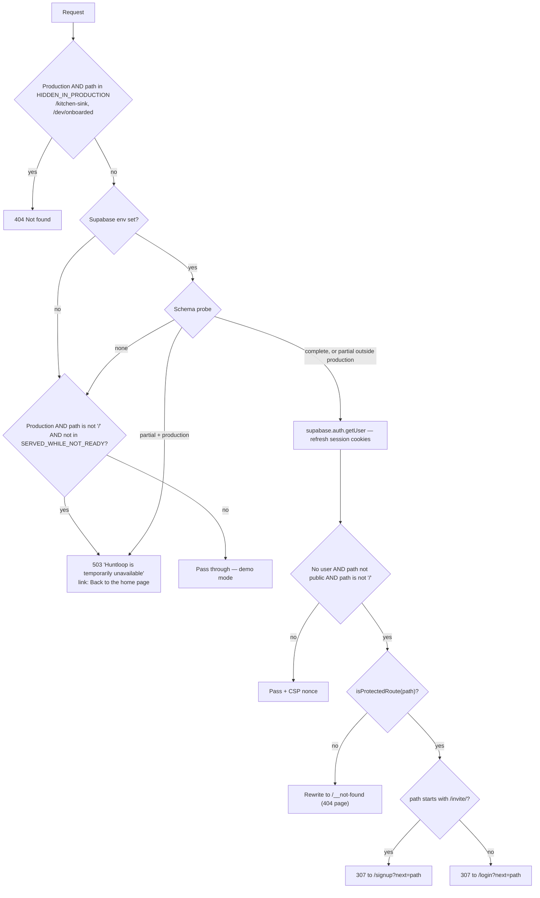
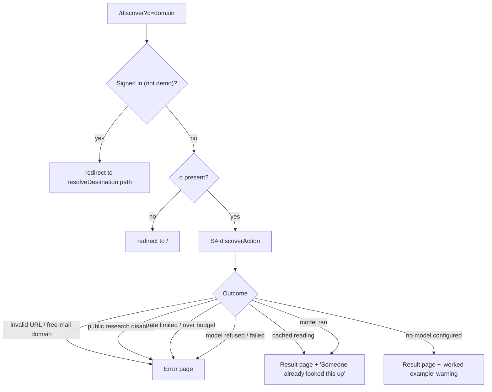
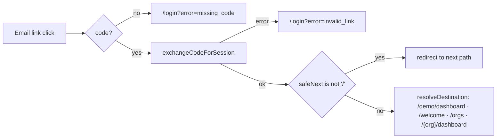
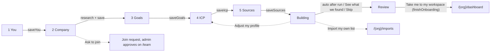
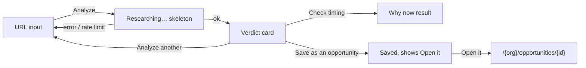
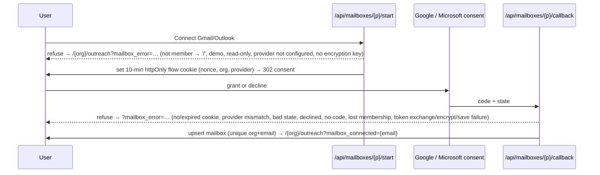
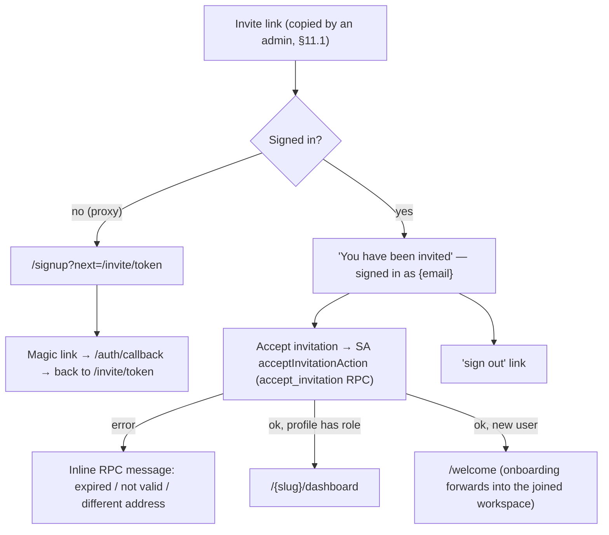

# COMMAND.md — Huntloop Website Interaction Map

> **Living document.** This is the single source of truth for every interactive element and user flow in the Huntloop web app (`apps/web`) and its shared UI kit (`packages/ui`). It documents **what the code implements today**, not what it should do. Any divergence is flagged `⚠️ FLOW MISMATCH` and collected in [§14](#14-unresolved-or-broken-flows).
>
> **Maintenance rule:** any change that adds, removes, renames, or rewires an interactive element, route, redirect, server action, or state must update this file in the same commit — the affected entry, every flow that links to it, and §14 if a mismatch is fixed or introduced.
>
> Last full sync: **2026-09-30** against `main` @ `ccf2bc3`.

**Entry format.** Complex elements use:
`Element → Action → Destination → New elements → Nested actions → Branches → Endpoint`.
Simple link lists use tables (`Element | Where | Goes to | Notes`).

**Notation.** `{org}` = workspace slug. `SA:` = Next.js Server Action (file path given). `RSC` = server component render. `router.push` = client navigation. `revalidate` = `revalidatePath` refresh of server data. "Demo mode" = no Supabase env or no schema (fixtures, `DataSourceBanner` shown).

---

## Contents

0. [System model: route gates, redirects, sessions](#0-system-model)
1. [Global navigation & shared components](#1-global-navigation--shared-components)
2. [Public / marketing site](#2-public--marketing-site)
3. [Authentication](#3-authentication)
4. [Onboarding (`/welcome/*`)](#4-onboarding)
5. [Workspace picker (`/orgs`)](#5-workspace-picker-orgs)
6. [Home: Command Center](#6-home-command-center)
7. [Hunt: Opportunities, Companies, Analyze, Imports](#7-hunt)
8. [Engage: Outreach, Inbox, Pipeline](#8-engage)
9. [Learn: Analytics, Intelligence, What we've learned, Memory](#9-learn)
10. [Company & Settings](#10-company--settings)
11. [Team & Operate](#11-team--operate)
12. [Public token pages & external integrations](#12-public-token-pages--external-integrations)
13. [Errors, empty states & edge cases](#13-errors-empty-states--edge-cases)
14. [Unresolved or broken flows (⚠️ FLOW MISMATCH register)](#14-unresolved-or-broken-flows)
15. [Cross-page flow reference](#15-cross-page-flow-reference)

---

## 0. System model

### 0.1 Request pipeline (`apps/web/proxy.ts`)

Every request except static assets, `robots.txt`, `humans.txt`, `sitemap.xml` and image files passes through `proxy()`:

- **Public prefixes** (no session needed): `/login`, `/signup`, `/auth`, `/kitchen-sink`, `/api/csp-report`, `/unsubscribe`, `/api/unsubscribe`, `/discover`, `/for`, `/compare`, `/privacy`, `/terms`, `/acceptable-use`, `/opengraph-image`, `/apple-icon`, `/api/jobs/tick`, `/api/inngest`, `/api/health`, `/dev/onboarded`, and `/` itself.
- **Protected shapes** (`lib/protected-routes.ts`): `/orgs*`, `/welcome*`, `/invite*`, `/api*`, and `/{org}/{section}` where section ∈ analytics, analyze, companies, dashboard, imports, inbox, intelligence, learn, memory, opportunities, ops, outreach, pipeline, settings, sources, team. Anything else anonymous → 404 page (not a login wall).
- **`?next=`** is path-only and re-validated by `lib/safe-next.ts` on consumption (no open redirect).
- Every response carries a per-request CSP nonce and `Reporting-Endpoints: csp-endpoint="/api/csp-report"`.

### 0.2 Workspace gate (`app/(app)/[org]/layout.tsx`)

For any `/{org}/*` page: `currentViewer(org)` → **not a member → `notFound()` (404, not 403)**. In demo mode a synthetic `demo` viewer is returned. The layout then renders `OrgShell` + `DataSourceBanner` + `SetupCard` (if onboarding incomplete) + the page.

### 0.3 The destination resolver (`lib/data/destination.ts → resolveDestination`)

Used by the auth callback, `/dev/onboarded`, the landing page CTAs (`continueTarget`), and `/discover`.

| Condition | `kind` | Path |
|---|---|---|
| No DB (demo) | `demo` | `/demo/dashboard` |
| DB but no signed-in user | `anonymous` | `/login` |
| Signed in, zero memberships | `new-user` | `/welcome` |
| One membership (or `preferredSlug` matches) | `workspace` | `/{slug}/dashboard` (+ `setupStep` if unfinished) |
| Several memberships, no preference | `choose` | `/orgs` |

`continueTarget()` converts this to the single CTA a signed-in visitor sees on public pages: `new-user` → "Continue setup" (`/welcome`); `choose` → "Open workspace" (`/orgs`); `workspace` unfinished → "Continue setup" (`stepPath(org, step)`); finished → "Open workspace" (`/{org}/dashboard`); anonymous/demo → none (Sign in + Start free shown instead).

`stepPath(org, step)`: you → `/welcome?org=`, company → `/welcome/company?org=`, goals → `/welcome/goals?org=`, icp → `/welcome/icp?org=`, sources → `/welcome/sources?org=`, building → `/welcome/building?org=`, review → `/welcome/review?org=`, done → `/{org}/dashboard`.

> ⚠️ **FLOW MISMATCH M-03** — `resolveDestination(preferredSlug)` supports a remembered workspace (`huntloop.org` cookie) but **no caller passes it**, so multi-workspace users land on `/orgs` on every sign-in. See §14.

### 0.4 Session-dependent behaviour summary

| Surface | Anonymous | Signed in | Demo mode |
|---|---|---|---|
| Landing nav/hero | Sign in + Start free | Single "Continue setup"/"Open workspace" CTA | Sign in + Start free |
| `/discover` | Renders | Redirects to `destination.path` | Renders |
| `/login`, `/signup` | Form | Form (no redirect for signed-in users) | Supabase env missing: "Supabase is not configured" note with demo link. Env set but schema missing: normal form |
| `/{org}/*` | 307 → `/login?next=` | Membership check → page or 404 | Fixture data, banner |
| Account menu | — | Account & privacy + Sign out | "Sample data · nobody signed in" + Sign in |

### 0.5 Roles & permissions (as enforced in UI)

Roles: **owner › admin › member › viewer** (see §11.1). `currentViewer(org)` yields the role; helpers `canWrite`, `canSpend`, `canAdmin`, `canOwn` (`lib/data/membership.ts`) gate controls. Read-only viewers see controls replaced by badges/labels, disabled with a Note, or rendered with a `pending` explanation (aria-disabled + tooltip). The **security boundary is Postgres RLS**; UI gating is convenience only. Most server actions go through `mutate(org, name, fn, { minRole })` (`lib/data/org.ts`), which returns plain-language failures for: no database ("…nothing to save to…"), not a member, viewer role ("Your role is read-only, so this change was not saved…"), and admin/owner-only actions. AI-spending actions additionally call `limitRefusal` (rate limits).

---

## 1. Global navigation & shared components

### 1.1 Workspace shell (`app/(app)/[org]/OrgShell.tsx`) — present on every `/{org}/*` page

Layout: **Top bar** (full width) · **Sidebar** = 76px **rail** of sections + 240px **panel** of the selected section's pages · **`<main id="main">`** (only scroller) · hidden sign-out form.

#### 1.1.1 Skip link
- **Element:** "Skip to content" anchor, first focusable element, visible only on keyboard focus.
- **Action:** Enter/click → `#main`. `<main tabIndex=-1>` receives focus.
- **Endpoint:** focus in page content; next Tab continues inside main.

#### 1.1.2 Top bar (`packages/ui TopBar`)

| Element | Where | Action → Destination | Branches / notes |
|---|---|---|---|
| **Open navigation** (☰) | Top-left, `< lg` only | Opens sidebar drawer (`navOpen=true`) → see 1.1.4 | Hidden ≥ lg |
| **Workspace switcher** (brand mark + org name + plan label + ⇅) | Top-left | Link → `/orgs` (§5) | `/orgs` immediately redirects single-workspace users back to `/{org}/dashboard` (see §5). Plan label hidden when unknown |
| **Search or jump to…** (field; icon-only on mobile) | Centre | Opens **Jump-to palette** (1.1.5) | Shows ⌘K / Ctrl K hint ≥ md |
| **Feedback** | Right, ≥ sm | Plain `<a>` → `NEXT_PUBLIC_FEEDBACK_URL` | Rendered **only** when env var set |
| **Avatar** (initials) | Right | Opens **Account menu** (1.1.6) | Initials = account name, or org name in demo |

#### 1.1.3 Sidebar (`packages/ui Sidebar`)

**Rail sections** (click = navigate to the section's first page; the rail item is a link):

| Rail | Panel? | Panel items → route |
|---|---|---|
| **Home** | No (single item) | Command Center → `/{org}/dashboard` |
| **Hunt** | Yes — "Find and qualify the accounts worth pursuing." | Opportunities → `/{org}/opportunities` · Companies → `/{org}/companies` · Analyze a URL → `/{org}/analyze` · Imports → `/{org}/imports` |
| **Engage** | Yes — "Reach out, follow up and move deals forward." | Outreach → `/{org}/outreach` · Inbox → `/{org}/inbox` · Pipeline → `/{org}/pipeline` |
| **Learn** | Yes — "What the loop is teaching you." | Analytics → `/{org}/analytics` · Intelligence [AI] → `/{org}/intelligence` · What we've learned [AI] → `/{org}/learn` · Memory → `/{org}/memory` |
| **Company** | Yes — "What you sell, and who you sell it to." | Product → `/{org}/settings/product` · ICP [AI] → `/{org}/settings/icp` · Sources → `/{org}/sources` |
| **Team** | Yes | Members → `/{org}/team` · Assignments → `/{org}/team/assignments` |
| **Operate** | No | Engine → `/{org}/ops` |
| **Settings** (rail footer) | Yes — "How this workspace is set up." | General → `/{org}/settings` · Product · ICP · Scoring → `/{org}/settings/scoring` · Integrations → `/{org}/settings/integrations` · Data & privacy → `/{org}/settings/privacy` |

- **Active state:** longest-prefix match of `pathname` against all item hrefs (detail pages light their list page). Product/ICP appear under both Company and Settings; the section you came from stays lit.
- **Panel footer:** `SidebarQuota` meter (`chrome.quota` label, used / limit) — omitted when plan unlimited/unknown. Not interactive.
- **Rail footer: Hide/Show sidebar** (`SidebarCollapseButton`, ≥ lg only) → toggles panel; persisted in `localStorage["hl:sidebar-panel"]` (`hidden`/`shown`). Storage failure → toggles but not remembered.
- **Attention dot** on a rail icon appears when any item has `count > 0` with `countTone: "attention"` — **no item currently sets `count`**, so the dot never renders today.
- **`unbuilt` flag:** renders an item as non-link "Soon" label. **No item uses it today** (every destination exists; `scripts/audit.mjs NAV-01` fails the build for a nav href without a route).

#### 1.1.4 Mobile drawer (`< lg`)
- **Open:** ☰ in top bar. Sidebar slides in over a scrim; panel is forced open; tapping a rail item with a panel **selects** that section (preview) instead of navigating.
- **Close paths:** tap scrim ("Close navigation" button) · `Esc` · choosing any page (pathname change auto-closes) · navigating via Jump-to.
- **Endpoint:** chosen page rendered, drawer closed.

#### 1.1.5 Jump-to palette (`packages/ui JumpTo`, opened by top-bar search or ⌘K/Ctrl K)
- **Element:** modal "Jump to" with a combobox "Search pages" and a listbox of every nav destination (deduped by href; group = section label).
- **Actions:** type → ranked filter (prefix > word-prefix > substring > group match) · ↑/↓ move highlight (wraps) · Enter or click → close + `router.push(href)` (also closes mobile drawer) · hover moves highlight · `Esc`/backdrop/✕ closes · ⌘K again toggles closed.
- **Empty state:** "No page matches "{query}"."
- **Endpoint:** target workspace page, or palette closed with no navigation.
- Only pages are searchable — **no records** (companies, opportunities) are indexed.

#### 1.1.6 Account menu (`app/(app)/[org]/AccountMenu.tsx`)
**Trigger:** avatar button (aria "Account menu for {name}"). Menu header shows name + email (demo: org name + "Sample data · nobody signed in"). Keyboard: ↑/↓, Enter, `Esc` closes and returns focus; click outside closes.

| Item | Shown when | Action → Destination |
|---|---|---|
| Account & privacy | Signed in | → `/{org}/settings/privacy` (§10.7) |
| Workspace settings | Always | → `/{org}/settings` (§10.1) |
| Integrations | Always | → `/{org}/settings/integrations` (§10.6) |
| Switch workspace | Always | → `/orgs` (§5) |
| Theme: System / Light / Dark (inline choice row) | Always | Sets `data-theme` on `<html>` + `hl-theme` cookie (1 year); all theme controls stay in sync via MutationObserver. No navigation |
| Keyboard shortcuts `?` | Always | Opens **Keyboard shortcuts** modal (1.1.7) |
| Help & docs ↗ | `NEXT_PUBLIC_HELP_URL` set | External link |
| Huntloop home page | Always | → `/` (landing renders "Open workspace" CTA for signed-in users) |
| **Sign out** (danger) | Signed in | `requestSubmit()` on hidden `<form method=post action="/auth/signout">` → `POST /auth/signout` → Supabase signOut → **303 → `/login`** |
| Sign in | Demo mode | → `/login` |

#### 1.1.7 Keyboard shortcuts modal & global hotkeys
- **Open:** account menu item, or `?` anywhere not typing in an input/textarea/select/contenteditable.
- **Content (read-only list):** ⌘K/Ctrl K — search or jump · `?` — show shortcuts · ↑ ↓ — move through menus/results · Enter — open highlighted result · Esc — close menu/dialog/drawer.
- **Close:** ✕, Esc, backdrop click. **Endpoint:** modal closed.

#### 1.1.8 Banners injected by the org layout (every `/{org}/*` page)

- **DataSourceBanner** (`role=status`, not interactive): `unconfigured` → "Demo data. Supabase isn't configured…"; `no-schema` → "…migrations haven't been applied yet… run packages/db/migrations". Hidden when live.
- **SetupCard** ("Finish setting up your workspace", shown until onboarding complete and only while something is missing):

| Element | Shown when | Goes to |
|---|---|---|
| "What your company sells" link | No product row | `/welcome/company?org={org}` |
| "Your ideal customer profile" link | No ICP | `/welcome/icp?org={org}` |
| "Sources to watch" link (optional) | ICP exists, 0 sources | `/welcome/sources?org={org}` |
| **Continue setup** button | Always in card | `stepPath(org, onboarding_step)` |

Card disappears once `completedAt` set, step `done`, or nothing is missing.

#### 1.1.9 Workspace error & loading boundaries
- **Loading:** `[org]/loading.tsx` skeleton (title + 6 rows) for every section; `opportunities/loading.tsx` overrides.
- **Error:** `[org]/error.tsx` — shell stays up; `ErrorState` "This screen failed to load. Nothing was changed." + `Reference: {digest}` + **Try again** (`reset()` re-renders the segment) + **Go to the home page** (→ `/`). Error sent to Sentry.

### 1.2 Shared UI primitives (`packages/ui`) — behaviour contracts used everywhere

| Primitive | Interaction contract |
|---|---|
| **Button** | `href` → renders a link (via `linkComponent`). `pending="reason"` → `aria-disabled`, `title=reason`, click ignored (explains *why* unavailable). `disabled` → native disabled |
| **ConfirmButton** (all destructive row actions) | Click 1 → **armed** (danger style, label e.g. "Remove it"/"Archive it", live-region "press again to confirm, or press Escape to cancel"). Click 2 within **4 s** → `onConfirm()`. Disarms on timeout, blur, or Esc. 48px hit area |
| **Confirmed** (undo banner) | Success strip with optional **Undo** button ("Undoing…" while pending). Only offered where a restore action exists |
| **Modal** | Native `<dialog>`; focus trapped; Esc and backdrop click close (unless `dismissible=false`); ✕ button |
| **Menu** | Trigger toggles; ↑/↓/Home/End; Enter selects; Esc closes + refocuses trigger; outside pointerdown closes; `choices` rows are inline radio sets |
| **Toast** | Provider mounted in root layout (success/info auto-dismiss 5 s; danger persists until ✕), but **no product screen calls `useToast`** today — outcomes use inline `FormMessage` instead (only `/kitchen-sink` demos it) |
| **ThemeToggle** | 3-way System/Light/Dark segmented control; writes theme cookie; used on public pages, `/orgs`, onboarding, auth |
| **HoverPanel** (ScorePill / PriorityBadge explanations) | Opens on hover/focus; Esc, outside click, blur close; keyboard reachable |
| **DataTable** | Optional checkbox column (select row / select all); sortable headers toggle desc⇄asc; `empty` slot rendered when no rows |
| **FilterBar** | Scope `<select>` + search input; when `selectionCount > 0` shows "{n} selected" + selection actions; `actions` slot on the right |
| **ErrorState** | Optional **Try again** (`onRetry`) |
| **RateLimited** | States retry time; no retry button |
| **EmptyState** | Icon, title, description, optional `action` slot |
| **`
` disclosures** | Native toggle (▸/▾), e.g. "Evidence (n)", "Based on (n)" |

### 1.3 Root-level pages

| Route | Behaviour |
|---|---|
| `app/not-found.tsx` | 404 page for unknown routes and non-member workspaces (see §13) |
| `app/error.tsx` | Root error boundary (replaces the whole document) |
| `app/global-error.tsx` | Layout-level failure fallback |
| `/robots.txt`, `/sitemap.xml`, `/humans.txt`, `/opengraph-image`, `/apple-icon` | Machine-readable; public |
| `/kitchen-sink` | Dev-only component gallery; 404 in production |

---

## 2. Public / marketing site

All public pages are reachable without a session. Signed-in visitors see the same pages with a "Continue setup"/"Open workspace" CTA instead of Sign in/Start free (via `continueTarget`, §0.3).

### 2.1 Landing page `/` (`app/(marketing)/page.tsx`)

**Reached from:** direct/SEO, every "Huntloop" logo link, account menu "Huntloop home page", error pages "Go to the home page", legal "← Huntloop", 503 page, onboarding header logo.

#### Sticky nav
| Element | Action → Destination | Notes |
|---|---|---|
| Logo "Huntloop" | → `/` | |
| Product | In-page anchor → `#discover` | Hidden < md (no mobile menu) |
| How it works | → `#how` | Hidden < md |
| Pricing | → `#pricing` | Hidden < md |
| ThemeToggle | Theme switch | Hidden < sm (footer copy always present) |
| Sign in | → `/login` | Anonymous/demo only |
| **Start free** | → `/signup` | Anonymous/demo only |
| **Continue setup / Open workspace** | → `continueTarget` href | Signed-in only; replaces both above |

#### Hero
| Element | Action → Destination |
|---|---|
| **Start free** / signed-in CTA | → `/signup` or `continueTarget` href |
| See how it works › | → `#how` |
| *Dev: open onboarded workspace* | Dev builds only → `GET /dev/onboarded` → `resolveDestination()` path, or `/login?next=/dev/onboarded` if anonymous. 404 outside `next dev` |

Hero mock, feature strip, "list is not the answer", loop diagram, Discover/Qualify/Evidence/Claim-kinds/In-control sections are **static** (no interactive elements) except:
- "Show evidence ›" text link (Qualify section) → `#evidence`.

#### Data & pricing section (`#pricing`)
| Element | Shown when | Action |
|---|---|---|
| Read our data practices › | `legalIsComplete()` | → `/privacy` |
| Plan cards (from `listPublicPlans()`) | Always | Static limits |
| **Start free** (Free plan) | price = 0 | → `/signup` |
| **Talk to us about {Plan}** | paid plan + `IDENTITY.contactEmail` set | `mailto:{contact}?subject=Huntloop {Plan}` (external mail client) |
| "Not available yet" (inert) | paid plan, no contact email | None |

Warning copy: "There is no checkout yet." — no billing flow exists anywhere in the product.

#### Closing CTA
| Element | Action |
|---|---|
| Try it on your domain › | → `#domain` (scrolls to the input below) |
| **DomainInput** (`#domain`) | See 2.2 |

#### Footer
| Column | Links |
|---|---|
| (left) | © year · ThemeToggle |
| Product | How it works → `#how` · Pricing → `#pricing` · Compared to a list tool → `/compare/list-tools` · Compared to an AI SDR → `/compare/ai-sdr` |
| Use cases | Founder-led sales → `/for/founder-led-sales` · Outbound teams → `/for/outbound-teams` · Agencies and consultants → `/for/agencies` · Account-based → `/for/account-based` |
| Company | Contact (`mailto:`, only if contact email set) · Sign in → `/login` · Create an account → `/signup` |
| Legal (only if `legalIsComplete()`) | Privacy → `/privacy` · Terms → `/terms` · Acceptable use → `/acceptable-use` |

`/compare/hiring-an-sdr` and `/compare/doing-it-manually` are **not** linked from the landing page; reachable only from other compare pages' "Also compared to" list and the sitemap.

### 2.2 DomainInput (shared: landing closing CTA, `/for/*`, `/compare/*`, `/discover` error state)

- **Element:** text input "yourcompany.com" + submit **See what Huntloop finds ›**.
- **Validation (client):** button disabled until value looks like `host.tld` (scheme stripped). Enter submits.
- **Action:** `canResearch=true` (anonymous research enabled) → `router.push(/discover?d={value})`; `canResearch=false` → `router.push(/signup?d={value})`. Button shows "Reading…" while navigating.
- Sub-copy: "No card. No account. Just your domain." vs "No card. Create a free account and we'll read your site first."
- Only the **landing page** passes the real `canResearch`; the other three call sites use the default `true`.

### 2.3 `/discover?d=` — anonymous company read (`app/(marketing)/discover`)

**Header:** logo → `/` · ThemeToggle · **Sign in** → `/login`.

**Result page elements:**
| Element | Action |
|---|---|
| Finding source URLs (facts only) | External link, new tab |
| **Continue with a free account** | → `/signup?d={domain}` (→ §3.2 "Keep going" variant) |

**Error page elements** (titles: "Let's do this with an account" when refused, else "That didn't work"; ErrorState titles: "You've used up the anonymous lookups" / "Not available without an account" / "We couldn't read that site"):
| Element | Action |
|---|---|
| **Create a free account** | → `/signup?d={domain}` (or `/signup`) |
| "Or try another address:" DomainInput (md) | → `/discover?d=` again |

> ⚠️ **FLOW MISMATCH M-10** — on the error page, and on `/for/*` and `/compare/*`, DomainInput always targets `/discover` even when anonymous research is switched off, so "try another address" loops back to the same refusal. See §14.

`robots: noindex`.

### 2.4 Use-case pages `/for/{useCase}` and comparison pages `/compare/{approach}`

- **Valid slugs only** (`generateStaticParams`, `dynamicParams=false`): for = founder-led-sales, outbound-teams, agencies, account-based; compare = list-tools, ai-sdr, hiring-an-sdr, doing-it-manually. Any other slug → 404.
- **Header:** logo → `/` · ThemeToggle · `NavActions` (anonymous: Sign in → `/login`, **Start free** → `/signup`; signed in: single `continueTarget` button).
- **Body:** DomainInput (md, near top on `/for`) · DomainInput (lg, "See what it finds for you") · static content.
- **Footer nav:** `/for/*`: "Also for" → the other three `/for/*` pages. `/compare/*`: "Also compared to" → other three `/compare/*`; "Or by what you do" → all four `/for/*`.

### 2.5 Legal pages `/privacy`, `/terms`, `/acceptable-use` (`LegalPage`)
- **Elements:** "← Huntloop" → `/` · ThemeToggle · `/terms` body links to `/privacy` and `/acceptable-use`.
- **Branch:** until every fact in `lib/legal.ts` is supplied, a "Draft — not in force" warning is shown, the pages are `noindex`, and they are **not linked** from the landing footer, pricing section, or sign-up form.

### 2.6 503 "temporarily unavailable" page (production, DB not ready)
Plain HTML from `proxy.ts`; single link **Back to the home page** → `/`. Served for every path except `/` and `SERVED_WHILE_NOT_READY`.

---

## 3. Authentication

Magic-link (email OTP) only. Google OAuth code exists (`signInWithGoogle`) but its button is **not rendered** ("temporarily hidden for testing").

### 3.1 `/login` — Sign in
**Reached from:** landing/nav "Sign in", `/discover` header, footer, proxy guard (`/login?next=/path`), sign-out (303), auth callback errors, account menu (demo "Sign in"), `/welcome` when session missing (`/login?next=/welcome`).

| Element | Action → Result |
|---|---|
| Logo (lg) | → `/` |
| ThemeToggle (top-right) | Theme |
| **Work email** input (required, type=email) | — |
| **Email me a sign-in link** | SA `sendMagicLink` (`app/(auth)/actions.ts`) with `mode=login`, `shouldCreateUser: false`, `emailRedirectTo=/auth/callback?next={safeNext}`. Button "Sending…" while pending |
| "No account? **Create one**" | → `/signup` (drops `next`) |

**Branches:**
- **Supabase not configured:** form replaced by warning note ("Supabase is not configured" locally / "Sign-in isn't available here yet" in production) + **open the Command Center** → `/demo/dashboard`.
- **Invalid email** → inline `role=alert` validation message.
- **Supabase error** → "That didn't work. Check the address and try again."
- **Success** → form replaced by "Check your email … If an account can be created or found for {email}, a sign-in link is on its way. It expires in an hour." (enumeration-safe; **no resend / change-address control** — reload the page to retry).
- Signed-in users visiting `/login` still see the form (no redirect).

> ⚠️ **FLOW MISMATCH M-01** — `/auth/callback` redirects failures to `/login?error=missing_code|invalid_link` (and `signInWithGoogle` to `?error=oauth`), but the login page **never reads `error`**, so an expired/used link lands silently on a blank sign-in form. See §14.

### 3.2 `/signup` — Create account
Same `AuthForm` with `mode=signup` (`shouldCreateUser: true`), button **Create account**.
- **`?d={domain}` variant** (from `/discover` or DomainInput with research off): title "Keep going", copy "We've already read {domain}…"; default `next` becomes `/welcome?d={domain}` so the domain survives the email round-trip.
- **`?next=`** (e.g. invite: proxy sends anonymous `/invite/*` visitors to `/signup?next=/invite/{token}`) takes precedence.
- **Agreement line** (Terms / Acceptable Use / Privacy links) only when `legalIsComplete()`.
- "Already have an account? **Sign in**" → `/login`.
- Branches identical to 3.1.

### 3.3 Magic-link callback `GET /auth/callback?code&next`

**First-time user** (no memberships) → `/welcome` (onboarding). **Returning single-workspace** → `/{org}/dashboard` (even if setup unfinished — SetupCard explains). **Multi-workspace** → `/orgs`.

### 3.4 Sign out `POST /auth/signout`
Triggered only by account menu "Sign out" (hidden form POST; CSRF-safe). Supabase `signOut()` → **303 → `/login`**. Endpoint: signed-out login page.

---

## 4. Onboarding

**Shell (`app/(onboarding)/welcome/layout.tsx`):** header logo → `/` (landing then offers "Continue setup"), ThemeToggle, **OnboardingProgress**, step content. Loading skeleton while steps render.

**Visible steps:** 1 You (`/welcome`) → 2 Your company (`/welcome/company`) → 3 Your goals (`/welcome/goals`) → 4 Ideal customer (`/welcome/icp`) → 5 Sources (`/welcome/sources`). Then hidden steps **building** (`/welcome/building`) → **review** (`/welcome/review`) → **done** (`/{org}/dashboard`). The server-side marker is `organizations.onboarding_step`.

### 4.0 OnboardingProgress (every step)
| Element | Action |
|---|---|
| Step dots 1–5 | Link (with `?org=`) when done or ≤ furthest-reached (furthest tracked in `sessionStorage["huntloop.onboarding.furthest.{org}"]`); plain text otherwise; current step has `aria-current=step` |
| ← Back to {previous step} | Link to previous step (on building/review → Sources) |
| Finish later — open workspace → | Only when `?org=` present → `/{org}/dashboard` (progress already saved) |

Steps 3–7 **require `?org=`**; without it the page redirects to `/welcome/company`.

### 4.1 Step 1 — "First — who are you?" `/welcome`
**Server branches (before render):**
- No session (DB configured) → `/login?next=/welcome`.
- Profile already has a role **and** no `?new` **and** no `?org` → forward: first membership done → `/{slug}/dashboard`; at you/company → `/welcome/company?org={slug}` (+`&d=`); else → `stepPath`; no membership → `/welcome/company` (+`?d=`).
- Otherwise render the form (prefilled name/role).

| Element | Action |
|---|---|
| Your name (required, autofocus if empty) | Hint "From your account…" when prefilled |
| "What do you do?" — 7 role radio cards (Founder or CEO, Founder-led sales/GTM, Sales/AE, SDR/BDR, RevOps/Growth, Marketing, Agency or consultant) | Selects role (drives dashboard layout & agency copy later) |
| **Continue** (disabled until name + role) | SA `saveYou` → `profiles` updated → returns `next`: existing membership done → `/{slug}/dashboard`; existing unfinished → `/welcome/company?org={slug}`; none → `/welcome/company`. Client appends `d` carry and `router.push` |

Branches: field errors under each field; general error `role=alert`; "Saving…".

> ⚠️ **FLOW MISMATCH M-02** — `/welcome?new=1` ("Create another workspace" on `/orgs`, "Set up another client" dashboard action) renders this step, but `saveYou` ignores `new` and forwards to the **existing** workspace, so a second workspace cannot be created through the UI. See §14.

### 4.2 Step 2 — "What does your company sell?" `/welcome/company[?org][&d]`
Phases: **input → researching → review → saving**.

**Input phase**
| Element | Shown when | Action |
|---|---|---|
| "Who is this workspace for?" toggle: **A client** / **My own agency** | Role = agency | Switches copy ("What does your client sell?", "Research this client") |
| **JoinExisting** panel "Your company already has a workspace(s)" | No `?org` and the `discoverable_workspaces` RPC returns matches (workspaces sharing the user's company domain) | Per workspace: **Ask to join** → SA `requestJoinAction(orgId)` → button becomes "✓ Asked" + note "An admin will see the request…". Error → inline. **Endpoint:** pending join request visible to that workspace's admins on `/team` (§11.1) |
| Website input (required, autofocus; prefilled from `?d`) | Always | — |
| **Research my company / Research this client** | Always | SA `researchCompanyAction(url, org)`: if no `org` → `createWorkspace(url)` (`create_organization` RPC; slug from domain; idempotent for same base slug) → reuse anonymous `/discover` reading if same domain (`claimResearch`) else run `research()` |
| "Your workspace will be /{slug} — this can't be changed later." | No `?org` | Live slug preview |

**Branches:** rate-limited → `RateLimited` block; error → ErrorState "That didn't work"; both return to input phase. Researching phase: "Reading {url}…" skeleton (no cancel).

**Review phase ("Here's what we understood")**
| Element | Action |
|---|---|
| Company name (editable input, max 200) | Becomes workspace/product name |
| **Start over** | Back to input phase (keeps URL) |
| Each finding: **Edit** | Opens textarea (autofocus); on change the finding becomes a user-asserted `fact`; blur closes |
| Fact source URL | External link, new tab |
| Worked-example warning | Shown when no model configured |
| **Looks right — continue** | SA `saveCompanyAction(slug, understanding, liveSeal)` (live flag verified by HMAC seal) → `router.push(/welcome/goals?org={slug})`. Error → message, stays on review |

> ⚠️ **FLOW MISMATCH M-08** — after the first research creates a workspace, **Start over** + a *different* domain calls `createWorkspace` again (the component passes the `org` prop, not the slug it just created), producing a second, orphaned workspace. See §14.

### 4.3 Step 3 — "What do you want Huntloop to do?" `/welcome/goals?org=`
| Element | Action |
|---|---|
| 5 goal toggle cards (Discover / Qualify / Enrich / Reach out / Learn), max 2 — a third selection drops the oldest | `aria-pressed` toggles; counter "n/2" |
| "How do you want to reach people?" 4 radios: My work email / LinkedIn, or by hand / Export to my CRM or sequencer / Not sure yet | Selects channel |
| **Continue** (disabled until ≥1 goal and a channel) | SA `saveGoals` → `router.push(/welcome/icp?org=)`; error inline |

Goals and channel drive dashboard section order, lead sentence and first-action suggestion (§6), and the Review screen's secondary CTA (§4.7).

> ⚠️ **FLOW MISMATCH M-09** — revisiting Goals (via Back or a progress dot) shows an **empty** form rather than the saved answers; revisiting ICP **re-drafts with the model** instead of loading the saved profile. See §14.

### 4.4 Step 4 — "Who should we hunt for?" `/welcome/icp?org=`
On mount runs SA `draftIcpAction(org)` once (from stored research).

| Phase | Elements & actions |
|---|---|
| **loading** | "Working out who you should be selling to…" skeleton |
| **error** | RateLimited *or* ErrorState "We couldn't draft your profile" + **Try again** (re-run draft) · **Build it myself** → ready phase with empty fields. If no stored research: error "We don't have a reading of your website…" |
| **ready** | Chip fields below; reach bar; save controls |

**Chip fields** (free-text: type + Enter or **Add**, commit on blur, ✕ "Remove {v}"; option fields: toggle buttons). Each drafted field shows an *inference* badge and "Because your site says: …".
- Card "Who they are": **Segments**\*, Industries, **Company size** (options 1–10 … 5000+)\*, **Regions** (options)\*.
- Card "What makes them ready to buy": **Buying triggers**\*.
- Card "Who to reach": **Job titles**\*, Titles that look right but aren't.
- Card "Who is never a fit": Exclusions.
- Card "Sharpen it further" **Show/Hide**: Technologies, Business model, Pain points, Use cases, **Companies that are obviously right** (domains) + **Preview what these add** (SA `previewLookAlikesAction`, reads ≤5 domains, "Reading them…", result via `LookAlikeResult`, nothing saved; editing the list clears the preview), Seniority, Departments.

(\* = required: segment **or** industry, size, region, trigger, title.)

**Reach bar** (auto, 900 ms debounce after any criteria change): "Counting matching companies…" → "About N companies match · per {provider}" / "No company-search provider is connected…" / error; unmapped criteria listed; > 50,000 → "very broad" warning; < 50 → "small, precise market" note.

**Save controls:**
| Element | Action |
|---|---|
| **Continue to sources** (disabled until required fields filled) | SA `saveIcp` → `router.push(/welcome/sources?org=)` |
| "Still needed: a segment or industry, a size band, …" links | Scroll to and focus the missing field |
| *Continue anyway (dev)* | Dev builds only; same save, bypasses client gate |
| Badge "Editable later in Settings → ICP" | Static |

### 4.5 Step 5 — "Where should we look?" `/welcome/sources?org=`
On mount runs SA `recommendSourcesAction(org)` once.

| Phase | Elements |
|---|---|
| **no-icp** | EmptyState "We don't know who you're hunting for yet" + **Build my ideal customer** → `/welcome/icp?org=` |
| **loading** | Skeleton |
| **error** | RateLimited or ErrorState + **Try again**; **Carry on without sources** → saves custom list only |
| **ready** | Recommended list: each source shows kind badge, why, "Because you said:", external link, toggle **On ✓ / Add +** (`n/m on` counter). "Your own": URL input + **Add**, chips with ✕ remove. |

**Start hunting** → SA `saveSources` (accepted system + user sources) → `router.push(/welcome/building?org=)`. Copy under the button states either "No sources — we'll still find companies…" or "{n} sources will be monitored."

### 4.6 Building `/welcome/building?org=`
Client runs SA `runStageAction(org, stage)` sequentially for **discover → enrich → score → contacts → explain → rules**; each row shows waiting / running (spinner) / done ✓ / skipped ⊖ / failed ⚠ + detail. A failed stage does not stop the next. After the loop: SA `advanceStep(org, "review")`.

| Element | Action |
|---|---|
| **Skip — I'll wait in the workspace** (while running) | → `/welcome/review?org=` |
| **See what we found** (after finish) | → `/welcome/review?org=` |
| Auto-advance | If anything was discovered/scored → `/welcome/review` after 900 ms |
| Nothing-found panel: **Adjust my profile** | → `/welcome/icp?org=` |
| Nothing-found panel: **Import my own list** | → `/{org}/imports` (§7.4) |

> ⚠️ **FLOW MISMATCH M-05** — "Skip — I'll wait in the workspace" goes to the **Review** step, not the workspace; and because stages are driven by the page, leaving it stops the remaining first-run stages (the copy says "This carries on without you"). See §14.

### 4.7 Review `/welcome/review?org=`
| Element | Shown when | Action |
|---|---|---|
| Top 3 opportunity cards: Priority badge + ScorePill (hover explanations), Why now, Why a fit, fact/inference counts, **See the working** | ≥1 opportunity | → `/{org}/opportunities/{id}` (§7.1.2) |
| EmptyState "Nothing has cleared the bar yet" + **Review my profile** / **Import my own list** | 0 opportunities | → `/{org}/settings/icp` / `/{org}/imports` |
| "We also drafted N scoring rules…" + **Read the proposed rules** | Proposed rules exist | → `/{org}/settings/scoring` (§10.4) |
| **Take me to my workspace** | Always | SA `finishOnboarding` → sets `completed_at`, writes `huntloop.org` cookie → `router.push(/{org}/dashboard)` — **onboarding endpoint** |
| **Connect a mailbox** | goals include reach_out | → `/{org}/settings` |
| **Import my accounts** | goals include qualify (not reach_out) | → `/{org}/imports` |
| **Invite a teammate** | neither | → `/{org}/team` |

> ⚠️ **FLOW MISMATCH M-04** — "Connect a mailbox" links to General settings, but mailbox connection lives on **Outreach** (`/{org}/outreach`). See §14.
> ⚠️ **FLOW MISMATCH M-06** — if `finishOnboarding` fails, the explanatory note is set and then immediately navigated away from, so it is never seen. See §14.

---

## 5. Workspace picker `/orgs`

**Reached from:** top-bar workspace switcher, account menu "Switch workspace", `resolveDestination` (`choose`).

**Server branches:** demo → redirect `/demo/dashboard`; 0 memberships → `/welcome`; **1 membership → `/{slug}/dashboard`** (so for single-workspace users "Switch workspace" just reloads their dashboard); ≥2 → render.

| Element | Action |
|---|---|
| Logo (not a link here) · ThemeToggle | — |
| Per workspace card: initial, name, role badge, "Last used" (cookie match), "Setup unfinished", `/slug`, this-month usage ("N opportunities · N AI runs · …" or "Nothing used this month") | Static |
| **Finish setup** (unfinished only) | → `stepPath(slug, step)` |
| **Open** | → `/{slug}/dashboard` |
| **Create another workspace** | → `/welcome?new=1` (see M-02) |

> ⚠️ **FLOW MISMATCH M-03** — the page says choosing a workspace remembers it, but **Open** is a plain link that writes nothing; only `finishOnboarding` writes `huntloop.org`, and no resolver reads it. See §14.

---

## 6. Home: Command Center `/{org}/dashboard`

**Reached from:** Home rail, auth callback, `/orgs` Open, onboarding finish, "Finish later — open workspace", `continueTarget`, jump-to.

Section **order and lead sentence are personalised** (`lib/data/personalization.ts`):

| Role (onboarding step 1) | Default order | Lead |
|---|---|---|
| Founder or CEO | whyNow, counts, loop, signals, capacity | "What changed in your market, and who is worth your next hour." |
| Founder-led sales / GTM (also the fallback when no role) | whyNow, counts, loop, capacity, signals | "The whole loop, with whatever needs a person first." |
| Sales / AE | counts, whyNow, loop, capacity, signals | "Your accounts, and what has moved on them." |
| SDR / BDR | capacity, counts, whyNow, loop, signals | "Today's queue: who to reach, and what to say." |
| RevOps / Growth | loop, signals, counts, capacity, whyNow | "How the engine is performing, and where it is losing." |
| Marketing | whyNow, signals, loop, counts, capacity | "Signals in your market, and what they are telling you." |
| Agency | counts, whyNow, loop, capacity, signals | "This client's pipeline, and what needs you." |

The **first chosen goal** then moves its section to the top and replaces the lead: discover → whyNow · qualify/enrich → counts · reach_out → capacity · learn → loop. Each role also defines a `defaultFilter` (hot-warm, assigned, ready…) that **no screen consumes** (see §14.2).

### 6.1 Header
| Element | Shown when | Action |
|---|---|---|
| Refresh (icon) | Always | `router.refresh()` (keeps client state); disabled while refreshing |
| **Sources** | Always | → `/{org}/sources` |
| **Hunt now** | `canSpend` | SA `huntNowAction` (rate-limited `first_run_stage`) → `followActiveIcp(runNow)` → success message "Hunting. New companies arrive on the engine's next run…" / error "There is no search to run yet. Define a customer profile first." (or rate-limit text). Revalidates dashboard. "Starting…" while pending |
| **Analyze a URL** | `canSpend` | → `/{org}/analyze` |

### 6.2 Alert chips
| Chip | Shown when | Action |
|---|---|---|
| "N new triggers in the last 24h" | > 0 | Static |
| "N opportunities awaiting your review →" | > 0 | → `/{org}/opportunities` |
| "Analyze a company URL →" | Always | → `/{org}/analyze` |

### 6.3 Personalised sections
| Section | Elements → Destination |
|---|---|
| **counts** (Priority) | StatCards Hot / Warm / Watch / Ignore → `/{org}/opportunities?priority=hot\|warm\|watch\|ignore` (pre-filters the table, §7.1) |
| **whyNow** | Per untriaged opportunity: **company name** → `/{org}/opportunities/{id}`; PriorityBadge & ScorePill (hover panels); **Evidence (n)** disclosure → EvidenceList (source links) or "Nothing is attributed…". **Empty:** "Nothing is waiting for a verdict" + first-action button (below) |
| **loop** (Loop this week / Outcomes) | Discovered → `/opportunities` · Researched → `/companies` · Contacted → `/outreach` · Replied → `/inbox` · Meetings → `/pipeline` · Won → `/pipeline` · Companies known → `/companies` |
| **capacity** | QuotaBars (mailbox sending capacity) — only when mailboxes exist; static |
| **signals** | "Signals by type", "Source performance" breakdowns — static; empty copy when none |

**First action** (whyNow empty state), first matching rule wins: goal reach_out → **Connect a mailbox** (`/{org}/settings`, see M-04) · goal qualify → **Import your accounts** (`/{org}/imports`) · goal learn or role RevOps → **Tune your scoring rules** (`/{org}/settings/scoring`) · role agency → **Set up another client** (`/welcome?new=1`, see M-02) · otherwise → **Add a source to watch** (`/{org}/sources`).

### 6.4 Nudges (one at most, below sections)
- **LearningNudge** (wins when present; `lib/data/nudges.ts`): kinds `rejection-streak` ("You've overruled N of our verdicts" → **Review what we got wrong**), `first-reply` ("Something worked" → **See what worked**), `tighten-icp` ("You've taken on N companies" → **Tighten my profile**) — all → `/{org}/learn`. ✕ **Dismiss** → hidden, `localStorage["huntloop.nudge.{org}.{kind}"]=dismissed`.
- **IcpQualityCard** ("Your customer profile is N% complete" + suggestions): **Sharpen my profile** → `/{org}/settings/icp`; ✕ dismiss → `localStorage["huntloop.icp-nudge.{org}.{score}"]` (re-appears if the score changes).

### 6.5 "Needs you" action rail (only when items exist; first on narrow screens, right column ≥1440px)
| Item | Open → |
|---|---|
| "N conversations are waiting on a reply" | `/{org}/inbox` |
| "N messages need approval" | `/{org}/inbox` |
| "N sources are failing" | `/{org}/sources` |
| "N opportunities were last scored over 90 days ago" | `/{org}/opportunities` |

No dismiss control is wired (`onDismiss` not passed).

---

## 7. Hunt

### 7.1 Opportunities

#### 7.1.1 List `/{org}/opportunities[?priority=hot|warm|watch|ignore][&company=Name]`
**Reached from:** Hunt rail, dashboard priority cards (pre-filtered), "awaiting your review" chip, "Discovered" loop card, Companies "{n} open" link (`?company=`), detail page "← All opportunities", action rail (stale scores), jump-to.

Server: `listOpportunities` (capped at `LIST_LIMIT`; notice "Showing the N highest-priority opportunities…" when hit) + `listCampaignTargets`; `canWrite` from viewer.

| Element | Action → Result |
|---|---|
| **Analyze a URL** (header, `canWrite`) | → `/{org}/analyze` |
| Priority chips All / Hot / Warm / Watch / Ignore (with counts) | Client filter; URL `?priority=` updated via `history.replaceState` (no navigation) |
| FilterBar scope (Company / Domain / Industry) + search | Client filter. `?company=` pre-fills search |
| Refresh (FilterBar right) | `router.refresh()` |
| Row checkbox / select-all | Selection → FilterBar shows "{n} selected" + actions |
| **Add to campaign** (selection action, `canWrite`) | Toggles inline **EnrollPanel**. If no campaigns: aria-disabled with tooltip "There are no campaigns to add these to yet. Create one under Outreach." |
| **Clear** (selection action) | Clears selection |
| Sortable headers Company / Priority / Score / Why now | Toggle desc⇄asc |
| **Company** cell (name + domain) | → `/{org}/opportunities/{id}` |
| PriorityBadge / ScorePill | Hover/focus panels with reason, dimensions, confidence |

**EnrollPanel** (inline, not modal):
Campaign `<select>` (non-sendable campaigns disabled "— no email step yet") → autonomy/status explainer → **Add {n} to campaign** (SA `enrollOpportunitiesAction`, max per call enforced, skips already-enrolled; revalidates `/opportunities` and `/outreach`) · **Cancel**.
Branches: none selected / no campaign → tooltip reasons; errors ("That campaign no longer exists.", "…has no email step yet…", batch too large) shown in panel; success → panel closes and selection clears.

> ⚠️ **FLOW MISMATCH M-07** — on success the panel (which holds the `FormMessage`) unmounts, so the "{n} enrolled" confirmation is never shown. Same pattern in Companies add/edit (§7.2). See §14.

**Empty states:** filtered → "No opportunities match this filter" + **Clear filters**; none at all → "No opportunities discovered yet" + **Analyze a company URL** (→ `/analyze`) + **Review sources** (→ `/sources`).

#### 7.1.2 Detail `/{org}/opportunities/{id}`
**Reached from:** list row, dashboard why-now card, pipeline card, onboarding review "See the working", Analyze "Open it". Unknown id → `notFound()`.

| Element | Action → Result |
|---|---|
| ← All opportunities | → `/{org}/opportunities` |
| Company domain link | External `https://{domain}` (new tab) |
| PriorityBadge / ScorePill / status badge | Hover explanations |
| **Assign / Owned by {name}** (`canWrite`) | Toggles Assign panel: Owner `<select>` (Unassigned + members; "You") → on change SA `assignOpportunityAction` (`team/actions.ts`) → message, panel closes |
| **Add to campaign** (`canWrite`) | Toggles Enrol panel: campaign select + **Add** (SA `enrollOpportunitiesAction(org, id, [id])`) + **Cancel**. No campaigns → tooltip explainer |
| **Disagree** (`canWrite`) | Toggles panel: Priority select (Hot/Warm/Watch/Ignore) + "Why (optional)" + **Record my correction** (disabled until band changes; SA `overridePriorityAction` — updates priority and stores the correction for learning; "already {band}" no-op message) + **Cancel** |
| **Push to HubSpot** (`canWrite` and HubSpot connected) | SA `requestCrmPushAction` → queues a push job ("Queuing…"); error "HubSpot isn't connected. An admin can connect it under Settings → Integrations." |
| Read-only viewers | See a badge "Owned by X / Unassigned" instead of all controls |
| LearningNudge (rejection-streak only) | Same as dashboard §6.4 (shared dismissal key) |
| Evidence list items | Source links (external) |
| Decision makers: email chip | `mailto:` (only verified addresses shown); LinkedIn icon → external profile |
| Decision makers empty | "Buyer identification incomplete" |
| **AgentPanel "Ask about {company}"** | See below |

Opening one of Assign/Enrol/Disagree closes the others. All outcomes surface in one shared `FormMessage`.

**AgentPanel** (per-user conversation, persisted):
- Suggested prompt chips (What should I write? · What should I not claim? · What do we actually know? · Prepare me for a meeting · Give me a different angle · Is this still a good opportunity?) → **fill the textarea only** (do not send).
- Textarea + **Send** (icon) → SA `askAgentAction` → appends user + Huntloop turns; "Not established" box lists unresolved items; each answer has **Based on (n)** disclosure listing cited claims. Read-only role → Send aria-disabled "Your role is read-only…". Errors → FormMessage, draft kept.
- Endpoint: answer rendered and saved to the conversation (reloads show history).

### 7.2 Companies `/{org}/companies`
**Reached from:** Hunt rail, dashboard "Researched"/"Companies known", jump-to. Demo → DemoFigures banner.

| Element | Action → Result |
|---|---|
| **Add a company** (`canWrite`) | Toggles inline CompanyForm (new) |
| FilterBar scope Name / Domain / Industry + search | Client filter |
| "{n} open" (Opportunities column) | → `/{org}/opportunities?company={name}` |
| Top PriorityBadge | Hover reason |
| ✏ Edit {name} (`canWrite`) | Toggles CompanyForm for that row |

**CompanyForm:** Name\*, Domain\* (URL reduced to host), Website, Industry, Country, Region, People (blank = unknown), Business model, What they do → **Add company / Save changes** (SA `saveCompanyAction`; duplicate-domain and field errors inline; revalidates) · **Cancel** · **Remove {name}** ConfirmButton ("Remove it", soft delete via `deleteCompanyAction`).
Success closes the form (message not visible — M-07); the row appears/updates. Hand-added companies with no research are researched and scored by the engine (≤5 per tick, once a day — migration 0036).
**Empty:** "No companies yet" / "No company matches that" (no action button). Rows are not clickable (no company detail page exists).

### 7.3 Analyze a URL `/{org}/analyze`
**Reached from:** Hunt rail, dashboard header + chip, opportunities header/empty state, jump-to. **Viewer without spend rights → `PermissionDenied` (required role: member)**.

| Element | Shown when | Action |
|---|---|---|
| Company website input + **Analyze** | Always | SA `analyzeUrlAction` → qualification vs org ICP ("Researching…") |
| RateLimited / ErrorState "That didn't work" | On failure | Informational |
| Verdict card: domain, PriorityBadge, ScorePill, summary, Recommendation | Done | Hover panels |
| **Check timing** | Priority ≠ ignore, not yet checked | SA `whyNowAction` → urgency badge (This week/month/quarter) or "No reason today", reason, "Rests on" claims; error inline |
| Evidence list | Done | Source links external |
| "No model is connected" warning | Worked example | Save hidden (no seal) |
| **Analyze another** | Done | Reset to empty input |
| **Save as an opportunity** | Priority ≠ ignore **and** live seal | SA `saveQualificationAction` (upserts company + opportunity, inserts score & evidence) → message |
| **Open it** | After successful save | → `/{org}/opportunities/{id}` |

### 7.4 Imports `/{org}/imports`
**Reached from:** Hunt rail, onboarding building/review "Import my own list/accounts", dashboard first action (qualify goal), jump-to.

| Element | Action |
|---|---|
| CSV textarea (read-only role: disabled + Note "Your role is read-only…") | Live client preview as you type |
| Hidden file input + **Choose a file** | Reads `.csv` into textarea |
| **Clear** (when text present) | Empties textarea |
| Preview card | Rows read / usable / skipped, warnings (no domain, column-count mismatch, >1,000 truncated), "Columns recognised" badges, "Not recognised, and not imported", first 8 rows table (scroll region) |
| **Import {n} companies** | SA `importCsvAction` → "What happened" card (Companies added / Already on your list / People added / Email addresses / Skipped) + message. `usable = 0` → aria-disabled with reason |

Server-side refusals: no rows, no company column, company without domain column. Existing companies are not overwritten. **Endpoint:** companies on `/companies`; the engine researches/scores them on following ticks.

---

## 8. Engage

### 8.1 Outreach `/{org}/outreach[?mailbox_connected=|?mailbox_error=]`
**Reached from:** Engage rail, dashboard "Contacted", mailbox OAuth return, opportunity tooltips ("Create one under Outreach"). Demo → DemoFigures.

**Summary figures** (static): Campaigns · Active · Sending without approval (active & autonomy ≥ 3). Shared `FormMessage` shows every outcome on the page, seeded by the OAuth query-string notice ("{email} is connected and can send." / error text).

#### Campaigns
| Element | Action |
|---|---|
| **New campaign** (`canWrite`) | Inline CampaignForm (name only; created as draft, autonomy 0) → **Create campaign** (SA `saveCampaignAction`) / **Cancel** |
| Empty | "No campaigns yet" explainer |
| Campaign card **Edit** | Swaps card for CampaignForm: Name\*, **Autonomy** 0 Draft only … 5 Autonomous (hint explains each), **Status** draft/active/paused/archived → **Save campaign** / **Cancel** / **Archive {name}** ConfirmButton ("Archive it" → `deleteCampaignAction`: "Campaign archived and removed from the list.") |
| Card badges | status, autonomy, "Nobody enrolled"/"{n} enrolled" — not links |
| **Add a sequence** name + **Add** | SA `createSequenceAction` (aria-disabled until named) |
| Sequence **Add step** | Opens new StepEditor |
| Step row **Edit** | Opens StepEditor for that step |

**StepEditor:** Step type Email/Wait/Condition · Position (read-only) · Delay (hours) · Subject + Body (email only; hint: every personalised claim must cite evidence before it can send) → **Save step** (SA `saveStepAction`) · **Remove this step** ConfirmButton · **Cancel**.

Enrolment happens from Opportunities (§7.1), not here. There is no enrolled-contacts list, draft queue, or send button on this page — drafts appear in the **Inbox** for approval (§8.2).

#### Mailboxes
| Element | Shown when | Action |
|---|---|---|
| **Connect Gmail** / **Connect Outlook** | `canWrite`, live DB, provider credentials, encryption key | Link → `GET /api/mailboxes/{provider}/start?org=` (see flow below) |
| **Connect a mailbox** (aria-disabled + reason) | Any prerequisite missing | Tooltip: no DB / no OAuth credentials / `MAILBOX_ENCRYPTION_KEY` unset |
| Mailbox rows | Connected mailboxes | Email, provider, status, warm-up stage, "Sent today" quota bar — **no disconnect control** |

### 8.2 Inbox `/{org}/inbox`
**Reached from:** Engage rail, dashboard "Replied" card, action-rail "waiting on a reply" / "need approval". Demo → DemoFigures.

| Element | Action |
|---|---|
| Summary figures | Conversations · Waiting on you · With a delivery failure (static) |
| Delivery-failure banner | Informational |
| Thread **Status** select open/snoozed/closed (`canWrite`) | SA `setThreadStatusAction` → "Moved to {status}." |
| **Reply** (`canWrite`) | Toggles ReplyBox; aria-disabled "Nothing has arrived in this conversation yet…" when no inbound message |
| ReplyBox textarea + **Queue reply** / **Cancel** | SA `replyToThreadAction` ("Queueing…"; aria-disabled until text) → queued for the next engine run |
| Message **Approve** (outbound, unsent, unscheduled, `canWrite`) | SA `approveMessageAction` → "Approved. It is sent on the next run." → badge becomes "Queued to send" |
| Badges | Received/Sent, "Drafted by Huntloop", evidence count / "No evidence cited", latest event (delivered…complained), "Awaiting approval"/"Queued to send" |

**Empty:** "Nothing here yet — Replies to your outreach arrive here…". There is **no reject/edit control for drafts** (approve only), no link from a thread to its opportunity, and `assignThreadAction` exists server-side but **no UI calls it** (see §14 notes).

### 8.3 Pipeline `/{org}/pipeline`
**Reached from:** Engage rail, dashboard Meetings/Won cards. Horizontal board scrolls within its own region.

Columns: Discovered · Researching · Qualified · Assigned · Contacted · Replied · Meeting · Proposal · Won · Closed (lost + archived). Empty column: "Nothing here".

| Element | Action |
|---|---|
| Card company name | → `/{org}/opportunities/{id}` |
| PriorityBadge | Hover reason |
| Owner badge | "Yours" / "Assigned" / "Unassigned" (static) |
| **Stage** select (`canWrite`) — all 11 statuses | SA `setOpportunityStatusAction` → "Moved to {stage}." and card moves column after revalidation |

No drag-and-drop.

---

## 9. Learn

### 9.1 Analytics → "AI spend" `/{org}/analytics`
**Reached from:** Learn rail "Analytics", jump-to. **Read-only page.**
Content: Last 30 days stat cards (Total spend, Cache hit rate, Failed, No outcome = stranded runs), "Spend by task" and "Spend by model" breakdowns, **Runs** DataTable (status badges Succeeded/Failed/No outcome). Empty: "No model calls yet". No links, filters or exports.

> ⚠️ **FLOW MISMATCH M-11** — the nav item "Analytics" (in the Learn section, "What the loop is teaching you") opens a page titled **"AI spend"** that reports model cost only; there are no loop/outcome analytics behind this label. See §14.

### 9.2 Intelligence `/{org}/intelligence`
**Read-only.** Figures (Facts · Inferences · Open questions · Triggers); **Evidence** (EvidenceList with source links; empty "No evidence yet — Evidence arrives from a hunt or from Analyze a URL…"); **Triggers** (with "Happened" freshness); **Decisions and overrides** (with "Overruled by a human" badge). Demo → DemoFigures. No actions.

### 9.3 What we've learned `/{org}/learn` (page H1 "Learn")
**Reached from:** Learn rail, all three dashboard LearningNudges, opportunity-detail rejection-streak nudge.

| Element | Shown when | Action |
|---|---|---|
| Engine warning "Nothing is running the engine… Set CRON_SECRET and schedule /api/jobs/tick" | Engine not configured | Informational |
| **Run an analysis** (`canWrite`) | Always for writers | SA `requestAnalysisAction(org, 90)` → queued run. Disabled while a run is requested/running or engine not running. Caption: "Looks at the last 90 days." / "One is already running…" |
| Run section header | Per run | Date, outcomes/overrides/ratings considered, "scheduled" |
| Run states | requested / running / insufficient / failed / ready-with-no-findings | Status copy ("Queued. It starts on the next engine tick." etc.) |
| Finding card: kind badge (Sources/Scoring/Outreach/Profile), inference badge, headline, detail, recommendation, support counts | Per finding | — |
| "Based on" citation links | Citation has href | → `/{org}/opportunities/{id}` or `/{org}/sources` |
| Proposal box | Finding has a proposal | "Accepting adds this to Memory" or "Accepting creates this rule, inactive" |
| **Accept** (`canWrite`, pending finding) | — | SA `approveFindingAction` → creates inactive scoring rule **or** memory note (or just records agreement) → card shows "Approved" + link |
| **Decline** | — | SA `rejectFindingAction` → "Rejected. Nothing was applied." |
| "waiting under Settings → Scoring" link | Approved rule | → `/{org}/settings/scoring` (rule must still be activated there) |
| "Memory" link | Approved memory | → `/{org}/memory` |

**Empty:** "Nothing analysed yet". Endpoint of the learning loop: inactive rule on Scoring (§10.4) → activated by a human; or a Memory entry (§9.4).

> ⚠️ **FLOW MISMATCH M-12** — the "tighten-icp" nudge promises "We can propose a tighter one and show you exactly what would have scored differently" with **Tighten my profile**, but it lands here, where the only action is a generic analysis run; no ICP proposal/diff view exists. See §14.

### 9.4 Memory `/{org}/memory`
**Reached from:** Learn rail, Learn "Memory" link after accepting a finding.

| Element | Action |
|---|---|
| Figures You wrote / Huntloop concluded | Static |
| **Add a document** (`canWrite`) | IngestForm: toggle **From a link** / **From a file** · Address (URL) *or* File (.txt/.md/.csv read in browser, not uploaded) · Label · Tags (comma) → **Store it** (SA `ingestMemoryAction`, "Reading…"; disabled until URL/text) · **Cancel** |
| **Add a memory** (`canWrite`) | MemoryForm: **Who this applies to** (organization / team / user / account / opportunity, with help text) · **Subject** (raw UUID, required for non-org scopes) · Label · **What to remember**\* → **Add memory** (SA `saveMemoryAction`) · **Cancel** |
| Memory card **Edit** (user-written only) | Swaps to MemoryForm → **Save memory** |
| **Remove this memory** ConfirmButton | SA `deleteMemoryAction` → "Memory removed. The agent will stop using it." |
| Source link on card | External, new tab |

"What Huntloop worked out" (derived memories): removable, **not editable**. Empty: "Nothing remembered yet". Non-org scopes require pasting an id — there is no picker (usability gap noted in §14).

---

## 10. Company & Settings

All `/{org}/settings/*` pages share `settings/layout.tsx`: eyebrow "Settings" + H1/description chosen from the path (General · Product · ICP · Scoring · Integrations · Data & privacy). Sub-navigation is the sidebar's **Settings** panel (and **Company** panel for Product/ICP). Demo mode → DemoFigures on each page.

### 10.1 General `/{org}/settings`
**Reached from:** Settings rail, account menu "Workspace settings", Privacy "Organisation" links, onboarding review / dashboard "Connect a mailbox" (M-04).

**Card "Organisation"** (editable by owner/admin only; others see Note "Only an owner or an admin can rename the organisation…" and disabled fields, no Save):
| Element | Action |
|---|---|
| Name\* | — |
| Address `/{slug}` | Read-only ("Fixed…") |
| Postal address | Required before sending (added to every email footer) |
| Contact retention (days, 30–3650, blank = keep everything) | Warning note appears when a value is entered |
| **Save changes** | SA `saveOrgSettingsAction` → "Organisation settings saved." / field errors |

**Card "Voice and limits"** (owner/admin):
| Element | Action |
|---|---|
| Tone select (No preference / Direct / Warm / Formal / Technical / Plain) | — |
| Competitors (one per line) · Where you sell (one per line) | — |
| Backlog limit (blank = 250, 0 = no limit) | — |
| **Save** | SA `saveOrgProfileAction` |

No mailbox, billing or member controls live here.

### 10.2 Product `/{org}/settings/product`
**Reached from:** Company rail "Product", Settings panel. Edits the **first** product only (`products[0]`); there is no multi-product list.
Fields: Name\*, Website, What it does, Value propositions (one per line), Proof points (one per line) → **Save changes** / **Create product** when none exists (SA `saveProductAction`: "Product saved." / "Product created.") · **Remove this product** ConfirmButton (when a product exists; `deleteProductAction` → "Product removed."). Read-only role: disabled fields, no buttons. Title "Describe your product" when none exists.

### 10.3 ICP `/{org}/settings/icp`
**Reached from:** Company rail "ICP", Settings panel, IcpQualityCard "Sharpen my profile", onboarding review "Review my profile".

| Element | Shown when | Action |
|---|---|---|
| "Your ICPs" list: row button (name, Active badge, vN) | > 1 ICP | Selects that ICP into the form |
| **Make active** | Row not active, `canWrite` | SA `activateIcpAction` → "This is now the active ICP…" → rebuilds discovery search (`followActiveIcp runNow`) and requests rescore; inline error on row |
| **Remove {name}** ConfirmButton | Row not active | SA `deleteIcpAction` (soft) |
| ICP form: Name\*, Product select (or "Not tied to a product"), Segments, Company sizes, Regions, Buying triggers, Companies that are obviously right, Not a fit (all one-per-line text) | Always | — |
| **Preview what these add** | `canWrite`, ≥1 example domain | SA `previewLookAlikesAction` → LookAlikeResult; editing examples clears it |
| "Also on this profile" | ICP has onboarding-only fields (industries, technologies, personas' titles…) | Read-only list; preserved on save |
| **Save changes** / **Create ICP** | `canWrite` | SA `saveIcpAction`. Saving the **active** ICP rebuilds its discovery search and requests a rescore. First ICP in an org is created active |
| Cancel | Creating while others exist | Back to selected ICP |
| **Add another ICP** | `canWrite`, not creating | Blank form (new ICPs are created inactive) |
| **SearchPreview** "What this searches for" | A saved discovery search exists | Read-only: provider filters vs. qualification-only criteria, "Paused" badge |

**Personas** (only for a saved, selected ICP): **Add persona** → PersonaForm (Persona\*, Title patterns, Seniority, Pain points) → **Add persona / Save persona** (SA `savePersonaAction`) · **Remove this persona** ConfirmButton · Cancel. Empty: "No personas yet…".

Note the free-text Company sizes / Regions here vs. fixed option chips in onboarding (§4.4) — values typed here may not match the provider's size bands.

> ⚠️ **FLOW MISMATCH M-13** — after **Create ICP** succeeds, the editor stays in "Define your ICP" create mode (local `creating` state is never cleared), personas stay hidden, and pressing the button again creates a duplicate ICP. See §14.
> ⚠️ **FLOW MISMATCH M-14** — creating the first (auto-active) ICP here does **not** call `followActiveIcp`, so no discovery search exists until the user edits it, activates another, or presses "Hunt now". See §14.

### 10.4 Scoring `/{org}/settings/scoring`
**Reached from:** Settings panel, onboarding review "Read the proposed rules", Learn (approved rule link), dashboard first action (learn goal).

| Element | Action |
|---|---|
| **Write a rule** (`canWrite`) | Opens RuleForm (new) |
| **Draft from my ICP** | SA `draftRulesAction` → proposed (inactive) rules appear under "Waiting for you" ("Drafting…") |
| **Rescore all opportunities** | SA `recomputeScoresAction` ("Starting…"); refuses a second concurrent rescore ("A rescore is already running…") |
| Section **Waiting for you** (proposed) / **Running** (active) | Rule cards; empty states "Nothing waiting" / "No rules are running" |
| Rule card **Turn on / Turn off** | SA `setRuleActiveAction` (disabled for malformed rules, which show a "not running" badge + warning) |
| Rule card **Edit** | Swaps card for RuleForm |
| **Remove {name}** ConfirmButton | SA `deleteRuleAction` → "Rule removed." |

**RuleForm:** Name\* · **When** (Headcount, Industry, Country, Region, Business model, What they say they do, Technology, Company name, Domain, Something Huntloop observed, Kind of signal seen, The qualifier's score/priority) · **Test** (is exactly / mentions / is at least / is at most / is known / is not known) · Value (hidden for known/not known) — or, for multi-condition rules, a read-only condition summary · **Then** (Adjust the score / Treat it as at least… / Never consider it) · Points (−40…40) or At least (Hot/Warm/Watch) · Group under (screen label only) · Why → **Save** (SA `saveRuleAction`) · **Test it** (SA `previewRuleAction` against the 50 most recently scored opportunities; company facts only) · **Cancel**.

> ⚠️ **FLOW MISMATCH M-15** — the RuleForm header says "Saved switched off. Nothing changes until you turn it on.", but editing a **running** rule saves it still active, so the change applies immediately. Only new rules are saved off. See §14.

### 10.5 Sources `/{org}/sources` (Company section of the nav)
**Reached from:** Company rail "Sources", dashboard header "Sources", dashboard first action (default), action rail "sources are failing", opportunities empty state "Review sources", Learn citations, jump-to.

**Header:**
| Element | Shown when | Action |
|---|---|---|
| **Scan now** | `canWrite` and the engine is actually driven (Inngest configured **or** a tick has run) | SA `scanSourceNowAction` for **every** monitored source → "{n} sources queued. They are read on the next tick…" / "Everything was already queued…" / first error. Disabled with 0 sources |
| **Scan now** (aria-disabled) | Engine not driven | Tooltip explains `CRON_SECRET` unset vs. set-but-never-called |
| **Add a source** (`canWrite`) | Always | Toggles SourceForm: Name\*, Kind (News/Blog/Jobs/Social/Code/Funding/Regulatory/Community/Podcast/Custom), URL → **Add source** (SA `saveSourceAction`, enabled immediately: "Source added. It will be read on the next hunt.") · **Cancel** |

**Banners:** "Nothing is reading these sources on a timer." (engine not driven) · "{n} of {m} sources are not returning full results." (degraded/unavailable).

**Monitored list** (empty: "Nothing is being monitored…"): name, kind, "Scanned {age}"/"Never scanned", documents/evidence counts, last error, status dot (Healthy/Degraded/Unavailable).
| Row control (`canWrite`) | Action |
|---|---|
| Scan interval select (15 min / Hourly / 6 h / Daily / Weekly) | SA `setScanIntervalAction` → "Saved. It takes effect after the next scan." |
| ⏸ Pause {name} | SA `setSourceEnabledAction(false)` → source moves to "Recommended" with badge "Paused by you" |
| 🗑 Remove {name} (single click) | SA `deleteSourceAction` → **Confirmed** banner "{name} removed." + **Undo** (SA `restoreSourceAction`) — the only undo in the app |

**Recommended for your ICP** ("Suggested, not enabled"):
| Element | Action |
|---|---|
| **Suggest sources** (`canWrite`) | SA `suggestSourcesAction` ("Asking…") → recommendations added |
| Per recommendation **Accept** | SA `setSourceEnabledAction(true)` → moves to Monitored |
| Per recommendation **Dismiss** | SA `deleteSourceAction` (no undo here) |
Empty: "No suggestions waiting…".

### 10.6 Integrations `/{org}/settings/integrations`
**Reached from:** Settings panel, account menu "Integrations", HubSpot error copy.
**HubSpot card** (only integration):
| State | Elements |
|---|---|
| Not connected, owner/admin | Private app token (password field) → **Connect HubSpot** (SA `connectHubspotAction`, disabled until token) → "HubSpot connected." |
| Connected | "Connected — portal {id}", "Last synced …" / "Not synced yet — use Push to HubSpot on any opportunity.", last error; **Disconnect HubSpot** ConfirmButton ("Disconnect it" → `disconnectHubspotAction`) |
| Non-admin | Note "Only an owner or an admin can connect or disconnect HubSpot…" |

Endpoint: connected → "Push to HubSpot" appears on every opportunity detail (§7.1.2). Mailboxes are **not** here (they are on Outreach §8.1).

### 10.7 Data & privacy `/{org}/settings/privacy`
**Reached from:** Settings panel, account menu "Account & privacy". Controls disabled in demo mode (`live=false`) and for non-admins (Note shown).

| Card / element | Action → Endpoint |
|---|---|
| **Requests from people in your database**: Email address → **Export everything held** | SA `exportContactAction` → browser downloads JSON (`Downloaded {file}.`) |
| Retype the address → **Erase permanently** (danger, enabled only when both addresses match) | SA `eraseContactAction` → contact points/person deleted, bodies redacted, suppression hash kept; fields cleared |
| Retention sentence "Organisation" link | → `/{org}/settings` |
| **Your own data** → **Export this workspace** | SA `exportOrganizationAction` → JSON download |
| **Delete this workspace** (owner only): type `{org}` → **Delete workspace** | SA `deleteOrganizationAction` → full reload to `/orgs` (→ `/welcome` if no workspaces left, dashboard if one) |
| **Delete your account**: type "delete my account" → **Delete my account** | SA `deleteOwnAccountAction` (refused if sole owner of a live workspace, naming it) → full reload to `/login` |

---

## 11. Team & Operate

### 11.1 Members `/{org}/team`
**Reached from:** Team rail "Members", onboarding review "Invite a teammate", Imports read-only note ("An admin can change your role under Members").

| Element | Shown when | Action |
|---|---|---|
| **Asking to join** card: email, "Asked {age}", **Decline** / **Approve** | Admin and pending join requests exist (from §4.2 JoinExisting) | SA `declineJoinAction` / `approveJoinAction` (`approve_join_request` RPC → membership as **member**); row disappears; inline error on failure |
| **Invite** (header) | Admin | Toggles InviteForm |
| InviteForm: Email address\* · Role (admin / member / viewer) → **Create invitation** / **Cancel** | — | SA `inviteMemberAction` → success panel with the invite URL + **Copy** ("Copied"). **No email is sent** — the admin must deliver the link (expires 14 days, bound to that address) |
| Member row role select (owner/admin/member/viewer) | Admin | SA `setMemberRoleAction`. Refusals: "Only an owner can grant, change or remove the owner role." · "This is the last owner. Promote somebody else to owner first…" (row shows a "Last owner" badge) |
| Member role badge | Non-admin | Static |
| **Remove {name}** ConfirmButton (armed label "Remove {name}?") | Admin | SA `removeMemberAction` → "Member removed." |
| **Pending invitations** rows: email, role, Expired, "Invited {age} by {name}", **Revoke** ConfirmButton ("Revoke it") | Admin (list is admin-scoped) | SA `revokeInvitationAction` → "Invitation revoked. That link no longer works." |
| "What each role may do" | Always | Static reference |

A pending invitation's link cannot be re-displayed after the success panel is dismissed — only revoked and re-issued (usability gap, §14 notes).

### 11.2 Assignments `/{org}/team/assignments`
Figures Unassigned · Assigned · Yours. Two lists: **Nobody is working on these** and **Assigned** (empty: "Nothing is assigned yet").
| Element | Action |
|---|---|
| Company name | → `/{org}/opportunities/{id}` |
| Owner select (Unassigned + members) (`canWrite`) | SA `assignOpportunityAction` → row moves between lists; status becomes `assigned` |

### 11.3 Engine `/{org}/ops`
**Reached from:** Operate rail "Engine", jump-to.
| State / element | Action |
|---|---|
| Demo / no member org | EmptyState "No engine to report on" |
| "Nothing is running the queue" warning | `CRON_SECRET` unset or never called (last tick shown) |
| **Given up on** dead jobs: name, attempts, age, verbatim error, payload | Informational; empty "Nothing has failed" |
| **Retry once** (admin) | SA `retryJobAction` → "Queued for one more attempt. It runs on the next tick." / "…no longer failed, so nothing was retried." |
| **Cancel** (admin) | SA `cancelJobAction` → "Cancelled. It will not run." |
| **By job** table | Per job: state, count, backlog (static) |
| "This organisation is most of the queue" | > 80% of queue and > 50 queued |

---

## 12. Public token pages & external integrations

### 12.1 Invitation `/invite/{token}`

- No DB → "No database connected" panel.
- `noindex`, `referrer: no-referrer`.

> ⚠️ **FLOW MISMATCH M-16** — the "sign out" link on this page is a `GET` `<Link href="/auth/signout">`, but `/auth/signout` only implements `POST`; following it returns **405** instead of signing out. See §14.

### 12.2 Unsubscribe `/unsubscribe/{token}` and `/api/unsubscribe/{token}`
- **Page:** "Unsubscribe" + **Unsubscribe me** → SA `unsubscribeAction` (`record_unsubscribe` RPC) → "You have been unsubscribed…" (endpoint) / "That unsubscribe link is not valid." / no-DB message ("Reply to the message and ask to be removed."). No account needed. `noindex`.
- **RFC 8058 one-click:** `POST /api/unsubscribe/{token}` from the mail client → 200 text / 400 invalid / 404 unknown token / 503 no DB. `GET` on the API path → 303 to the page (so a link click confirms rather than unsubscribes).
- Suppression also stops already-scheduled follow-ups.

### 12.3 Machine endpoints (no UI)
| Route | Caller | Behaviour |
|---|---|---|
| `GET /api/health` | Monitors | JSON booleans about configuration (never values) |
| `GET\|POST /api/jobs/tick` | Scheduler with `Authorization: Bearer $CRON_SECRET` | 503 when secret unset; 404 on wrong secret; runs the job engine and returns a report |
| `POST /api/inngest` | Inngest (HMAC signed) | 404 when not configured; 401 bad signature; drives the engine. `GET` → 404 or status JSON |
| `POST /api/csp-report` | Browsers | Always 204 |
| `GET /api/mailboxes/{provider}/start` · `/callback` | Outreach Connect buttons | OAuth dance, §8.1 |

### 12.4 External integrations & destinations
| Integration | Where it surfaces | Configured by |
|---|---|---|
| Supabase Auth (magic link email) | §3 | `NEXT_PUBLIC_SUPABASE_URL`, `…PUBLISHABLE_KEY` |
| Anthropic model (research, ICP draft, sources, qualification, why-now, agent, learning) | Onboarding, Analyze, `/discover`, AgentPanel, Learn | `ANTHROPIC_API_KEY` — absent ⇒ labelled "worked example" everywhere, never saved as live |
| Company search / enrichment / email verification (Apollo etc.) | Reach bar, discovery, contacts | `APOLLO_API_KEY`, `ENRICHMENT_API_KEY`, `EMAIL_VERIFICATION_API_KEY` |
| Google / Microsoft OAuth mail | Outreach mailboxes | `GOOGLE_*`, `MICROSOFT_*`, `MAILBOX_ENCRYPTION_KEY` |
| HubSpot (private app token) | Integrations, "Push to HubSpot" | Admin-entered token |
| Inngest / cron | Engine, Sources "Scan now", Learn "Run an analysis" | `INNGEST_*`, `CRON_SECRET` |
| PostHog (server-side events `onboarding_step_*`) | Invisible | `NEXT_PUBLIC_POSTHOG_KEY` |
| Sentry | Error boundaries | `NEXT_PUBLIC_SENTRY_DSN` |
| Feedback / Help links | Top bar, account menu | `NEXT_PUBLIC_FEEDBACK_URL`, `NEXT_PUBLIC_HELP_URL` |
| `mailto:` contact | Landing pricing/footer | `IDENTITY.contactEmail` |
| Outbound links | Company domains, evidence/source URLs, LinkedIn, `mailto:` buyers | Open in new tab where external |

---

## 13. Errors, empty states & edge cases

| Situation | What the user sees | Where it ends |
|---|---|---|
| Unknown URL (any user) | `app/not-found.tsx`: "Not found — There is nothing at this address." + **Go to the home page** | `/` |
| Anonymous on unknown non-protected path | Same 404 (never a login wall) | `/` |
| Anonymous on protected path | 307 → `/login?next=path` (invites → `/signup?next=`) | After sign-in → `next` |
| Signed-in non-member on `/{org}/*` | 404 (no org-existence leak) | `/` |
| Workspace page throws | `[org]/error.tsx` inside the shell: Try again / Go to the home page | Retry or `/` |
| Root/layout throws | `app/error.tsx` / `global-error.tsx`: reference digest + retry button | Retry |
| Production DB not ready | Plain 503 page, "Back to the home page" | `/` |
| Demo mode (no Supabase / no schema) | Yellow DataSourceBanner on every workspace page; DemoFigures on list pages; destructive/privacy controls disabled; mailbox connect refused; `/orgs` → `/demo/dashboard` | Fixtures only |
| Model not configured | "No model is connected / worked example" notices in onboarding, Analyze, `/discover`; results not storable as live | — |
| Rate limited (AI) | `RateLimited` block with absolute retry time (no retry button) | Wait |
| Read-only role (viewer) | Controls hidden, disabled with Note, or aria-disabled with tooltip explaining why; Analyze shows PermissionDenied | — |
| Engine not scheduled | Warnings on Sources, Learn, Engine; "Scan now"/"Run an analysis" disabled with reasons | — |
| Session expired mid-action | Server actions return "Your session expired. Sign in again." / "You are no longer signed in." | Manual navigation to `/login` |
| Magic link expired/used | Silent redirect to `/login?error=…` (M-01) | Login form |
| Long lists | Opportunities capped at `LIST_LIMIT` with a status notice; Imports capped at 1,000 rows | — |
| Destructive actions | ConfirmButton double-click (4 s window) everywhere except: Sources remove (single click + Undo), Privacy erase/delete (type-to-confirm), Recommended source "Dismiss" (single click, no undo) | — |

---

## 14. Unresolved or broken flows

### 14.1 ⚠️ FLOW MISMATCH register

| ID | Where | Current behaviour | Expected behaviour | Fix needed |
|---|---|---|---|---|
| **M-01** | `app/(auth)/login/page.tsx` ← `app/auth/callback/route.ts`, `(auth)/actions.ts signInWithGoogle` | Callback sends failures to `/login?error=missing_code\|invalid_link\|oauth`; login page ignores `error`, user sees an unexplained blank form | Login explains "That link has expired or was already used — enter your email for a new one" | Read `searchParams.error` in LoginPage and render a `Note`/alert per code |
| **M-02** | `/orgs` "Create another workspace", dashboard "Set up another client" → `/welcome?new=1` → `YouForm` → `saveYou` (`welcome/actions.ts`) | `?new=1` only skips the page's auto-forward; `saveYou` then forwards to the **existing** workspace (`/welcome/company?org=existing` or its dashboard). A second workspace cannot be created via the UI | `?new=1` leads to `/welcome/company` with no `org`, creating a new workspace | Pass `new` through `YouForm` to `saveYou` (or from `/welcome?new=1` with a role already set, go straight to `/welcome/company`) and skip the existing-membership redirect |
| **M-03** | `lib/data/destination.ts resolveDestination`, `app/auth/callback/route.ts`, `/orgs` | `huntloop.org` is written only by `finishOnboarding`; no caller passes `preferredSlug`; `/orgs` **Open** writes nothing. Multi-workspace users hit `/orgs` every sign-in; "Last used" badge only reflects the last onboarded workspace | Choosing a workspace remembers it; callback honours it | Read the cookie in callback/`resolveDestination`; set it when a workspace is opened (e.g. in the org layout or an `/orgs` open action) |
| **M-04** | `welcome/review/page.tsx` "Connect a mailbox"; `lib/data/personalization.ts` first action | Links to `/{org}/settings` (General), which has no mailbox controls | Links to `/{org}/outreach` (Mailboxes card) | Change both hrefs to `/${org}/outreach` |
| **M-05** | `welcome/building/BuildingStep.tsx` | "Skip — I'll wait in the workspace" → `/welcome/review`; stages are client-sequenced so leaving stops the remaining first-run stages, despite "This carries on without you" | Button goes to the workspace (or is relabelled), and remaining stages continue server-side | Relabel/retarget, and/or run the first-run chain as a background job |
| **M-06** | `welcome/review/FinishButton.tsx` | On `finishOnboarding` failure the note is set then `router.push` fires immediately — note never visible | Failure note visible (or surfaced on the dashboard) | Only navigate on success, or pass a flag to the dashboard |
| **M-07** | `opportunities/OpportunityTable.tsx EnrollPanel`; `companies/CompanyManager.tsx CompanyForm`; `sources/SourceManager.tsx SourceForm` | Success message lives inside the panel/form that unmounts on success, so confirmation is never seen | Success confirmation visible after the panel closes | Lift the result to the parent's `FormMessage` (as Outreach/Memory already do) |
| **M-08** | `welcome/company/CompanyStep.tsx runResearch` | After the first research creates workspace A, **Start over** with a different domain calls `researchCompanyAction(url, undefined)` → `createWorkspace` creates workspace B; A is orphaned mid-onboarding | Re-research reuses the workspace already created in this session | Pass `state.org ?? org` to `researchCompanyAction` |
| **M-09** | `welcome/goals/GoalsStep.tsx`, `welcome/icp/IcpStep.tsx` | Revisiting Goals shows an empty form; revisiting ICP re-runs the model draft (cost) and discards saved edits in the form | Back/progress navigation shows saved answers for editing | Load `onboarding.goals/channel` into GoalsStep; load the saved ICP when one exists instead of drafting |
| **M-10** | `(marketing)/DomainInput.tsx` call sites in `discover/page.tsx`, `for/[useCase]`, `compare/[approach]` | Default `canResearch=true` → always `/discover`, even when anonymous research is disabled; "try another address" loops to the same refusal | Follows `publicResearchEnabled()` like the landing page (→ `/signup?d=`) | Pass `canResearch={publicResearchEnabled()}` at every call site |
| **M-11** | Sidebar Learn → "Analytics" → `analytics/page.tsx` | Page is titled "AI spend" and shows only model cost | Label matches content | Rename nav item to "AI spend" (or move it under Operate), or build loop analytics |
| **M-12** | `lib/data/nudges.ts` "tighten-icp" → `/learn` | Copy promises a proposed tighter ICP and a what-would-have-changed diff; destination only offers a generic analysis | Destination provides the promised proposal, or copy matches what exists | Adjust copy/CTA, or implement ICP-refinement proposals |
| **M-13** | `settings/icp/IcpEditor.tsx` | `creating` state is never cleared after **Create ICP** succeeds; form stays in create mode, personas hidden; a second click creates a duplicate ICP | After create, the new ICP is selected in edit mode | On success, `setCreating(false)` and select the returned id |
| **M-14** | `settings/icp/actions.ts saveIcpAction` (insert branch) | First ICP (auto-active) created in Settings does not call `followActiveIcp`; no discovery search until an edit/activation/"Hunt now" | Creating an active ICP builds its search like saving one does | Call `followActiveIcp(db, orgId, { runNow: false })` when inserting with `is_active = true` |
| **M-15** | `settings/scoring/ScoringRules.tsx RuleForm` vs `actions.ts saveRuleAction` | Header says "Saved switched off. Nothing changes until you turn it on." but edits to a running rule stay active and apply immediately | Copy is accurate, or edits to active rules require re-activation | Show different copy when editing an active rule (or deactivate on edit) |
| **M-16** | `invite/[token]/page.tsx` | "sign out" is a GET link to `/auth/signout`, which is POST-only → 405 | Signs the user out and returns to the invite (or login) | Replace with a `<form method="post" action="/auth/signout">` button |

Fixed and removed from the register: **M-17** — on opportunity detail, opening Assign or Add to campaign left an open Disagree panel open (`OpportunityActions.tsx`); every toggle now closes the other two.

### 14.2 Gaps & dead ends (not mismatches, but undefined or incomplete flows)

- **No mobile menu on the landing page** — Product / How it works / Pricing anchors are hidden below `md`; Sign in / Start free remain.
- **Auth "Check your email" state** has no resend or change-address control.
- **Inbox:** drafts can only be approved (no edit/reject); threads don't link to their opportunity; `assignThreadAction` (`inbox/actions.ts`) is implemented but **not used by any UI**.
- **Outreach:** no mailbox disconnect; no enrolled-contacts view per campaign; OAuth notice persists in the URL (`?mailbox_connected=`) across refreshes.
- **Team:** an issued invite link cannot be shown again (revoke + reissue only); approved join requesters are not notified.
- **Memory:** non-organisation scopes require pasting a raw UUID (no picker).
- **Companies:** no company detail page; rows are not clickable.
- **Dashboard "Needs you" rail** has no dismiss; sidebar attention dots/counts are supported but never populated.
- **Personalisation `defaultFilter`** (per role) is computed but never applied — the Opportunities list always opens on "All" unless `?priority=` is passed.
- **Product settings** manages only the first product.
- **ICP settings** use free-text sizes/regions while onboarding uses fixed option sets.
- **Analyze:** re-clicking "Save as an opportunity" upserts the opportunity but inserts evidence rows again.
- **Billing:** no checkout anywhere (stated explicitly on the pricing section).
- **Google OAuth sign-in** implemented but hidden.
- **Engine readiness is judged two ways:** Learn's **Run an analysis** uses `isEngineRunning()` (a trigger is configured), while Sources' **Scan now** also requires that a tick has actually run. With `CRON_SECRET` set but never called, Learn lets you queue a run that nothing will pick up, while Sources refuses.

---

## 15. Cross-page flow reference

### 15.1 Page reachability matrix

| Page | Reached from | Leads to |
|---|---|---|
| `/` | Direct, logos, account menu, error/404/503 pages, legal back links | `/login`, `/signup`, `/discover`, `/for/*`, `/compare/*`, legal, `continueTarget` |
| `/discover` | DomainInput | `/signup?d=`, `/login`, `/` |
| `/login` | Many (see §3.1) | Email → `/auth/callback` → destination |
| `/signup` | Start free, discover, DomainInput (research off), invite gate | Same as login |
| `/welcome/*` | Callback (new user), SetupCard, `/orgs` Finish setup, `continueTarget`, invite (new user) | Next step, `/{org}/dashboard`, `/{org}/imports`, `/{org}/settings/*`, `/{org}/team` |
| `/orgs` | Switcher, account menu, callback (multi) | `/{slug}/dashboard`, `stepPath`, `/welcome?new=1` |
| `/{org}/dashboard` | Home rail, callback, onboarding finish, `/orgs` | Opportunities (filtered), detail, companies, analyze, sources, outreach, inbox, pipeline, learn, settings/icp, settings/scoring, imports |
| `/{org}/opportunities` | Hunt rail, dashboard, companies `?company=`, detail back | Detail, analyze, sources |
| `/{org}/opportunities/{id}` | List, dashboard why-now, pipeline, assignments, review, analyze "Open it", learn citations | List, external domain/LinkedIn/mailto, learn (nudge) |
| `/{org}/companies` | Hunt rail, dashboard | `/opportunities?company=` |
| `/{org}/analyze` | Hunt rail, dashboard, opportunities | Detail ("Open it") |
| `/{org}/imports` | Hunt rail, onboarding building/review, dashboard first action | — (companies appear on `/companies`) |
| `/{org}/outreach` | Engage rail, dashboard, OAuth return | Google/Microsoft consent (external) |
| `/{org}/inbox` | Engage rail, dashboard, action rail | — |
| `/{org}/pipeline` | Engage rail, dashboard | Detail |
| `/{org}/analytics` · `/intelligence` | Learn rail | — |
| `/{org}/learn` | Learn rail, nudges | Detail, sources, settings/scoring, memory |
| `/{org}/memory` | Learn rail, learn | External source URLs |
| `/{org}/settings` | Settings rail, account menu, privacy links, "Connect a mailbox" (M-04) | — |
| `/{org}/settings/product` · `/icp` · `/scoring` · `/integrations` · `/privacy` | Settings/Company rails, account menu (integrations, privacy), nudges, review | `/orgs` (workspace deleted), `/login` (account deleted), `/settings` |
| `/{org}/sources` | Company rail, dashboard, action rail, learn | — |
| `/{org}/team` · `/team/assignments` | Team rail, review "Invite a teammate" | Detail (assignments) |
| `/{org}/ops` | Operate rail | — |
| `/invite/{token}` | Out-of-band link | `/signup?next=`, `/{slug}/dashboard`, `/welcome` |
| `/unsubscribe/{token}` | Email footer / one-click API GET | Terminal confirmation |

### 15.2 Global actions available on every workspace page
Jump-to (⌘K/Ctrl K or top-bar search) · Keyboard shortcuts (`?`) · Account menu (theme, settings, integrations, switch workspace, home, sign out) · Workspace switcher (`/orgs`) · Sidebar rails/panels · Skip link · Mobile drawer (☰) · SetupCard (while onboarding incomplete) · Feedback link (if configured).

### 15.3 Core loop (end-to-end)

```mermaid
flowchart LR
  subgraph Acquire
    L["/ landing"] --> DI["DomainInput"] --> DC["/discover"] --> SU["/signup?d="]
    L --> SU2["/signup"]
  end
  SU --> CB["/auth/callback"]
  SU2 --> CB
  CB --> ON["/welcome → company → goals → icp → sources → building → review"]
  ON --> DB["/{org}/dashboard"]
  DB --> OP["Opportunities → detail"]
  OP -->|"Add to campaign"| OUT["Outreach campaign (sequence, autonomy)"]
  OUT --> ENG["Engine tick drafts/sends"]
  ENG --> IN["Inbox: Approve / Reply"]
  IN --> PL["Pipeline stage changes"]
  OP -->|"Disagree"| LEARN["Learn: Run an analysis → Accept finding"]
  PL --> LEARN
  LEARN -->|"inactive rule"| SC["Settings → Scoring: Turn on"]
  LEARN -->|"memory"| MEM["Memory"]
  SC -->|"Rescore"| OP
  MEM --> ENG
```

### 15.4 Modals, drawers and panels triggered from multiple places
| Surface | Triggers |
|---|---|
| Jump-to palette | Top-bar search button, ⌘K/Ctrl K |
| Keyboard shortcuts modal | Account menu item, `?` key |
| Mobile nav drawer | ☰ button; closed by scrim, Esc, navigation, jump |
| Enroll-in-campaign panel | Opportunities list (bulk) and opportunity detail (single) — same server action |
| Look-alike preview (`LookAlikeResult`) | Onboarding ICP step and Settings → ICP |
| LearningNudge | Dashboard (all kinds) and opportunity detail (rejection-streak only), shared dismissal key |
| Assign owner | Opportunity detail and Team → Assignments — same `assignOpportunityAction` |

