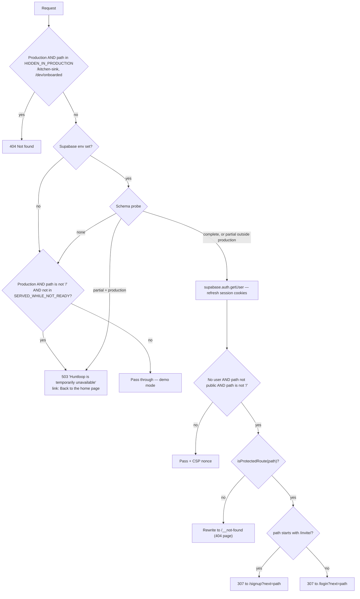
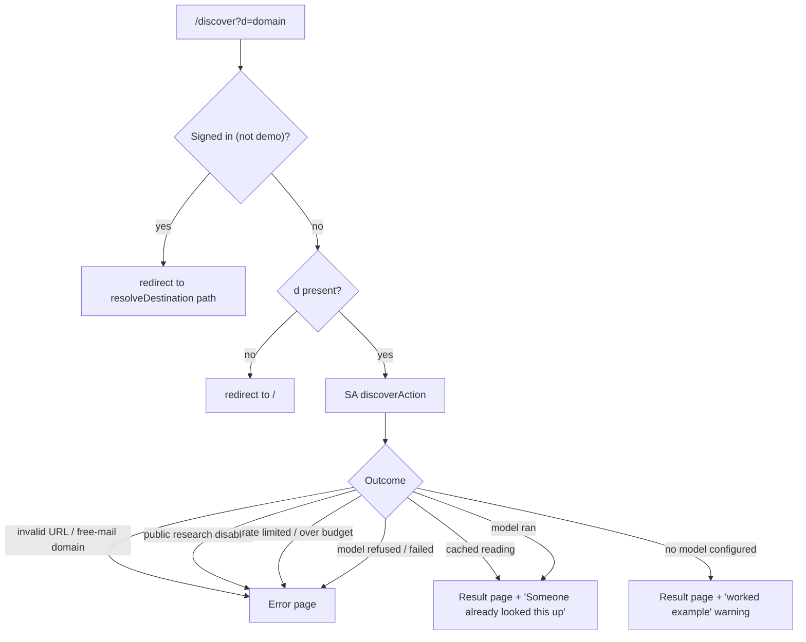
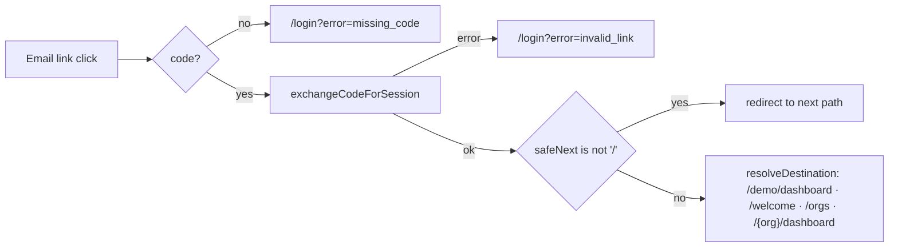
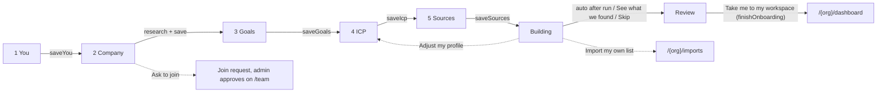
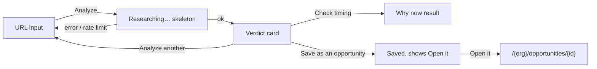
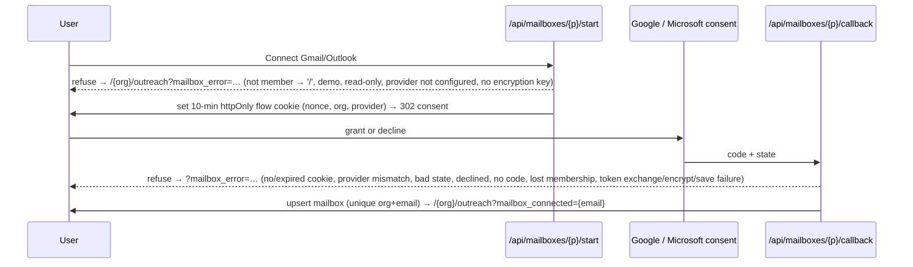
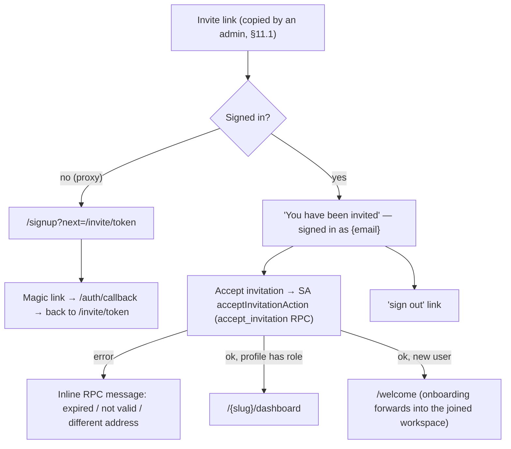

# COMMAND.md — Huntloop Website Interaction Map

> **Living document.** This is the single source of truth for every interactive element and user flow in the Huntloop web app (`apps/web`) and its shared UI kit (`packages/ui`). It documents **what the code implements today**, not what it should do. Any divergence is flagged `⚠️ FLOW MISMATCH` and collected in [§14](#14-unresolved-or-broken-flows).
>
> **Maintenance rule:** any change that adds, removes, renames, or rewires an interactive element, route, redirect, server action, or state must update this file in the same commit — the affected entry, every flow that links to it, and §14 if a mismatch is fixed or introduced.
>
> Last full sync: **2026-10-06** against the `main` working tree (P0–P6 of §16; P3–P6 uncommitted).
>
> **Roadmap:** [§16](#16-product-roadmap) holds the product roadmap (added 2026-10-06). It is the only part of this file that describes **planned** behaviour; when a §16 item ships, document it in §0–§15 and mark it Shipped in §16 in the same commit.

**Entry format.** Complex elements use:
`Element → Action → Destination → New elements → Nested actions → Branches → Endpoint`.
Simple link lists use tables (`Element | Where | Goes to | Notes`).

**Notation.** `{org}` = workspace slug. `SA:` = Next.js Server Action (file path given). `RSC` = server component render. `router.push` = client navigation. `revalidate` = `revalidatePath` refresh of server data. "Demo mode" = no Supabase env or no schema (fixtures, `DataSourceBanner` shown).

---

## Contents

0. [System model: route gates, redirects, sessions](#0-system-model)
1. [Global navigation & shared components](#1-global-navigation--shared-components)
2. [Public / marketing site](#2-public--marketing-site)
3. [Authentication](#3-authentication)
4. [Onboarding (`/welcome/*`)](#4-onboarding)
5. [Workspace picker (`/orgs`)](#5-workspace-picker-orgs)
6. [Home: Command Center](#6-home-command-center)
7. [Hunt: Opportunities, Companies, Analyze, Imports](#7-hunt)
8. [Engage: Outreach, Inbox, Pipeline](#8-engage)
9. [Learn: Analytics, Intelligence, What we've learned, Memory](#9-learn)
10. [Company & Settings](#10-company--settings)
11. [Team & Operate](#11-team--operate)
12. [Public token pages & external integrations](#12-public-token-pages--external-integrations)
13. [Errors, empty states & edge cases](#13-errors-empty-states--edge-cases)
14. [Unresolved or broken flows (⚠️ FLOW MISMATCH register)](#14-unresolved-or-broken-flows)
15. [Cross-page flow reference](#15-cross-page-flow-reference)
16. [Product roadmap](#16-product-roadmap)

---

## 0. System model

### 0.1 Request pipeline (`apps/web/proxy.ts`)

Every request except static assets, `robots.txt`, `humans.txt`, `sitemap.xml` and image files passes through `proxy()`:



- **Public prefixes** (no session needed): `/login`, `/signup`, `/auth`, `/kitchen-sink`, `/api/csp-report`, `/unsubscribe`, `/api/unsubscribe`, `/discover`, `/for`, `/compare`, `/privacy`, `/terms`, `/acceptable-use`, `/opengraph-image`, `/apple-icon`, `/api/jobs/tick`, `/api/inngest`, `/api/health`, `/dev/onboarded`, and `/` itself.
- **Protected shapes** (`lib/protected-routes.ts`): `/orgs*`, `/welcome*`, `/invite*`, `/api*`, and `/{org}/{section}` where section ∈ analytics, analyze, companies, dashboard, imports, inbox, intelligence, learn, memory, opportunities, ops, outreach, pipeline, settings, sources, team. Anything else anonymous → 404 page (not a login wall).
- **`?next=`** is path-only and re-validated by `lib/safe-next.ts` on consumption (no open redirect).
- Every response carries a per-request CSP nonce and `Reporting-Endpoints: csp-endpoint="/api/csp-report"`.

### 0.2 Workspace gate (`app/(app)/[org]/layout.tsx`)

For any `/{org}/*` page: `currentViewer(org)` → **not a member → `notFound()` (404, not 403)**. In demo mode a synthetic `demo` viewer is returned. The layout then renders `OrgShell` + `DataSourceBanner` + `SetupCard` (if onboarding incomplete) + the page.

### 0.3 The destination resolver (`lib/data/destination.ts → resolveDestination`)

Used by the auth callback, `/dev/onboarded`, the landing page CTAs (`continueTarget`), and `/discover`.

| Condition | `kind` | Path |
|---|---|---|
| No DB (demo) | `demo` | `/demo/dashboard` |
| DB but no signed-in user | `anonymous` | `/login` |
| Signed in, zero memberships | `new-user` | `/welcome` |
| One membership (or `preferredSlug` matches) | `workspace` | `/{slug}/dashboard` (+ `setupStep` if unfinished) |
| Several memberships, no preference | `choose` | `/orgs` |

`continueTarget()` converts this to the single CTA a signed-in visitor sees on public pages: `new-user` → "Continue setup" (`/welcome`); `choose` → "Open workspace" (`/orgs`); `workspace` unfinished → "Continue setup" (`stepPath(org, step)`); finished → "Open workspace" (`/{org}/dashboard`); anonymous/demo → none (Sign in + Start free shown instead).

`stepPath(org, step)`: you → `/welcome?org=`, company → `/welcome/company?org=`, goals → `/welcome/goals?org=`, icp → `/welcome/icp?org=`, sources → `/welcome/sources?org=`, building → `/welcome/building?org=`, review → `/welcome/review?org=`, done → `/{org}/dashboard`.

> ⚠️ **FLOW MISMATCH M-03** — `resolveDestination(preferredSlug)` supports a remembered workspace (`huntloop.org` cookie) but **no caller passes it**, so multi-workspace users land on `/orgs` on every sign-in. See §14.

### 0.4 Session-dependent behaviour summary

| Surface | Anonymous | Signed in | Demo mode |
|---|---|---|---|
| Landing nav/hero | Sign in + Start free | Single "Continue setup"/"Open workspace" CTA | Sign in + Start free |
| `/discover` | Renders | Redirects to `destination.path` | Renders |
| `/login`, `/signup` | Form | Form (no redirect for signed-in users) | Supabase env missing: "Supabase is not configured" note with demo link. Env set but schema missing: normal form |
| `/{org}/*` | 307 → `/login?next=` | Membership check → page or 404 | Fixture data, banner |
| Account menu | — | Account & privacy + Sign out | "Sample data · nobody signed in" + Sign in |

### 0.5 Roles & permissions (as enforced in UI)

Roles: **owner › admin › member › viewer** (see §11.1). `currentViewer(org)` yields the role; helpers `canWrite`, `canSpend`, `canAdmin`, `canOwn` (`lib/data/membership.ts`) gate controls. Read-only viewers see controls replaced by badges/labels, disabled with a Note, or rendered with a `pending` explanation (aria-disabled + tooltip). The **security boundary is Postgres RLS**; UI gating is convenience only. Most server actions go through `mutate(org, name, fn, { minRole })` (`lib/data/org.ts`), which returns plain-language failures for: no database ("…nothing to save to…"), not a member, viewer role ("Your role is read-only, so this change was not saved…"), and admin/owner-only actions. AI-spending actions additionally call `limitRefusal` (rate limits).

---

## 1. Global navigation & shared components

### 1.1 Workspace shell (`app/(app)/[org]/OrgShell.tsx`) — present on every `/{org}/*` page

Layout: **Top bar** (full width) · **Sidebar** = 76px **rail** of sections + 240px **panel** of the selected section's pages · **`<main id="main">`** (only scroller) · hidden sign-out form.

#### 1.1.1 Skip link
- **Element:** "Skip to content" anchor, first focusable element, visible only on keyboard focus.
- **Action:** Enter/click → `#main`. `<main tabIndex=-1>` receives focus.
- **Endpoint:** focus in page content; next Tab continues inside main.

#### 1.1.2 Top bar (`packages/ui TopBar`)

| Element | Where | Action → Destination | Branches / notes |
|---|---|---|---|
| **Open navigation** (☰) | Top-left, `< lg` only | Opens sidebar drawer (`navOpen=true`) → see 1.1.4 | Hidden ≥ lg |
| **Workspace switcher** (brand mark + org name + plan label + ⇅) | Top-left | Link → `/orgs` (§5) | `/orgs` immediately redirects single-workspace users back to `/{org}/dashboard` (see §5). Plan label hidden when unknown |
| **Search or jump to…** (field; icon-only on mobile) | Centre | Opens **Jump-to palette** (1.1.5) | Shows ⌘K / Ctrl K hint ≥ md |
| **Feedback** | Right, ≥ sm | Plain `<a>` → `NEXT_PUBLIC_FEEDBACK_URL` | Rendered **only** when env var set |
| **Avatar** (initials) | Right | Opens **Account menu** (1.1.6) | Initials = account name, or org name in demo |

#### 1.1.3 Sidebar (`packages/ui Sidebar`)

**Rail sections** (click = navigate to the section's first page; the rail item is a link):

| Rail | Panel? | Panel items → route |
|---|---|---|
| **Home** | No (single item) | Command Center → `/{org}/dashboard` |
| **Hunt** | Yes — "Find and qualify the accounts worth pursuing." | Opportunities → `/{org}/opportunities` · Companies → `/{org}/companies` · Analyze a URL → `/{org}/analyze` · Imports → `/{org}/imports` |
| **Engage** | Yes — "Reach out, follow up and move deals forward." | **Needs you** (count) → `/{org}/needs-you` · Outreach → `/{org}/outreach` · Inbox → `/{org}/inbox` · Pipeline → `/{org}/pipeline` |
| **Learn** | Yes — "What the loop is teaching you." | Performance → `/{org}/performance` · Ask Huntloop [AI] → `/{org}/assistant` · Intelligence [AI] → `/{org}/intelligence` · What we've learned [AI] → `/{org}/learn` · Memory → `/{org}/memory` · Prospect demand → `/{org}/demand` |
| **Company** | Yes — "What you sell, and who you sell it to." | Product → `/{org}/settings/product` · ICP [AI] → `/{org}/settings/icp` · Sources → `/{org}/sources` · Competitors → `/{org}/competitors` |
| **Team** | Yes | Members → `/{org}/team` · Assignments → `/{org}/team/assignments` |
| **Operate** | Yes — "Is the engine running, and what is it costing?" | Engine → `/{org}/ops` · AI spend → `/{org}/analytics` |
| **Settings** (rail footer) | Yes — "How this workspace is set up." | General → `/{org}/settings` · Product · ICP · Scoring → `/{org}/settings/scoring` · Integrations → `/{org}/settings/integrations` · Data & privacy → `/{org}/settings/privacy` |

- **Active state:** longest-prefix match of `pathname` against all item hrefs (detail pages light their list page). Product/ICP appear under both Company and Settings; the section you came from stays lit.
- **Panel footer:** `SidebarQuota` meter (`chrome.quota` label, used / limit) — omitted when plan unlimited/unknown. Not interactive.
- **Rail footer: Hide/Show sidebar** (`SidebarCollapseButton`, ≥ lg only) → toggles panel; persisted in `localStorage["hl:sidebar-panel"]` (`hidden`/`shown`). Storage failure → toggles but not remembered.
- **Attention dot** on a rail icon appears when any item has `count > 0` with `countTone: "attention"`. **Needs you** sets it from `chrome.needsYou` — the number of ranked items in this person's default view (`getDefaultNeedsYou`, request-cached and shared with the dashboard rail, so the two always agree). A failure to count costs the badge, never the shell.
- **`unbuilt` flag:** renders an item as non-link "Soon" label. **No item uses it today** (every destination exists; `scripts/audit.mjs NAV-01` fails the build for a nav href without a route).

#### 1.1.4 Mobile drawer (`< lg`)
- **Open:** ☰ in top bar. Sidebar slides in over a scrim; panel is forced open; tapping a rail item with a panel **selects** that section (preview) instead of navigating.
- **Close paths:** tap scrim ("Close navigation" button) · `Esc` · choosing any page (pathname change auto-closes) · navigating via Jump-to.
- **Endpoint:** chosen page rendered, drawer closed.

#### 1.1.5 Jump-to palette (`packages/ui JumpTo`, opened by top-bar search or ⌘K/Ctrl K)
- **Element:** modal "Jump to" with a combobox "Search pages" and a listbox of every nav destination (deduped by href; group = section label).
- **Actions:** type → ranked filter (prefix > word-prefix > substring > group match) · ↑/↓ move highlight (wraps) · Enter or click → close + `router.push(href)` (also closes mobile drawer) · hover moves highlight · `Esc`/backdrop/✕ closes · ⌘K again toggles closed.
- **Empty state:** "No page matches "{query}"."
- **Endpoint:** target workspace page, or palette closed with no navigation.
- Only pages are searchable — **no records** (companies, opportunities) are indexed.

#### 1.1.6 Account menu (`app/(app)/[org]/AccountMenu.tsx`)
**Trigger:** avatar button (aria "Account menu for {name}"). Menu header shows name + email (demo: org name + "Sample data · nobody signed in"). Keyboard: ↑/↓, Enter, `Esc` closes and returns focus; click outside closes.

| Item | Shown when | Action → Destination |
|---|---|---|
| Account & privacy | Signed in | → `/{org}/settings/privacy` (§10.7) |
| Workspace settings | Always | → `/{org}/settings` (§10.1) |
| Integrations | Always | → `/{org}/settings/integrations` (§10.6) |
| Switch workspace | Always | → `/orgs` (§5) |
| Theme: System / Light / Dark (inline choice row) | Always | Sets `data-theme` on `<html>` + `hl-theme` cookie (1 year); all theme controls stay in sync via MutationObserver. No navigation |
| Keyboard shortcuts `?` | Always | Opens **Keyboard shortcuts** modal (1.1.7) |
| Help & docs ↗ | `NEXT_PUBLIC_HELP_URL` set | External link |
| Huntloop home page | Always | → `/` (landing renders "Open workspace" CTA for signed-in users) |
| **Sign out** (danger) | Signed in | `requestSubmit()` on hidden `<form method=post action="/auth/signout">` → `POST /auth/signout` → Supabase signOut → **303 → `/login`** |
| Sign in | Demo mode | → `/login` |

#### 1.1.7 Keyboard shortcuts modal & global hotkeys
- **Open:** account menu item, or `?` anywhere not typing in an input/textarea/select/contenteditable.
- **Content (read-only list):** ⌘K/Ctrl K — search or jump · `?` — show shortcuts · ↑ ↓ — move through menus/results · Enter — open highlighted result · Esc — close menu/dialog/drawer.
- **Close:** ✕, Esc, backdrop click. **Endpoint:** modal closed.

#### 1.1.8 Banners injected by the org layout (every `/{org}/*` page)

- **DataSourceBanner** (`role=status`, not interactive): `unconfigured` → "Demo data. Supabase isn't configured…"; `no-schema` → "…migrations haven't been applied yet… run packages/db/migrations". Hidden when live.
- **SetupCard** ("Finish setting up your workspace", shown until onboarding complete and only while something is missing):

| Element | Shown when | Goes to |
|---|---|---|
| "What your company sells" link | No product row | `/welcome/company?org={org}` |
| "Your ideal customer profile" link | No ICP | `/welcome/icp?org={org}` |
| "Sources to watch" link (optional) | ICP exists, 0 sources | `/welcome/sources?org={org}` |
| **Continue setup** button | Always in card | `stepPath(org, onboarding_step)` |

Card disappears once `completedAt` set, step `done`, or nothing is missing.

#### 1.1.9 Workspace error & loading boundaries
- **Loading:** `[org]/loading.tsx` skeleton (title + 6 rows) for every section; `opportunities/loading.tsx` overrides.
- **Error:** `[org]/error.tsx` — shell stays up; `ErrorState` "This screen failed to load. Nothing was changed." + `Reference: {digest}` + **Try again** (`reset()` re-renders the segment) + **Go to the home page** (→ `/`). Error sent to Sentry.

### 1.2 Shared UI primitives (`packages/ui`) — behaviour contracts used everywhere

| Primitive | Interaction contract |
|---|---|
| **Button** | `href` → renders a link (via `linkComponent`). `pending="reason"` → `aria-disabled`, `title=reason`, click ignored (explains *why* unavailable). `disabled` → native disabled |
| **ConfirmButton** (all destructive row actions) | Click 1 → **armed** (danger style, label e.g. "Remove it"/"Archive it", live-region "press again to confirm, or press Escape to cancel"). Click 2 within **4 s** → `onConfirm()`. Disarms on timeout, blur, or Esc. 48px hit area |
| **Confirmed** (undo banner) | Success strip with optional **Undo** button ("Undoing…" while pending). Only offered where a restore action exists |
| **Modal** | Native `<dialog>`; focus trapped; Esc and backdrop click close (unless `dismissible=false`); ✕ button |
| **Menu** | Trigger toggles; ↑/↓/Home/End; Enter selects; Esc closes + refocuses trigger; outside pointerdown closes; `choices` rows are inline radio sets |
| **Toast** | Provider mounted in root layout (success/info auto-dismiss 5 s; danger persists until ✕), but **no product screen calls `useToast`** today — outcomes use inline `FormMessage` instead (only `/kitchen-sink` demos it) |
| **ThemeToggle** | 3-way System/Light/Dark segmented control; writes theme cookie; used on public pages, `/orgs`, onboarding, auth |
| **HoverPanel** (ScorePill / PriorityBadge explanations) | Opens on hover/focus; Esc, outside click, blur close; keyboard reachable |
| **DataTable** | Optional checkbox column (select row / select all); sortable headers toggle desc⇄asc; `empty` slot rendered when no rows |
| **FilterBar** | Scope `<select>` + search input; when `selectionCount > 0` shows "{n} selected" + selection actions; `actions` slot on the right |
| **ErrorState** | Optional **Try again** (`onRetry`) |
| **RateLimited** | States retry time; no retry button |
| **EmptyState** | Icon, title, description, optional `action` slot |
| **`<details>` disclosures** | Native toggle (▸/▾), e.g. "Evidence (n)", "Based on (n)" |

### 1.3 Root-level pages

| Route | Behaviour |
|---|---|
| `app/not-found.tsx` | 404 page for unknown routes and non-member workspaces (see §13) |
| `app/error.tsx` | Root error boundary (replaces the whole document) |
| `app/global-error.tsx` | Layout-level failure fallback |
| `/robots.txt`, `/sitemap.xml`, `/humans.txt`, `/opengraph-image`, `/apple-icon` | Machine-readable; public |
| `/kitchen-sink` | Dev-only component gallery; 404 in production |

---

## 2. Public / marketing site

All public pages are reachable without a session. Signed-in visitors see the same pages with a "Continue setup"/"Open workspace" CTA instead of Sign in/Start free (via `continueTarget`, §0.3).

### 2.1 Landing page `/` (`app/(marketing)/page.tsx`)

**Reached from:** direct/SEO, every "Huntloop" logo link, account menu "Huntloop home page", error pages "Go to the home page", legal "← Huntloop", 503 page, onboarding header logo.

#### Sticky nav
| Element | Action → Destination | Notes |
|---|---|---|
| Logo "Huntloop" | → `/` | |
| Product | In-page anchor → `#discover` | Hidden < md (no mobile menu) |
| How it works | → `#how` | Hidden < md |
| Pricing | → `#pricing` | Hidden < md |
| ThemeToggle | Theme switch | Hidden < sm (footer copy always present) |
| Sign in | → `/login` | Anonymous/demo only |
| **Start free** | → `/signup` | Anonymous/demo only |
| **Continue setup / Open workspace** | → `continueTarget` href | Signed-in only; replaces both above |

#### Hero
| Element | Action → Destination |
|---|---|
| **Start free** / signed-in CTA | → `/signup` or `continueTarget` href |
| See how it works › | → `#how` |
| *Dev: open onboarded workspace* | Dev builds only → `GET /dev/onboarded` → `resolveDestination()` path, or `/login?next=/dev/onboarded` if anonymous. 404 outside `next dev` |

Hero mock, feature strip, "list is not the answer", loop diagram, Discover/Qualify/Evidence/Claim-kinds/In-control sections are **static** (no interactive elements) except:
- "Show evidence ›" text link (Qualify section) → `#evidence`.

#### Data & pricing section (`#pricing`)
| Element | Shown when | Action |
|---|---|---|
| Read our data practices › | `legalIsComplete()` | → `/privacy` |
| Plan cards (from `listPublicPlans()`) | Always | Static limits |
| **Start free** (Free plan) | price = 0 | → `/signup` |
| **Talk to us about {Plan}** | paid plan + `IDENTITY.contactEmail` set | `mailto:{contact}?subject=Huntloop {Plan}` (external mail client) |
| "Not available yet" (inert) | paid plan, no contact email | None |

Warning copy: "There is no checkout yet." — no billing flow exists anywhere in the product.

#### Closing CTA
| Element | Action |
|---|---|
| Try it on your domain › | → `#domain` (scrolls to the input below) |
| **DomainInput** (`#domain`) | See 2.2 |

#### Footer
| Column | Links |
|---|---|
| (left) | © year · ThemeToggle |
| Product | How it works → `#how` · Pricing → `#pricing` · Compared to a list tool → `/compare/list-tools` · Compared to an AI SDR → `/compare/ai-sdr` |
| Use cases | Founder-led sales → `/for/founder-led-sales` · Outbound teams → `/for/outbound-teams` · Agencies and consultants → `/for/agencies` · Account-based → `/for/account-based` |
| Company | Contact (`mailto:`, only if contact email set) · Sign in → `/login` · Create an account → `/signup` |
| Legal (only if `legalIsComplete()`) | Privacy → `/privacy` · Terms → `/terms` · Acceptable use → `/acceptable-use` |

`/compare/hiring-an-sdr` and `/compare/doing-it-manually` are **not** linked from the landing page; reachable only from other compare pages' "Also compared to" list and the sitemap.

### 2.2 DomainInput (shared: landing closing CTA, `/for/*`, `/compare/*`, `/discover` error state)

- **Element:** text input "yourcompany.com" + submit **See what Huntloop finds ›**.
- **Validation (client):** button disabled until value looks like `host.tld` (scheme stripped). Enter submits.
- **Action:** `canResearch=true` (anonymous research enabled) → `router.push(/discover?d={value})`; `canResearch=false` → `router.push(/signup?d={value})`. Button shows "Reading…" while navigating.
- Sub-copy: "No card. No account. Just your domain." vs "No card. Create a free account and we'll read your site first."
- Only the **landing page** passes the real `canResearch`; the other three call sites use the default `true`.

### 2.3 `/discover?d=` — anonymous company read (`app/(marketing)/discover`)



**Header:** logo → `/` · ThemeToggle · **Sign in** → `/login`.

**Result page elements:**
| Element | Action |
|---|---|
| Finding source URLs (facts only) | External link, new tab |
| **Continue with a free account** | → `/signup?d={domain}` (→ §3.2 "Keep going" variant) |

**Error page elements** (titles: "Let's do this with an account" when refused, else "That didn't work"; ErrorState titles: "You've used up the anonymous lookups" / "Not available without an account" / "We couldn't read that site"):
| Element | Action |
|---|---|
| **Create a free account** | → `/signup?d={domain}` (or `/signup`) |
| "Or try another address:" DomainInput (md) | → `/discover?d=` again |

> ⚠️ **FLOW MISMATCH M-10** — on the error page, and on `/for/*` and `/compare/*`, DomainInput always targets `/discover` even when anonymous research is switched off, so "try another address" loops back to the same refusal. See §14.

`robots: noindex`.

### 2.4 Use-case pages `/for/{useCase}` and comparison pages `/compare/{approach}`

- **Valid slugs only** (`generateStaticParams`, `dynamicParams=false`): for = founder-led-sales, outbound-teams, agencies, account-based; compare = list-tools, ai-sdr, hiring-an-sdr, doing-it-manually. Any other slug → 404.
- **Header:** logo → `/` · ThemeToggle · `NavActions` (anonymous: Sign in → `/login`, **Start free** → `/signup`; signed in: single `continueTarget` button).
- **Body:** DomainInput (md, near top on `/for`) · DomainInput (lg, "See what it finds for you") · static content.
- **Footer nav:** `/for/*`: "Also for" → the other three `/for/*` pages. `/compare/*`: "Also compared to" → other three `/compare/*`; "Or by what you do" → all four `/for/*`.

### 2.5 Legal pages `/privacy`, `/terms`, `/acceptable-use` (`LegalPage`)
- **Elements:** "← Huntloop" → `/` · ThemeToggle · `/terms` body links to `/privacy` and `/acceptable-use`.
- **Branch:** until every fact in `lib/legal.ts` is supplied, a "Draft — not in force" warning is shown, the pages are `noindex`, and they are **not linked** from the landing footer, pricing section, or sign-up form.

### 2.6 503 "temporarily unavailable" page (production, DB not ready)
Plain HTML from `proxy.ts`; single link **Back to the home page** → `/`. Served for every path except `/` and `SERVED_WHILE_NOT_READY`.

---

## 3. Authentication

Magic-link (email OTP) only. Google OAuth code exists (`signInWithGoogle`) but its button is **not rendered** ("temporarily hidden for testing").

### 3.1 `/login` — Sign in
**Reached from:** landing/nav "Sign in", `/discover` header, footer, proxy guard (`/login?next=/path`), sign-out (303), auth callback errors, account menu (demo "Sign in"), `/welcome` when session missing (`/login?next=/welcome`).

| Element | Action → Result |
|---|---|
| Logo (lg) | → `/` |
| ThemeToggle (top-right) | Theme |
| **Work email** input (required, type=email) | — |
| **Email me a sign-in link** | SA `sendMagicLink` (`app/(auth)/actions.ts`) with `mode=login`, `shouldCreateUser: false`, `emailRedirectTo=/auth/callback?next={safeNext}`. Button "Sending…" while pending |
| "No account? **Create one**" | → `/signup` (drops `next`) |

**Branches:**
- **Supabase not configured:** form replaced by warning note ("Supabase is not configured" locally / "Sign-in isn't available here yet" in production) + **open the Command Center** → `/demo/dashboard`.
- **Invalid email** → inline `role=alert` validation message.
- **Supabase error** → "That didn't work. Check the address and try again."
- **Success** → form replaced by "Check your email … If an account can be created or found for {email}, a sign-in link is on its way. It expires in an hour." (enumeration-safe; **no resend / change-address control** — reload the page to retry).
- Signed-in users visiting `/login` still see the form (no redirect).

> ⚠️ **FLOW MISMATCH M-01** — `/auth/callback` redirects failures to `/login?error=missing_code|invalid_link` (and `signInWithGoogle` to `?error=oauth`), but the login page **never reads `error`**, so an expired/used link lands silently on a blank sign-in form. See §14.

### 3.2 `/signup` — Create account
Same `AuthForm` with `mode=signup` (`shouldCreateUser: true`), button **Create account**.
- **`?d={domain}` variant** (from `/discover` or DomainInput with research off): title "Keep going", copy "We've already read {domain}…"; default `next` becomes `/welcome?d={domain}` so the domain survives the email round-trip.
- **`?next=`** (e.g. invite: proxy sends anonymous `/invite/*` visitors to `/signup?next=/invite/{token}`) takes precedence.
- **Agreement line** (Terms / Acceptable Use / Privacy links) only when `legalIsComplete()`.
- "Already have an account? **Sign in**" → `/login`.
- Branches identical to 3.1.

### 3.3 Magic-link callback `GET /auth/callback?code&next`

**First-time user** (no memberships) → `/welcome` (onboarding). **Returning single-workspace** → `/{org}/dashboard` (even if setup unfinished — SetupCard explains). **Multi-workspace** → `/orgs`.

### 3.4 Sign out `POST /auth/signout`
Triggered only by account menu "Sign out" (hidden form POST; CSRF-safe). Supabase `signOut()` → **303 → `/login`**. Endpoint: signed-out login page.

---

## 4. Onboarding

**Shell (`app/(onboarding)/welcome/layout.tsx`):** header logo → `/` (landing then offers "Continue setup"), ThemeToggle, **OnboardingProgress**, step content. Loading skeleton while steps render.

**Visible steps:** 1 You (`/welcome`) → 2 Your company (`/welcome/company`) → 3 Your goals (`/welcome/goals`) → 4 Ideal customer (`/welcome/icp`) → 5 Sources (`/welcome/sources`). Then hidden steps **building** (`/welcome/building`) → **review** (`/welcome/review`) → **done** (`/{org}/dashboard`). The server-side marker is `organizations.onboarding_step`.



### 4.0 OnboardingProgress (every step)
| Element | Action |
|---|---|
| Step dots 1–5 | Link (with `?org=`) when done or ≤ furthest-reached (furthest tracked in `sessionStorage["huntloop.onboarding.furthest.{org}"]`); plain text otherwise; current step has `aria-current=step` |
| ← Back to {previous step} | Link to previous step (on building/review → Sources) |
| Finish later — open workspace → | Only when `?org=` present → `/{org}/dashboard` (progress already saved) |

Steps 3–7 **require `?org=`**; without it the page redirects to `/welcome/company`.

### 4.1 Step 1 — "First — who are you?" `/welcome`
**Server branches (before render):**
- No session (DB configured) → `/login?next=/welcome`.
- Profile already has a role **and** no `?new` **and** no `?org` → forward: first membership done → `/{slug}/dashboard`; at you/company → `/welcome/company?org={slug}` (+`&d=`); else → `stepPath`; no membership → `/welcome/company` (+`?d=`).
- Otherwise render the form (prefilled name/role).

| Element | Action |
|---|---|
| Your name (required, autofocus if empty) | Hint "From your account…" when prefilled |
| "What do you do?" — 7 role radio cards (Founder or CEO, Founder-led sales/GTM, Sales/AE, SDR/BDR, RevOps/Growth, Marketing, Agency or consultant) | Selects role (drives dashboard layout & agency copy later) |
| **Continue** (disabled until name + role) | SA `saveYou` → `profiles` updated → returns `next`: existing membership done → `/{slug}/dashboard`; existing unfinished → `/welcome/company?org={slug}`; none → `/welcome/company`. Client appends `d` carry and `router.push` |

Branches: field errors under each field; general error `role=alert`; "Saving…".

> ⚠️ **FLOW MISMATCH M-02** — `/welcome?new=1` ("Create another workspace" on `/orgs`, "Set up another client" dashboard action) renders this step, but `saveYou` ignores `new` and forwards to the **existing** workspace, so a second workspace cannot be created through the UI. See §14.

### 4.2 Step 2 — "What does your company sell?" `/welcome/company[?org][&d]`
Phases: **input → researching → review → saving**.

**Input phase**
| Element | Shown when | Action |
|---|---|---|
| "Who is this workspace for?" toggle: **A client** / **My own agency** | Role = agency | Switches copy ("What does your client sell?", "Research this client") |
| **JoinExisting** panel "Your company already has a workspace(s)" | No `?org` and the `discoverable_workspaces` RPC returns matches (workspaces sharing the user's company domain) | Per workspace: **Ask to join** → SA `requestJoinAction(orgId)` → button becomes "✓ Asked" + note "An admin will see the request…". Error → inline. **Endpoint:** pending join request visible to that workspace's admins on `/team` (§11.1) |
| Website input (required, autofocus; prefilled from `?d`) | Always | — |
| **Research my company / Research this client** | Always | SA `researchCompanyAction(url, org)`: if no `org` → `createWorkspace(url)` (`create_organization` RPC; slug from domain; idempotent for same base slug) → reuse anonymous `/discover` reading if same domain (`claimResearch`) else run `research()` |
| "Your workspace will be /{slug} — this can't be changed later." | No `?org` | Live slug preview |

**Branches:** rate-limited → `RateLimited` block; error → ErrorState "That didn't work"; both return to input phase. Researching phase: "Reading {url}…" skeleton (no cancel).

**Review phase ("Here's what we understood")**
| Element | Action |
|---|---|
| Company name (editable input, max 200) | Becomes workspace/product name |
| **Start over** | Back to input phase (keeps URL) |
| Each finding: **Edit** | Opens textarea (autofocus); on change the finding becomes a user-asserted `fact`; blur closes |
| Fact source URL | External link, new tab |
| Worked-example warning | Shown when no model configured |
| **Looks right — continue** | SA `saveCompanyAction(slug, understanding, liveSeal)` (live flag verified by HMAC seal) → `router.push(/welcome/goals?org={slug})`. Error → message, stays on review |

> ⚠️ **FLOW MISMATCH M-08** — after the first research creates a workspace, **Start over** + a *different* domain calls `createWorkspace` again (the component passes the `org` prop, not the slug it just created), producing a second, orphaned workspace. See §14.

### 4.3 Step 3 — "What do you want Huntloop to do?" `/welcome/goals?org=`
| Element | Action |
|---|---|
| 5 goal toggle cards (Discover / Qualify / Enrich / Reach out / Learn), max 2 — a third selection drops the oldest | `aria-pressed` toggles; counter "n/2" |
| "How do you want to reach people?" 4 radios: My work email / LinkedIn, or by hand / Export to my CRM or sequencer / Not sure yet | Selects channel |
| **Continue** (disabled until ≥1 goal and a channel) | SA `saveGoals` → `router.push(/welcome/icp?org=)`; error inline |

Goals and channel drive dashboard section order, lead sentence and first-action suggestion (§6), and the Review screen's secondary CTA (§4.7).

> ⚠️ **FLOW MISMATCH M-09** — revisiting Goals (via Back or a progress dot) shows an **empty** form rather than the saved answers; revisiting ICP **re-drafts with the model** instead of loading the saved profile. See §14.

### 4.4 Step 4 — "Who should we hunt for?" `/welcome/icp?org=`
On mount runs SA `draftIcpAction(org)` once (from stored research).

| Phase | Elements & actions |
|---|---|
| **loading** | "Working out who you should be selling to…" skeleton |
| **error** | RateLimited *or* ErrorState "We couldn't draft your profile" + **Try again** (re-run draft) · **Build it myself** → ready phase with empty fields. If no stored research: error "We don't have a reading of your website…" |
| **ready** | Chip fields below; reach bar; save controls |

**Chip fields** (free-text: type + Enter or **Add**, commit on blur, ✕ "Remove {v}"; option fields: toggle buttons). Each drafted field shows an *inference* badge and "Because your site says: …".
- Card "Who they are": **Segments**\*, Industries, **Company size** (options 1–10 … 5000+)\*, **Regions** (options)\*.
- Card "What makes them ready to buy": **Buying triggers**\*.
- Card "Who to reach": **Job titles**\*, Titles that look right but aren't.
- Card "Who is never a fit": Exclusions.
- Card "Sharpen it further" **Show/Hide**: Technologies, Business model, Pain points, Use cases, **Companies that are obviously right** (domains) + **Preview what these add** (SA `previewLookAlikesAction`, reads ≤5 domains, "Reading them…", result via `LookAlikeResult`, nothing saved; editing the list clears the preview), Seniority, Departments.

(\* = required: segment **or** industry, size, region, trigger, title.)

**Reach bar** (auto, 900 ms debounce after any criteria change): "Counting matching companies…" → "About N companies match · per {provider}" / "No company-search provider is connected…" / error; unmapped criteria listed; > 50,000 → "very broad" warning; < 50 → "small, precise market" note.

**Save controls:**
| Element | Action |
|---|---|
| **Continue to sources** (disabled until required fields filled) | SA `saveIcp` → `router.push(/welcome/sources?org=)` |
| "Still needed: a segment or industry, a size band, …" links | Scroll to and focus the missing field |
| *Continue anyway (dev)* | Dev builds only; same save, bypasses client gate |
| Badge "Editable later in Settings → ICP" | Static |

### 4.5 Step 5 — "Where should we look?" `/welcome/sources?org=`
On mount runs SA `recommendSourcesAction(org)` once.

| Phase | Elements |
|---|---|
| **no-icp** | EmptyState "We don't know who you're hunting for yet" + **Build my ideal customer** → `/welcome/icp?org=` |
| **loading** | Skeleton |
| **error** | RateLimited or ErrorState + **Try again**; **Carry on without sources** → saves custom list only |
| **ready** | Recommended list: each source shows kind badge, why, "Because you said:", external link, toggle **On ✓ / Add +** (`n/m on` counter). "Your own": URL input + **Add**, chips with ✕ remove. |

**Start hunting** → SA `saveSources` (accepted system + user sources) → `router.push(/welcome/building?org=)`. Copy under the button states either "No sources — we'll still find companies…" or "{n} sources will be monitored."

### 4.6 Building `/welcome/building?org=`
Client runs SA `runStageAction(org, stage)` sequentially for **discover → enrich → score → contacts → explain → rules**; each row shows waiting / running (spinner) / done ✓ / skipped ⊖ / failed ⚠ + detail. A failed stage does not stop the next. After the loop: SA `advanceStep(org, "review")`.

| Element | Action |
|---|---|
| **Skip — I'll wait in the workspace** (while running) | → `/welcome/review?org=` |
| **See what we found** (after finish) | → `/welcome/review?org=` |
| Auto-advance | If anything was discovered/scored → `/welcome/review` after 900 ms |
| Nothing-found panel: **Adjust my profile** | → `/welcome/icp?org=` |
| Nothing-found panel: **Import my own list** | → `/{org}/imports` (§7.4) |

> ⚠️ **FLOW MISMATCH M-05** — "Skip — I'll wait in the workspace" goes to the **Review** step, not the workspace; and because stages are driven by the page, leaving it stops the remaining first-run stages (the copy says "This carries on without you"). See §14.

### 4.7 Review `/welcome/review?org=`
| Element | Shown when | Action |
|---|---|---|
| Top 3 opportunity cards: Priority badge + ScorePill (hover explanations), Why now, Why a fit, fact/inference counts, **See the working** | ≥1 opportunity | → `/{org}/opportunities/{id}` (§7.1.2) |
| EmptyState "Nothing has cleared the bar yet" + **Review my profile** / **Import my own list** | 0 opportunities | → `/{org}/settings/icp` / `/{org}/imports` |
| "We also drafted N scoring rules…" + **Read the proposed rules** | Proposed rules exist | → `/{org}/settings/scoring` (§10.4) |
| **Take me to my workspace** | Always | SA `finishOnboarding` → sets `completed_at`, writes `huntloop.org` cookie → `router.push(/{org}/dashboard)` — **onboarding endpoint** |
| **Connect a mailbox** | goals include reach_out | → `/{org}/settings` |
| **Import my accounts** | goals include qualify (not reach_out) | → `/{org}/imports` |
| **Invite a teammate** | neither | → `/{org}/team` |

> ⚠️ **FLOW MISMATCH M-04** — "Connect a mailbox" links to General settings, but mailbox connection lives on **Outreach** (`/{org}/outreach`). See §14.
> ⚠️ **FLOW MISMATCH M-06** — if `finishOnboarding` fails, the explanatory note is set and then immediately navigated away from, so it is never seen. See §14.

---

## 5. Workspace picker `/orgs`

**Reached from:** top-bar workspace switcher, account menu "Switch workspace", `resolveDestination` (`choose`).

**Server branches:** demo → redirect `/demo/dashboard`; 0 memberships → `/welcome`; **1 membership → `/{slug}/dashboard`** (so for single-workspace users "Switch workspace" just reloads their dashboard); ≥2 → render.

| Element | Action |
|---|---|
| Logo (not a link here) · ThemeToggle | — |
| Per workspace card: initial, name, role badge, "Last used" (cookie match), "Setup unfinished", `/slug`, this-month usage ("N opportunities · N AI runs · …" or "Nothing used this month") | Static |
| **Finish setup** (unfinished only) | → `stepPath(slug, step)` |
| **Open** | → `/{slug}/dashboard` |
| **Create another workspace** | → `/welcome?new=1` (see M-02) |

> ⚠️ **FLOW MISMATCH M-03** — the page says choosing a workspace remembers it, but **Open** is a plain link that writes nothing; only `finishOnboarding` writes `huntloop.org`, and no resolver reads it. See §14.

---

## 6. Home: Command Center `/{org}/dashboard`

**Reached from:** Home rail, auth callback, `/orgs` Open, onboarding finish, "Finish later — open workspace", `continueTarget`, jump-to.

Section **order and lead sentence are personalised** (`lib/data/personalization.ts`):

| Role (onboarding step 1) | Default order | Lead |
|---|---|---|
| Founder or CEO | whyNow, counts, loop, signals, capacity | "What changed in your market, and who is worth your next hour." |
| Founder-led sales / GTM (also the fallback when no role) | whyNow, counts, loop, capacity, signals | "The whole loop, with whatever needs a person first." |
| Sales / AE | counts, whyNow, loop, capacity, signals | "Your accounts, and what has moved on them." |
| SDR / BDR | capacity, counts, whyNow, loop, signals | "Today's queue: who to reach, and what to say." |
| RevOps / Growth | loop, signals, counts, capacity, whyNow | "How the engine is performing, and where it is losing." |
| Marketing | whyNow, signals, loop, counts, capacity | "Signals in your market, and what they are telling you." |
| Agency | counts, whyNow, loop, capacity, signals | "This client's pipeline, and what needs you." |

The **first chosen goal** then moves its section to the top and replaces the lead: discover → whyNow · qualify/enrich → counts · reach_out → capacity · learn → loop. Each role also defines a `defaultFilter` (hot-warm, assigned, ready…) that **no screen consumes** (see §14.2).

### 6.1 Header
| Element | Shown when | Action |
|---|---|---|
| Refresh (icon) | Always | `router.refresh()` (keeps client state); disabled while refreshing |
| **Sources** | Always | → `/{org}/sources` |
| **Hunt now** | `canSpend` | SA `huntNowAction` (rate-limited `first_run_stage`) → `followActiveIcp(runNow)` → success message "Hunting. New companies arrive on the engine's next run…" / error "There is no search to run yet. Define a customer profile first." (or rate-limit text). Revalidates dashboard. "Starting…" while pending |
| **Analyze a URL** | `canSpend` | → `/{org}/analyze` |

### 6.2 Alert chips
| Chip | Shown when | Action |
|---|---|---|
| "N new triggers in the last 24h" | > 0 | Static |
| "N opportunities awaiting your review →" | > 0 | → `/{org}/opportunities` |
| "Analyze a company URL →" | Always | → `/{org}/analyze` |

### 6.3 Personalised sections
| Section | Elements → Destination |
|---|---|
| **counts** (Priority) | StatCards Hot / Warm / Watch / Ignore → `/{org}/opportunities?priority=hot\|warm\|watch\|ignore` (pre-filters the table, §7.1) |
| **whyNow** | Per untriaged opportunity: **company name** → `/{org}/opportunities/{id}`; PriorityBadge & ScorePill (hover panels); **Evidence (n)** disclosure → EvidenceList (source links) or "Nothing is attributed…". **Empty:** "Nothing is waiting for a verdict" + first-action button (below) |
| **loop** (Loop this week / Outcomes) | Discovered → `/opportunities` · Researched → `/companies` · Contacted → `/outreach` · Replied → `/inbox` · Meetings → `/pipeline` · Won → `/pipeline` · Companies known → `/companies` |
| **capacity** | QuotaBars (mailbox sending capacity) — only when mailboxes exist; static |
| **signals** | "Signals by type", "Source performance" breakdowns — static; empty copy when none |

**First action** (whyNow empty state), first matching rule wins: goal reach_out → **Connect a mailbox** (`/{org}/settings`, see M-04) · goal qualify → **Import your accounts** (`/{org}/imports`) · goal learn or role RevOps → **Tune your scoring rules** (`/{org}/settings/scoring`) · role agency → **Set up another client** (`/welcome?new=1`, see M-02) · otherwise → **Add a source to watch** (`/{org}/sources`).

### 6.4 Nudges (one at most, below sections)
- **LearningNudge** (wins when present; `lib/data/nudges.ts`): kinds `rejection-streak` ("You've overruled N of our verdicts" → **Review what we got wrong**), `first-reply` ("Something worked" → **See what worked**), `tighten-icp` ("You've taken on N companies" → **Tighten my profile**) — all → `/{org}/learn`. ✕ **Dismiss** → hidden, `localStorage["huntloop.nudge.{org}.{kind}"]=dismissed`.
- **IcpQualityCard** ("Your customer profile is N% complete" + suggestions): **Sharpen my profile** → `/{org}/settings/icp`; ✕ dismiss → `localStorage["huntloop.icp-nudge.{org}.{score}"]` (re-appears if the score changes).

### 6.5 "Needs you" rail (only when items exist; first on narrow screens, right column ≥1440px)

The top 5 items of the ranked queue (§6.6), in this person's **default ownership filter** (role `defaultFilter = "assigned"` → Mine; every other role → Everyone). Header "Needs you · N" + **Open the queue →** / **See all N →** → `/{org}/needs-you`. Each item is a `NeedsYouList` card (`needs-you/NeedsYouList.tsx`):

| Element | Action |
|---|---|
| Badge (Positive reply / Reply / Wrong person / Approve / Due today / Overdue / Gone quiet / Hot / No next step / Learning / Discovery paused / Sources / Freshness) + priority | Static |
| Title (company, or thread subject / workspace subject) | Static |
| "Why" sentence written by the ranker from the facts (ages, channel, classification, next-step text) | Static |
| Primary button (Reply / Log your reply / Find the right person / Review draft / Open / Follow up / Set next step / Review / Triage / Open sources) | Link → the item's `href` (email reply → `/{org}/inbox#thread-{id}`; draft → `/{org}/inbox#thread-{id}` or `#draft-{id}`; opportunity items → `/{org}/opportunities/{id}`; learning → `/learn`; sources → `/sources`; discovery paused / stale → `/opportunities`) |
| ⏰ **Snooze** menu: Later today (+4h) / Tomorrow morning (09:00 local) / Next week (Monday 09:00) | SA `snoozeAttentionAction` (`needs-you/actions.ts`) → upserts `attention_snoozes` (per user, max 30 days) → item hidden; message "Snoozed. It comes back on its own." Demo → "no database connected". Viewers may snooze (personal preference; not via `mutate`) |

### 6.6 Needs you `/{org}/needs-you[?filter=mine|unassigned|everyone]`
**Reached from:** Engage rail "Needs you", dashboard rail header link, jump-to.

Ranked by `lib/needs-you/rank.ts` (pure, unit-tested): base weight per kind × priority weight (hot 1.3 … ignore 0.6) × stage weight (meeting 1.25, proposal 1.3), plus age; ties by title. One item per opportunity (its strongest) **except drafts**, which are never folded. Candidates gathered by `lib/data/needs-you.ts` (bounded queries):

| Kind | Produced when |
|---|---|
| Reply (email) | Open thread whose last message is inbound; classifications `out_of_office`/`bounce`/`unsubscribe` never surface; `positive` ranks highest; `wrong_person` → "Find the right person" |
| Reply (other channel) | Latest logged touch is inbound on LinkedIn/phone/chat/other and no future next step |
| Approve | Outbound message, unsent, unapproved, not deleted (threaded or not) |
| Next step due | `opportunities.next_step_due_at` ≤ end of today |
| Gone quiet | Latest touch outbound, stage in assigned/contacted/replied/meeting/proposal, **no active enrollment**, no future next step, ≥ N business days (workspace setting, default 4) |
| Hot, untouched | HOT, stage before contact, no touch, no enrollment, trigger < 30 days or found < 14 days |
| No next step | Stage meeting/proposal and no next step |
| Learning | Pending `learning_findings` |
| Discovery paused | `backlog_state_for_org` saturated (open opportunities ≥ backlog cap) |
| Sources failing / Old scores | As before (`last_error` set; `last_scored_at` > 90 days) |

| Element | Action |
|---|---|
| Filter links **Mine / Unassigned / Everyone** | `?filter=` (link, shareable); default from role. Workspace items always shown |
| Groups: Conversations · Follow-ups · New opportunities · Workspace health (count each) | Item cards as §6.5 |
| Empty | "Nothing needs you right now" (Mine: suggests switching to Everyone) |
| "{n} items are snoozed…" + **Bring them back now** | SA `clearSnoozesAction` → deletes this person's snoozes |
| Demo | `DemoFigures`; items from fixtures, ranked at the fixtures' own "now" |

---|---|
| "N conversations are waiting on a reply" | `/{org}/inbox` |
| "N messages need approval" | `/{org}/inbox` |
| "N sources are failing" | `/{org}/sources` |
| "N opportunities were last scored over 90 days ago" | `/{org}/opportunities` |

No dismiss control is wired (`onDismiss` not passed).

---

## 7. Hunt

### 7.1 Opportunities

#### 7.1.1 List `/{org}/opportunities[?priority=hot|warm|watch|ignore][&company=Name]`
**Reached from:** Hunt rail, dashboard priority cards (pre-filtered), "awaiting your review" chip, "Discovered" loop card, Companies "{n} open" link (`?company=`), detail page "← All opportunities", action rail (stale scores), jump-to.

Server: `listOpportunities` (capped at `LIST_LIMIT`; notice "Showing the N highest-priority opportunities…" when hit) + `listCampaignTargets`; `canWrite` from viewer.

| Element | Action → Result |
|---|---|
| **Analyze a URL** (header, `canWrite`) | → `/{org}/analyze` |
| Priority chips All / Hot / Warm / Watch / Ignore (with counts) | Client filter; URL `?priority=` updated via `history.replaceState` (no navigation) |
| FilterBar scope (Company / Domain / Industry) + search | Client filter. `?company=` pre-fills search |
| Refresh (FilterBar right) | `router.refresh()` |
| Row checkbox / select-all | Selection → FilterBar shows "{n} selected" + actions |
| **Add to campaign** (selection action, `canWrite`) | Toggles inline **EnrollPanel**. If no campaigns: aria-disabled with tooltip "There are no campaigns to add these to yet. Create one under Outreach." |
| **Clear** (selection action) | Clears selection |
| Sortable headers Company / Priority / Score / Why now | Toggle desc⇄asc |
| **Company** cell (name + domain) | → `/{org}/opportunities/{id}` |
| PriorityBadge / ScorePill | Hover/focus panels with reason, dimensions, confidence |

**EnrollPanel** (inline, not modal):
Campaign `<select>` (non-sendable campaigns disabled "— no email step yet") → autonomy/status explainer → **Add {n} to campaign** (SA `enrollOpportunitiesAction`, max per call enforced, skips already-enrolled; revalidates `/opportunities` and `/outreach`) · **Cancel**.
Branches: none selected / no campaign → tooltip reasons; errors ("That campaign no longer exists.", "…has no email step yet…", batch too large) shown in panel; success → panel closes and selection clears.

On success the panel closes and the "{n} enrolled" confirmation shows under the filters (M-07 fixed).

**Empty states:** filtered → "No opportunities match this filter" + **Clear filters**; none at all → "No opportunities discovered yet" + **Analyze a company URL** (→ `/analyze`) + **Review sources** (→ `/sources`).

#### 7.1.2 Detail `/{org}/opportunities/{id}`
**Reached from:** list row, dashboard why-now card, pipeline card, onboarding review "See the working", Analyze "Open it". Unknown id → `notFound()`.

| Element | Action → Result |
|---|---|
| ← All opportunities | → `/{org}/opportunities` |
| Company domain link | External `https://{domain}` (new tab) |
| PriorityBadge / ScorePill / status badge | Hover explanations |
| **Assign / Owned by {name}** (`canWrite`) | Toggles Assign panel: Owner `<select>` (Unassigned + members; "You") → on change SA `assignOpportunityAction` (`team/actions.ts`) → message, panel closes |
| **Add to campaign** (`canWrite`) | Toggles Enrol panel: campaign select + **Add** (SA `enrollOpportunitiesAction(org, id, [id])`) + **Cancel**. No campaigns → tooltip explainer |
| **Disagree** (`canWrite`) | Toggles panel: Priority select (Hot/Warm/Watch/Ignore) + "Why (optional)" + **Record my correction** (disabled until band changes; SA `overridePriorityAction` — updates priority and stores the correction for learning; "already {band}" no-op message) + **Cancel** |
| **Not a fit** (`canWrite`, not won/lost/archived) | Toggles panel: **Why** select (Not our customer profile / No need / No budget / Already uses a competitor / Needs something we do not offer / Wrong time / Something else) + detail ("What do they need?" for missing capability) + **Mark not a fit** (danger) / **Cancel** → SA `disqualifyAction` (`activity-actions.ts`): `outcomes` kind `disqualified` with reason + recorded_by; band → Ignore via `record_override`; status → `archived`; next step cleared. Active sequences stop on their next run ("closed as not a fit") |
| **Push to HubSpot** (`canWrite` and HubSpot connected) | SA `requestCrmPushAction` → queues a push job ("Queuing…"); error "HubSpot isn't connected. An admin can connect it under Settings → Integrations." |
| Read-only viewers | See a badge "Owned by X / Unassigned" instead of all controls |
| LearningNudge (rejection-streak only) | Same as dashboard §6.4 (shared dismissal key) |
| Evidence list items | Source links (external) |
| Decision makers: email chip | `mailto:` (only verified addresses shown); LinkedIn icon → external profile |
| Decision makers empty | "Buyer identification incomplete" |
| **AgentPanel "Ask about {company}"** | See below |

Assign / Enrol / Disagree / Not a fit are one exclusive panel state (opening one closes the others). All outcomes surface in one shared `FormMessage`.

**What next bar** (`NextStepBar.tsx`, directly under the header; replaces the old static "Recommended" strip):
| Element | Shown when | Action |
|---|---|---|
| Label "Next step" or "Recommended" + sentence + **Based on:** inputs | Always | Sentence from `lib/needs-you/next-action.ts`: own next step (or "Overdue: …") → inbound reply (positive / wrong person / plain) → meeting/proposal without a next step → active sequence → outbound touch quiet (≥ N business days) or waiting → the legacy four-case verdict rule. Tone: info / warning / success / neutral |
| **Set next step** | `canWrite`, none set | Inline form: Next step (≤280) + Due (date, default +2 days, stored as 09:00 local) → **Save** (SA `setNextStepAction`: "Next step saved. It shows in Needs you when it is due.") / **Cancel** |
| **Done** / **Edit** / **Clear** | `canWrite`, step set | Done → SA `clearNextStepAction(done=true)` (also logs a note "Done: …"); Clear → same with done=false; Edit → inline form |
| "Trigger {age}" | Trigger on file | Static freshness |

**Activity card** (`ActivityPanel.tsx`; first in the main column once the stage is past qualified, otherwise after Outreach angle). Timeline from `lib/data/activity.ts getTimeline` (50 newest; 0037 ledger): icon per kind/channel, summary, actor (You / name / "They" / Huntloop), freshness, detail (email subject linking to `/inbox#thread-{id}`; loss reason and competitor; override reason; "Reconstructed from a recorded outcome"), body for manual rows; system rows rendered quieter. Footer notes: "Showing the 50 most recent", "Stage changes are recorded from {date}…".
| Element | Action |
|---|---|
| **Log activity** (`canWrite`) | Inline form: What (Message / Call / Meeting / Connection request / Note) · Channel (LinkedIn / Email outside Huntloop / Chat / Other — messages) · Who started it (We reached out / They replied or reached out — messages & calls) · With (optional person at the company) · When (datetime, ≤ now, ≤ 2 years back) · Summary (optional, auto-written) · Notes · Then (optional next step + due) → **Log it** → SA `logActivityAction`: inserts a manual `activities` row; **moves stage forward only** — meeting → `meeting` (+ outcome meeting once), inbound → `replied` (+ outcome reply once; stops sequences), outbound → `contacted`; sets the next step if given. Message "Logged. Moved to {stage}. Next step set." |
| **Remove** (own manual rows) | SA `deleteActivityAction` → soft delete |

**AgentPanel** (per-user conversation, persisted):
- Suggested prompt chips (What should I write? · What should I not claim? · What do we actually know? · Prepare me for a meeting · Give me a different angle · Is this still a good opportunity?) → **fill the textarea only** (do not send).
- Textarea + **Send** (icon) → SA `askAgentAction` → appends user + Huntloop turns; "Not established" box lists unresolved items; each answer has **Based on (n)** disclosure listing cited claims. Read-only role → Send aria-disabled "Your role is read-only…". Errors → FormMessage, draft kept.
- Endpoint: answer rendered and saved to the conversation (reloads show history).

### 7.2 Companies `/{org}/companies`
**Reached from:** Hunt rail, dashboard "Researched"/"Companies known", jump-to. Demo → DemoFigures banner.

| Element | Action → Result |
|---|---|
| **Add a company** (`canWrite`) | Toggles inline CompanyForm (new) |
| FilterBar scope Name / Domain / Industry + search | Client filter |
| "{n} open" (Opportunities column) | → `/{org}/opportunities?company={name}` |
| Top PriorityBadge | Hover reason |
| ✏ Edit {name} (`canWrite`) | Toggles CompanyForm for that row |

**CompanyForm:** Name\*, Domain\* (URL reduced to host), Website, Industry, Country, Region, People (blank = unknown), Business model, What they do → **Add company / Save changes** (SA `saveCompanyAction`; duplicate-domain and field errors inline; revalidates) · **Cancel** · **Remove {name}** ConfirmButton ("Remove it", soft delete via `deleteCompanyAction`).
Success closes the form and the message shows above the list (M-07 fixed); the row appears/updates. Hand-added companies with no research are researched and scored by the engine (≤5 per tick, once a day — migration 0036).
**Empty:** "No companies yet" / "No company matches that" (no action button). Rows are not clickable (no company detail page exists).

### 7.2.1 Company detail `/{org}/companies/{id}`
**Reached from:** company names on Companies (§7.2). One company across every profile it fits: **Opportunities** (each a company × profile pair → opportunity detail) and **Not qualified yet**; **History** — one timeline across all its opportunities; the opportunity brief sections computed for the company; **People on file** (LinkedIn links); **Funding and leadership**.

### 7.3 Analyze a URL `/{org}/analyze`
**Reached from:** Hunt rail, dashboard header + chip, opportunities header/empty state, jump-to. **Viewer without spend rights → `PermissionDenied` (required role: member)**.



| Element | Shown when | Action |
|---|---|---|
| Company website input + **Analyze** | Always | SA `analyzeUrlAction` → qualification vs org ICP ("Researching…") |
| RateLimited / ErrorState "That didn't work" | On failure | Informational |
| Verdict card: domain, PriorityBadge, ScorePill, summary, Recommendation | Done | Hover panels |
| **Check timing** | Priority ≠ ignore, not yet checked | SA `whyNowAction` → urgency badge (This week/month/quarter) or "No reason today", reason, "Rests on" claims; error inline |
| Evidence list | Done | Source links external |
| "No model is connected" warning | Worked example | Save hidden (no seal) |
| **Analyze another** | Done | Reset to empty input |
| **Save as an opportunity** | Priority ≠ ignore **and** live seal | SA `saveQualificationAction` (upserts company + opportunity, inserts score & evidence) → message |
| **Open it** | After successful save | → `/{org}/opportunities/{id}` |

### 7.4 Imports `/{org}/imports`
**Reached from:** Hunt rail, onboarding building/review "Import my own list/accounts", dashboard first action (qualify goal), jump-to.

| Element | Action |
|---|---|
| CSV textarea (read-only role: disabled + Note "Your role is read-only…") | Live client preview as you type |
| Hidden file input + **Choose a file** | Reads `.csv` into textarea |
| **Clear** (when text present) | Empties textarea |
| Preview card | Rows read / usable / skipped, warnings (no domain, column-count mismatch, >1,000 truncated), "Columns recognised" badges, "Not recognised, and not imported", first 8 rows table (scroll region) |
| **Import {n} companies** | SA `importCsvAction` → "What happened" card (Companies added / Already on your list / People added / Email addresses / Skipped) + message. `usable = 0` → aria-disabled with reason |

Server-side refusals: no rows, no company column, company without domain column. Existing companies are not overwritten. **Endpoint:** companies on `/companies`; the engine researches/scores them on following ticks.

---

## 8. Engage

### 8.1 Outreach `/{org}/outreach[?mailbox_connected=|?mailbox_error=]`
**Reached from:** Engage rail, dashboard "Contacted", mailbox OAuth return, opportunity tooltips ("Create one under Outreach"). Demo → DemoFigures.

**Summary figures** (static): Campaigns · Active · Sending without approval (active & autonomy ≥ 3). Shared `FormMessage` shows every outcome on the page, seeded by the OAuth query-string notice ("{email} is connected and can send." / error text).

#### Campaigns
| Element | Action |
|---|---|
| **New campaign** (`canWrite`) | Inline CampaignForm (name only; created as draft, autonomy 0) → **Create campaign** (SA `saveCampaignAction`) / **Cancel** |
| Empty | "No campaigns yet" explainer |
| Campaign card **Edit** | Swaps card for CampaignForm: Name\*, **Autonomy** 0 Draft only … 5 Autonomous (hint explains each), **Status** draft/active/paused/archived → **Save campaign** / **Cancel** / **Archive {name}** ConfirmButton ("Archive it" → `deleteCampaignAction`: "Campaign archived and removed from the list.") |
| Card badges | status, autonomy, "Nobody enrolled"/"{n} enrolled" — not links |
| **Add a sequence** name + **Add** | SA `createSequenceAction` (aria-disabled until named) |
| Sequence **Add step** | Opens new StepEditor |
| Step row **Edit** | Opens StepEditor for that step |

**StepEditor:** Step type Email/Wait/Condition · Position (read-only) · Delay (hours) · Subject + Body (email only; hint: every personalised claim must cite evidence before it can send) → **Save step** (SA `saveStepAction`) · **Remove this step** ConfirmButton · **Cancel**.

Enrolment happens from Opportunities (§7.1), not here. There is no enrolled-contacts list, draft queue, or send button on this page — drafts appear in the **Inbox** for approval (§8.2).

#### Mailboxes
| Element | Shown when | Action |
|---|---|---|
| **Connect Gmail** / **Connect Outlook** | `canWrite`, live DB, provider credentials, encryption key | Link → `GET /api/mailboxes/{provider}/start?org=` (see flow below) |
| **Connect a mailbox** (aria-disabled + reason) | Any prerequisite missing | Tooltip: no DB / no OAuth credentials / `MAILBOX_ENCRYPTION_KEY` unset |
| Mailbox rows | Connected mailboxes | Email, provider, status, warm-up stage, "Sent today" quota bar — **no disconnect control** |



### 8.2 Inbox `/{org}/inbox`
**Reached from:** Engage rail, dashboard "Replied" card, action-rail "waiting on a reply" / "need approval". Demo → DemoFigures.

| Element | Action |
|---|---|
| Summary figures | Conversations · Waiting on you · With a delivery failure (static) |
| Delivery-failure banner | Informational |
| Thread **Status** select open/snoozed/closed (`canWrite`) | SA `setThreadStatusAction` → "Moved to {status}." |
| **Reply** (`canWrite`) | Toggles ReplyBox; aria-disabled "Nothing has arrived in this conversation yet…" when no inbound message |
| ReplyBox textarea + **Queue reply** / **Cancel** | SA `replyToThreadAction` ("Queueing…"; aria-disabled until text) → queued for the next engine run |
| Message **Approve** (outbound, unsent, unscheduled, `canWrite`) | SA `approveMessageAction` → "Approved. It is sent on the next run." → badge becomes "Queued to send" |
| Badges | Received/Sent, "Drafted by Huntloop", evidence count / "No evidence cited", latest event (delivered…complained), "Awaiting approval"/"Queued to send" |

**Approval queue** "Waiting for your approval · N" (every outbound draft, unsent and unapproved, threaded or not — `listDrafts`; first emails have no thread until sent, so before 0037 they appeared nowhere). Per `DraftCard` (anchor `#draft-{id}`): Drafted by Huntloop · evidence badge · "Edited by a person" · "Awaiting approval" · To {address} at {company → opportunity} · campaign.
| Element | Action |
|---|---|
| **Approve** | SA `approveMessageAction` (as before); disabled with reason when no recipient |
| **Edit** → Subject / Body → **Save changes** / **Cancel** | SA `editDraftAction`: keeps recipient/step/evidence; stores the AI original once (`original_subject`/`original_body_text`), `edited_by/at`; stays unapproved — "Saved. It still waits for your approval." |
| **Reject** → Why (optional) → **Reject draft** / **Cancel** | SA `rejectDraftAction`: soft-deletes with `rejected_by/at/reason` (timeline: "Draft rejected"); parks its enrollment — "Rejected. Its sequence is paused so nothing follows up on it." |

Threads: card anchor `#thread-{id}`; **{company} ↗** link → `/{org}/opportunities/{id}` when attached; **Who handles** select (Nobody + members; shown when > 1 member) → SA `assignThreadAction`; an unapproved draft inside a thread shows **Review in the approval queue** (→ `#draft-{id}`) instead of its own Approve. Figures now include "Waiting for approval". Replies a person queues record them as `approved_by` (attribution on the timeline).

**Empty:** "Nothing here yet — Replies to your outreach arrive here…" (only when there are no threads **and** no drafts).

### 8.3 Pipeline `/{org}/pipeline`
**Reached from:** Engage rail, dashboard Meetings/Won cards. Horizontal board scrolls within its own region.

Columns: Discovered · Researching · Qualified · Assigned · Contacted · Replied · Meeting · Proposal · Won · Closed (lost + archived). Empty column: "Nothing here".

| Element | Action |
|---|---|
| Card company name | → `/{org}/opportunities/{id}` |
| PriorityBadge | Hover reason |
| Owner badge | "Yours" / "Assigned" / "Unassigned" (static) |
| **Stage** select (`canWrite`) — all 11 statuses | SA `setOpportunityStatusAction` → "Moved to {stage}." and card moves column after revalidation |
| Choosing **lost** | Does not move yet: inline "Why was {company} lost?" — Reason (They stopped responding / Chose a competitor / No budget / Wrong time / No real need / Needed something we do not offer / Not a fit after all / Never reached the right person / Something else) · To whom (competitor picker, when "Chose a competitor" and competitors exist) · Detail → **Mark lost** (reason saved on the `outcomes` row; timeline "Lost · {reason}") / **Skip** (moves without a reason) / **Cancel** (stays put) |

No drag-and-drop.

---

## 9. Learn

### 9.1 Performance `/{org}/performance[?period=7d|30d|90d|month|last-month]`
**Reached from:** Learn rail "Performance", jump-to. Definitions and statistics live in `lib/performance/compute.ts` (pure, unit-tested); rows from `lib/data/performance.ts` (paginated, ceilings stated on screen when hit).

| Element | Action |
|---|---|
| Period links (Last 7 / 30 / 90 days, This month, Last month) | `?period=`; the previous window is the same length, immediately before |
| **What the data says** | Insight cards: a segment called better/worse only when its 95% Wilson interval does not overlap the rest (≥ 10 each side); reply-rate change only when a two-proportion test clears 1.96 (≥ 30 each side); volume change ≥ 50%; dominant loss reason (≥ 5 closed, ≥ 40% share; missing capability called out); stalled deals. Each shows its basis; segment insights link to the breakdown. Small samples → "Not enough outreach in this period to compare…" |
| **Summary** → **Summarise this period** / **Write it again** (`canSpend`) | SA `explainPerformanceAction` → recomputes the figures server-side, builds the closed fact list (`lib/performance/facts.ts`) and runs `explain_performance` (Sonnet; every sentence cites fact ids; any number not in its cited facts is rejected). Rendered with an INFERENCE badge; each sentence expands to its sources; suggestions listed separately. No key → worked example quoting the top two facts. Rate-limited, spend-guarded, not persisted |
| Funnel stat cards (Found, Qualified, First contacted, First replied, Positive replies, Meetings, Won) with change vs previous; **CSV** | CSV → `GET /{org}/performance/export?period=&table=funnel` |
| Reply rate / Meeting rate / Time to an answer cards | Cohort = companies whose first outbound touch (any channel) fell in the period; replies and meetings counted after that touch, up to now; medians in days |
| **Where replies come from** — tabs First channel / Source / Trigger / Priority / Owner; **CSV** (`table=segments`) | Table: contacted, replied, reply rate with 95% range, meetings; a row expands to up to 25 company links → opportunity detail |
| **Why deals ended** (+ CSV `table=reasons`) | Lost / Not a fit / Lost to (competitor) tallies for the period |
| **Your pace** | Outbound touches you made this week and meetings on accounts you own this month, against workspace goals with an even-pace marker. Owner/admin: **Set goals / Edit goals** → Touches per week, Meetings per month → SA `saveGoalsAction` (`settings.goals`) |
| **Stalled deals** | Meeting/proposal with no activity ≥ 14 days → opportunity links |
| **What it cost** | Model spend, provider credits (never converted to money), spend per qualified opportunity and per meeting; **Full AI spend →** `/{org}/analytics` |
| Demo | `DemoFigures`; fixtures have no outreach, so the "not enough data" state is the real one |

CSV export (`performance/export/route.ts`): member check (404 otherwise); tables funnel / segments / reasons / stalled; cells starting `= + - @` are neutralised (`lib/csv-write.ts`).

### 9.1b AI spend `/{org}/analytics` (Operate rail)
**Reached from:** Operate rail "AI spend", Performance "Full AI spend →", jump-to. **Read-only page.**
Content: Last 30 days stat cards (Total spend, Cache hit rate, Failed, No outcome = stranded runs), "Spend by task" and "Spend by model" breakdowns, **Runs** DataTable (status badges Succeeded/Failed/No outcome). Empty: "No model calls yet". No links, filters or exports.

### 9.2 Intelligence `/{org}/intelligence`
**Read-only.** Figures (Facts · Inferences · Open questions · Triggers); **Evidence** (EvidenceList with source links; empty "No evidence yet — Evidence arrives from a hunt or from Analyze a URL…"); **Triggers** (with "Happened" freshness); **Decisions and overrides** (with "Overruled by a human" badge). Demo → DemoFigures. No actions.

### 9.3 What we've learned `/{org}/learn` (page H1 "Learn")
**Reached from:** Learn rail, all three dashboard LearningNudges, opportunity-detail rejection-streak nudge.

| Element | Shown when | Action |
|---|---|---|
| Engine warning | Engine not **driven** (`engineReadiness`, the same check Sources uses) | Not configured → "Nothing is running the engine… Set CRON_SECRET and schedule /api/jobs/tick"; configured but never called → "/api/jobs/tick would accept a caller, but nothing has called it…" |
| **Run an analysis** (`canWrite`) | Always for writers | SA `requestAnalysisAction(org, 90)` → queued run. Disabled while a run is requested/running or the engine is not driven; the action refuses in that state too. Caption: "Looks at the last 90 days." / "One is already running…" |
| Run section header | Per run | Date, outcomes/overrides/ratings considered, "scheduled" |
| Run states | requested / running / insufficient / failed / ready-with-no-findings | Status copy ("Queued. It starts on the next engine tick." etc.) |
| Finding card: kind badge (Sources/Scoring/Outreach/Profile/Competitors/Demand), inference badge, headline, detail, recommendation, support counts | Per finding | — |
| "Based on" citation links | Citation has href | → `/{org}/opportunities/{id}`, `/{org}/companies/{id}`, `/{org}/sources`, `/{org}/competitors/{id}` or `/{org}/demand` |
| What an analysis reads | — | Outcomes, overrides and ratings in the window; sources; accepted competitors (losses in the window, prospects using / evaluating / leaving them, whether positioning is written); accepted demand themes (statements, deals that asked, how many were lost) — `0043`. Competitor and demand findings cite those records by id |
| Proposal box | Finding has a proposal | "Accepting adds this to Memory" or "Accepting creates this rule, inactive" |
| **Accept** (`canWrite`, pending finding) | — | SA `approveFindingAction` → creates inactive scoring rule **or** memory note (or just records agreement) → card shows "Approved" + link |
| **Decline** | — | SA `rejectFindingAction` → "Rejected. Nothing was applied." |
| "waiting under Settings → Scoring" link | Approved rule | → `/{org}/settings/scoring` (rule must still be activated there) |
| "Memory" link | Approved memory | → `/{org}/memory` |

**Empty:** "Nothing analysed yet". Endpoint of the learning loop: inactive rule on Scoring (§10.4) → activated by a human; or a Memory entry (§9.4).

The "tighten-icp" nudge's promise is kept on ICP settings (§10.3): **Suggested from your decisions** proposes additions drawn from the companies this workspace took on, each naming the companies behind it (M-12, fixed).

### 9.4 Memory `/{org}/memory`
**Reached from:** Learn rail, Learn "Memory" link after accepting a finding.

| Element | Action |
|---|---|
| Figures You wrote / Huntloop concluded | Static |
| **Add a document** (`canWrite`) | IngestForm: toggle **From a link** / **From a file** · Address (URL) *or* File — PDF, Word (.docx), .txt/.md/.csv, ≤ 4 MB. Text files are read in the browser; PDF/DOCX are posted to `POST /api/memory/extract` (writers only; type judged by magic bytes, not the declared type; zip-bomb bounded; stores nothing), which returns their text. A scanned PDF with no text layer is refused with "Paste the text instead". The text appears in an editable **What will be stored** box ("Reading {file}…" while extracting) · Label · Tags (comma) → **Store it** (SA `ingestMemoryAction`, "Reading…"; disabled until URL/text) · **Cancel** |
| **Add a memory** (`canWrite`) | MemoryForm: **Who this applies to** (organization / team / user / account / opportunity, with help text) · **Subject** (filterable picker of named people / companies / opportunities, required for non-org scopes; `team` is offered only on a memory that already has it) · Label · **What to remember**\* → **Add memory** (SA `saveMemoryAction`) · **Cancel** |
| Memory card **Edit** (user-written only) | Swaps to MemoryForm → **Save memory** |
| **Remove this memory** ConfirmButton | SA `deleteMemoryAction` → "Memory removed. The agent will stop using it." |
| Source link on card | External, new tab |

"What Huntloop worked out" (derived memories): removable, **not editable**. Empty: "Nothing remembered yet". Scoped memory cards show their subject by name ("Removed or not loaded" when it is gone).

### 9.5 Ask Huntloop `/{org}/assistant`
**Reached from:** Learn rail "Ask Huntloop" [AI], jump-to. The workspace co-pilot (§16.3-G).

| Element | Action |
|---|---|
| **Your question** ("Ask about your pipeline…") → send | SA `askAssistantAction` → `workspace_assistant` answers from this workspace's own records only (`lib/ai/workspace-context.ts`); the conversation is personal (RLS, `0041`) |
| Answer: **Based on** citations | Each cited record links to its page; with nothing on file the answer says **Not in your records** |
| Proposed actions (set a next step, remember something) | Nothing happens until pressed → SA `setNextStepAction` / `saveMemoryAction` |
| Clear the conversation | SA `clearAssistantAction` deletes this person's turns |
| No model key / demo | **Worked example** |

### 9.6 Prospect demand `/{org}/demand` (H1 "What prospects ask for")
**Reached from:** Learn rail "Prospect demand", jump-to. Data: `demand_signals`, `demand_themes` (`0042`).

Statements come from three producers: `classify_reply` (objections and requests a prospect stated, citing the message), deals closed lost / not a fit with a reason (trigger on `outcomes`), and activities marked as product feedback (trigger on `activities`). Erasing a contact deletes the statements drawn from them.

| Element | Action |
|---|---|
| **Group new statements** / "Grouping requested" (`canWrite`) | SA `requestGroupingAction` → `schedule_demand` (hourly) enqueues `cluster_demand`, which proposes themes citing statements |
| **Themes** — status (Proposed · Open · Planned · Shipped · Won't do · Dismissed · Merged), kind (Request / Objection / Blocker), statements with source ("from a reply / a closed deal / a note") | — |
| Proposed theme: **Accept** / dismiss; status changes (Open → Planned → Shipped / Won't do) | SA `setThemeStatusAction`. **Shipped** puts the lost and stalled deals that asked for it into Needs you ("Now shipped", 30 days) |
| Rename · **Merge into…** | SA `renameThemeAction` · `mergeThemeAction` |
| New theme (Theme name, Kind) | SA `createThemeAction` (origin `user`) |
| **Not grouped yet** — statement **Add to theme…** | SA `assignStatementAction` |
| Empty | "No themes yet" |

---

## 10. Company & Settings

All `/{org}/settings/*` pages share `settings/layout.tsx`: eyebrow "Settings" + H1/description chosen from the path (General · Product · ICP · Scoring · Integrations · Data & privacy). Sub-navigation is the sidebar's **Settings** panel (and **Company** panel for Product/ICP). Demo mode → DemoFigures on each page.

### 10.1 General `/{org}/settings`
**Reached from:** Settings rail, account menu "Workspace settings", Privacy "Organisation" links, onboarding review / dashboard "Connect a mailbox" (M-04).

**Card "Organisation"** (editable by owner/admin only; others see Note "Only an owner or an admin can rename the organisation…" and disabled fields, no Save):
| Element | Action |
|---|---|
| Name\* | — |
| Address `/{slug}` | Read-only ("Fixed…") |
| Postal address | Required before sending (added to every email footer) |
| Contact retention (days, 30–3650, blank = keep everything) | Warning note appears when a value is entered |
| **Save changes** | SA `saveOrgSettingsAction` → "Organisation settings saved." / field errors |

**Card "Voice and limits"** (owner/admin):
| Element | Action |
|---|---|
| Tone select (No preference / Direct / Warm / Formal / Technical / Plain) | — |
| Competitors (one per line) · Where you sell (one per line) | — |
| Backlog limit (blank = 250, 0 = no limit) | — |
| Follow-up reminder (business days, 1–20, blank = 4) | When an unanswered touch shows as "Gone quiet" in Needs you (`settings.followup.quietAfterBusinessDays`) |
| **Save** | SA `saveOrgProfileAction` |

No mailbox, billing or member controls live here.

### 10.2 Product `/{org}/settings/product`
**Reached from:** Company rail "Product", Settings panel. Edits the **first** product only (`products[0]`); there is no multi-product list.
Fields: Name\*, Website, What it does, Value propositions (one per line), Proof points (one per line) → **Save changes** / **Create product** when none exists (SA `saveProductAction`: "Product saved." / "Product created.") · **Remove this product** ConfirmButton (when a product exists; `deleteProductAction` → "Product removed."). Read-only role: disabled fields, no buttons. Title "Describe your product" when none exists.

### 10.3 ICP `/{org}/settings/icp`
**Reached from:** Company rail "ICP", Settings panel, IcpQualityCard "Sharpen my profile", onboarding review "Review my profile".

| Element | Shown when | Action |
|---|---|---|
| "Your ICPs" list: row button (name, Active badge, vN) | > 1 ICP | Selects that ICP into the form |
| **Make active** | Row not active, `canWrite` | SA `activateIcpAction` → "This is now the active ICP…" → rebuilds discovery search (`followActiveIcp runNow`) and requests rescore; inline error on row |
| **Remove {name}** ConfirmButton | Row not active | SA `deleteIcpAction` (soft) |
| ICP form: Name\*, Product select (or "Not tied to a product"), Segments, Company sizes, Regions, Buying triggers, Companies that are obviously right, Not a fit (all one-per-line text) | Always | — |
| **Preview what these add** | `canWrite`, ≥1 example domain | SA `previewLookAlikesAction` → LookAlikeResult; editing examples clears it |
| "Also on this profile" | ICP has onboarding-only fields (industries, technologies, personas' titles…) | Read-only list; preserved on save |
| **Save changes** / **Create ICP** | `canWrite` | SA `saveIcpAction`. Saving the **active** ICP rebuilds its discovery search and requests a rescore. First ICP in an org is created active |
| Cancel | Creating while others exist | Back to selected ICP |
| **Add another ICP** | `canWrite`, not creating | Blank form (new ICPs are created inactive) |
| **SearchPreview** "What this searches for" | A saved discovery search exists | Read-only: provider filters vs. qualification-only criteria, "Paused" badge |

**Personas** (only for a saved, selected ICP): **Add persona** → PersonaForm (Persona\*, Title patterns, Seniority, Pain points) → **Add persona / Save persona** (SA `savePersonaAction`) · **Remove this persona** ConfirmButton · Cancel. Empty: "No personas yet…".

Note the free-text Company sizes / Regions here vs. fixed option chips in onboarding (§4.4) — values typed here may not match the provider's size bands.

> ⚠️ **FLOW MISMATCH M-13** — after **Create ICP** succeeds, the editor stays in "Define your ICP" create mode (local `creating` state is never cleared), personas stay hidden, and pressing the button again creates a duplicate ICP. See §14.
> ⚠️ **FLOW MISMATCH M-14** — creating the first (auto-active) ICP here does **not** call `followActiveIcp`, so no discovery search exists until the user edits it, activates another, or presses "Hunt now". See §14.

### 10.4 Scoring `/{org}/settings/scoring`
**Reached from:** Settings panel, onboarding review "Read the proposed rules", Learn (approved rule link), dashboard first action (learn goal).

| Element | Action |
|---|---|
| **Write a rule** (`canWrite`) | Opens RuleForm (new) |
| **Draft from my ICP** | SA `draftRulesAction` → proposed (inactive) rules appear under "Waiting for you" ("Drafting…") |
| **Rescore all opportunities** | SA `recomputeScoresAction` ("Starting…"); refuses a second concurrent rescore ("A rescore is already running…") |
| Section **Waiting for you** (proposed) / **Running** (active) | Rule cards; empty states "Nothing waiting" / "No rules are running" |
| Rule card **Turn on / Turn off** | SA `setRuleActiveAction` (disabled for malformed rules, which show a "not running" badge + warning) |
| Rule card **Edit** | Swaps card for RuleForm |
| **Remove {name}** ConfirmButton | SA `deleteRuleAction` → "Rule removed." |

**RuleForm:** Name\* · **When** (Headcount, Industry, Country, Region, Business model, What they say they do, Technology, Company name, Domain, Something Huntloop observed, Kind of signal seen, The qualifier's score/priority) · **Test** (is exactly / mentions / is at least / is at most / is known / is not known) · Value (hidden for known/not known) — or, for multi-condition rules, a read-only condition summary · **Then** (Adjust the score / Treat it as at least… / Never consider it) · Points (−40…40) or At least (Hot/Warm/Watch) · Group under (screen label only) · Why → **Save** (SA `saveRuleAction`) · **Test it** (SA `previewRuleAction` against the 50 most recently scored opportunities; company facts only) · **Cancel**.

> ⚠️ **FLOW MISMATCH M-15** — the RuleForm header says "Saved switched off. Nothing changes until you turn it on.", but editing a **running** rule saves it still active, so the change applies immediately. Only new rules are saved off. See §14.

### 10.5 Sources `/{org}/sources` (Company section of the nav)
**Reached from:** Company rail "Sources", dashboard header "Sources", dashboard first action (default), action rail "sources are failing", opportunities empty state "Review sources", Learn citations, jump-to.

**Header:**
| Element | Shown when | Action |
|---|---|---|
| **Scan now** | `canWrite` and the engine is actually driven (Inngest configured **or** a tick has run) | SA `scanSourceNowAction` for **every** monitored source → "{n} sources queued. They are read on the next tick…" / "Everything was already queued…" / first error. Disabled with 0 sources |
| **Scan now** (aria-disabled) | Engine not driven | Tooltip explains `CRON_SECRET` unset vs. set-but-never-called |
| **Add a source** (`canWrite`) | Always | Toggles SourceForm: Name\*, Kind (News/Blog/Jobs/Social/Code/Funding/Regulatory/Community/Podcast/Custom), URL → **Add source** (SA `saveSourceAction`, enabled immediately: "Source added. It will be read on the next hunt.") · **Cancel** |

**Banners:** "Nothing is reading these sources on a timer." (engine not driven) · "{n} of {m} sources are not returning full results." (degraded/unavailable) · "Discovery is paused: {n} opportunities are waiting for review, which is at your backlog limit of {cap}…" with **triage them** (→ `/opportunities`) and **Settings** links (when `backlog_state_for_org` is saturated; since 0038 the cap pauses paid discovery as well as scans, without costing a query its turn).

**Monitored list** (empty: "Nothing is being monitored…"): name, kind, "Scanned {age}"/"Never scanned", documents/evidence counts, last error, status dot (Healthy/Degraded/Unavailable).
| Row control (`canWrite`) | Action |
|---|---|
| Scan interval select (15 min / Hourly / 6 h / Daily / Weekly) | SA `setScanIntervalAction` → "Saved. It takes effect after the next scan." |
| ⏸ Pause {name} | SA `setSourceEnabledAction(false)` → source moves to "Recommended" with badge "Paused by you" |
| 🗑 Remove {name} (single click) | SA `deleteSourceAction` → **Confirmed** banner "{name} removed." + **Undo** (SA `restoreSourceAction`) — the only undo in the app |

**Recommended for your ICP** ("Suggested, not enabled"):
| Element | Action |
|---|---|
| **Suggest sources** (`canWrite`) | SA `suggestSourcesAction` ("Asking…") → recommendations added |
| Per recommendation **Accept** | SA `setSourceEnabledAction(true)` → moves to Monitored |
| Per recommendation **Dismiss** | SA `deleteSourceAction` (no undo here) |
Empty: "No suggestions waiting…".

### 10.5b Competitors `/{org}/competitors` and `/{org}/competitors/{id}` (Company section of the nav)
**Reached from:** Company rail "Competitors", jump-to.

| Element | Action |
|---|---|
| **Add a competitor** (Name, Website, How directly) | SA `addCompetitorAction` (origin `user`) |
| **Proposed** — "Named in what your sources said about prospects. Nothing counts until you accept it." | Accept / dismiss → SA `setCompetitorStatusAction` |
| **Your competitors** rows (Not researched · Research queued · Prospecting their customers · Not sure yet) | → detail page |
| Detail: Name, Website, How directly they compete; **Your positioning** — Where we win / Where they win (person-owned; research never writes them) | SA `updateCompetitorAction` |
| Detail: **Research** | SA `requestCompetitorResearchAction` → request column (`0039`) → `research_competitor`; refused when nothing drives the engine |
| Detail: delete | SA `deleteCompetitorAction` |

### 10.6 Integrations `/{org}/settings/integrations`
**Reached from:** Settings panel, account menu "Integrations", HubSpot error copy.
**HubSpot card** (only integration):
| State | Elements |
|---|---|
| Not connected, owner/admin | Private app token (password field) → **Connect HubSpot** (SA `connectHubspotAction`, disabled until token) → "HubSpot connected." |
| Connected | "Connected — portal {id}", "Last synced …" / "Not synced yet — use Push to HubSpot on any opportunity.", last error; **Disconnect HubSpot** ConfirmButton ("Disconnect it" → `disconnectHubspotAction`) |
| Non-admin | Note "Only an owner or an admin can connect or disconnect HubSpot…" |

Endpoint: connected → "Push to HubSpot" appears on every opportunity detail (§7.1.2). Mailboxes are **not** here (they are on Outreach §8.1).

### 10.7 Data & privacy `/{org}/settings/privacy`
**Reached from:** Settings panel, account menu "Account & privacy". Controls disabled in demo mode (`live=false`) and for non-admins (Note shown).

| Card / element | Action → Endpoint |
|---|---|
| **Requests from people in your database**: Email address → **Export everything held** | SA `exportContactAction` → browser downloads JSON (`Downloaded {file}.`) |
| Retype the address → **Erase permanently** (danger, enabled only when both addresses match) | SA `eraseContactAction` → contact points/person deleted, bodies redacted (mail **to and from** the person, and any AI original kept beside an edited draft), hand-written activities about the person lose their text, suppression hash kept; fields cleared |
| Retention sentence "Organisation" link | → `/{org}/settings` |
| **Your own data** → **Export this workspace** | SA `exportOrganizationAction` → JSON download (includes the activity ledger in full since 0037) |
| **Delete this workspace** (owner only): type `{org}` → **Delete workspace** | SA `deleteOrganizationAction` → full reload to `/orgs` (→ `/welcome` if no workspaces left, dashboard if one) |
| **Delete your account**: type "delete my account" → **Delete my account** | SA `deleteOwnAccountAction` (refused if sole owner of a live workspace, naming it) → full reload to `/login` |

---

## 11. Team & Operate

### 11.1 Members `/{org}/team`
**Reached from:** Team rail "Members", onboarding review "Invite a teammate", Imports read-only note ("An admin can change your role under Members").

| Element | Shown when | Action |
|---|---|---|
| **Asking to join** card: email, "Asked {age}", **Decline** / **Approve** | Admin and pending join requests exist (from §4.2 JoinExisting) | SA `declineJoinAction` / `approveJoinAction` (`approve_join_request` RPC → membership as **member**); row disappears; inline error on failure |
| **Invite** (header) | Admin | Toggles InviteForm |
| InviteForm: Email address\* · Role (admin / member / viewer) → **Create invitation** / **Cancel** | — | SA `inviteMemberAction` → success panel with the invite URL + **Copy** ("Copied"). **No email is sent** — the admin must deliver the link (expires 14 days, bound to that address) |
| Member row role select (owner/admin/member/viewer) | Admin | SA `setMemberRoleAction`. Refusals: "Only an owner can grant, change or remove the owner role." · "This is the last owner. Promote somebody else to owner first…" (row shows a "Last owner" badge) |
| Member role badge | Non-admin | Static |
| **Remove {name}** ConfirmButton (armed label "Remove {name}?") | Admin | SA `removeMemberAction` → "Member removed." |
| **Pending invitations** rows: email, role, Expired, "Invited {age} by {name}", **Revoke** ConfirmButton ("Revoke it") | Admin (list is admin-scoped) | SA `revokeInvitationAction` → "Invitation revoked. That link no longer works." |
| "What each role may do" | Always | Static reference |

A pending invitation's link cannot be re-displayed after the success panel is dismissed — only revoked and re-issued (usability gap, §14 notes).

### 11.2 Assignments `/{org}/team/assignments`
Figures Unassigned · Assigned · Yours. Two lists: **Nobody is working on these** and **Assigned** (empty: "Nothing is assigned yet").
| Element | Action |
|---|---|
| Company name | → `/{org}/opportunities/{id}` |
| Owner select (Unassigned + members) (`canWrite`) | SA `assignOpportunityAction` → row moves between lists; status becomes `assigned` |

### 11.3 Engine `/{org}/ops`
**Reached from:** Operate rail "Engine", jump-to.
| State / element | Action |
|---|---|
| Demo / no member org | EmptyState "No engine to report on" |
| "Nothing is running the queue" warning | `CRON_SECRET` unset or never called (last tick shown) |
| **Given up on** dead jobs: name, attempts, age, verbatim error, payload | Informational; empty "Nothing has failed" |
| **Retry once** (admin) | SA `retryJobAction` → "Queued for one more attempt. It runs on the next tick." / "…no longer failed, so nothing was retried." |
| **Cancel** (admin) | SA `cancelJobAction` → "Cancelled. It will not run." |
| **By job** table | Per job: state, count, backlog (static) |
| **Data providers · last 24 hours** | Per provider and capability (`provider_health`, 0019): calls, cached, credits, p95 latency, rate-limited badge, failure-rate badge (over calls actually made). Empty: "No provider was called in the last 24 hours." |
| "This organisation is most of the queue" | > 80% of queue and > 50 queued |

---

## 12. Public token pages & external integrations

### 12.1 Invitation `/invite/{token}`

- No DB → "No database connected" panel.
- `noindex`, `referrer: no-referrer`.

> ⚠️ **FLOW MISMATCH M-16** — the "sign out" link on this page is a `GET` `<Link href="/auth/signout">`, but `/auth/signout` only implements `POST`; following it returns **405** instead of signing out. See §14.

### 12.2 Unsubscribe `/unsubscribe/{token}` and `/api/unsubscribe/{token}`
- **Page:** "Unsubscribe" + **Unsubscribe me** → SA `unsubscribeAction` (`record_unsubscribe` RPC) → "You have been unsubscribed…" (endpoint) / "That unsubscribe link is not valid." / no-DB message ("Reply to the message and ask to be removed."). No account needed. `noindex`.
- **RFC 8058 one-click:** `POST /api/unsubscribe/{token}` from the mail client → 200 text / 400 invalid / 404 unknown token / 503 no DB. `GET` on the API path → 303 to the page (so a link click confirms rather than unsubscribes).
- Suppression also stops already-scheduled follow-ups.

### 12.3 Machine endpoints (no UI)
| Route | Caller | Behaviour |
|---|---|---|
| `GET /api/health` | Monitors | JSON booleans about configuration (never values) |
| `GET\|POST /api/jobs/tick` | Scheduler with `Authorization: Bearer $CRON_SECRET` | 503 when secret unset; 404 on wrong secret; runs the job engine and returns a report |
| `POST /api/inngest` | Inngest (HMAC signed) | 404 when not configured; 401 bad signature; drives the engine. `GET` → 404 or status JSON |
| `POST /api/csp-report` | Browsers | Always 204 |
| `GET /api/mailboxes/{provider}/start` · `/callback` | Outreach Connect buttons | OAuth dance, §8.1 |

### 12.4 External integrations & destinations
| Integration | Where it surfaces | Configured by |
|---|---|---|
| Supabase Auth (magic link email) | §3 | `NEXT_PUBLIC_SUPABASE_URL`, `…PUBLISHABLE_KEY` |
| Anthropic model (research, ICP draft, sources, qualification, why-now, agent, learning) | Onboarding, Analyze, `/discover`, AgentPanel, Learn | `ANTHROPIC_API_KEY` — absent ⇒ labelled "worked example" everywhere, never saved as live |
| Company search / enrichment / email verification (Apollo etc.) | Reach bar, discovery, contacts | `APOLLO_API_KEY`, `ENRICHMENT_API_KEY`, `EMAIL_VERIFICATION_API_KEY` |
| Google / Microsoft OAuth mail | Outreach mailboxes | `GOOGLE_*`, `MICROSOFT_*`, `MAILBOX_ENCRYPTION_KEY` |
| HubSpot (private app token) | Integrations, "Push to HubSpot" | Admin-entered token |
| Inngest / cron | Engine, Sources "Scan now", Learn "Run an analysis" | `INNGEST_*`, `CRON_SECRET` |
| PostHog (server-side events `onboarding_step_*`) | Invisible | `NEXT_PUBLIC_POSTHOG_KEY` |
| Sentry | Error boundaries | `NEXT_PUBLIC_SENTRY_DSN` |
| Feedback / Help links | Top bar, account menu | `NEXT_PUBLIC_FEEDBACK_URL`, `NEXT_PUBLIC_HELP_URL` |
| `mailto:` contact | Landing pricing/footer | `IDENTITY.contactEmail` |
| Outbound links | Company domains, evidence/source URLs, LinkedIn, `mailto:` buyers | Open in new tab where external |

---

## 13. Errors, empty states & edge cases

| Situation | What the user sees | Where it ends |
|---|---|---|
| Unknown URL (any user) | `app/not-found.tsx`: "Not found — There is nothing at this address." + **Go to the home page** | `/` |
| Anonymous on unknown non-protected path | Same 404 (never a login wall) | `/` |
| Anonymous on protected path | 307 → `/login?next=path` (invites → `/signup?next=`) | After sign-in → `next` |
| Signed-in non-member on `/{org}/*` | 404 (no org-existence leak) | `/` |
| Workspace page throws | `[org]/error.tsx` inside the shell: Try again / Go to the home page | Retry or `/` |
| Root/layout throws | `app/error.tsx` / `global-error.tsx`: reference digest + retry button | Retry |
| Production DB not ready | Plain 503 page, "Back to the home page" | `/` |
| Demo mode (no Supabase / no schema) | Yellow DataSourceBanner on every workspace page; DemoFigures on list pages; destructive/privacy controls disabled; mailbox connect refused; `/orgs` → `/demo/dashboard` | Fixtures only |
| Model not configured | "No model is connected / worked example" notices in onboarding, Analyze, `/discover`; results not storable as live | — |
| Rate limited (AI) | `RateLimited` block with absolute retry time (no retry button) | Wait |
| Read-only role (viewer) | Controls hidden, disabled with Note, or aria-disabled with tooltip explaining why; Analyze shows PermissionDenied | — |
| Engine not scheduled | Warnings on Sources, Learn, Engine; "Scan now"/"Run an analysis" disabled with reasons | — |
| Session expired mid-action | Server actions return "Your session expired. Sign in again." / "You are no longer signed in." | Manual navigation to `/login` |
| Magic link expired/used | Silent redirect to `/login?error=…` (M-01) | Login form |
| Long lists | Opportunities capped at `LIST_LIMIT` with a status notice; Imports capped at 1,000 rows | — |
| Destructive actions | ConfirmButton double-click (4 s window) everywhere except: Sources remove (single click + Undo), Privacy erase/delete (type-to-confirm), Recommended source "Dismiss" (single click, no undo) | — |

---

## 14. Unresolved or broken flows

### 14.1 ⚠️ FLOW MISMATCH register

| ID | Where | Current behaviour | Expected behaviour | Fix needed |
|---|---|---|---|---|
| — | — | **No open mismatches.** | — | — |

Fixed and removed from the register: **M-01** (login explains each `?error=` code), **M-02** (`/welcome?new=1` creates a new workspace), **M-03** (the workspace last opened is remembered), **M-04** ("Connect a mailbox" → Outreach), **M-05** (Skip marks the saved search due and opens the workspace, saying when nothing runs the engine), **M-06** (a finish failure is shown, not lost to navigation), **M-08** (re-research reuses the session's workspace), **M-09** (Goals and ICP steps reload saved answers), **M-10** (every DomainInput honours `publicResearchEnabled()`), **M-12** (ICP proposal from decisions), **M-13** (a created ICP is selected for editing), **M-14** (an active ICP created in Settings builds its search), **M-15** (editing a live rule says it stays live), **M-16** (invite sign-out is a POST form). **M-17** — on opportunity detail, opening Assign or Add to campaign left an open Disagree panel open (`OpportunityActions.tsx`); the panels are now one exclusive state. **M-07** — success messages lived inside panels that unmount on success (Opportunities EnrollPanel, Companies CompanyForm, Sources SourceForm); each now hands its message to the parent, which shows it after the panel closes. **M-11** — "Analytics" opened a model-spend page; Learn now has **Performance** (outcome analytics) and spend moved to Operate as **AI spend**.

### 14.2 Gaps & dead ends (not mismatches, but undefined or incomplete flows)

- **Inbox:** an edited draft's added sentences are not re-checked against evidence; the **Edited by a person** badge says so.
- **Needs you:** snoozes are personal and time-boxed (≤ 30 days); there is deliberately no permanent dismiss — an item that is still true comes back.
- **Billing:** no checkout anywhere (stated explicitly on the pricing section).
- **Google OAuth sign-in** is implemented and shown only when `NEXT_PUBLIC_AUTH_GOOGLE=true`.

Closed since the last sync (verified in code): "Check your email" has **Resend** and **Use a different address**; Outreach has mailbox **Disconnect**, a per-campaign **Show who's enrolled** list (parked enrollments say why, with resume/stop), and strips `?mailbox_connected=` after showing it; Team pending invites keep a **Copy link** and approved join requesters are emailed (`join_approved`); the Opportunities list opens on the role's default filter; ICP settings use the onboarding size and region options; Analyze no longer re-inserts identical evidence; Memory has a subject picker; Companies has a detail page; Product settings lists every product; the landing page has a mobile menu; Learn and Sources judge engine readiness the same way.

---

## 15. Cross-page flow reference

### 15.1 Page reachability matrix

| Page | Reached from | Leads to |
|---|---|---|
| `/` | Direct, logos, account menu, error/404/503 pages, legal back links | `/login`, `/signup`, `/discover`, `/for/*`, `/compare/*`, legal, `continueTarget` |
| `/discover` | DomainInput | `/signup?d=`, `/login`, `/` |
| `/login` | Many (see §3.1) | Email → `/auth/callback` → destination |
| `/signup` | Start free, discover, DomainInput (research off), invite gate | Same as login |
| `/welcome/*` | Callback (new user), SetupCard, `/orgs` Finish setup, `continueTarget`, invite (new user) | Next step, `/{org}/dashboard`, `/{org}/imports`, `/{org}/settings/*`, `/{org}/team` |
| `/orgs` | Switcher, account menu, callback (multi) | `/{slug}/dashboard`, `stepPath`, `/welcome?new=1` |
| `/{org}/dashboard` | Home rail, callback, onboarding finish, `/orgs` | Opportunities (filtered), detail, companies, analyze, sources, outreach, inbox, pipeline, learn, settings/icp, settings/scoring, imports |
| `/{org}/opportunities` | Hunt rail, dashboard, companies `?company=`, detail back | Detail, analyze, sources |
| `/{org}/opportunities/{id}` | List, dashboard why-now, pipeline, assignments, review, analyze "Open it", learn citations | List, external domain/LinkedIn/mailto, learn (nudge) |
| `/{org}/companies` | Hunt rail, dashboard | `/companies/{id}`, `/opportunities?company=` |
| `/{org}/companies/{id}` | Companies (name link) | Opportunity detail, external LinkedIn |
| `/{org}/analyze` | Hunt rail, dashboard, opportunities | Detail ("Open it") |
| `/{org}/imports` | Hunt rail, onboarding building/review, dashboard first action | — (companies appear on `/companies`) |
| `/{org}/outreach` | Engage rail, dashboard, OAuth return | Google/Microsoft consent (external) |
| `/{org}/needs-you` | Engage rail (count), dashboard rail header | Inbox threads/drafts, opportunity detail, learn, sources, opportunities |
| `/{org}/inbox` | Engage rail, dashboard, Needs you items, opportunity timeline (email subjects) | Opportunity detail (thread company link) |
| `/{org}/pipeline` | Engage rail, dashboard | Detail |
| `/{org}/performance` | Learn rail | Opportunity detail (segment drill-down, stalled), `/analytics`, CSV export |
| `/{org}/analytics` | Operate rail, Performance | — |
| `/{org}/intelligence` | Learn rail | — |
| `/{org}/learn` | Learn rail, nudges | Detail, sources, settings/scoring, memory |
| `/{org}/memory` | Learn rail, learn, Ask Huntloop (proposed memory) | External source URLs |
| `/{org}/assistant` | Learn rail | Cited records (opportunity, company and other detail pages) |
| `/{org}/demand` | Learn rail | — (shipped themes surface in Needs you) |
| `/{org}/settings` | Settings rail, account menu, privacy links, "Connect a mailbox" (M-04) | — |
| `/{org}/settings/product` · `/icp` · `/scoring` · `/integrations` · `/privacy` | Settings/Company rails, account menu (integrations, privacy), nudges, review | `/orgs` (workspace deleted), `/login` (account deleted), `/settings` |
| `/{org}/sources` | Company rail, dashboard, action rail, learn | — |
| `/{org}/competitors` · `/competitors/{id}` | Company rail | Detail, back to list |
| `/{org}/team` · `/team/assignments` | Team rail, review "Invite a teammate" | Detail (assignments) |
| `/{org}/ops` | Operate rail | — |
| `/invite/{token}` | Out-of-band link | `/signup?next=`, `/{slug}/dashboard`, `/welcome` |
| `/unsubscribe/{token}` | Email footer / one-click API GET | Terminal confirmation |

### 15.2 Global actions available on every workspace page
Jump-to (⌘K/Ctrl K or top-bar search) · Keyboard shortcuts (`?`) · Account menu (theme, settings, integrations, switch workspace, home, sign out) · Workspace switcher (`/orgs`) · Sidebar rails/panels · Skip link · Mobile drawer (☰) · SetupCard (while onboarding incomplete) · Feedback link (if configured).

### 15.3 Core loop (end-to-end)

```mermaid
flowchart LR
  subgraph Acquire
    L["/ landing"] --> DI["DomainInput"] --> DC["/discover"] --> SU["/signup?d="]
    L --> SU2["/signup"]
  end
  SU --> CB["/auth/callback"]
  SU2 --> CB
  CB --> ON["/welcome → company → goals → icp → sources → building → review"]
  ON --> DB["/{org}/dashboard"]
  DB --> OP["Opportunities → detail"]
  OP -->|"Add to campaign"| OUT["Outreach campaign (sequence, autonomy)"]
  OUT --> ENG["Engine tick drafts/sends"]
  ENG --> IN["Inbox: Approve / Reply"]
  IN --> PL["Pipeline stage changes"]
  OP -->|"Disagree"| LEARN["Learn: Run an analysis → Accept finding"]
  PL --> LEARN
  LEARN -->|"inactive rule"| SC["Settings → Scoring: Turn on"]
  LEARN -->|"memory"| MEM["Memory"]
  SC -->|"Rescore"| OP
  MEM --> ENG
```



### 15.4 Modals, drawers and panels triggered from multiple places
| Surface | Triggers |
|---|---|
| Jump-to palette | Top-bar search button, ⌘K/Ctrl K |
| Keyboard shortcuts modal | Account menu item, `?` key |
| Mobile nav drawer | ☰ button; closed by scrim, Esc, navigation, jump |
| Enroll-in-campaign panel | Opportunities list (bulk) and opportunity detail (single) — same server action |
| Look-alike preview (`LookAlikeResult`) | Onboarding ICP step and Settings → ICP |
| LearningNudge | Dashboard (all kinds) and opportunity detail (rejection-streak only), shared dismissal key |
| Assign owner | Opportunity detail and Team → Assignments — same `assignOpportunityAction` |


---

## 16. Product roadmap

> **Status of this section:** a plan, not current behaviour. Nothing in §16 exists in the code yet unless its status column says so. Sections §0–§15 remain the record of what the app does **today**; when a roadmap item ships, its behaviour is documented in the relevant §0–§15 entry in the same commit, and its row here moves to **Shipped** with the commit hash.
>
> **Origin:** produced 2026-10-06 from (a) a benchmark of Kima BD OS (`kimacrm.xyz`, a single-company internal BD tool) and (b) an inspection of this repository at `main` @ `2bc4196` — schema `0001`–`0036`, `packages/{ai,jobs,db,crm,providers,ui}`, `apps/web`, the master context, `audit/ROADMAP.md` and `audit/BACKLOG.md`. The request that commissioned it called the product "TruChat"; every capability it listed (Gmail/Outlook, warm-up, autonomy levels, HubSpot, scoring rules, failed-job retry) is Huntloop's, so this plan is for Huntloop.
>
> **Relationship to other plans:** `audit/ROADMAP.md` (R0–R6) is the engineering-hardening roadmap and is complete except provisioning items. The master context §68 phases describe the original product vision. This section is the next product roadmap and is consistent with both: it mostly finishes what master context §26–§30, §46–§47 and §64–§65 already asked for, using data the schema already collects.
>
> **Kima is a benchmark, not a spec.** Nothing here copies Kima's UI, layout, navigation, branding or workflows. Kima was used only to find the *user problems* a BD tool must solve after discovery.

### 16.0 Status legend

`Planned` · `In progress` · `Shipped (<hash>)` · `Deferred` · `Rejected`.

**Current status (2026-10-06):** P0-1, P0-2, P0-3 and all of P1 are **Shipped** on branch `feat/daily-loop-roadmap` (migration `0037_daily_loop.sql`; behaviour documented in §1.1.3, §6.5–6.6, §7.1.2, §8.2, §8.3, §10.1, §10.7, §14). P0-4 (M-11), **P2** and **P2B** are **Shipped** too (migration `0038_discovery_backpressure.sql`; §9.1, §9.1b, §10.5, §11.3). **P3** (competitors, brief sections, deal value, notifications, Memory scope picker — `0039`, `0040`; §7.1.2, §9.4, §10.5b), **P4** (Ask Huntloop — `0041`; §9.5), **P5** (product list, company page; §10.2, §7.2.1) and **P6** (prospect demand — `0042`; §9.6 — PDF/DOCX Memory ingest; §9.4 — and learning over competitors and demand — `0043`; §9.3) are **implemented in the working tree, not yet committed or deployed**. Defects found on the way are recorded in §16.8.

### 16.1 Diagnosis — what the audit actually found

The most important finding is not a missing feature. **Huntloop already collects most of the data a better product needs, and shows almost none of it.** The engine and schema run several releases ahead of the UI.

| # | Finding | Evidence in the code | Consequence for the user |
|---|---|---|---|
| D1 | Performance views exist and nothing reads them | `angle_performance`, `discovery_performance`, `persona_performance` (`0018`); `pipeline_throughput`, `spend_by_period`, `provider_health` (`0019`) — zero references in `apps/web` | "Analytics" shows AI spend only (M-11). The user cannot tell which sources, searches, personas or angles produce meetings |
| D2 | Competitor intelligence is fully modelled, partly computed, and completely invisible | `competitors`, `competitor_profiles`, `competitor_evidence`, `company_competitor_signals` (`0015`, `0021`); `resolve_competitor_mentions` is enqueued whenever a scan adds evidence about a company (`scan-source.ts:382`); **nothing enqueues `research_competitor`** (an orphaned handler, the same class of defect as MAP-001); no screen, prompt or scoring rule reads competitor signals | Huntloop may already know a prospect uses a competitor and never tells the salesperson, the message writer or the agent |
| D3 | No relationship history | Activity exists only in fragments: `messages` (email), `message_events`, `outcomes` (one row per kind), `human_overrides`, `opportunities.status` (no history), `conversations` (agent). No table records a stage change, a LinkedIn message, a call or a note | The opportunity page has no "what has happened" section (master context §47 asks for Outreach, Conversation History, Activities). Time-in-stage and channel reporting are impossible |
| D4 | Email is the only channel Huntloop can see | `contact_points.kind` allows `linkedin`, but there is no activity model; Inbox is email-only | Founder-led sales happens largely on LinkedIn and calls. That work is invisible to the pipeline, the learning loop and "Needs you" |
| D5 | "Needs you" is four counts, not a queue | `dashboard.ts attentionItems` → replies waiting, approvals, failing sources, stale scores. No follow-ups, no next steps, no snooze (`onDismiss` unwired); sidebar attention counts supported but never populated (§14.2) | The product does not say what to do next beyond "go look at the inbox" |
| D6 | Recommended action is a fixed four-case rule | `opportunity-map.ts recommendedAction(priority, hasBuyer, hasTrigger)` ignores replies, outreach, stage and age | An opportunity at meeting stage, with a reply, can still say "Reach out now, while the trigger is fresh" |
| D7 | Loss and disqualification reasons are modelled but never captured | `outcomes.reason` and `outcomes.kind = 'disqualified'` exist (`0018`); `setOpportunityStatusAction` writes `lost` with no reason; nothing writes `disqualified` | The learning loop's most informative negative labels are thrown away; product-demand intelligence has no raw material |
| D8 | Research the page never shows | `company_problems` and `company_gaps` (`0003`) are not read by `getOpportunity`; `companies.tech_stack`, `funding`, `leadership` are not rendered | "What they use" and "what's wrong" are thinner on screen than in the database |
| D9 | The agent sees less than the page | `sales_agent` input is narrative + evidence only (`sales-agent.ts AgentInput`): no memories, outreach history, reply classifications, competitor signals or stage | "Prepare me for a meeting" cannot use the conversation that produced the meeting |
| D10 | Multi-product is a schema capability blocked by app conventions | `products` is multi-row; `icps.product_id`, `campaigns.product_id`; opportunity uniqueness is already `(org, company, icp)`. But `activateIcpAction` deactivates every other ICP, `score-opportunity.ts` reads the newest active ICP, and Product settings edits `products[0]` only | A company with two products must pick one; "also fits product B" cannot be expressed |
| D11 | Inbox approval is approve-only | §8.2 / §14.2: no edit and no reject for drafts; threads do not link to their opportunity; `assignThreadAction` is unused | The approval workflow, a core safety feature, forces approving copy you would change or leaving it to rot |
| D12 | No review backpressure on discovery | Credit budgets per query and per org (`0014`, providers budget), `MAX_AUTO_RESEARCH = 25`; nothing pauses discovery when the untriaged queue is already full | Spend keeps producing opportunities nobody will read |

**Through the user's goal.** Where Huntloop currently costs the user effort:

- **Unnecessary steps:** Needs you → Inbox → find the thread → no link to the opportunity → back to Opportunities for context. Approve-only drafts force workarounds in the mail client.
- **Missing context:** no timeline on the opportunity, no competitor context, and an agent that cannot see outreach or memory.
- **Manual work with no payoff:** LinkedIn and calls are tracked outside Huntloop, so the pipeline is wrong and learning ignores them.
- **Information lost:** loss reasons, disqualification reasons, stage timing, objections raised in replies.
- **No next step:** the recommendation ignores state, there are no follow-up due dates, and nothing says "this went quiet".

### 16.2 Non-negotiables for every phase

**Preserve, and regression-test, everything below.** A phase that weakens one of these does not ship.

| Area | Where it lives | Guard |
|---|---|---|
| Auth, sessions, magic link | `proxy.ts`, `app/auth/*`, §0, §3 | e2e `routing.spec.ts`, `smoke.spec.ts` |
| Roles (owner / admin / member / viewer) | `lib/data/membership.ts`, RLS `has_org_role` | New tables use the standard `tenant_read` / `tenant_write` pair; viewers get read only; `mutate(minRole)` |
| Multi-tenancy | RLS on every table, `OrgScope`, `requireOrgId` | `verify-migrations.ts` RLS assertions per new table; cross-tenant id tests for every new citation enum |
| Onboarding and ICP | `(onboarding)`, `settings/icp`, `followActiveIcp` | Unchanged until Phase 5; Phase 5 extends, never replaces |
| Gmail / Outlook, warm-up, sending quotas | `jobs/mailbox/*`, `send-message.ts`, `0017`, `0033` | Activity projection is trigger-based and **cannot fail a send** (§16.5.2) |
| Autonomy levels and approval | `campaigns.autonomy_level`, `advance-enrollments.ts:181`, Inbox approve | Nothing new sends. AI output that can become outbound goes through the existing draft → approve path |
| Unsubscribe and suppression | `/unsubscribe`, `record_unsubscribe`, `is_suppressed` | Manual logging never bypasses suppression; Needs you never suggests contacting a suppressed address |
| GDPR export / erase | `settings/privacy`, `erase_contact` RPC, `purge_contact_data` | Every new table holding person data joins export, erase and retention in the same migration |
| Evidence-backed claims, FACT / INFERENCE / UNKNOWN | `evidence` constraints (`0002`), `ClaimBadge`, closed citation enums in AI tasks | New AI tasks cite from closed sets; inferences render as inferences; recommendations are labelled as recommendations |
| Scoring rules | `packages/db/src/rules.ts`, `settings/scoring` | New rule fields extend `RULE_FIELDS`; proposed rules are still saved inactive |
| HubSpot | `packages/crm`, `sync-hubspot.ts` | Untouched until an explicit integration phase |
| Failed-job retry | `ops`, `job_dead_letters`, `retryJobAction` | New jobs register in `registry.ts` and inherit retry and dead-lettering |
| Memory and learning | `memories`, `learning_runs`, `learning_findings`, `learn/actions.ts` | **No AI output becomes durable memory or an active rule without a human accept.** AI-derived generalisations become `learning_findings` proposals |
| Spend and rate limits | `lib/ai/budget.ts`, `lib/rate-limit.ts`, audit `SEC-SPEND` / `SEC-RATELIMIT` / `SEC-QUOTA` | Every new model call goes through the `lib/ai/*` wrapper pattern |
| Demo-mode honesty | `load()` live and demo branches, audit `FEAT-FIXTURE` / `FEAT-DEMO` | Every new loader has a demo branch derived from fixtures; no invented figures |

**AI rules applied throughout** (master context §7, §62, §77):

1. Four labels, never blurred: **Fact** (observed at a source, has `source_url`), **Inference** (derived by a model or rule, shows its basis), **Unknown** (looked, could not establish), **Recommendation** (what to do, with the inputs it was derived from).
2. Citations are ids from a closed per-call set (the `sales_agent` / `analyze_performance` mechanism), so citing an ungathered fact or another tenant's row is unrepresentable.
3. Numbers in any AI narrative come only from computed metrics passed in. The model may connect them, never produce them.
4. A user's chat text is untrusted input and can never become a claim (`wrapUntrusted`).
5. Durable changes (memory, rule, ICP, discovery query, competitor, demand-theme status) always require an explicit human accept.

### 16.3 Master roadmap

Each area: current state → Kima insight (the underlying problem only) → Huntloop solution → why it is better → what it needs. Complexity: **S** ≤ 3 days · **M** ≤ 2 weeks · **L** ≤ 4 weeks · **XL** > 4 weeks. These assume one engineer and exclude review; treat them as a floor.

#### A. Relationship activity ledger (foundation) — Phase 1 · **L** · worth building: **yes, it enables everything else**

- **Current:** fragments (D3). Stage changes leave no history; non-email touches cannot be recorded.
- **Kima insight:** a BD person needs every touch on every channel in one place, marked replied or no response, to know what to do next and what works. Kima does this with free-text "reachout" records disconnected from its pipeline.
- **Huntloop solution:** one append-only `activities` ledger per opportunity, company and person. System activity (emails sent and received, bounces, stage changes, priority band changes, assignment, overrides) is **projected by database triggers** from the tables that already hold it, so no sending or syncing code changes. Human activity (LinkedIn message, call, meeting, note, other channel) is logged in two clicks from the opportunity page or a Needs you item, with an optional next step.
- **Why better:** one timeline that is complete by construction rather than by discipline; email activity cannot be forgotten; manual touches feed the same reporting, queue and learning loop as email; idempotent projection means re-running a backfill cannot duplicate rows.
- **Dependencies:** none. **Data:** existing `messages`, `message_events`, `outcomes`, `human_overrides`, `opportunities`; new `activities`. **Events:** `email_sent`, `email_received`, `email_bounced`, `email_unsubscribed`, `stage_changed`, `priority_changed` (band changes only), `owner_changed`, `override_recorded`, `outcome_recorded`, `note`, `call`, `meeting`, `linkedin_message`, `linkedin_connect`, `other_touch`.
- **Architecture:** a read-model ledger, not a second source of truth. `messages` stays authoritative for email and `activities.ref_type` / `ref_id` points at it. Trigger functions are `security definer`, exception-isolated, and idempotent on `(org_id, ref_type, ref_id, kind)`.
- **Outcome:** "what has happened with this account" is answered on one screen, for every channel.

#### B. "Needs you" → an intelligent daily action queue — Phase 1 · **M** · worth building: **yes, highest user value**

- **Current:** four derived counts linking to list pages (D5). No follow-ups, next steps, snooze or ownership filter.
- **Kima insight:** BD work is a queue (replies to answer, follow-ups due, hot leads to act on) worked top-down each morning. Kima splits it across "Today's Plan", a floating overdue panel and a dashboard, and the pieces disagree with each other.
- **Huntloop solution:** keep the name and place ("Needs you", the dashboard's right rail, plus a full `/{org}/needs-you` page). Make it **one ranked list of individual items**, each with *what*, *why it is here* (inputs, ages, evidence count), *the suggested action*, an inline primary action where safe, and **Snooze** (persisted per user). Item types, ranked by a deterministic, explained score (urgency × value):
  1. Reply waiting: last message inbound; `positive` and `needsHuman` classifications first; `wrong_person` suggests finding the right contact.
  2. Draft awaiting approval: inline Approve / Edit / Reject (needs P0-1).
  3. Next step due: user-set `next_step_due_at` reached.
  4. Gone quiet: last outbound touch on **any channel** at least N business days ago, nothing inbound since, and not in an active sequence (sequences run their own follow-ups). N is a workspace setting, default 4.
  5. Hot and untouched: HOT, trigger fresher than 14 days, no owner or no touch.
  6. Late stage without a next step: `meeting` or `proposal` with no next step set.
  7. Learning proposals waiting: pending `learning_findings`.
  8. System health: failing sources and stale scores (today's items, ranked last).
  A **Mine / Unassigned / Everyone** filter defaults from the role's personalisation `defaultFilter` (computed today and never used, §14.2). The sidebar attention count is populated from the same builder.
- **Why better than Kima:** one queue instead of three surfaces; every item explains itself; actions complete in place; it is team-aware and respects sequences instead of double-chasing; ranking needs no AI, so it is free and auditable.
- **Dependencies:** A (activity ages), P0-1 (draft edit / reject), P0-2 (thread → opportunity link). **Data:** activities, threads / messages / classification, opportunities (priority, owner, status, next step), `company_triggers`, `learning_findings`; new `attention_snoozes` and `opportunities.next_step*`.
- **Architecture:** a pure ranking module (`needs-you-rank.ts`, unit tested) fed by a bounded loader. It replaces `dashboard.ts attentionItems`. No new jobs.
- **Outcome:** the user opens Huntloop and knows the next five things to do, and why.

#### C. Opportunity page as a decision brief — Phase 1 (timeline, next step) and Phase 3 (intelligence) · **M + M** · worth building: **yes**

- **Current:** strong evidence discipline (§7.1.2), but no history, no competitor context, `company_problems` / `company_gaps` unread, and a recommendation that ignores state (D6, D8).
- **Kima insight:** a salesperson wants one page that answers who they are, what to sell them, why now, what they use today, what could be displaced, and what to do next. Kima's lead page answers most of these in long AI prose with weak provenance.
- **Huntloop solution:** reorganise master context §47's sections into a brief, keeping evidence before the pitch:
  - **Header:** verdict, score, stage, owner, and **Next step** (editable, with a due date), which replaces the static Recommended strip. With no next step set, show a **state-aware recommendation** derived from stage, latest activity, reply classification, buyer and trigger, with its inputs listed ("They replied positively 2 days ago and nobody has answered").
  - **Who they are:** what they do, size, region, and funding / leadership where researched.
  - **Why they fit:** ICP criteria matched, not matched or unknown, computed from the ICP and company facts rather than prose.
  - **Why now:** triggers with freshness (exists).
  - **What they use:** current approach + `company_competitor_signals` (uses / evaluating / former / partner / mentions, each with its evidence excerpt) + `tech_stack`. A displacement angle appears only for `uses` or `former` with evidence; `partner` is labelled as not competitive.
  - **Problems and gaps:** `company_problems` (with severity) and `company_gaps` (with current approach), with evidence.
  - **Strength:** score dimensions explained, confidence, and **what would raise confidence**. Each Unknown becomes a one-click "Research this" request (existing `research_requested_at` seam).
  - **Who to talk to** (exists).
  - **Activity:** timeline + Log activity (Phase 1).
  - **Agent:** upgraded context (Phase 3).
- **Why better:** every section is sourced, computed or labelled unknown; the page is a research to-do list as well as a selling one; history and next step sit beside the evidence.
- **Dependencies:** A, B (next step), D (competitor data). **Data:** existing tables + activities. **Architecture:** `getOpportunity` gains bounded sub-queries; `recommendedAction` moves to a pure, tested module.

#### D. Competitor intelligence that changes discovery and outreach — Phase 3 · **L** · worth building: **yes, distinctive and mostly built**

- **Current:** D2. Schema, a profile research task and a deterministic mention resolver exist; there is no UI, `research_competitor` is never enqueued, and nothing consumes the signals.
- **Kima insight:** per product: who competes, their weakness, our edge, and *their customers as prospects*. Kima's weaknesses and edges are unsourced AI text.
- **Huntloop solution:**
  1. **Settings → Competitors** (Company section): list (name, domain, tier, origin); add and dismiss; accept `proposed` competitors; human-owned `our_advantage` / `their_advantage`; **Research** (a request column + a `schedule_followups` branch → `research_competitor`, the established seam); a profile view showing each field's claim kind and evidence.
  2. **Opportunity "What they use"** card (C) from `company_competitor_signals`.
  3. **Outreach and agent:** `personalize_message` and `sales_agent` receive competitor signals and profile claims as citable evidence ids. Tier decides whether naming is allowed: direct only with `uses` evidence and a human-written `our_advantage`; adjacent, incumbent and DIY never named.
  4. **Scoring:** new rule fields "Uses competitor", "Recently left a competitor" and "Evaluating a competitor" in `RULE_FIELDS`. User-authored and testable with the existing `previewRuleAction`.
  5. **Discovery:** competitor `customer_examples` that carry evidence become *proposed* companies to research (opt-in per competitor, budget-bounded, never auto-contacted).
  6. **Win / loss:** "lost to competitor" (captured in Phase 1) is aggregated per competitor on its profile and in Performance.
- **Why better:** sourced or silent. A competitor weakness Huntloop cannot cite is not shown, and signals change scoring and copy instead of sitting on a reference page.
- **Dependencies:** A (loss reasons), C. **Data:** all existing tables; new `competitors.research_requested_at` and `competitors.prospect_customers`. **Architecture:** no new AI task; two prompt-input extensions with closed citation sets; one sweeper branch.

#### E. Performance intelligence that explains, not just displays — Phase 2 · **L** · worth building: **yes**

- **Current:** D1. Analytics = AI spend (M-11).
- **Kima insight:** BD people report upward monthly and need funnel rates, time to reply, channel mix, goals and exports. Kima shows these as separate dashboards plus an AI summary.
- **Huntloop solution:** `/{org}/performance` replaces "Analytics" in Learn (AI spend moves to Operate):
  - **Funnel** for a period: discovered → qualified → contacted → replied → positive → meeting → proposal → won, with conversion and **median time between stages** (from the Phase 1 ledger; outcomes supply dates from before the ledger).
  - **Breakdowns**, each drilling down to the opportunities behind the number: source and discovery search (`discovery_performance`), ICP / product, trigger type, persona (`persona_performance`), angle (`angle_performance`), and channel and owner (ledger).
  - **Cost per outcome:** `ai_runs` + `provider_calls` spend joined to outcomes, giving cost per qualified opportunity and per meeting, by source. Kima cannot do this; Huntloop already records both halves.
  - **"What changed" insights**, computed deterministically: period-over-period and segment-vs-baseline differences that pass a minimum sample and a confidence-interval test (Wilson), each citing the metric and its opportunities. Below the threshold the page says "not enough data", never a trend.
  - **Optional narrative** (one AI task, `explain_performance`): receives only computed metric ids and values; its schema forbids numbers that are not in the input; labelled inference; generated on demand and spend-guarded.
  - **Goals** (workspace and per user: touches per week, meetings per month) shown as pace, not gamification.
  - **CSV export** of every table (`lib/csv.ts` exists) and "Copy as summary" for a manager update.
  - **Team view** for owners and admins: per-owner funnel and response rates (master context §28).
- **Why better:** explanations are statistically honest and traceable to the rows behind them; spend and outcomes share one view; learning findings link from the metric that motivated them.
- **Dependencies:** A for stage timing and channels. A first slice can ship on existing views before the ledger has accrued history. **Data:** existing views + ledger; new optional `opportunities.estimated_value_cents` for pipeline value. **Architecture:** aggregates as `security_invoker` views or RPCs (PostgREST has no group-by), indexed on `(org_id, kind, occurred_at)`.

#### F. Review capacity and intake quotas — Phase 2B · **S–M** · worth building: **yes, protects spend**

- **Current:** D12. Credit budgets bound cost per run; nothing bounds attention.
- **Kima insight:** "the agent pauses when the queue is full". Discovery should stop when nobody can review its output.
- **Huntloop solution:** a workspace **review capacity** setting (max untriaged HOT + WARM, default 50). When it is exceeded, `schedule_discovery` skips the org and records why, and Sources and Needs you show "Discovery paused: N waiting for review" with Triage / Raise limit. An optional per-ICP daily intake cap. The Sources screen gains **yield** (evidence → opportunities → meetings per source, from `discovery_performance` and evidence attribution), and suggests pausing a source whose yield is still zero after N scans, filed as a `source_performance` learning finding for a person to accept. Ops gains a provider-health card from the existing `provider_health` view.
- **Dependencies:** none. **Architecture:** one guard in `schedule-discovery.ts` and one settings field.

#### G. Workspace co-pilot grounded in Huntloop's own data — Phase 4 · **L–XL** · worth building: **yes, after A–E exist**

- **Current:** `AgentPanel` per opportunity with schema-constrained citations, and no memory or history in its context (D9). `conversations` is unique per `(org, opportunity, user)`.
- **Kima insight:** "Where am I losing deals? What should I focus on today?" Users want to ask the pipeline questions in plain language. Kima's co-pilot "learns from corrections" by writing memories directly.
- **Huntloop solution:**
  - **A Phase 3 step first:** the per-opportunity agent receives a timeline summary, reply classifications, competitor signals, applicable memories (scope-filtered in `packages/db`) and the stage. Cheap and immediately useful.
  - **Workspace assistant** (new task `workspace_assistant`, a panel reachable from the top bar and Jump-to) with read-only tools over typed loaders: search opportunities, get a brief, get a timeline, Needs you, performance metrics, memories, rules, competitors, and source / engine health. **No web fetch.**
  - **Answer schema:** answer · citations as typed refs `{type: opportunity|evidence|metric|activity|memory|rule|competitor, id}`, validated against the ids the tools returned in this turn · unresolved · **proposed actions** (open a page, set a next step, create a draft for approval, propose a memory, propose a rule) that run only on an explicit click and only through the existing actions and approval paths.
  - **Learning from corrections, safely:** "Remember this" stores the user's own sentence as a `source = 'user'` memory after confirmation. Any generalisation the model infers is filed as a `learning_findings` proposal for Learn, never written as memory directly.
  - **Conversations:** add `conversations.scope` (`opportunity` | `workspace`) and make `opportunity_id` nullable with a check constraint; history is replayed as untrusted.
  - **Cost:** per-user rate limit, spend guard, caps on tool-result size, prompt caching, and the mid-tier model by default.
- **Why better:** answers trace to rows; it cannot invent a number, a claim or a memory; it acts only through approval paths. Voice is not needed, because browser dictation covers it.
- **Dependencies:** A, B, C, D, E. It is only as good as the read models it can call. **Architecture:** the first tool-using task in `packages/ai`; closed-set citation validation generalised from `citableClaims`.

#### H. Multi-product without hard-coding — Phase 5 · **L** · worth building: **conditional, build when a customer needs it**

- **Current:** D10.
- **Kima insight:** a company selling several products needs each lead matched to the right product(s), with "also fits" visible. Kima hard-codes its products into navigation.
- **Huntloop solution:** products are data. Product settings becomes a list. **Several ICPs can be active**, each optionally bound to a product; the engine scores a company against every active ICP and produces at most one opportunity per `(company, icp)`, a uniqueness that already exists. Opportunity pages show **Also fits** chips linking sibling opportunities. Opportunities, Pipeline, Needs you and Performance gain a product filter. Sources already carry `icp_id`; campaigns already carry `product_id`.
- **Risks to design for:** contacting one company twice for two products (enforce the existing company-level caps from `0017` across campaigns, with tests); double counting (dashboards must count distinct companies where they mean companies); discovery spend splitting (per-ICP budgets already exist on `discovery_queries`).
- **Why better:** no per-product UI sprawl: one company, several opportunities, one relationship timeline at company level.
- **Dependencies:** A (company-level timeline), E (product breakdowns). **Architecture:** changes to `activateIcpAction`, `followActiveIcp`, ICP loading in `score-opportunity.ts`, `first-run.ts` and Product settings. A company page (a §14.2 gap) becomes the hub for companies with several opportunities.

#### I. Product-demand intelligence — Phase 6 · **M–L** · worth building: **yes, once A has captured reasons for a few months**

- **Current:** no capture (D7). `classify_reply` returns a label and summary only.
- **Kima insight:** what prospects say is missing, clustered and ranked by volume at risk, should drive the product roadmap. Kima's backlog was empty, because capture is the hard part.
- **Huntloop solution:** capture ships in Phase 1: loss and disqualification reasons with a category, "missing capability" text, the competitor lost to, and notes taggable as product feedback. Phase 6 adds: reply classification extended to extract objections and requests as **inferences citing the message**; a clustering job proposing **demand themes** (statement; kind: objection, request or blocker; linked activities, outcomes and messages; opportunities affected; pipeline value at stake); a person accepts, merges or rejects themes and sets their status (open / planned / shipped / won't). **When a theme is marked shipped, Needs you surfaces the lost and stalled opportunities that asked for it.** Kima never closes that loop.
- **Dependencies:** A (reasons, notes), E (value). **Data:** new `demand_themes` and `demand_signals`.

#### J. Learning and memory extensions — spread across Phases 3, 4 and 6 · **M** · worth building: **yes, incrementally**

- **Current:** accept / decline findings with closed citations (strong); Memory ingest of URL, PDF, .docx, .txt, .md and .csv, reviewed before saving; a named subject picker for non-org scopes (§9.4).
- **Kima insight:** teaching the agent should accept whatever the user has (PDFs, decks, screenshots, call notes), and conversations should yield durable knowledge.
- **Huntloop solution:** a scope picker instead of raw UUIDs (Phase 3); server-side PDF / DOCX text extraction with size caps (Phase 6); learning targets extended to competitors and demand (Phase 6, **done** — `0043`); "propose memory" from the co-pilot (Phase 4). Screenshots / vision deferred until users ask.

### 16.4 Phases

Ordered by user value × business value ÷ (dependency depth + regression risk), not by the order of the Kima audit.

| Phase | Name | Contents | Complexity | Depends on | Regression risk |
|---|---|---|---|---|---|
| **P0** | Prerequisites and quick wins | P0-1 Inbox draft **Edit** and **Reject** · P0-2 thread → opportunity link, wire `assignThreadAction` · P0-3 fix M-07 (success messages lost when a panel closes) · P0-4 fix M-11 (rename to "AI spend", move to Operate) | S–M (≈ 1 week) | — | Low |
| **P1** | The daily loop | A activity ledger · B Needs you queue · C timeline + next step + state-aware recommendation · loss and disqualification reasons · manual multi-channel logging | L (≈ 3 weeks) | P0 | **Medium** (triggers on send / sync tables) |
| **P2** | Performance intelligence | E: funnel, breakdowns, cost per outcome, honest insights, goals, CSV, team view | L (≈ 3 weeks) | P1 for timing and channel; a first slice can start on existing views | Low (read-only) |
| **P2B** | Review capacity | F | S–M | — (runs in parallel with P2) | Low–Medium (discovery scheduler) |
| **P3** | Intelligence depth | D competitors · C brief sections · agent context upgrade · Memory scope picker | L (≈ 3–4 weeks) | P1 | Medium (prompt inputs) |
| **P4** | Workspace co-pilot | G | L–XL | P1–P3 | Medium (new AI surface, cost) |
| **P5** | Multi-product | H + company page | L | P1, P2 | **High** (the engine's ICP model) |
| **P6** | Demand intelligence and learning extensions | I, J | M–L | P1 (data accrued), P2 | Low–Medium |

**Why this order.** P1 builds the event spine that P2, P3's win/loss, P4's grounding and P6's raw material all read, and it delivers the biggest immediate user value (knowing what to do next) with no AI cost or AI risk. P2 is next because it is read-only and fixes the product's most visible broken promise (M-11). Competitors (P3) come before the co-pilot because they are mostly built and because the co-pilot is only as good as the read models it can call. Multi-product (P5) is the riskiest engine change with the narrowest audience, so it waits for a customer who needs it. Demand intelligence (P6) needs months of captured reasons, so its capture ships in P1 and its analysis later.

### 16.5 Phase 1 — deep technical mapping (with its P0 prerequisites)

#### 16.5.1 Scope

**In:** P0-1 to P0-4; the `activities` ledger with trigger projection and backfill; manual activity logging (LinkedIn message, LinkedIn connect, call, meeting, note, other channel); one next step per opportunity with a due date; loss and disqualification reasons; the ranked Needs you queue with snooze and an ownership filter; the opportunity Activity timeline; the state-aware recommendation; GDPR coverage; COMMAND.md updates.

**Out (later phases):** reporting screens, competitor UI, AI changes, multi-product, demand clustering, HubSpot activity sync, a task system beyond one next step per opportunity, and LinkedIn automation of any kind (manual logging only, see §16.6).

#### 16.5.2 Schema — migration `0037_activity_ledger.sql`

```sql
-- Sketch. The final SQL follows the house style of 0015 / 0034 (comments state the why).
create table activities (
  id             uuid primary key default gen_random_uuid(),
  org_id         uuid not null references organizations(id) on delete cascade,
  opportunity_id uuid references opportunities(id) on delete cascade,
  company_id     uuid references companies(id) on delete cascade,
  person_id      uuid references people(id) on delete set null,
  kind           text not null check (kind in (
                   'email_sent','email_received','email_bounced','email_unsubscribed',
                   'stage_changed','priority_changed','owner_changed','override_recorded',
                   'outcome_recorded','note','call','meeting','linkedin_message',
                   'linkedin_connect','other_touch')),
  channel        text not null check (channel in
                   ('email','linkedin','phone','meeting','chat','other','system')),
  direction      text not null check (direction in ('outbound','inbound','internal')),
  actor_type     text not null check (actor_type in ('user','system','contact')),
  actor_id       uuid references auth.users(id) on delete set null,
  occurred_at    timestamptz not null,
  summary        text not null check (length(summary) <= 500),
  body           text check (body is null or length(body) <= 10000),  -- manual notes only
  ref_type       text check (ref_type is null or ref_type in
                   ('message','message_event','outcome','human_override')),
  ref_id         uuid,
  payload        jsonb not null default '{}'::jsonb,   -- e.g. {"from":"contacted","to":"replied"}
  origin         text not null check (origin in ('trigger','manual','backfill')),
  created_at     timestamptz not null default now(),
  updated_at     timestamptz not null default now(),
  deleted_at     timestamptz,
  constraint activities_subject check (opportunity_id is not null or company_id is not null),
  constraint activities_manual_has_actor check (origin <> 'manual' or actor_id is not null)
);
create unique index activities_projection_key on activities (org_id, ref_type, ref_id, kind)
  where ref_id is not null;                       -- idempotent projection and backfill
create index activities_opportunity_idx on activities (org_id, opportunity_id, occurred_at desc)
  where deleted_at is null;
create index activities_company_idx on activities (org_id, company_id, occurred_at desc)
  where deleted_at is null;
create index activities_kind_idx on activities (org_id, kind, occurred_at desc)
  where deleted_at is null;                       -- Needs you and P2 reporting

create table attention_snoozes (
  org_id        uuid not null references organizations(id) on delete cascade,
  user_id       uuid not null references auth.users(id) on delete cascade,
  item_key      text not null check (length(item_key) <= 200), -- e.g. 'quiet:<opportunity id>'
  snoozed_until timestamptz not null,
  created_at    timestamptz not null default now(),
  primary key (org_id, user_id, item_key)
);   -- RLS: a user reads and writes only their own rows

alter table opportunities
  add column next_step         text check (next_step is null or length(next_step) <= 280),
  add column next_step_due_at  timestamptz,
  add column next_step_set_by  uuid references auth.users(id) on delete set null,
  add column next_step_set_at  timestamptz;
create index opportunities_next_step_due_idx on opportunities (org_id, next_step_due_at)
  where next_step_due_at is not null and deleted_at is null;

alter table outcomes
  add column reason_category text check (reason_category is null or reason_category in (
    'no_need','no_budget','timing','chose_competitor','missing_capability',
    'no_response','not_a_fit','wrong_contact','other')),
  add column competitor_id uuid references competitors(id) on delete set null,
  add column recorded_by   uuid references auth.users(id) on delete set null;

alter table messages                            -- P0-1: human edits to AI drafts
  add column edited_by          uuid references auth.users(id) on delete set null,
  add column edited_at          timestamptz,
  add column original_body_text text;            -- the AI's text, kept only when edited

-- organizations.settings gains 'followup' -> {"quietAfterBusinessDays": 4} (validated in the app).
```

**Trigger projection.** Each function is `security definer` with `set search_path = public, pg_catalog`, and each body is wrapped in `begin … exception when others then raise warning …; return new; end`, so a projection failure can **never** abort the write that fired it.

| Trigger | Fires on | Writes |
|---|---|---|
| `messages_project_activity` | `after insert or update of sent_at on messages` | Outbound, when `sent_at` goes from null to a value: `email_sent`. Inbound, on insert: `email_received`. Opportunity from `messages.opportunity_id`, else `threads.opportunity_id`; person from `to_email` / `from_email` matched on `contact_points` when unambiguous |
| `message_events_project_activity` | `after insert on message_events` | `bounced` → `email_bounced`, `unsubscribed` → `email_unsubscribed`. Opens and clicks are deliberately not projected |
| `opportunities_project_activity` | `after update of status, priority, owner_id on opportunities` | `stage_changed` when the status differs; `priority_changed` **only when the band changes**, so rescoring within a band writes nothing and `recompute_scores` cannot flood timelines; `owner_changed`. `actor_type = 'user'` when `auth.uid()` is not null, otherwise `'system'` |
| `human_overrides_project_activity` | `after insert on human_overrides` | `override_recorded`, with the reason |
| `outcomes_project_activity` | `after insert on outcomes` | `outcome_recorded` for `disqualified` and `lost` (with the reason). Other kinds already show as stage changes |

**Backfill:** `public.backfill_activities(p_org uuid default null)` inserts from `messages` (sent and inbound), `message_events` (bounced, unsubscribed), `outcomes` and `human_overrides` with `origin = 'backfill'`, using `on conflict do nothing` on the projection key. The migration calls it once for all orgs, and it is safe to re-run. **Stage history from before the migration cannot be reconstructed.** The timeline shows a marker ("History before 6 Oct 2026 shows email and recorded outcomes only"), and P2 timing metrics use outcomes for earlier dates.

**RLS:** `activities` uses the standard `tenant_read` / `tenant_write` (member) pair. Updating or deleting a manual row is limited to its author or an admin through the server action, and deletes are soft. `attention_snoozes` is per user (`user_id = auth.uid()`).

**Privacy and retention, in the same migration:** `erase_contact` already redacts message bodies and must now also redact `messages.original_body_text`; it redacts `activities.body` and nulls `person_id` on the erased person's rows, and deletes manual activities whose only subject is that person; `exportContactAction` includes their activities; `exportOrganizationAction` includes all activities; `enforce_retention` (which prunes never-messaged contacts past `contact_retention_days`) reaches activities through the same person rule; messaged contacts are already exempt from it, so it touches few activity rows. The probe `migration_0037_applied()` is added to `doctor.ts`.

#### 16.5.3 Backend

| File | Change |
|---|---|
| `packages/db/migrations/0037_activity_ledger.sql` | New (above) |
| `packages/db/scripts/verify-migrations.ts` | RLS on both tables; constraints reject a manual row with no actor, an unknown kind and an oversize summary; **a raising projection does not abort a `messages` update**; running the backfill twice leaves the same row count; a recompute within a band writes no activity; a non-member cannot read another org's activities |
| `packages/db/scripts/doctor.ts` | Probe `migration_0037_applied` |
| `packages/db/src/types.ts` | `ActivityKind`, `ActivityChannel` and `ReasonCategory` unions, the single source of truth that zod reuses |
| `packages/db/scripts/seed.ts` | Seed activities, next steps and one lost reason so live screens are not empty |
| `packages/jobs/*` | **No changes.** Projection happens in the database. `verify-jobs.ts` is re-run unchanged to prove send and sync behaviour did not move |
| `apps/web/lib/validation.ts` | `logActivitySchema`, `nextStepSchema`, `outcomeReasonSchema`, `snoozeSchema`, `draftEditSchema` |
| `apps/web/lib/data/activity.ts` | New loader `getTimeline(org, {opportunityId or companyId}, cursor)`, 50 per page, with a demo branch from fixtures |
| `apps/web/lib/data/needs-you.ts` | New loader that gathers candidates with bounded queries (each ≤ 200 rows) and calls the ranker. It replaces `attentionItems` in `dashboard.ts`; the dashboard keeps its existing shape for the other sections |
| `apps/web/lib/data/needs-you-rank.ts` | **Pure** ranking and explanation, `rank(items, now, settings)`: no I/O, fully unit tested |
| `apps/web/lib/data/next-action.ts` | **Pure** state-aware `recommendedAction`, moved out of `opportunity-map.ts` with the old cases kept as fallbacks. Returns `{text, inputs[]}` |
| `apps/web/lib/data/opportunities.ts`, `opportunity-map.ts` | Load the next step, latest activity and latest reply classification, and map them to the new recommendation |
| `apps/web/lib/data/inbox.ts` | Expose each thread's `opportunityId` and company (P0-2) |
| `apps/web/lib/data/personalization.ts` | Export the role `defaultFilter` so Needs you defaults to Mine / Unassigned / Everyone |
| `app/(app)/[org]/opportunities/[id]/actions.ts` | `logActivityAction` (member and above), `setNextStepAction`, `clearNextStepAction`, `disqualifyAction` (writes an `outcomes` row of kind `disqualified` with its reason, and moves the priority to Ignore through the existing override path so learning sees one coherent event) |
| `app/(app)/[org]/pipeline/actions.ts` | `setOpportunityStatusAction` accepts an optional `{reasonCategory, competitorId, reason}` for `lost` and writes it to the `outcomes` row it already inserts |
| `app/(app)/[org]/inbox/actions.ts` | P0-1: `editDraftAction` (subject and body; keeps `evidence_ids`; records `edited_by` / `edited_at` and preserves the AI's `original_body_text`, so master context §27's "AI-generated vs human-edited" becomes measurable; the draft stays unapproved) and `rejectDraftAction` (soft-deletes the draft with a reason; the enrollment parks rather than silently advancing). P0-2: surface `assignThreadAction` |
| `app/(app)/[org]/needs-you/actions.ts` | `snoozeAttentionAction(itemKey, until)` and `unsnoozeAttentionAction` |
| `app/(app)/[org]/settings/actions.ts` | `quietAfterBusinessDays` on the organisation settings form (admin) |

Every new action is zod-validated (`SEC-VAL`), goes through `mutate()` with the right `minRole`, and revalidates the dashboard, Needs you, opportunity, pipeline and inbox paths.

#### 16.5.4 Frontend

| File | Change |
|---|---|
| `packages/ui/src/components/Timeline.tsx` (new) + a `kitchen-sink` example | Accessible ordered-list primitive: an icon per channel, the actor, relative time via `Freshness`, a collapsible body, and quieter styling for system items |
| `packages/ui/src/components/ActionRail.tsx` | `onDismiss` becomes a **Snooze** menu (later today / tomorrow / next week); a slot for the "why" line; the inline secondary action already exists |
| `app/(app)/[org]/dashboard/page.tsx` | The rail renders the top 5 ranked items + "See all N" → `/{org}/needs-you`; the empty state stays honest ("Nothing needs you right now") |
| `app/(app)/[org]/needs-you/page.tsx` + `NeedsYouQueue.tsx` (new) | Full queue, grouped (Conversations · Follow-ups · New opportunities · Workspace health), with the Mine / Unassigned / Everyone filter, inline actions (Approve / Edit / Reject draft, Reply, Log touch, Set next step, Assign) and snooze |
| `app/(app)/[org]/OrgShell.tsx` / sidebar config | A "Needs you" nav item under Home showing the attention count (fills the sidebar counts §14.2 notes are never populated) |
| `app/(app)/[org]/opportunities/[id]/page.tsx` | Next step in the header; the recommendation lists its inputs; a new **Activity** card (Timeline + "Log activity"); a "Mark not a fit" entry |
| `.../opportunities/[id]/LogActivityForm.tsx`, `NextStepControl.tsx` (new) | Channel, direction, date (defaults to now), summary, optional note, optional next step + due date. Results show in the page's shared `FormMessage` (relies on the M-07 fix) |
| `.../opportunities/[id]/OpportunityActions.tsx` | A "Not a fit" panel (reason category + note), mutually exclusive with Assign / Enrol / Disagree as those panels are today |
| `app/(app)/[org]/pipeline/PipelineBoard.tsx` | Choosing **Lost** opens a small reason panel (category, optional competitor from `competitors`, note). "Skip" is allowed: the reason is encouraged, not forced |
| `app/(app)/[org]/inbox/InboxView.tsx` | Draft **Edit** / **Reject**; the thread header links to its opportunity; an assignee select |
| `app/(app)/[org]/settings/OrgSettingsForm.tsx` | "Follow-up reminder after N business days" |

Design language: existing tokens; the `Card`, `Badge`, `ClaimBadge`, `Freshness` and `FormMessage` patterns; sentence-case copy in Huntloop's voice ("Nothing needs you right now"); no new colours.

#### 16.5.5 AI work in Phase 1

**None.** Ranking and recommendations are deterministic and explained. That is deliberate: Phase 1 adds no model cost, no new prompt surface and no hallucination risk, and its outputs become trusted inputs that later AI phases cite.

#### 16.5.6 Tests

- **DB (`npm run test:migrations`):** as listed in §16.5.3.
- **Unit (vitest, `apps/web`):** `needs-you-rank.test.ts` (ordering, exclusion when a sequence is active, suppressed contacts excluded, snooze respected, business-day maths across weekends, explanation text includes its inputs); `next-action.test.ts` (each state → its recommendation, the old four cases preserved); activity mapping; validation schemas.
- **Jobs (`verify-jobs.ts`):** the unchanged suite passes, proving send, sync and advance behaviour did not move.
- **Playwright:** a new `daily-loop.spec.ts`: log a LinkedIn touch, set a next step, see it in Needs you once due (clock-controlled), snooze it, mark an opportunity lost with a reason, edit and reject a draft. A viewer sees the timeline but no controls. The mobile project covers the queue and the timeline; `a11y.spec.ts` is extended to `/needs-you` and the Activity card.
- **Audit (`npm run audit:site`):** new loaders pass `FEAT-FIXTURE` (demo branch), new actions pass `SEC-VAL`, and the nav item passes `NAV-*`.
- **Live check:** `scripts/check-queries.mjs` is extended with the new loaders' SELECTs, run against the live project.

#### 16.5.7 Acceptance criteria

1. Every email sent or received after the migration appears on its opportunity's timeline within one engine tick, with no change to send or sync code, and a forced trigger error does not prevent a send (proven in `verify-migrations`).
2. A member can log a LinkedIn message, call, meeting or note in at most two interactions from the opportunity page or a Needs you item. A viewer cannot.
3. Stage, band and owner changes, by people or by the engine, appear on the timeline with the correct actor. Rescoring within a band adds nothing.
4. Needs you shows individual ranked items, each with a visible reason. Each item type in §16.3-B is produced by a seeded fixture. Snooze persists across devices. The Mine / Unassigned / Everyone filter works and defaults from the role.
5. An opportunity enrolled in a sequence never appears as "gone quiet", and a suppressed contact is never suggested.
6. The opportunity's recommendation reflects replies, stage and next step, and lists its inputs.
7. Moving to Lost offers a reason; "Mark not a fit" writes a `disqualified` outcome with its reason; both appear on the timeline and reach the learning loop (`analyze_performance` input).
8. Drafts can be edited (edit recorded, original AI text preserved, still unapproved) and rejected (enrollment parked with the reason), and threads link to their opportunity.
9. Erasing a contact redacts their activity bodies, and the workspace export includes activities.
10. `npm run verify` passes; COMMAND.md §6, §7.1.2, §8.2, §8.3, §10.1, §10.7 and §14 are updated; M-07 and M-11 leave the register.

#### 16.5.8 Migration and rollout

- Additive only: new tables, nullable columns and triggers. Nothing is dropped or renamed, so existing readers are unaffected.
- Apply `0037` → run `db:doctor`. The backfill runs inside the migration, bounded by org count; for large tenants the function can be re-run per org.
- Order within the phase: (1) P0-3 / P0-4 · (2) P0-1 / P0-2 · (3) migration + timeline (read-only value straight away) · (4) manual logging, next step, reasons · (5) Needs you queue · (6) recommendation v2.
- Rollback: the UI can be reverted on its own; the triggers can be dropped without losing data, because the ledger is a projection and the source tables are untouched.

#### 16.5.9 Regressions to watch

| Risk | Mitigation |
|---|---|
| A trigger slows or blocks sending or mailbox sync | Exception-isolated, single-row inserts, indexed lookups only; `verify-migrations` asserts the isolation; watch `send-message` latency and `job_health` after deploy |
| Timelines flooded by rescoring | Only band changes are recorded; system items are quieter and collapsible |
| An RLS gap exposing activities across tenants | The standard policy pair plus an explicit cross-tenant read test |
| GDPR erase missing activity text | `erase_contact` updated in the same migration, plus a Playwright privacy test |
| A slower dashboard | Needs you candidate queries are bounded and indexed; the rest of the dashboard keeps its head-count queries |
| Chasing prospects a sequence is already chasing | An active enrollment excludes "gone quiet"; tested |
| Bypassing approval through draft edit | Editing keeps the draft unapproved; only Approve schedules a send. The Inbox shows that the copy was edited and that sentences a person added are not covered by the cited evidence |
| Demo-mode regressions | Fixtures for the timeline and the queue; `FEAT-FIXTURE` / `FEAT-DEMO` |
| COMMAND.md drifting from the UI | The maintenance rule at the top of this file; updated in the shipping commit |

### 16.6 Deliberately not building

| Kima feature | Decision | Reason |
|---|---|---|
| Time tracker | **Rejected** | Measures time spent in the app, not selling; feels like surveillance; no decision gets better because of it |
| Content Studio (news → social posts) | **Rejected for now** | Off the Discover → Learn loop and close to master context §67's "AI spam generator". Revisit only as "share this trigger with my team" if users ask |
| Voice chat | **Deferred** | High cost and little value over text; browser and OS dictation already work in the agent input |
| Hard-coded navigation per product | **Rejected** | Products are data (Phase 5), not navigation |
| API-key / model-picker screen | **Rejected** | Keys are managed through the environment and never shown to tenants; provider health appears on Ops (P2B) |
| Thousands of free-text agent rules | **Rejected** | Huntloop's rules are few, typed, testable and saved inactive. That is a strength |
| Named per-person sections ("Pluto's Section") | **Rejected** | Covered by the owner filter, Assignments and the "Mine" filter in Needs you |
| A separate weekly-learning approval page | **Not needed** | Learn's per-finding accept / decline already does this better |
| LinkedIn automation or scraping | **Rejected** | Platform terms and master context §67; manual logging and copy-ready drafts only |

### 16.7 Open decisions for the owner

1. **Transactional email.** Huntloop sends no product email today (invites are a copied link). A daily Needs you digest and goal reminders would need it. The provider is a business choice; P1 and P2 are designed to work without it.
2. **LinkedIn capture.** Manual logging only (recommended for P1), or later a browser extension that records touches the user makes (never automates)?
3. **Deal value.** Should opportunities carry an optional estimated value (needed for pipeline value and demand "value at stake")? Recommended: yes, optional, in P2.
4. **Multi-product timing.** Build P5 now, or wait for a paying customer with more than one product? Recommended: wait.
5. **Plan packaging.** Which phases are gated by plan (master context §56)? The team view and the workspace co-pilot are natural Professional / Team features.

### 16.8 Change log

| Date | Change |
|---|---|
| 2026-10-06 | §16 created from the Kima benchmark and a full repository inspection. All items Planned. |
| 2026-10-06 | **§16.3-J complete**: `analyze_performance` reads accepted competitors and demand themes and can conclude `competitive_positioning` and `product_demand` findings citing them by id (`0043`); Learn links company, competitor and theme citations. §14.2 re-verified against the code and trimmed to the four gaps that remain. |
| 2026-10-06 | **P3–P6 implemented** (migrations `0039`–`0042`): competitors and their research, brief sections and deal value, notifications and digests, Ask Huntloop, product list and company page, prospect demand, PDF/DOCX Memory ingest. Every remaining FLOW MISMATCH (M-01…M-16) fixed. Found on the way: `0042`'s erasure trigger read `new.subject` on `activities` rows (PL/pgSQL resolves every field an `and` chain names), so `erase_contact` failed for anyone with a manual activity — split into nested `if`s. |
| 2026-10-06 | **P2 + P2B shipped**: Performance (cohort funnel, Wilson/z-tested insights, breakdowns with drill-down, loss reasons, goals and pace, stalled deals, cost per outcome, CSV, grounded `explain_performance` narrative); M-11 fixed; paid discovery honours the backlog cap (0038); provider health on Engine; discovery pause shown on Sources and in Needs you. |
| 2026-10-06 | **P0 (1–3) and P1 shipped.** Found and fixed on the way: (1) at autonomy 0–1, first-step drafts had no thread until sent, so the Inbox (threads only) never showed them while the dashboard counted them — the approval queue was unreachable; (2) sequences drafted the next step on top of an unapproved draft, so follow-ups to unsent emails piled up — `advance_enrollments` now holds an enrollment while a draft awaits approval, sets `messages.opportunity_id` on drafts, and stops sequences on opportunities closed as not a fit; (3) `erase_contact` redacted mail *to* a person but not their own replies — now both. The opportunity brief goes two-column at xl instead of lg (at 1024px its main column was ~240px). |
