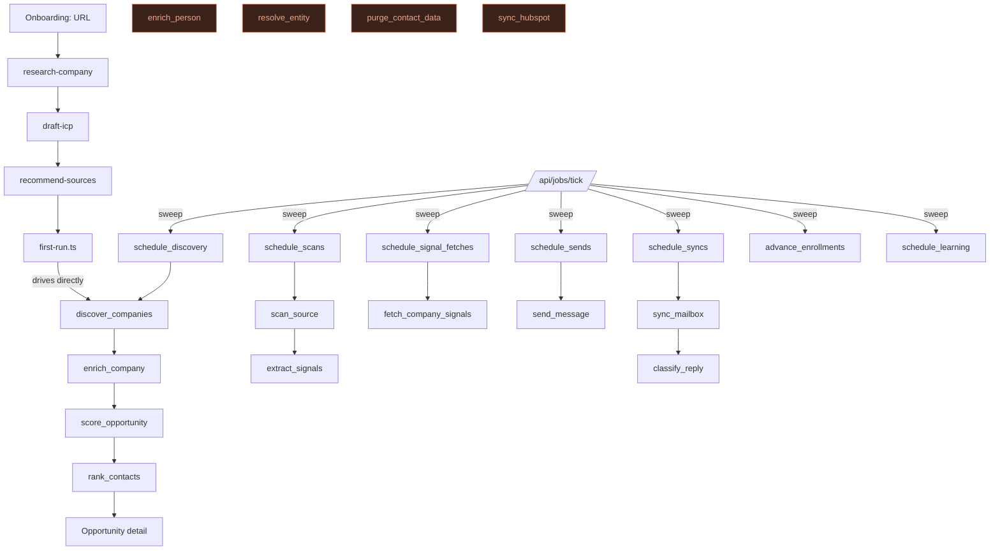

# System map

## Packages

```
apps/web          Next.js 16 (App Router, Turbopack). Marketing, onboarding, product, admin.
packages/ui       Design system: tokens + 20 components. Vitest.
packages/db       Schema (28 migrations), RLS, clients, pure domain logic, crypto.
packages/ai       12 AI tasks, prompt/claim validation, run ledger.
packages/jobs     Queue, runner, 26 job handlers, mailbox adapters, first-run.
packages/providers Vendor seam: Apollo, Hunter, ZeroBounce + cache/budget/ledger/breaker.
packages/crm      HubSpot connector (single-vendor by design).
```

Dependency direction is clean and deliberate: `packages/ai` does **not** import `packages/db`, so it cannot become a second path around RLS (`audit/FINDINGS.md` Phase 1; still true).

## Entity model — origin, owner, lifecycle

| Entity | Table(s) | Created by | Read by | Lifecycle | Notes |
|---|---|---|---|---|---|
| Organization | `organizations` | signup / `createWorkspace` | everything | soft delete | tenant root; `org_id` on every tenant table |
| User / profile | `auth.users`, `profiles` | Supabase auth + trigger | team, assignments | — | names readable only by co-members |
| Membership | `memberships` | `accept_invitation()` | guard, RLS | role enum | `has_org_role()` is the authorization primitive |
| Invitation | `org_invites` | `inviteMemberAction` | `/invite/[token]` | token, expiry | ✅ complete |
| Product | `products` | onboarding / settings | ICP, qualification | soft delete | upstream of everything |
| ICP | `icps`, `icp_versions` | `draft-icp` + user edit | discovery, scoring | versioned | 15 criteria keys |
| Source | `sources`, `source_documents`, `source_events` | onboarding / settings | `scan_source` | soft delete | user-controlled object |
| Company | `companies`, `company_domains` | `discover_companies`, `scan_source`, import | everything | soft delete + `merged_into_id` | canonical domain is display key; `company_domains` is resolution key |
| External id | `external_ids` | `enrich_company`, `sync_hubspot` | dedup, CRM | — | generic over entity type — good design |
| Person | `people`, `contact_points` | `enrich_person` (⚠ unreachable), first-run | opportunity page, outreach | soft delete | contact points carry confidence + verification |
| Opportunity | `opportunities` | `score_opportunity` | list, detail, pipeline, CRM | status enum | **the product's unit** |
| Score | `opportunity_scores`, `contact_fit_scores` | `score_opportunity`, `rank_contacts` | detail, ordering | append-only | 8 named dims, no weights column |
| Evidence | `evidence` | enrichment, signals, scans, CRM | detail page | dedup by (subject, field, source) | fact/inference/unknown enforced by CHECK |
| Trigger | `company_triggers` | `extract_signals` | why-now, scoring | freshness decay | |
| Campaign / sequence | `campaigns`, `sequences`, `sequence_steps` | `OutreachManager` | outreach | — | |
| Enrollment | `enrollments` | outreach actions | `advance_enrollments` | autonomy-gated | |
| Message | `messages`, `message_events`, `threads` | `send_message`, `sync_mailbox` | inbox | `sent_at` is proof | idempotent send |
| Mailbox | `mailboxes` | OAuth callback | send, sync | tokens encrypted | Gmail + Outlook |
| CRM link | `hubspot_connections` + `external_ids` | settings + `sync_hubspot` | CRM push | token encrypted | |
| Learning | `learning_runs`, outcomes | `analyze_performance` | `/learn` | — | needs volume |
| Memory | org/person memory tables | agent, learning | `/memory` | scoped | |
| Provider call | `provider_calls`, `provider_cache`, `provider_breakers`, `provider_accounts` | `callProvider` | `/ops`, budget | ledger is append-only | cost control |
| AI run | `ai_runs` | `runTask` | `/analytics` | — | cost + latency |
| Job | `job_executions` | `enqueue()` | runner, `/ops` | claim/retry/backoff | at-least-once |
| Audit | `audit_logs` | `lib/data/audit.ts` | **nothing** | — | ⚠ write-only |

## Conflicting concepts — resolved

The brief asked which overlapping concepts should merge. Findings:

| Pair | Verdict |
|---|---|
| **lead vs contact** | No conflict. HuntLoop has no `leads` table. `people` + `contact_points` is the only contact model. **Keep as is** — and do not introduce "lead"; it would duplicate `opportunities`. |
| **company vs account** | No conflict. Only `companies` exists; "account" appears in prose only. **Keep one word — company.** |
| **lead vs opportunity** | `opportunities` is the unit; an opportunity is `(company × icp)` unique. Correct. |
| **source vs signal** | Genuinely distinct and correctly separated: a `source` is a monitored place, a signal/`company_triggers` row is an event extracted from one. Keep. |
| **campaign vs sequence** | Distinct: `campaigns` group targets; `sequences`/`sequence_steps` define cadence. Correct and conventional. |
| **qualification vs scoring** | Overlap is real but intentional: `score_opportunity` produces model + rule-adjusted scores; `priority` is the human-facing verdict derived from them. **One risk:** three independent ranked signals (`priority`, `opportunity_scores.score`, `contact_fit_scores.score`) and nothing composes them into a single next action. See `22_PRODUCT_GAPS.md`. |

## Runtime flow (as built)



Everything in the `/api/jobs/tick` column depends on a cron that did not exist until 2026-09-15. The four red nodes have no caller at all.
