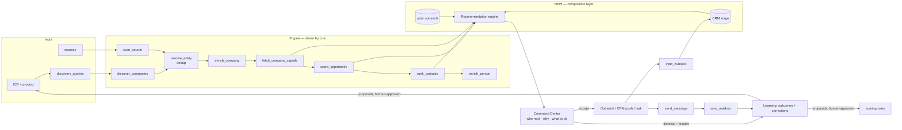

# Target architecture

**Principle: almost nothing here should be rewritten.** The architecture is sound. What it needs is connective tissue, one new composition layer, and the removal of a small amount of dead weight.

## Keep as-is

| System | Why |
|---|---|
| Provider seam (`packages/providers`) | Vendor-neutral capabilities, cache/budget/breaker/ledger, now build-enforced by `PRV-CHK` |
| `OrgScope` + RLS | Tenant boundary is mechanical, not conventional |
| Postgres job queue | Right call for second-scale work; transactional with the rows the job is about |
| Evidence model + fact/inference/unknown | Enforced at three layers; this is the product's differentiator |
| Scoring architecture | 8 nullable dims, model/rule separation, mandatory explanation, no weights column |
| Autonomy ladder | Correct answer to AI outbound |
| Design system | Semantic, product-aware, accessible |
| `load()` + `DemoFigures` honesty invariant | Build-enforced; rare and valuable |

## Refactor

| System | Change |
|---|---|
| **Provider registry** | One adapter per capability → an ordered **fallback chain** per capability. Each attempt separately ledgered. Registry change + loop; the call path already wraps individual attempts |
| **`packages/crm`** | Stays single-vendor until a second CRM is real; then promote to a registry mirroring `packages/providers` |
| **Signal handling** | New evidence should enqueue a rescore for companies with a live opportunity |
| **`first-run.ts`** | Extract the shared ordering so discovery sequence is encoded once, not twice |

## Add

| System | Purpose |
|---|---|
| **Recommendation engine** | The missing centre. *Reads* `priority`, `opportunity_scores`, `contact_fit_scores`, recency, signal freshness, prior outreach and CRM stage; emits one ranked queue of `(account, contact, reason, urgency, action, confidence, evidence)`. **Never recomputes a score.** |
| **Recommendation state** | Accepted / dismissed / snoozed + reason. This is both the UX and the supervised-learning signal |
| **Trigger surface** | Buttons for the three missing verbs: hunt now, push to CRM, enrich contact. Plus an erasure intake |
| **Merge review UI** | Over `merge_candidates`, calling the already-built `merge_companies_for_org()` |
| **Dead-letter surface** | In `/ops`, with a safe retry |
| **Quota enforcement** | At the three existing choke points (`send_message`, provider call path, `score_opportunity`) |

## Remove

`company_gaps`, `contact_frequency`, `evidence_citations` (orphan tables) · `STRIPE_*` env vars and `subscriptions` **if** billing is deferred · `/kitchen-sink` from the production build.

## Target diagram



The only genuinely new box is **Brain**. Everything else exists and needs wiring.

## Canonical workflow

```
ICP + product
  ↓
Discover companies        (provider search + source scans, on a clock and on demand)
  ↓
Resolve + deduplicate     ← currently missing from the running system
  ↓
Enrich company            (evidence with provenance)
  ↓
Detect signals            (hiring now; job-change and intent later)
  ↓
Score opportunity         (8 explainable dimensions + rules)
  ↓
Find and rank contacts    (contact-fit score)
  ↓
Enrich contact            ← currently unreachable
  ↓
Research                  (automatic on discovery; deeper on demand via the agent)
  ↓
RECOMMEND NEXT ACTION     ← the missing centre: who, why, what, how urgent
  ↓
Act: outreach (autonomy-gated) · push to CRM · dismiss with a reason
  ↓
Track: replies, stages, meetings
  ↓
Learn: outcomes + corrections → proposals → human accepts → improved ICP, rules, sources
```

Two arrows in that chain do not exist today (`resolve`, `enrich contact` are unreachable; `recommend` is unbuilt). Everything else is written and waiting for a clock.
