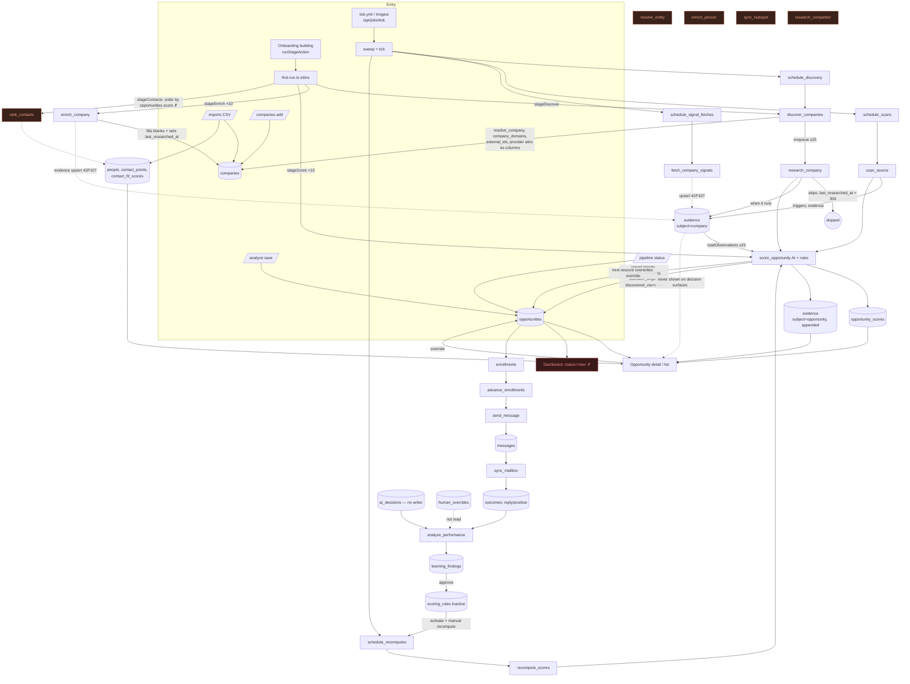

# Auditor A — map · flow · trust

Commit `509a24e` (main), audited 2026-09-29. Read-only: no server, build, DB or provider call was run. Every trace below is code-read; "CONFIRMED" means the call chain was followed end to end in source (and, where schema matters, against `packages/db/migrations/*`). Where only a live Postgres/PostgREST would settle it, the finding is LIKELY and names the check.

Severity counts: **Critical 1 · High 13 · Medium 12 · Low 5** (31 findings; see §7).

---

## 1. Feature status (map)

Status: Working · Partial · Broken · Mock/Demo-only · Dead (built, nothing reaches it) · Missing.
"Reachable" means a user action or the clock (`.github/workflows/tick.yml` → `/api/jobs/tick` → `sweep()`+`tick()`) can reach it.

### 1a. Routes and entry points (auth)

| Route / entry | Auth | Notes |
|---|---|---|
| `/`, `/for/*`, `/compare/*`, `/privacy`, `/terms`, `/acceptable-use`, `/discover` | public (`proxy.ts:58-105`) | `/discover` AI research gated by `PUBLIC_RESEARCH_ENABLED` |
| `/login`, `/signup`, `/auth/callback`, `/auth/signout` | public | |
| `/welcome/*` (onboarding), `/orgs`, `/invite/[token]` | session (`protected-routes.ts` ACCOUNT_PREFIXES) | invite → `/signup` redirect |
| `/[org]/{dashboard,opportunities,opportunities/[id],companies,analyze,imports,inbox,outreach,pipeline,sources,intelligence,learn,memory,analytics,ops,team,team/assignments,settings/*}` | session + membership (`(app)/[org]/layout.tsx`, 404 for non-member) | all server actions go through `mutate()` (membership + `minRole`) |
| `/api/jobs/tick` | `CRON_SECRET` bearer (route-level) | driven by `tick.yml` every 5 min (secrets UNVERIFIED) |
| `/api/inngest` | HMAC (route-level) | alternative driver; same `sweep()`+`tick()` |
| `/api/health`, `/api/csp-report` | public | |
| `/api/unsubscribe/[token]`, `/unsubscribe/[token]` | public, token | |
| `/api/mailboxes/[provider]/{start,callback}` | session | |
| `/kitchen-sink` | public, hidden in production (`proxy.ts:136`) | |

### 1b. Capabilities

| Capability | Status | Entry point | Backend | Tables | Providers | Evidence |
|---|---|---|---|---|---|---|
| Onboarding company research | Working (unverified live) | `/welcome/company` | `researchCompanyAction` → `lib/ai/research.ts` | organizations, products | Anthropic | `welcome/company/actions.ts:43` |
| ICP draft + look-alike preview | Working | `/welcome/icp`, `/settings/icp` | `draftIcpAction`, `previewLookAlikesAction` → `look-alike.ts` | icps, icp_versions | Anthropic, Apollo (enrich) | `welcome/icp/actions.ts:63,193` |
| First-run: discover | Working | `/welcome/building` | `runStageAction` → `stageDiscover` → `discover_companies` inline | discovery_queries/runs/results, companies, company_domains, external_ids | Apollo | `first-run.ts:311-373` |
| First-run: enrich | Working (evidence write LIKELY broken, TRUST-001) | same | `stageEnrich` → `enrich_company` ×10 | companies, evidence | Apollo | `first-run.ts:389-416` |
| First-run: score | Working | same | `stageScore` → `score_opportunity` ×10 | opportunities, opportunity_scores, evidence | Anthropic | `first-run.ts:425-455` |
| First-run: contacts | **Broken** (FLOW-002) | same | `stageContacts` orders by non-existent `opportunities.score` | — | — | `first-run.ts:467` |
| First-run: explain | **Broken** (FLOW-002/003) | same | `stageExplain` same bad order; research gate pre-set by enrich | — | — | `first-run.ts:520`, `enrich-company.ts:154` |
| Scheduled discovery | Partial (cron-gated; ICP edits never reach it — FLOW-008) | clock | `schedule_discovery` → `discover_companies` → `research_company` → `score_opportunity` | discovery_* | Apollo, Anthropic | `schedule-discovery.ts:52`, `discover-companies.ts:285` |
| Manual "hunt now" | **Missing** | — | — | — | — | no discovery write under `app/(app)` |
| Saved-search management | **Missing** (read-only preview) | `/settings/icp` SearchPreview | `getDiscoveryPreview` | discovery_queries | — | `discovery-preview.ts:52` |
| Source scan (RSS/HTML) | Partial (cron-gated) | `/sources` "Scan now" → `next_scan_at` | `schedule_scans` → `scan_source` → extract_signals | sources, source_documents, source_events, evidence, company_triggers | Anthropic, fetch | `lib/data/engine.ts:51`, `scan-source.ts:257-400` |
| CSV import | **Partial — dead-ends** (FLOW-007) | `/imports` | `importCsvAction` | companies, people, contact_points | — | `imports/actions.ts:159-230` (nothing qualifies them) |
| Manual company add/edit | Partial (same dead end) | `/companies` | `saveCompanyAction` | companies | — | `companies/actions.ts:39` |
| Analyze a URL → save opportunity | Working (TRUST-007) | `/analyze` | `analyzeUrlAction`, `saveQualificationAction` | companies, opportunities, opportunity_scores, evidence | Anthropic | `analyze/actions.ts:46,137` |
| Why-now (explain_why_now) | Partial — ephemeral | `/analyze` only | `whyNowAction` | not persisted | Anthropic | `analyze/actions.ts:88`; no writer of `opportunities.why_now` |
| Company enrichment (refresh) | Dead after onboarding | first-run only | `enrich_company` | companies, evidence, external_ids | Apollo | only caller `first-run.ts:402`; `staleBefore()` unused `enrich-company.ts:257` |
| Company AI research | Partial (gate conflict FLOW-003) | queue (after discovery) | `research_company` | companies, evidence, company_problems | Anthropic | `research-company.ts:59` |
| Contact discovery + ranking | **Dead in practice** | first-run only (broken) | `rank_contacts` | people, contact_points, contact_fit_scores | Apollo | only caller `first-run.ts:487` |
| Person enrichment | Dead | — | `enrich_person` (+ legacy `packages/jobs/src/providers.ts`) | contact_points | Hunter/Apollo/ZeroBounce | no enqueue |
| Entity resolution (exact) | Partial | discovery only | `resolve_company()` RPC | company_domains, external_ids | — | `discover-companies.ts:444,506` |
| Entity resolution (fuzzy) / merge | Dead / Missing UI | — | `resolve_entity`, `merge_companies_for_org()` | merge_candidates, company_merges | — | no callers |
| Hiring signals | Partial (cron; evidence write LIKELY fails TRUST-001) | clock | `schedule_signal_fetches` → `fetch_company_signals` | evidence, companies.last_signal_checked_at | Apollo | `fetch-company-signals.ts:120` |
| Competitor tracking | Dead | — | `resolve_competitor_mentions` (enqueued by scan), `research_competitor` (no producer) | competitors (no writer) | Anthropic | MAP-003 |
| Opportunity scoring | Working (AI) | queue / first-run / analyze | `score_opportunity` + `applyRules` | opportunities, opportunity_scores, evidence | Anthropic | `score-opportunity.ts:103-398` |
| Scoring rules + recompute | Working (rule_change only) | `/settings/scoring` | `recomputeScoresAction` → `request_score_recompute` → `schedule_recomputes` | scoring_rules, score_recompute_requests | Anthropic | `settings/scoring/actions.ts:275-305` |
| Priority override | Partial (reverted — FLOW-004) | opportunity detail | `overridePriorityAction` → `record_override` | opportunities, human_overrides | — | `opportunities/[id]/actions.ts:226-298` |
| Next-best-action | **Missing** | — | `recommendedAction()` 4-case switch | — | — | `opportunity-map.ts:331` |
| Command Center | **Broken on live DB** (FLOW-001) | `/[org]/dashboard` (post-login landing) | `getDashboard` | many | — | `dashboard.ts:107,212` |
| Opportunities list / detail | Working (trust gaps) | `/opportunities` | `listOpportunities`, `getOpportunity` | opportunities, scores, evidence(opportunity only), people, contact_fit_scores | — | `opportunities.ts:83-285` |
| Sales agent panel | Working (opportunity evidence only) | detail page | `askAgentAction` | conversations, conversation_messages | Anthropic | `opportunities/[id]/actions.ts:42` |
| Intelligence feed | Partial | `/intelligence` | `getIntelligence` | evidence, company_triggers, ai_decisions (never written) | — | `intelligence.ts:57-90` |
| Outreach enrol/advance/send | Partial (cron) | `/opportunities`, `/outreach` | `enrollOpportunitiesAction` → `advance_enrollments` → `send_message` | enrollments, messages | Gmail/Outlook | recipient picker `advance-enrollments.ts:294` |
| Reply sync → outcome | Partial (cron) | clock | `sync_mailbox` → classify-reply → `outcomes` (reply/positive only) | outcomes | Anthropic | `sync-mailbox.ts:326` |
| Pipeline stages | Working, not a learning input | `/pipeline` | `setOpportunityStatusAction` | opportunities | — | `pipeline/actions.ts` (no outcome write) |
| Learning analysis | Partial | `/learn` button + hourly sweep | `requestAnalysisAction` / `schedule_learning` → `analyze_performance` | learning_runs, learning_findings | Anthropic | `learn/actions.ts:48`; FLOW-005/006 |
| Learning → proposal → apply | Working | `/learn` | `approveFindingAction` (inactive rule / derived memory) | scoring_rules, memories | — | `learn/actions.ts:105-246` |
| HubSpot push | Dead | — | `sync_hubspot` | external_ids, evidence | HubSpot | no producer |
| GDPR erase/export | Working (Server Action) | `/settings/privacy` | `erase_contact_for_org` | many | — | `settings/privacy/actions.ts:41` |
| Audit log read | Dead | — | `listAudit` unused | audit_logs | — | `lib/data/audit.ts:111` |

### 1c. Built but not wired (exists in code, nothing reaches it)

- Job handlers with **no producer**: `resolve_entity`, `enrich_person`, `purge_contact_data`, `sync_hubspot`, `research_competitor` (grep of every `enqueue({ name:` and `runHandler(` call site; none name them).
- Handlers reachable **only from onboarding first-run**: `enrich_company` (`first-run.ts:402`), `rank_contacts` (`first-run.ts:487`) — and `rank_contacts` is itself unreachable there (FLOW-002).
- App seams with no caller: `requestResearch` (`lib/data/engine.ts:85`), `latestRecompute` (`engine.ts:143`), `getCompany` (`lib/data/company.ts:68`, no company detail route), `listAudit` (`lib/data/audit.ts:111`), `consumeQuota`/`allQuotas` (`lib/data/usage.ts`), `staleBefore` (`enrich-company.ts:257`, "Read by the scheduler" — no scheduler reads it).
- Tables with no production writer: `competitors`, `ai_decisions` (only `seed.ts:1195`), `company_gaps`, `contact_frequency`. Write-only: `evidence_citations` (written by `merge_duplicate_evidence`, `0022:191`; never read), `audit_logs`, `human_overrides` (read only by nudges, `nudges.ts:92`).
- Columns written, never displayed: `opportunity_scores.rule_trace`, `model_score`, `computed_at` (not rendered), `evidence.reliability`, `opportunities.why_this_person`.
- Legacy duplicate provider path: `packages/jobs/src/providers.ts` (own Hunter/Apollo/ZeroBounce fetches, used only by dead `enrich_person`), bypassing `@huntloop/providers` budget/ledger/cache.

---

## 2. The loop, stage by stage

| Stage | What user sees | Data | Action | Stored | Undoable | Next stage gets correct data? | Missing data / API fail / zero result |
|---|---|---|---|---|---|---|---|
| **Discover** | Onboarding "Found N companies"; later nothing (no hunt control) | Apollo company search from ICP-translated filters (+ look-alike expansion) | first-run inline, or `schedule_discovery` daily when cron runs | companies (provider attrs written directly as columns), discovery_runs/results, company_domains, external_ids | Company soft-delete only | Partially: companies carry provider attributes with **no evidence rows** (TRUST-001); ICP edits never reach the saved query (FLOW-008) | Excellent: `status`/`stop_reason` distinguish refused/failed/empty (`discover-companies.ts:237-262` (refused :243, failed :257)); refusal text reaches the screen |
| **Qualify** | Priority badge + reason, score pill with 8 dims, prose | company columns + ≤25 company-subject evidence (`loadObservations`) + ICP summary + rules | `score_opportunity` (AI) then `applyRules` (deterministic) | opportunities (upsert), opportunity_scores (append), evidence (subject=opportunity, append) | Priority override exists but is **reverted on next rescore** (FLOW-004) | Detail page shows only opportunity-subject evidence; the company-subject evidence the model reasoned over is invisible (TRUST-002) | No ICP → skipped with reason; AI unavailable → skipped; quota → skipped with reason. Missing score renders as 0 (TRUST-008) |
| **Enrich (company)** | Header industry/region/employees; no source, no date | Apollo `company.enrich` | first-run only | companies (fill blanks), evidence (LIKELY never lands), external_ids | no | Sets `last_researched_at`, which blocks AI research for 30 days (FLOW-003) | No provider → skipped, ok. Not-found → marks researched |
| **Enrich (people)** | "Buyer identification incomplete" everywhere | Apollo `person.search` | `rank_contacts` — unreachable (FLOW-002); `enrich_person` dead | people, contact_points, contact_fit_scores | — | Recipients come only from CSV imports | Emails with non-`verified` status render as "No verified address" (TRUST-004) |
| **Prioritize** | List ordered priority→score; dashboard why-now cards | opportunities.priority, latest opportunity_scores.score | client-side sort | — | — | Dashboard throws on live DB (FLOW-001) | "No trigger on file" + first_seen_at shown as trigger age (TRUST-005) |
| **Recommend** | "Recommended: Reach out now, while the trigger is fresh" | priority + "any person exists" | `recommendedAction()` pure fn | not stored | n/a | Ignores triggers, contact fit, outreach history, CRM stage (FLOW-009) | HOT with no trigger still says "trigger is fresh" |
| **Reach out** | Enrol into campaign; approvals in inbox | enrollments, sequences | `advance_enrollments` → `send_message` (cron) | messages | draft/approve gate | Recipient = primary_person (never set) → any decision-maker → first person with a non-undeliverable email, ignoring contact_fit (FLOW-009) | Sends to `unverified` imported emails the UI calls unverified (TRUST-004) |
| **Track** | Pipeline board, inbox | opportunities.status, threads | `setOpportunityStatusAction`; `sync_mailbox` | opportunities.status; outcomes (reply/positive only) | status editable | Won/lost/meeting **not recorded as outcomes** (FLOW-006) | Dashboard meetings/won always 0 |
| **Learn** | `/learn` findings with approve/reject | outcomes, ai_decisions (empty), rules, memories | `analyze_performance` | learning_runs, learning_findings → inactive rule / derived memory | reject kept; rule inactive until activated | Human overrides never read (FLOW-005); wins never present (FLOW-006) | Refuses below `MIN_LEARNING_SIGNALS` before spending (good) |

---

## 3. Every score, rank and recommendation

| Output | Inputs | Formula / model | Source | Confidence carried | Timestamp | Deterministic vs AI | Inspectable by user | Staleness |
|---|---|---|---|---|---|---|---|---|
| `opportunity_scores.model_score` + 8 dims | company row, ≤25 company evidence (newest `event_date`), ICP summary | `qualify_opportunity` prompt; `PRIORITY_REQUIRES` check; dims NULL=unknown | Anthropic | `confidence` (low/med/high) | `computed_at` (not shown) | AI | Dims + explanation in ScorePill; inputs (company evidence) not shown | Only recomputed on scan/research/rule-recompute; attention rail flags >90 days (`dashboard.ts:393`) |
| `opportunity_scores.score` | model_score + active `scoring_rules` | `applyRules` adjust/veto/floor | `@huntloop/db/rules` | inherits | same | Deterministic | **No** — `rule_trace`, `model_score` never rendered (TRUST-003) | same |
| `opportunities.priority` (HOT…IGNORE) | model priority + rule floor/veto; or human override | same | AI + rules / human | `opportunities.confidence` | `last_scored_at` (not shown) | Mixed | `priority_reason` in badge tooltip; override not marked as human on screen | Human value overwritten by next rescore (FLOW-004) |
| `contact_fit_scores.score` | persona spec, title classification, reachability | `rankContacts` in `@huntloop/db/contact` | deterministic | `confidence` | `computed_at` | Deterministic | "Fit N" + explanation on buyer card | Never computed in practice (FLOW-002); `emailVerified` checks `deliverable` but writer writes `provider_verified` (`rank-contacts.ts:280` vs `:404`) |
| List/dashboard ordering | priority, latest score (missing → 0) | `byPriorityThenScore` | app | — | — | Deterministic | Header says "ordered by verdict, then score" | Unscored = 0 |
| "Recommended" action | priority, buyers.length>0 | 4-case switch (`opportunity-map.ts:331-338`) | app | none | none | Deterministic | Inputs visible above it | Claims trigger freshness without checking a trigger exists (TRUST-005) |
| Trigger `strength` | extract_signals confidence | high 80 / medium 55 / low 30 (`scan-source.ts` STRENGTH) | deterministic mapping of AI label | — | `event_date` | Mixed | shown as "strength N" | Freshness shown per trigger |
| Dashboard "researched" count | companies.last_researched_at ≥ 7d | count | app | — | — | Calculated | No | Counts provider "not found" lookups as researched (TRUST-010) |
| Dashboard meetings / won | outcomes kind meeting/won | count | app | — | — | Calculated | No | Always 0 — no writer of those kinds (FLOW-006) |
| ICP quality score | criteria | `icp-quality.ts` | app | — | — | Deterministic | card | — |
| Learning findings | outcomes, ai_decisions, source provenance, rules, memories | `analyze_performance` (Opus) | Anthropic | per-finding | run window | AI | Evidence listed per finding; approve/reject | Weekly (hourly check) |
| Look-alike expansion | example companies' enriched attrs | fold into filters | Apollo | — | — | Deterministic over provider data | Named in onboarding and SearchPreview | Preview mislabels stale ICP diffs as look-alike additions (FLOW-008) |

Can an unsupported claim get in? Partly guarded: `assertValidClaim` requires a URL for a `fact`, and `qualify_opportunity` restricts fact URLs to the company's own domain or supplied observation URLs (`qualify-opportunity.ts:571-600`). It does not check the URL was actually fetched or that the excerpt appears in fetched text (TRUST-012), and free-text fields (`summary`, `recommendation`, `priorityReason`, `explanation`) are unconstrained and rendered as plain prose (TRUST-003). A client-supplied qualification can be saved verbatim (TRUST-007).

---

## 4. Trust classification of decision-surface statements

| Surface / statement | Class | Shown as | Blur |
|---|---|---|---|
| Opp header: industry, region, employee count | Provider-sourced (discovery/enrich) or User-provided (import) | Plain text, no source, no date | Provider vs user vs AI indistinguishable; no evidence row backs it (TRUST-001) |
| "What they do" (`companies.description`) | Provider-sourced, AI-inferred (`research_company` "sells") or User | Prose | Origin unrecorded on the column (TRUST-003) |
| "Why this company", "Outreach angle", `priority_reason` | AI-inferred | Prose / tooltip | No AI marker; "Every claim above traces to one of these" is not enforced (`page.tsx:181`) |
| Identified problem / Potential gap / Current approach / Why now / Use case | Unknown (never written by pipeline) | "Not established" + unknown badge | Honest, but the emphasized "Why now" is always empty (FLOW-015) |
| Score + 8 dimensions | AI-inferred, rule-adjusted (Calculated) | ScorePill number | Rule adjustment and compute time invisible; unscored shown as 0 (TRUST-003/008) |
| Priority badge | AI + rules, or Human | Badge | Human override not distinguished; silently reverted (FLOW-004) |
| Evidence list items | fact / inference / unknown with source host, confidence, event & observed dates | EvidenceList | Good component; but provider assertions labelled `fact` like observed facts; `reliability` hidden (TRUST-006); only opportunity-subject rows shown (TRUST-002); merged citations hidden (TRUST-011) |
| Recent triggers | AI-extracted from user-chosen source, dated | list + Freshness | Good |
| "Trigger · N days ago" under Recommended | Calculated | Freshness label "Trigger" | Falls back to `first_seen_at` (TRUST-005) |
| Buyer email "No verified address" | Provider-sourced / User-provided | chip | Status vocabulary mismatch hides every email (TRUST-004) |
| Fit N + reason | Calculated | badge | Good (when present) |
| Dashboard counts | Calculated | stat cards | "meetings/won" structurally 0; "researched" inflated |
| First-run stage messages | System status | onboarding | "Worked out why now…" / "No opportunities to find contacts for yet" are false (FLOW-002/003) |
| Override toast "weekly analysis reads it" | System claim | toast | False (FLOW-005) |
| SearchPreview "added by example companies" | Calculated diff | settings | Stale-ICP drift mislabelled as look-alike (FLOW-008) |

---

## 5. Lead data flow (as built)



---

## 6. Prior findings (2026-09-15 pass) — status

| Prior ID | Claim | Status | Evidence |
|---|---|---|---|
| C-2 / DI-3 / DQ-1 | `resolve_entity` never enqueued; dedup never runs | **Still open, narrowed** | discovery now resolves exactly via `resolve_company` and writes `company_domains`/`external_ids` (`discover-companies.ts:444-513`). `resolve_entity` still has no producer; `scan_source` (`scan-source.ts:272-300`), imports and analyze key on `canonical_domain` only → FLOW-011 |
| C-4 / DQ-3 | `enrich_person` never enqueued | **Still open** | no producer; also uses legacy `packages/jobs/src/providers.ts` → MAP-001 |
| C-3 / U-3 | GDPR erasure unreachable | **Obsolete (fixed differently)** | `eraseContactAction` → `erase_contact_for_org` (`settings/privacy/actions.ts:41-80`); `purge_contact_data` handler now dead code |
| H-2 / U-2 | `sync_hubspot` has no trigger | **Still open** | no producer → MAP-001 |
| H-1 / DI-1 / U-1 | No in-app "hunt now" | **Still open** | no write to `discovery_queries.next_run_at` under `app/(app)`; only `first-run.ts:206,229` → FLOW-008 |
| C-1 / DI-2 | No cron | **Partially fixed / UNVERIFIED** | `.github/workflows/tick.yml` every 5 min; silently exits 0 if `CRON_SECRET`/`HUNTLOOP_URL` unset |
| H-4 / Q-1 | No composite next-best-action | **Still open** | `opportunity-map.ts:331-338` → FLOW-009 |
| H-5 / SG-2 / Q-2 | Signals don't become actions; no rescore on new evidence | **Partially fixed** | scan path enqueues `score_opportunity` (`scan-source.ts:368`); hiring-signal and enrichment paths don't; no trigger row from hiring → FLOW-009 |
| SG-3 / SG-4 | No "what changed", no notifications | **Still open** | dashboard has none; marketing copy promises it (`(marketing)/for/use-cases.ts:73`) → TRUST-013 |
| Q-3 | No recompute after ICP change | **Still open** | only `recomputeScoresAction` with `rule_change` (`settings/scoring/actions.ts:287`); ICP actions never call `requestRecompute` → FLOW-008 |
| Q-4 / H-9 / L-2 | No user-correction capture | **Partially fixed, then undermined** | `overridePriorityAction` + `record_override` exist; reverted by rescoring and unread by learning → FLOW-004, FLOW-005 |
| L-3 | Learning produces no proposals | **Fixed** | `approveFindingAction` writes inactive rule / derived memory (`learn/actions.ts:105-246`) |
| L-5 | No manual analyse trigger | **Fixed** | `requestAnalysisAction` (`learn/actions.ts:48`) |
| U-4 / DQ-2 / H-3 | No merge review UI | **Still open** | `merge_companies_for_org` no caller |
| U-6 / DI-4 | No saved-search management | **Still open** | read-only `SearchPreview` |
| DQ-4 | No company refresh | **Still open** | `staleBefore` unused → FLOW-012 |
| U-5 / H-7 | Audit log write-only | **Still open** | `listAudit` unused → MAP-002 |
| M-2 orphans | `company_gaps`, `contact_frequency`, `evidence_citations` | `company_gaps` **still open**; `contact_frequency` **still open**; `evidence_citations` **changed**: now written by `merge_duplicate_evidence` (`0022:191`, called `scan-source.ts:221`) but never read → TRUST-011 |
| 02 "CSV import ✅" | Import works | **Prior assessment incomplete** | rows land, but nothing ever qualifies them → FLOW-007 |
| 03 "Command Center ✅ live loaders" | Dashboard works | **Wrong / regressed on live DB** | `status = 'new'` not an enum value → FLOW-001 |
| 03 "First-run is the best moment… properly engineered" | first-run works | **Partially wrong** | contacts/explain stages broken → FLOW-002/003 |
| SG-7 | Only `hiring` signal kind | **Still open** | `fetch-company-signals.ts:76` `kinds: ["hiring"]` |

---

## 7. Findings

### [Critical] FLOW-001 — Command Center filters on an enum value that does not exist; the post-login landing page throws on a live database
- Confidence: LIKELY (one request to `/[org]/dashboard` against any migrated DB, or `select 1 from opportunities where status = 'new'`, settles it — expect `22P02 invalid input value for enum opportunity_status: "new"`)
- Where: `apps/web/lib/data/dashboard.ts:107` (`awaitingReview`), `:212` (`whyNowCards`); enum `packages/db/migrations/0003_companies_opportunities.sql:14-17`; landing `apps/web/lib/data/destination.ts:87,222`, `app/(app)/orgs/page.tsx:52`
- Evidence:
  ```
  opportunity_status as enum ('discovered','researching','qualified','assigned','contacted','replied','meeting','proposal','won','lost','archived')
  .eq("status", "new")            // dashboard.ts:212, inside whyNowCards
  if (error) throw new Error(`getDashboard whyNow: ${error.message}`);
  ```
  No migration adds `'new'` (`grep "alter type.*opportunity_status"` → none). `load()` deliberately rethrows (`lib/data/source.ts:118-126`), so the page falls to `app/error.tsx`.
- Repro / trace: sign in → `destination.ts` sends single-membership users to `/{slug}/dashboard` → `getDashboard` → `Promise.all([... whyNowCards ...])` → PostgREST 400 → throw → error boundary. `awaitingReview` uses `countRows`, which ignores the error and reports 0.
- Impact: every user of a live workspace lands on an error page after sign-in; the why-now shortlist could never render anyway, because no code sets a `new` status. Demo mode (fixtures) hides it, which is why E2E passes.
- Root cause: the loader uses a status vocabulary from the demo fixtures/kitchen-sink (`kitchen-sink/page.tsx:82`), not the schema.
- Fix: replace `status = 'new'` with states that exist (e.g. `in ('discovered','qualified')` and `owner_id is null`) in both places; add a live-DB smoke test that loads `/dashboard`.
- Effort: S · Depends on: — · Mechanizable: yes (type `.eq("status", …)` literals against `OpportunityStatus` in `packages/db/src/types.ts:23`)
- Status vs last pass: New (prior 03 marked Command Center ✅)

### [High] FLOW-002 — First-run "contacts" and "explain" stages order by a column that doesn't exist, so contact discovery never runs anywhere
- Confidence: LIKELY (schema-confirmed: no `opportunities.score` column in any migration; PostgREST returns 42703 → `data` null)
- Where: `packages/jobs/src/first-run.ts:464-468`, `:517-521`; schema `0003_companies_opportunities.sql:162-203`, `0008:400-402`, `0016:146-156`
- Evidence:
  ```
  .select("opportunities", "id, company_id, score")
  .order("score", { ascending: false, nullsFirst: false })
  const rows = (data ?? []) ...; if (rows.length === 0) return { status: "skipped", detail: "No opportunities to find contacts for yet." }
  ```
- Repro / trace: `/welcome/building` → `runStageAction("contacts")` → `stageContacts` → query error swallowed → "skipped". Same for `stageExplain` ("Nothing to explain yet."). `rank_contacts` has no other producer, so `people`/`contact_points`/`contact_fit_scores` are only ever filled by CSV import.
- Impact: every discovered opportunity shows "Buyer identification incomplete"; `recommendedAction` says "Identify a decision maker" with no control to do so; outreach has no recipients except imported people. Onboarding tells the user there are no opportunities right after scoring ten.
- Root cause: the stage assumes a denormalised `opportunities.score`; scores live only in append-only `opportunity_scores`.
- Fix: select top opportunities by priority then latest `opportunity_scores.score` (embed + sort in code, as `listOpportunities` does) or add a view; give `rank_contacts` a non-onboarding producer (e.g. from `score_opportunity` when priority ∈ {hot,warm} and no fit rows exist).
- Effort: S · Depends on: — · Mechanizable: yes (verify every `.select`/`.order` column exists in migrations)
- Status vs last pass: New (prior called first-run "properly engineered")

### [High] FLOW-003 — Provider enrichment writes the AI-research freshness gate, so research is skipped for 30 days for every enriched company
- Confidence: CONFIRMED (code trace)
- Where: `packages/jobs/src/handlers/enrich-company.ts:119,154`; `research-company.ts:59-68`; `first-run.ts:389-416` then `:515-545`; `discover-companies.ts:285`
- Evidence:
  ```
  patch.last_researched_at = new Date().toISOString();   // enrich-company.ts:154 (and :119 on not-found)
  if (!payload.force && company.last_researched_at) { if (age < FRESH_FOR_MS) return { ok: true, result: { skipped: "researched 0 days ago; still current" } } }  // research-company.ts:59-66
  ```
- Repro / trace: onboarding discover (enqueues `research_company` for ≤25 new companies) → stageEnrich sets `last_researched_at` on 10 → stageExplain and the queued research jobs return `ok` with "skipped" → stageExplain counts `ok` as explained and says "Worked out why now for your top N" (`first-run.ts:541`).
- Impact: the AI research that produces "what they sell / buyers / problem" evidence and `company_problems` never runs for the companies users see first; the qualifier scores on provider attributes only; the onboarding claim is false.
- Root cause: one column is the freshness gate for two jobs with different costs and meanings.
- Fix: give enrichment its own `last_enriched_at` (also fixes TRUST-010); count only non-skipped runs in stageExplain.
- Effort: S · Depends on: — · Mechanizable: no
- Status vs last pass: New

### [High] FLOW-004 — A human priority override is silently reverted by the next automatic rescore
- Confidence: CONFIRMED
- Where: `apps/web/app/(app)/[org]/opportunities/[id]/actions.ts:226-298`; `packages/jobs/src/handlers/score-opportunity.ts:240-254`; rescore producers `scan-source.ts:368`, `research-company.ts:172`, `recompute-scores.ts:122`, `resolve-competitor-mentions.ts:294`
- Evidence: override writes `opportunities.priority` + `human_overrides`; `score_opportunity` upserts `priority: ruled.priority` on `(org_id,company_id,icp_id)` without reading overrides. Contrast `rank-contacts.ts:181` (`humanChose = contact_selected_by === "user"`), which respects the human.
- Repro / trace: set HOT→IGNORE with reason → any scan article, research or rule recompute for that company → priority back to the model/rule verdict; list and dashboard reorder; nothing tells the user.
- Impact: user decisions don't stick on the primary ranking surface; the toast "Your correction is kept" is contradicted within a tick.
- Root cause: `opportunities.priority` has no "set by" provenance and the scorer owns it unconditionally.
- Fix: add `priority_set_by` (system|user) like `contact_selected_by`; scorer always appends score history but only updates `priority` when set by system; show "set by you" on the badge.
- Effort: S · Depends on: — · Mechanizable: no
- Status vs last pass: New (prior Q-4/H-9 said no override existed)

### [High] FLOW-005 — Corrections are promised to the learning loop, which never reads them
- Confidence: CONFIRMED
- Where: toast `opportunities/[id]/actions.ts:293-296`; `packages/jobs/src/handlers/analyze-performance.ts:457-464` reads `ai_decisions.human_override`; `ai_decisions` has no production writer (only `packages/db/scripts/seed.ts:1195`); `human_overrides` is read only by `lib/data/nudges.ts:92`
- Evidence: "Set to … Your correction is kept, and the weekly analysis reads it alongside the outcomes." vs analyze-performance selecting `ai_decisions` (`decision_type, entity_type, entity_id, human_override, quality_rating …`).
- Repro / trace: override → `record_override` → `human_overrides` → `analyze_performance` loads outcomes + `ai_decisions` (empty) → overrides never reach the prompt or `countSignals`.
- Impact: the one supervised signal the product collects is dropped while the user is told otherwise; learning is less likely to reach `MIN_LEARNING_SIGNALS`; `/intelligence` "decisions" is permanently empty (MAP-004).
- Root cause: two override stores (`ai_decisions.human_override` from 0004/0010 and `human_overrides` from 0016); writer and reader picked different ones.
- Fix: read `human_overrides` in `analyze_performance`; retire or wire `ai_decisions`.
- Effort: S · Depends on: FLOW-004 · Mechanizable: yes (table read by a job but written by nothing)
- Status vs last pass: New

### [High] FLOW-006 — Wins, losses and meetings never become outcomes; learning only sees replies
- Confidence: CONFIRMED
- Where: `apps/web/app/(app)/[org]/pipeline/actions.ts` (`setOpportunityStatusAction` updates status only); sole outcome writer `packages/jobs/src/handlers/sync-mailbox.ts:326` (`reply`/`positive`); dashboard counts `meeting`/`won` at `lib/data/dashboard.ts:293-296`
- Evidence: `grep '"outcomes"'` in app+jobs → one insert (sync-mailbox). HubSpot stage read-back (`sync_hubspot`) has no producer.
- Repro / trace: move an opportunity to Won on `/pipeline` → `opportunities.status='won'`; dashboard "won" stays 0; `loadOutcomes` sees nothing.
- Impact: Learn cannot relate fit/signals to revenue; dashboard outcome cards are structurally zero while the pipeline shows wins.
- Root cause: pipeline status and outcomes are separate models with no bridge.
- Fix: in `setOpportunityStatusAction`, insert an `outcomes` row on entering `meeting|won|lost` (idempotent per opportunity+kind).
- Effort: S · Depends on: — · Mechanizable: no
- Status vs last pass: Still open (L-4, narrowed)

### [High] FLOW-007 — Imported and manually added companies are never qualified
- Confidence: CONFIRMED
- Where: `apps/web/app/(app)/[org]/imports/actions.ts:159-230`; `companies/actions.ts:39-100`; dead seam `apps/web/lib/data/engine.ts:85` (`requestResearch`: no caller, and no sweeper reads `last_researched_at is null`); `research-company.ts:5` claims it runs for CSV imports
- Evidence: import inserts `companies`/`people`/`contact_points` and returns; no request column, RPC or job. The sweeper set (`runner.ts:171-205`) has nothing that selects unqualified companies.
- Repro / trace: paste CSV → "N companies added" → they never appear in `/opportunities` unless a monitored source mentions them.
- Impact: one of three documented entry channels dead-ends; users who bring their own list get no fit, score or evidence.
- Root cause: request path may not enqueue, and no request seam + sweeper exists for research/score.
- Fix: add a research request (column or table like `score_recompute_requests`) written by import/add, a bounded sweeper that enqueues `research_company`, and a "Qualify" button wired through `requestResearch`.
- Effort: M · Depends on: FLOW-003 · Mechanizable: no
- Status vs last pass: New (prior 02 marked CSV import ✅)

### [High] FLOW-008 — Editing the ICP changes nothing the engine does; no "hunt now"; preview mislabels the drift
- Confidence: CONFIRMED
- Where: only writer of `discovery_queries` is `packages/jobs/src/first-run.ts:103-255` (onboarding); `settings/icp/actions.ts:54-240` neither touches it nor calls `requestRecompute`; preview diff `apps/web/lib/data/discovery-preview.ts:105-115,137-157`
- Evidence: `grep discovery_queries apps/web` → only preview readers. `requestRecompute` has one caller (`settings/scoring/actions.ts:287`, `rule_change`). The preview comment admits "your search is out of date" is unimplemented; `diff()` reports stale saved values absent from the edited ICP as "added by example companies".
- Repro / trace: finish onboarding → edit ICP industries → daily saved query keeps searching old industries; scores stay; SearchPreview attributes the removed industries to look-alikes.
- Impact: the Discover→Qualify loop can't be steered after day one; spend continues on an abandoned profile; a trust surface mislabels why.
- Root cause: `ensureDiscoveryQuery` is onboarding-only; ICP save has no downstream hooks.
- Fix: call `ensureDiscoveryQuery` (RLS-safe) from `saveIcpAction`/`activateIcpAction`, disable superseded queries, `requestRecompute(…, "icp_change")`; add "Hunt now" setting `next_run_at = now()` (same seam as `enqueueScan`); show "out of date" when the diff isn't explained by look-alikes.
- Effort: M · Depends on: — · Mechanizable: no
- Status vs last pass: Still open (H-1/DI-1/U-1, Q-3, U-6) + New (preview mislabel)

### [High] FLOW-009 — No next-best-action: the recommendation is a four-case switch; signals, contact fit and history don't feed it
- Confidence: CONFIRMED
- Where: `apps/web/lib/data/opportunity-map.ts:331-338`; recipient choice `packages/jobs/src/handlers/advance-enrollments.ts:294-340`; hiring signals `fetch-company-signals.ts:95-130` (no rescore, no `company_triggers` row)
- Evidence:
  ```
  if (!hasBuyer) return "Identify a decision maker before reaching out.";
  return priority === "hot" ? "Reach out now, while the trigger is fresh." : "Research the current approach before contacting.";
  ```
  Recipient = `named ?? decisionMaker ?? candidates[0]`; `contact_fit_scores` never consulted; `primary_person_id` only set by unreachable `rank_contacts`.
- Impact: "who should I pursue next and what should I do" is answered per page by priority alone; no ordered queue across opportunities × contacts × recency × outreach state; a new hiring signal changes nothing.
- Root cause: three ranked outputs (priority, score, contact fit) and no composer; signals stored only as evidence.
- Fix: one read-only composer (no new scorer) over latest score, priority, newest trigger age, best contact fit + reachable email, last touch → ordered queue on the dashboard; enqueue `score_opportunity` from `fetch_company_signals` for companies with a live opportunity; use contact fit in `resolveRecipient`.
- Effort: M · Depends on: FLOW-001, FLOW-002 · Mechanizable: no
- Status vs last pass: Still open (H-4/Q-1; H-5/SG-2 partial — scan path rescoring exists, `scan-source.ts:368`)

### [High] MAP-001 — Five handlers have no producer; two more are onboarding-only
- Confidence: CONFIRMED
- Where: `packages/jobs/src/registry.ts:66-93`; producers enumerated from every `enqueue({ name: … })` and `runHandler(` call site
- Evidence: no producer for `resolve_entity`, `enrich_person`, `purge_contact_data`, `sync_hubspot`, `research_competitor`. Only `first-run.ts` reaches `enrich_company` (:402) and `rank_contacts` (:487). `enrich_person` still uses legacy `packages/jobs/src/providers.ts`, outside `@huntloop/providers` budget/ledger.
- Impact: CRM push, fuzzy dedup, person enrichment and competitor research look built (and tested) but never run; company data never refreshes after onboarding.
- Root cause: the request path is barred from enqueueing (`lib/data/engine.ts:7-20`) and only three request seams + sweepers exist (scans, recomputes, analysis).
- Fix: per capability add a request seam + sweeper (sync_hubspot on status change; resolve_entity after discovery/scan; enrich_company refresh via `staleBefore()`) or delete it. Delete `purge_contact_data` (superseded by `erase_contact_for_org`).
- Effort: M · Depends on: — · Mechanizable: yes (verify-jobs: every `JobName` needs a producer or a SWEEPERS entry)
- Status vs last pass: Still open (C-2, C-4, H-2); Obsolete for C-3

### [High] TRUST-001 — Provider evidence upserts use a conflict target no index matches; enrichment and hiring evidence likely never lands while the data is displayed
- Confidence: LIKELY (run one `enrich_company` against a migrated DB and read the upsert `error`; expect `42P10 there is no unique or exclusion constraint matching the ON CONFLICT specification`)
- Where: `packages/jobs/src/handlers/enrich-company.ts:191-211`, `fetch-company-signals.ts:120-123`, `research-competitor.ts:221`, `sync-hubspot.ts:186`; index `packages/db/migrations/0020_evidence_v2.sql:91-96`
- Evidence:
  ```
  create unique index evidence_one_per_source_field on evidence (org_id, subject_type, subject_id, field,
    coalesce(source_id::text, ''), coalesce(source_url, '')) where field is not null and deleted_at is null;
  onConflict: "org_id,subject_type,subject_id,field,source_id,source_url"   // plain columns, no predicate
  ```
  None of the four call sites reads the returned `error`.
- Repro / trace: stageEnrich → `enrich_company` fills `companies.industry/employee_count/…` (succeeds) → evidence upsert rejected → job reports `claims: N`. `fetch_company_signals` updates `last_signal_checked_at` first, so a failed posting isn't retried for 48h.
- Impact: provider attributes on the opportunity header have no evidence row, source or date; hiring signals never appear or reach the scorer; contradiction flagging has nothing to flag.
- Root cause: PostgREST `on_conflict` can only infer plain-column unique constraints; the dedupe key is an expression + partial index.
- Fix: replace with a plain unique constraint over a generated `source_key` column (`nulls not distinct`) and target it; check `error` on every evidence write.
- Effort: S · Depends on: — · Mechanizable: yes (verify-migrations executes each `onConflict` spec used in code)
- Status vs last pass: New

### [High] TRUST-002 — The evidence the score is built from is never shown on decision surfaces
- Confidence: CONFIRMED
- Where: scorer input `score-opportunity.ts:441-458` (`subject_type='company'`); readers filter `subject_type='opportunity'`: `lib/data/opportunities.ts:142,276`, `dashboard.ts:252`, agent `opportunities/[id]/actions.ts:78`; page claim `opportunities/[id]/page.tsx:181` "Every claim above traces to one of these."
- Evidence: company-subject evidence (enrichment, hiring, `research_company` findings, scanned news with excerpts) is visible only in `/intelligence`, an org-wide latest-50 list without company names (`lib/data/intelligence.ts:78-90`). No company detail route exists (`getCompany` unused).
- Repro / trace: scan finds "Acme raised $20M" → company evidence + trigger → `score_opportunity` reasons over it → detail Evidence card shows only the qualifier's restatements; the original excerpt and URL are absent; the agent can't cite it.
- Impact: users can't check the basis of a verdict; the page's provenance claim is false.
- Root cause: evidence is polymorphic by subject and every reader picked the opportunity subject.
- Fix: load company-subject evidence for the opportunity's `company_id` in `evidenceFor`, `whyNowCards` and `askAgentAction`, labelled by origin.
- Effort: S · Depends on: TRUST-001 · Mechanizable: no
- Status vs last pass: New

### [High] TRUST-003 — AI verdict text and numbers render without an inferred marker, compute time, or the rule adjustments
- Confidence: CONFIRMED
- Where: `opportunities/[id]/page.tsx` Prose ("Why this company", "Outreach angle"), `PriorityBadge reason`, `ScorePill`; writer `score-opportunity.ts:240-252` (`why_this_company = qualification.summary`, `outreach_angle = qualification.recommendation`); `rule_trace`/`model_score`/`computed_at` never displayed (`grep rule_trace apps/web` → only a rule-editor label)
- Evidence: `Prose` shows an "unknown" badge only when empty; established AI text renders like fact. ScorePill shows score, dims, explanation, confidence — not "model 72 → your rule 'X' → 55", not "scored 40 days ago".
- Impact: inferred narrative is indistinguishable from observed fact on the main decision surface; policy effects and staleness are invisible.
- Root cause: provenance is stored (0010/0016) but `ScorePill`/`Prose` have no fields for it.
- Fix: mark model-authored prose with `ClaimBadge kind="inference"` + "AI · {date}"; add `computedAt`, `modelScore`, `ruleTrace` to ScorePill's hover panel.
- Effort: S · Depends on: — · Mechanizable: no
- Status vs last pass: New

### [High] TRUST-004 — Email verification vocabulary is split: the UI hides every email as unverified while outreach sends to unverified ones
- Confidence: CONFIRMED
- Where: display `apps/web/lib/data/opportunity-map.ts:407-409` (`=== "verified"`); writers `rank-contacts.ts:404` (`provider_verified`/`unverified`), `enrich-person.ts:159` (`deliverable|undeliverable|risky|unknown`), `imports/actions.ts:346` (`unverified`), `sync-mailbox.ts:266` (`undeliverable`); ranker `rank-contacts.ts:280` (`=== "deliverable"`); sender `advance-enrollments.ts:318-323` (anything but undeliverable/risky); column is free `text` (`0003:125`)
- Evidence: no code path writes `"verified"`.
- Repro / trace: import a contact with an email → detail page "No verified address"; enrol → `resolveRecipient` picks that address and sends.
- Impact: the buyer card misreports reachability everywhere; outreach emails addresses the UI calls unverified; contact-fit reachability is false for provider-verified emails.
- Root cause: `verification_status` is unconstrained text with four writer vocabularies.
- Fix: CHECK/enum (`unverified, provider_verified, deliverable, risky, undeliverable, unknown`); one mapping helper in `@huntloop/db/contact` used by display, ranker and sender; show the status word instead of hiding the address.
- Effort: S · Depends on: — · Mechanizable: yes (CHECK constraint)
- Status vs last pass: New

### [Medium] FLOW-010 — Opportunity evidence piles up on every rescore
- Confidence: CONFIRMED
- Where: `score-opportunity.ts:330-345` (plain insert, nothing retired); contrast `analyze/actions.ts:250-258` (retires prior rows)
- Evidence: qualifier evidence has no `field`, so the one-per-source index never applies; no `merge_duplicate_evidence` for opportunity subjects.
- Impact: each scan/research/recompute appends a full set of claims; "N facts · N inferences" and the list grow with stale and contradictory restatements.
- Root cause: two writers of the same shape with different replacement rules.
- Fix: retire prior `subject_type='opportunity'` rows in `score_opportunity` as `saveQualificationAction` does (or link rows to the score id).
- Effort: S · Depends on: — · Mechanizable: no
- Status vs last pass: New

### [Medium] FLOW-011 — Only discovery resolves identity; scans, imports and analyze key on raw canonical_domain; fuzzy dedup/merge never runs
- Confidence: CONFIRMED
- Where: `scan-source.ts:278-300`; `imports/actions.ts:163-195`; `analyze/actions.ts:170-183`; `resolve_entity` no producer; `merge_companies_for_org` no caller
- Impact: alias domains create duplicate companies/opportunities through three of four entry channels; no operator surface for probable duplicates.
- Root cause: `resolve_company()` adopted in one writer only.
- Fix: route all company creation through one resolve-or-create helper using `resolve_company` + `company_domains`; enqueue `resolve_entity` after scans/discovery (bounded).
- Effort: M · Depends on: MAP-001 · Mechanizable: yes (lint: no direct `insert("companies")` outside the helper)
- Status vs last pass: Still open (C-2/DQ-1/DQ-2, narrowed)

### [Medium] FLOW-012 — Company data is enriched once and frozen; hiring signals only cover companies with an Apollo id
- Confidence: CONFIRMED
- Where: `enrich-company.ts:257` `staleBefore` unused; `schedule-signal-fetches.ts:46-53` requires `external_ids.provider='apollo'`
- Impact: headcount/industry/funding shown indefinitely with no date; scanned/imported companies never get signals.
- Fix: a `schedule_enrichments` sweeper over `staleBefore()` for companies with live opportunities; show `observed_at` on header attributes.
- Effort: S · Depends on: MAP-001, TRUST-001 · Mechanizable: no
- Status vs last pass: Still open (DQ-4)

### [Medium] FLOW-015 — "Why now", problem, gap, current approach and use case are never written by the pipeline
- Confidence: CONFIRMED
- Where: no writer of `opportunities.why_now|identified_problem|potential_gap|current_approach|potential_use_case` in `packages/jobs/src` or `apps/web/app`; `explain_why_now` runs only on `/analyze` (`analyze/actions.ts:88`) and `saveQualificationAction` doesn't persist it; `sync-hubspot.ts:140` would push "Not yet researched."
- Impact: the emphasised "Why now" section on every opportunity reads "Not established"; the first-run "explain" stage implies otherwise.
- Fix: persist `explain_why_now` output (with cited evidence ids) when a dated trigger exists; map `research_company`'s `problem` finding to `identified_problem`.
- Effort: M · Depends on: FLOW-003 · Mechanizable: no
- Status vs last pass: New

### [Medium] MAP-002 — Dead seams and tables that make the product look more wired than it is
- Confidence: CONFIRMED
- Where: `lib/data/engine.ts:85` `requestResearch`, `:143` `latestRecompute`; `lib/data/company.ts:68` `getCompany`; `lib/data/audit.ts:111` `listAudit`; `lib/data/usage.ts:67` `consumeQuota`, `allQuotas`; `enrich-company.ts:257` `staleBefore`; tables `company_gaps`, `contact_frequency` (referenced only by `scripts/doctor.ts`, `verify-migrations.ts`), `ai_decisions` (seed-only writer), `evidence_citations` (write-only)
- Impact: capabilities read as working (scoring screen can't show recompute progress; audit log unreadable).
- Fix: wire (`latestRecompute` on `/settings/scoring`, `listAudit` on `/team`) or delete; drop the two orphan tables.
- Effort: S · Depends on: — · Mechanizable: yes (unused-export check over `lib/data`)
- Status vs last pass: Still open (M-2, H-7), extended

### [Medium] MAP-003 — Competitor capability has no front door
- Confidence: CONFIRMED
- Where: `competitors` read by `resolve-competitor-mentions.ts:196` and `research-competitor.ts:143`; no insert anywhere; org profile stores competitor names as strings (`settings/actions.ts:129,156`) unconnected to the table
- Impact: `resolve_competitor_mentions`, enqueued for every scanned company (`scan-source.ts:380`), always finds nothing — queue work for a no-op; `research_competitor` unreachable.
- Fix: sync the profile's competitors into `competitors` on save, or remove both handlers and the enqueue.
- Effort: S · Depends on: — · Mechanizable: no
- Status vs last pass: New

### [Medium] TRUST-005 — Freshness labelled "Trigger" shows the first-seen date; HOT with no trigger is told "the trigger is fresh"
- Confidence: CONFIRMED
- Where: `opportunity-map.ts:381` (list `triggerDate: newest?.event_date ?? r.first_seen_at`), `:469` (detail), `:335-337`; `opportunities/[id]/page.tsx:158` `<Freshness … label="Trigger">`; list cell `OpportunityTable.tsx:208-209`
- Impact: discovery time is shown as the age of a buying signal on the recommendation line and the "Why now" column; sort-by-trigger mixes the two.
- Fix: pass `null` with no trigger; render "No trigger" without an age; make `recommendedAction` take the trigger age.
- Effort: S · Depends on: — · Mechanizable: no
- Status vs last pass: New

### [Medium] TRUST-006 — Provider assertions get the same "fact" badge as observed facts; `reliability` is stored but never shown
- Confidence: CONFIRMED
- Where: `enrich-company.ts:193-203` (`kind: recordUrl ? "fact" : "inference"`, `reliability: "provider_attested"`, `source_url` = login-walled `app.apollo.io` record); `fetch-company-signals.ts:103-107`; `EvidenceList` has no reliability prop (`packages/ui/src/components/EvidenceList.tsx:10-30`)
- Impact: Verified vs Provider-sourced blur — "Industry: Software — according to apollo" reads as a checked fact; most users can't open the citation.
- Fix: render reliability ("Provider · Apollo · observed {date}") beside the kind badge; count provider claims separately.
- Effort: S · Depends on: TRUST-002 · Mechanizable: no
- Status vs last pass: New

### [Medium] TRUST-007 — A client-supplied qualification is stored as model output
- Confidence: CONFIRMED (shape-only validation)
- Where: `apps/web/app/(app)/[org]/analyze/actions.ts:137-300`
- Evidence: verdict, score, dims and evidence (incl. `kind:"fact"` + `sourceUrl`) arrive from the browser and are written with `model_version: qualify_opportunity@{date}`; the fact-domain check (`qualify-opportunity.ts:571-600`) isn't re-run server-side.
- Impact: a member can create opportunities whose "facts" and scores no model produced, indistinguishable in data from real ones; the path also skips the `opportunities` quota the job enforces (`score-opportunity.ts:196-230`).
- Root cause: the analyze screen round-trips the AI result through the client.
- Fix: persist the run server-side during `analyzeUrlAction` and have save reference its id; at minimum re-run `assertValidClaims` + the fact-domain check on save.
- Effort: M · Depends on: — · Mechanizable: no
- Status vs last pass: New

### [Medium] TRUST-008 — A missing score renders as 0 with "low" confidence
- Confidence: CONFIRMED
- Where: `opportunity-map.ts:371,373,457,459`; `dashboard.ts:233,235`
- Impact: an unscored opportunity looks like a measured zero and sorts below measured lows — the "unknown ≠ 0" rule the dimensions follow, broken for the headline number.
- Fix: `score: number | null`; ScorePill renders "Not scored"; sort nulls last explicitly.
- Effort: S · Depends on: — · Mechanizable: no
- Status vs last pass: New

### [Medium] TRUST-011 — Corroborating citations are merged away from view
- Confidence: CONFIRMED
- Where: `0022_evidence_dedupe.sql:137-230` (`merge_duplicate_evidence` writes `evidence_citations`, soft-deletes duplicates), called at `scan-source.ts:221`; no reader of `evidence_citations`
- Impact: "three outlets reported it" collapses to one source on screen, losing the corroboration the migration calls "the whole point".
- Fix: embed citation count/hosts in evidence readers and EvidenceList.
- Effort: S · Depends on: TRUST-002 · Mechanizable: no
- Status vs last pass: Changed (prior: orphan; now write-only)

### [Medium] TRUST-012 — A model "fact" may cite any page on the company's domain, fetched or not, and its excerpt isn't checked
- Confidence: LIKELY
- Where: `packages/ai/src/tasks/qualify-opportunity.ts:524-600`
- Evidence: allowed set = `canonicalDomain` (any path) ∪ supplied observation URLs; `excerpt` isn't compared with fetched content.
- Impact: a recalled `acme.com/customers` claim renders with a FACT badge and a plausible link.
- Fix: record fetched URLs during the run and require exact membership; require the excerpt to be a substring of fetched text (as `extract_signals` does for scans).
- Effort: M · Depends on: — · Mechanizable: no
- Status vs last pass: New

### [Low] MAP-004 — `/intelligence` "decisions" and the audit log read tables nothing writes or renders
- Confidence: CONFIRMED
- Where: `lib/data/intelligence.ts:84-88` (`ai_decisions`); `lib/data/audit.ts:111`
- Fix: point decisions at `human_overrides`/`opportunity_scores`, or remove the panel.
- Effort: S · Depends on: FLOW-005 · Mechanizable: no
- Status vs last pass: Still open (H-7)

### [Low] FLOW-013 — `score_opportunity` overwrites `discovered_via` with "scan" on every upsert
- Confidence: CONFIRMED
- Where: `score-opportunity.ts:250`
- Impact: opportunities from discovery, analyze ("manual") or imports are relabelled "scan" on first rescore; origin-based learning comparisons are wrong.
- Fix: set `discovered_via` on insert only (derive from `companies.discovered_via`).
- Effort: S · Depends on: — · Mechanizable: no
- Status vs last pass: New

### [Low] FLOW-014 — Double-approving a learning finding can create duplicate rules and still say "Approved"
- Confidence: LIKELY
- Where: `learn/actions.ts:147-222` (rule insert happens before the `status='pending'` guard; the guarded update's zero-row result isn't checked)
- Fix: claim the finding first (`update … where status='pending' returning id`), then insert.
- Effort: S · Depends on: — · Mechanizable: no
- Status vs last pass: New

### [Low] TRUST-010 — Dashboard "researched" counts provider not-found lookups
- Confidence: CONFIRMED
- Where: `dashboard.ts:275-278` counts `last_researched_at`; set on not-found at `enrich-company.ts:119`
- Fix: resolved by FLOW-003's separate `last_enriched_at`.
- Effort: S · Depends on: FLOW-003 · Mechanizable: no
- Status vs last pass: New

### [Low] TRUST-013 — Marketing promises a "what changed" dashboard that doesn't exist
- Confidence: CONFIRMED
- Where: `app/(marketing)/for/use-cases.ts:73`, `lib/data/personalization.ts:57` vs `lib/data/dashboard.ts` (no change feed)
- Fix: build the change rail (FLOW-009) or soften the copy.
- Effort: S · Depends on: FLOW-009 · Mechanizable: no
- Status vs last pass: Still open (SG-3)

---

## 8. Do not change

- `discover_companies`' failure taxonomy (`status`/`stop_reason`: refused vs failed vs empty) and its paging/budget caps.
- Append-only `opportunity_scores` with `model_score` vs `score` + `rule_trace`, and NULL-means-unknown dimensions.
- `assertValidClaim` and the fact-domain check in `qualify_opportunity` (tighten, don't remove).
- The request-seam pattern (`enqueueScan`, `request_score_recompute`, `learning_runs` in `requested`) — extend it rather than letting Server Actions enqueue.
- `EvidenceList` (kind, confidence, source host, event vs observed date) — feed it more, don't replace it.
- `rank_contacts`' respect for `contact_selected_by='user'` — copy the pattern for priority.
- Learning proposals landing inactive, or as `derived` memory.

## 9. Could not verify

- Whether production has migrations 0011+ applied (project memory notes 0011–0029 pending). If not, most loaders above fail differently.
- Whether `tick.yml` secrets (`CRON_SECRET`, `HUNTLOOP_URL`) are set. Without them every cron-gated stage is dormant and the workflow exits 0 silently.
- The runtime errors behind FLOW-001, FLOW-002 and TRUST-001. Code and schema make them near-certain; one request against a migrated DB confirms each.
- No live model or provider call was made, so AI output quality and Apollo field coverage are unassessed.
