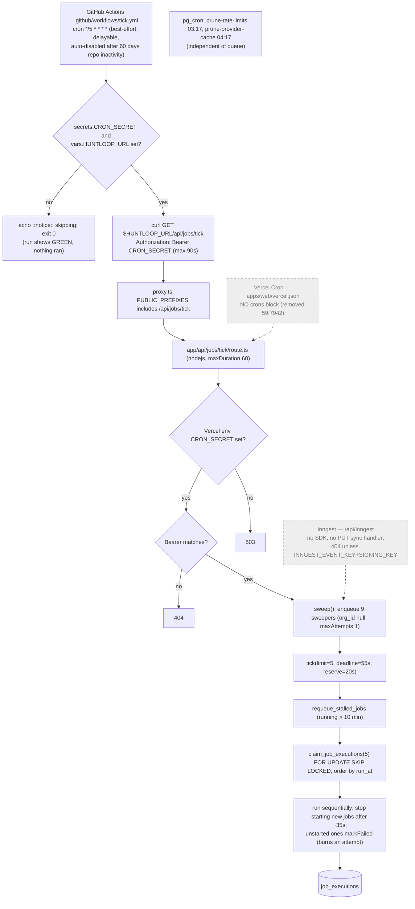

# D — Jobs, Outreach, Prod (static/config) — audit at 509a24e

Auditor D. Read-only. Static analysis only: no builds, no network, no DB. `.env.local` not opened (exists, is git-ignored via `.gitignore:28 .env*`, not tracked — `git ls-files` shows only `.env.example`).

Severity counts: **Critical 1 · High 5 · Medium 15 · Low 8** (29 findings).

---

## 1. Job table

`JobName` union: `packages/jobs/src/queue.ts:37-77` (26 names). Registry is a total map: `packages/jobs/src/registry.ts` (`HANDLERS`). Sweeper set: `packages/jobs/src/runner.ts:171-205`. Enqueue sites found by grepping every name as `name: "<job>"` / `runHandler(…, "<job>")` across `apps/` and `packages/` (excluding tests/verify scripts).

Retries: default `max_attempts = 3` (`queue.ts:118`), backoff `min(attempts², 60)` minutes (`queue.ts:190`); sweepers `maxAttempts: 1` (`runner.ts:274`). "Idempotent enqueue" = partial unique index on `(job_name, idempotency_key) WHERE status IN ('queued','running')` (`0008_engine_columns.sql:295-297`) — collapses duplicates **only while one is live**.

| Job | Handler | Enqueued by | Scheduled by | Idempotent? (key / handler) | Retries |
|---|---|---|---|---|---|
| schedule_scans | handlers/schedule-scans.ts | `sweep()` runner.ts:274 | tick (every call) | key = name | 1 |
| scan_source | scan-source.ts | schedule-scans.ts:119 | via schedule_scans (`sources.next_scan_at`) | `scan:<source>` | 3 |
| research_company | research-company.ts | discover-companies.ts:285 | via discovery | `research:<org>:<company>` | 3 |
| score_opportunity | score-opportunity.ts | research-company.ts:172, scan-source.ts:368, resolve-competitor-mentions.ts:294, recompute-scores.ts:122; first-run.ts:435 (inline) | chained | `score:<company>` | 3 |
| **enrich_person** | enrich-person.ts | **none** | none | n/a | — (ORPHAN) |
| schedule_syncs | schedule-syncs.ts | sweep() | tick | key = name | 1 |
| sync_mailbox | sync-mailbox.ts | schedule-syncs.ts:70 | every 15 min per mailbox | `sync:<mailbox>`; handler dedupes by SELECT on provider_message_id (no unique index) | 3 |
| schedule_sends | schedule-sends.ts | sweep() | tick | key = name | 1 |
| send_message | send-message.ts | schedule-sends.ts:73, advance-enrollments.ts:227 | sweep of approved `messages.scheduled_at` | `send:<message>`; handler checks `sent_at` — **not safe against lost-response / crash-after-send (OUT-001)** | 3 |
| advance_enrollments | advance-enrollments.ts | sweep() | tick | key = name; handler not atomic (OUT-002) | 1 |
| schedule_learning | schedule-learning.ts | sweep() | intended hourly, actually every tick (JOB-006) | `schedule_learning:<hour>` (ineffective after success) | 1 |
| analyze_performance | analyze-performance.ts | schedule-learning.ts:146, :212 | weekly by learning_runs | `learn:<org>:<isoWeek>`, `learn-run:<id>` | 3 |
| schedule_discovery | schedule-discovery.ts | sweep() | tick | key = name + `claim_due_discovery_queries` (SKIP LOCKED, advances next_run_at) | 1 |
| discover_companies | discover-companies.ts | schedule-discovery.ts:52; first-run.ts:323 (inline) | per query `next_run_at` | `discover:<query>:<hour>` + cursor | 3 |
| **enrich_company** | enrich-company.ts | **only first-run.ts:402 (inline, onboarding)** | never by engine | n/a | — (engine-orphan, JOB-003) |
| **rank_contacts** | rank-contacts.ts | **only first-run.ts:487 (inline, onboarding)** | never by engine | n/a | — (engine-orphan, JOB-003) |
| **resolve_entity** | resolve-entity.ts | **none** | none | — | — (ORPHAN) |
| **research_competitor** | research-competitor.ts | **none** (new; prior audit missed it) | none | — | — (ORPHAN) |
| resolve_competitor_mentions | resolve-competitor-mentions.ts | scan-source.ts:380 | chained | `competitors:<company>` | 3 |
| **purge_contact_data** | purge-contact-data.ts | **none** — erasure now runs synchronously via `erase_contact_for_org` (settings/privacy/actions.ts:52) | none | — | — (dead code, JOB-005) |
| enforce_retention | enforce-retention.ts | sweep() | intended daily, actually every tick (JOB-006) | `enforce_retention:<date>` (ineffective after success) | 1 |
| recompute_scores | recompute-scores.ts | schedule-recomputes.ts:48, recompute-scores.ts:167 (continuation) | via `score_recompute_requests` | `recompute:<req>` | 3 |
| schedule_recomputes | schedule-recomputes.ts | sweep() | tick | key = name | 1 |
| schedule_signal_fetches | schedule-signal-fetches.ts | sweep() | tick | key = name + 48h staleness | 1 |
| fetch_company_signals | fetch-company-signals.ts | schedule-signal-fetches.ts:62 | 48h | `signals:<company>:<date>` | 3 |
| **sync_hubspot** | sync-hubspot.ts | **none** | none | — | — (ORPHAN; CRM "connected" but never pushes) |

Other job machinery: `claim_job_executions` uses `FOR UPDATE SKIP LOCKED` (`0008:308-333`); `requeue_stalled_jobs` returns `running` rows older than 10 min (`0008:340-360`); dead-letter now has an admin surface (`0019_ops_views.sql:225-275` `retry_job` / `cancel_job`, `apps/web/app/(app)/[org]/ops/actions.ts:25-64`). No pruning of `job_executions` anywhere (grep for `delete from … job_executions` / `prune_job` → none).

pg_cron jobs (the only two in migrations): `prune-rate-limits` 03:17 UTC (`0006_prune_schedule.sql:71-74`), `prune-provider-cache` 04:17 UTC (`0011_providers.sql:469-472`). Neither touches the queue, so they do not overlap the HTTP tick. Both are guarded by `pg_available_extensions` and silently skip (RAISE NOTICE) when pg_cron is unavailable — whether they exist in prod is UNVERIFIED (`select * from cron.job`).

---

## 2. Tick / cron trigger chain



Max platform throughput with this chain: ≤5 claims per GitHub run (~every 5 min, often later) ≈ ≤60 jobs/hour **for all tenants combined**, of which up to 9 per cycle are sweepers, and AI-bound jobs (research, drafting) mean fewer than 5 actually start per run (JOB-002).

---

## 3. Outreach send-path trace

1. **Draft.** `advance_enrollments` (sweeper) selects up to 25 due `enrollments` cross-tenant (`advance-enrollments.ts:50-58`) → per enrollment: campaign active? reply stop? next step → recipient → `is_suppressed` (`:167`) → AI `personalizeMessage` (`:386`) → `insert messages` (`:187`, `scheduled_at` = now only if `autonomy_level >= 2`, `:184,:203`) → `update enrollments` step/next_action (`:213`) → if autonomous `enqueue send_message key send:<id>` (`:226-232`).
2. **Approve (autonomy 0–1).** `approveMessageAction` sets `scheduled_at` via RLS (`inbox/actions.ts:261-306`). Manual reply: `replyToThreadAction` inserts outbound message with `scheduled_at=now` (`inbox/actions.ts:203-222`).
3. **Sweep.** `schedule_sends` selects outbound, `sent_at IS NULL`, **`error IS NULL`**, scheduled_at ≤ now, 50/tick (`schedule-sends.ts:50-64`) → `enqueue send_message key send:<id>` (`:73-80`).
4. **Send.** `send-message.ts`: load message (scoped) → `sent_at` set? skip (`:66-70`) → outbound? → `scheduled_at` set? (`:76-88`) → `can_contact` (suppression incl. erasure hash, too_soon, 30d cap, org daily cap; SECURITY DEFINER, service-role only — `0017:116-214, 503-522`) (`:105-134`) → unsubscribe URL buildable from `NEXT_PUBLIC_SITE_URL` (`:160-167`) → org postal address set (`:184-196`) → plan `emails` quota via `check_quota_internal` (fails open on read error) (`:218-234`) → pick mailbox / `authorize` (decrypt AES-256-GCM token, refresh if <2 min left; any refresh error ⇒ mailbox disconnected) (`mailbox/index.ts`) → `claim_mailbox_send` atomic per-mailbox daily cap (`0008:145-164`) (`:261-267`) → **provider send** (Gmail `messages/send`, 20s timeout; Outlook create-draft + send) with List-Unsubscribe + List-Unsubscribe-Post headers (`mailbox/provider.ts:129-131`) and text/HTML footer (address + unsubscribe link) (`:273-303`) → **unchecked** `update messages set sent_at, provider_message_id…` (`:307-316`) → thread, `delivered` event, `increment_usage_internal`, `record_contact_send`, opportunity → contacted.
5. **Failure branch.** Provider throw ⇒ `messages.error` set, `failed` event, job retryable (`:364-374`) — the job retries even though `schedule_sends` would not.
6. **Unsubscribe.** Token = per-message random `uuid` (`0008:195,200`), not HMAC-signed but 122-bit unguessable. GET `/unsubscribe/<token>` page asks; POST `/api/unsubscribe/<token>` (RFC 8058) → `record_unsubscribe` SECURITY DEFINER inserts suppression + stops all active enrollments for that address (`0008:204-252`). Both routes are in proxy PUBLIC_PREFIXES (`proxy.ts:68-69`). Honored at send time by `can_contact`. ✔
7. **Replies.** `sync_mailbox` (every 15 min per connected mailbox) → dedupe by SELECT on `provider_message_id` (`sync-mailbox.ts:72-76`, no unique index) → thread match → AI `classifyReply` → `applyClassification`: bounce ⇒ `contact_points.verification_status='undeliverable'` **for `input.from`** (`:264-269`) (OUT-005); unsubscribe reply ⇒ suppression (`:271-283`); reply ⇒ `record_contact_reply`, stop sequence.

---

## 4. Environment variable inventory

Sources: `.env.example`, every `process.env.X` in `apps/ packages/ scripts/` (non-test), `required("X")` in mailbox adapters, `.github/workflows/*.yml`, `apps/web/vercel.json` (empty — declares nothing). "Env" column = where it must be set; production values were **not** inspected (UNVERIFIED — needs Vercel dashboard / `vercel env ls` for project huntloop-web, and GitHub repo settings).

| Name | Used where (path:line) | Required? | Public/Private | Which env | Risk / notes |
|---|---|---|---|---|---|
| NEXT_PUBLIC_SUPABASE_URL | lib/data/source.ts:37, lib/schema.ts:59, lib/csp.ts:73, (auth)/AuthForm.tsx:38, packages/db/src/env.ts | Yes (else demo mode) | Public (by design) | Prod, Preview, CI (set to "" in ci.yml:74) | Low. Missing ⇒ whole app silently runs on demo data. |
| NEXT_PUBLIC_SUPABASE_PUBLISHABLE_KEY | same + AuthForm.tsx:39, db/src/env.ts:29 | Yes | Public (anon key, RLS-bound) | Prod, Preview | Low. |
| NEXT_PUBLIC_SUPABASE_ANON_KEY | source.ts:39, schema.ts:62, db/src/env.ts:30, scripts/dev-session.mjs:45 | Fallback | Public | legacy | **Used but not in .env.example.** Low. |
| SUPABASE_SECRET_KEY | packages/db/src/env.ts:41, db/scripts/doctor.ts:53, scripts/check-queries.mjs:30 | Yes (jobs, admin) | **Private** (RLS bypass) | Prod (server only) | Critical if leaked; never NEXT_PUBLIC ✔. |
| SUPABASE_SERVICE_ROLE_KEY | db/src/env.ts:41, doctor.ts:53 | Fallback | Private | legacy | Used but not in .env.example. |
| DATABASE_URL | — (no reader in code) | No | Private | — | **Declared, unused.** Remove or document (likely for `psql` migrations by hand). |
| CRON_SECRET | packages/jobs/src/index.ts:99, apps/web/lib/data/engine.ts:34; tick.yml:43 (GitHub **secret**) | Yes — both Vercel **and** GitHub, same value | Private | Prod (Vercel) + GitHub Actions secret | **Critical path.** Vercel value only proves the endpoint would accept; GitHub value is what actually drives it (JOB-001). |
| HUNTLOOP_URL | tick.yml:44 (GitHub **variable**) | Yes | n/a (non-secret) | GitHub Actions variable | Not in .env.example (GitHub-only). Unset ⇒ silent skip. |
| INNGEST_EVENT_KEY | jobs/src/index.ts:86, lib/data/engine.ts:40 | Optional | Private | Prod | Path effectively dead (JOB-004). |
| INNGEST_SIGNING_KEY | api/inngest/route.ts:104, index.ts:86, engine.ts:40 | Optional | Private | Prod | Same. |
| MAILBOX_ENCRYPTION_KEY | packages/db/src/crypto.ts:81 | Yes for mailbox/CRM connect | Private | Prod (server) | 32-byte hex/base64 enforced; no key-rotation path (v1 prefix only). Losing it bricks every stored token. |
| NEXT_PUBLIC_SITE_URL | jobs/handlers/send-message.ts:446, sync-hubspot.ts:116, lib/site-url.ts:23, api/health/route.ts:44 | **Yes for any send** | Public | Prod (and **not** prod value on Preview) | Inlined at build; send path has no `VERCEL_PROJECT_PRODUCTION_URL` fallback unlike `siteUrl()` ⇒ unset = every send refused (OUT-008). |
| ANTHROPIC_API_KEY | packages/ai/src/env.ts:16,20 | Yes | Private | Prod | Spend. |
| APOLLO_API_KEY | packages/providers/src/registry.ts:71 | Yes (discovery) | Private | Prod | Spend. |
| ENRICHMENT_API_KEY | jobs/src/providers.ts:64,88, providers/registry.ts:72 | Optional (Hunter) | Private | Prod | Spend. |
| EMAIL_VERIFICATION_API_KEY | jobs/src/providers.ts:70,202, providers/registry.ts:73 | Optional (ZeroBounce) | Private | Prod | Unset ⇒ all addresses stay unverified ⇒ enrollments park. |
| GOOGLE_CLIENT_ID / GOOGLE_CLIENT_SECRET | jobs/src/mailbox/provider.ts:87, gmail.ts (required()) | For Gmail | Private (ID semi-public) | Prod | Redirect URI derived from request origin (`shared.ts callbackUrl`) — preview/duplicate domains need registration. |
| MICROSOFT_CLIENT_ID / MICROSOFT_CLIENT_SECRET | mailbox/provider.ts:90, outlook.ts | For Outlook | Private | Prod | Same. |
| SENTRY_DSN | sentry.server.config.ts:18, sentry.edge.config.ts:15 | Optional | Private-ish | Prod | No-op if unset. |
| NEXT_PUBLIC_SENTRY_DSN | instrumentation-client.ts:13, lib/csp.ts:85 | Optional | Public (by design) | Prod | OK. |
| SENTRY_AUTH_TOKEN / SENTRY_ORG / SENTRY_PROJECT | next.config.ts:79-85 | Optional (source maps) | Private (token) | Build | OK. |
| NEXT_PUBLIC_POSTHOG_KEY / NEXT_PUBLIC_POSTHOG_HOST | lib/analytics.ts:108,115 | Optional | Public (by design) | Prod | OK. |
| NEXT_PUBLIC_HELP_URL | (app)/[org]/AccountMenu.tsx:73 | Optional | Public | Prod | OK. |
| NEXT_PUBLIC_FEEDBACK_URL | (app)/[org]/OrgShell.tsx:391 | Optional | Public | Prod | OK. |
| NEXT_PUBLIC_HUNTLOOP_DEV_BYPASS | (onboarding)/welcome/icp/IcpStep.tsx:39 | No | Public | Dev only | Not in .env.example. Gated by `NODE_ENV === "development"` (`:38`) → dead in prod builds. OK. |
| CSP_ENFORCE | lib/csp.ts:42 | Optional | Private | Prod | Report-only unless set. |
| PUBLIC_RESEARCH_ENABLED / _DAILY_LIMIT / _SALT | jobs/src/public-research.ts:78,72,225 | Optional | Private (salt) | Prod | Anonymous AI spend surface. |
| NEXT_PUBLIC_STRIPE_PUBLISHABLE_KEY, STRIPE_SECRET_KEY, STRIPE_WEBHOOK_SECRET | — (no reader) | No | mixed | — | **Declared, unused** (still open from 28_MANUAL_ACTIONS). |
| VERCEL_ENV / VERCEL_GIT_COMMIT_SHA / VERCEL_REGION / VERCEL_PROJECT_PRODUCTION_URL / NEXT_PUBLIC_VERCEL_ENV | health/route.ts:42-43, schema.ts:74, tick/route.ts:80, site-url.ts:24, sentry configs, instrumentation-client.ts:16 | System | Platform-provided | Vercel | `NEXT_PUBLIC_VERCEL_ENV` must be enabled ("Automatically expose System Environment Variables") or client Sentry env falls back to NODE_ENV. |
| NODE_ENV / NEXT_RUNTIME / CI / PORT / DEMO_PORT / DEMO_PROD_PORT | various, scripts/dev-demo*.mjs | System/dev | — | — | OK. |

No `NEXT_PUBLIC_*` variable carries a secret. No secret values appear in tracked files (checked `.env.example` names only; `git ls-files | grep .env` → `.env.example` only).

---

## 5. Status of prior findings

| Prior ID (file) | Finding | Status now | Evidence |
|---|---|---|---|
| J-1 (15) | Four orphan handlers | **Still open, worse** — enrich_person, resolve_entity, sync_hubspot still never enqueued; purge_contact_data orphaned but **obsolete as a gap** (erasure now synchronous via `erase_contact_for_org`, settings/privacy/actions.ts:52); **new orphan research_competitor**; enrich_company/rank_contacts only reachable from onboarding | §1 table; JOB-003 |
| J-2 (15) / OU-1 (10) / C-1 (22) | No cron | **Regressed/Still open** — Vercel cron removed (59f7942), replaced by GitHub tick.yml that silently no-ops when unconfigured | JOB-001 |
| J-3 (15) / R-1 (18) / M-7 (22) | No dead-letter surface | **Fixed** (admin retry/cancel in /ops; `0019:225-275`) — alerting still missing (R-2) | ops/actions.ts:25-64 |
| J-4 (15) | No test asserts every job reachable | **Still open** — verify-jobs.ts asserts sweeper list only | verify-jobs.ts:540-610 |
| J-5 (15) | first-run duplicates orchestration | Still open (Medium→ now causes JOB-003) | first-run.ts:259-487 |
| J-6 (15) / PF-2 (18) | Throughput/concurrency unanalysed | **Still open, worse** (5 jobs per ~5-min GitHub run, not per minute) | JOB-002 |
| OU-2 (10) / C-6 (22) | `emails` quota never enforced | **Fixed** (send-message.ts:218-234) — docs still claim unfixed (OUT-010) | |
| OU-3 (10) | Never verified live | Still open (UNVERIFIED; needs live mailbox) | |
| OU-4 (10) | No warm-up tooling | Still open; UI shows a warm-up badge for a column nothing writes (OUT-007) | |
| OU-5 (10) | No distinct bounce handling | **Still open, and the existing bounce path targets the wrong address** | OUT-005 |
| OU-6/OU-7 (10) | Single channel / no send-time opt | Still open (by design) | — |
| R-2 (18) | No alerting | Still open — packages/ have no Sentry calls; job failures only in `job_executions.error` | PROD-004 |
| R-3 (18) | No health endpoint | **Fixed** (`/api/health`) but it cannot detect a dead queue and is public (PROD-003) | |
| R-4/T-4 | No rollback doc | Not re-checked (out of scope) | — |
| R-5 / T-2 (19) | Migrations applied by hand | **Still open** — ci.yml has no migration step | ci.yml:14-84 |
| T-1 (19) / Gate 11 (27) | npm audit fails, Next RCE | **Fixed** in lockfile (next 16.3.5, sharp 0.35.4); audit step still `continue-on-error: true` so it never gates (PROD-006) | package-lock.json |
| T-3 (19) | No preview smoke test | Still open | ci.yml |
| Gate 7 (27) | "Idempotent send with proof" ✅ | **Incorrect claim** — see OUT-001 | |
| Gate 7 / H-2 (22) | CRM push has no trigger | Still open | JOB-003 |
| Gate 12 / C-3 (22) | Erasure not triggerable | **Fixed** (synchronous admin action) | |
| 28 §Credentials STRIPE_* | read by nothing | Still open | PROD-008 |
| 28 Decision 6 (Hobby vs Pro) | Engine frequency | Superseded by GitHub tick; still unresolved | JOB-001/002 |
| Legal (28) | Privacy policy / DSAR | Still open — `lib/legal.ts:76-86` all PENDING | OUT-009 |

---

## 6. Findings

### [Critical] JOB-001 — The only engine driver silently no-ops when unconfigured; nothing else runs the queue
- Confidence: CONFIRMED (code: the design fails silent-green) / UNVERIFIED (prod: whether `secrets.CRON_SECRET` and `vars.HUNTLOOP_URL` are set — settle with `gh secret list`, `gh variable list`, and the log of any recent "Engine tick" run: "HTTP 200" vs "::notice::…skipping")
- Where: `.github/workflows/tick.yml:46-49`; `apps/web/vercel.json:1-3` (no `crons`); `apps/web/app/api/inngest/route.ts` (see JOB-004); `apps/web/lib/data/engine.ts:33-35`
- Evidence:
  ```
  if [ -z "$CRON_SECRET" ] || [ -z "$HUNTLOOP_URL" ]; then
    echo "::notice::CRON_SECRET or HUNTLOOP_URL is not configured; skipping."
    exit 0
  ```
  `vercel.json` is `{"$schema": …}` only; git log shows cron removed in 59f7942. No pg_cron / pg_net job calls the tick (only two prune jobs exist).
- Repro / trace: GitHub schedule → step exits 0 → workflow green → `/api/jobs/tick` never called → `sweep()` never runs → no schedule_sends / advance_enrollments / schedule_syncs / schedule_discovery / scans / signals / recomputes / retention.
- Impact: every tenant, post-onboarding: approved messages never send, replies never ingested, sequences never advance, discovery never re-runs, retention never enforced — while CI and the Actions tab look green. `isEngineRunning()` (engine.ts:33) tells the Ops/Learn screens the engine is running whenever the *Vercel* var is set, independent of whether anything calls it.
- Root cause: the single driver is an opt-in external workflow that treats "not configured" as success, and there is no liveness check.
- Fix: make the unconfigured branch `exit 1` (red run + GitHub email); add "last successful tick" freshness (e.g. `max(finished_at) where job_name='schedule_sends'`) to `/api/health` and fail `ok` when > 15 min; base `isEngineRunning()` on that freshness (sources page already has `lastTickAt`). Then set the secret + variable. Touches tick.yml, health route, engine.ts.
- Effort: S · Depends on: — · Mechanizable: yes (health check asserting tick freshness; CI lint that tick.yml never exits 0 on missing config)
- Status vs last pass: Still open (J-2 / OU-1 / C-1) — mechanism changed, outcome same

### [High] JOB-002 — Queue throughput ceiling ≈ 5 jobs per GitHub run (~60/hour platform-wide), mostly consumed by sweepers
- Confidence: LIKELY (arithmetic from code; not load-tested)
- Where: `packages/jobs/src/runner.ts:57-58,81-96`; `apps/web/app/api/jobs/tick/route.ts:45,75-81`; `.github/workflows/tick.yml:29`; `runner.ts:264-275`
- Evidence: `limit = options.limit ?? 5`; tick.yml passes no `?limit=`; `maxDuration = 60`, deadline 55s, reserve 20s ⇒ no job starts after ~35s; 9 sweepers are re-enqueued every run and compete FIFO by `run_at` with real work.
- Repro / trace: one discovery run creating 50 `research_company` jobs (each an AI call of several seconds) + 50 `score_opportunity` + 9 sweepers/run ⇒ ≥ hours of backlog for one tenant; `queue_pressure` view (0019) documents the cross-tenant starvation and explicitly defers the fix.
- Impact: core loop latency for all tenants; approved sends wait behind research jobs; multi-tenant starvation.
- Root cause: a serverless 60s tick with limit 5 driven every ≥5 minutes, no fan-out and no per-org fairness.
- Fix: raise per-run limit and loop claim-until-deadline (claim 1 at a time instead of 5 up front), move sweepers out of the claim budget (run `sweep()`'s children inline or give sweepers their own claim), consider Vercel Pro 300s / Supabase pg_cron+pg_net or a real worker. Add round-robin by org to `claim_job_executions`.
- Effort: M · Depends on: JOB-001 · Mechanizable: yes (queue-age SLO alert)
- Status vs last pass: Still open, worse (PF-2 / J-6)

### [High] JOB-003 — Handlers with no engine caller: enrich_person, resolve_entity, research_competitor, sync_hubspot (orphans); enrich_company and rank_contacts only run during onboarding
- Confidence: CONFIRMED (grep of every job name vs enqueue/runHandler sites, §1)
- Where: `packages/jobs/src/queue.ts:42,56-58,62,77`; `packages/jobs/src/first-run.ts:402,487`; `apps/web/app/(app)/[org]/settings/integrations/actions.ts:28-90` (connect/disconnect only)
- Evidence: no `name: "enrich_person" | "resolve_entity" | "research_competitor" | "sync_hubspot" | "enrich_company" | "rank_contacts"` anywhere in `packages/jobs/src/handlers` or `apps/web`; `enrich_company`/`rank_contacts` appear only as `runHandler(orgId, "…")` in first-run.ts.
- Repro / trace: scheduled discovery → `discover_companies` → `research_company` → `score_opportunity`; nothing enriches the company or ranks/finds contacts ⇒ `advance_enrollments.resolveRecipient` finds no verified email ⇒ enrollment parked ("No verified email address…", advance-enrollments.ts ~152). HubSpot shows "connected" but no opportunity is ever pushed. Competitors are never researched.
- Impact: for every company discovered after onboarding, the Enriched stage and contact selection never happen; CRM integration is decorative; competitor research is dead.
- Root cause: orchestration encoded in `first-run.ts` was never mirrored in the engine chain, and no test asserts every JobName has a producer.
- Fix: chain `discover_companies`/`research_company` → `enrich_company` → `rank_contacts` (keys `enrich:<company>`, `rank:<company>`); add request-table seams (like `score_recompute_requests`) for "push to HubSpot" and "research competitor"; delete `enrich_person`/`resolve_entity` if not wanted. Add the verify-jobs.ts assertion J-4 proposed (every JobName ∈ SWEEPERS or has an `enqueue({name})` site).
- Effort: M · Depends on: JOB-001 · Mechanizable: yes (static check in scripts/audit.mjs)
- Status vs last pass: Still open (J-1, H-2) + new (research_competitor, enrich_company/rank_contacts engine-orphans)

### [Medium] JOB-004 — Inngest driver is not a working integration
- Confidence: LIKELY (no Inngest SDK; UNVERIFIED against Inngest's current protocol)
- Where: `apps/web/app/api/inngest/route.ts:44-91,120-125`; `docs/operations/heartbeat.md` ("B — Inngest … recommended on Hobby")
- Evidence: route exports only `GET` (custom JSON `{framework, appName, functions}`) and `POST`; no `PUT` (the SDK's app-sync/registration call); signature computed as HMAC(timestamp‖body) with hand-parsed key.
- Impact: operators following heartbeat.md's recommended option get a driver that never registers; health shows `inngest: true` while nothing ticks.
- Root cause: hand-rolled imitation of the Inngest serve protocol with no test against the real platform.
- Fix: either delete `/api/inngest` + the docs option, or use the `inngest` SDK `serve()` with one cron function calling `sweep(); tick()`.
- Effort: S · Depends on: — · Mechanizable: no
- Status vs last pass: New

### [Low] JOB-005 — `purge_contact_data` is dead code; compliance docs still say erasure has no intake
- Confidence: CONFIRMED
- Where: `packages/jobs/src/handlers/purge-contact-data.ts`; `apps/web/app/(app)/[org]/settings/privacy/actions.ts:41-80`; `docs/security/outreach-compliance.md` "Gaps" table; `audit/full-system/28_MANUAL_ACTIONS_REQUIRED.md:82`
- Evidence: erasure runs synchronously `db.rpc("erase_contact_for_org", …)`; nothing enqueues purge_contact_data.
- Impact: maintenance confusion; handler's retry-safety rationale (closed tab mid-erasure) is not what runs. `erase_contact` is one plpgsql function so atomic — the synchronous path is acceptable.
- Fix: delete the handler + JobName, update docs. · Effort: S · Mechanizable: yes (same producer check as JOB-003)
- Status vs last pass: Obsolete as a gap (C-3 fixed); residue open

### [Medium] JOB-006 — "Hourly"/"daily" sweeper collapse doesn't work; `job_executions` grows without bound
- Confidence: CONFIRMED (index predicate) 
- Where: `packages/db/migrations/0008_engine_columns.sql:295-297`; `packages/jobs/src/runner.ts:221,237,264-275`; test `packages/jobs/scripts/verify-jobs.ts:594-609` checks key shape only
- Evidence: `create unique index … where idempotency_key is not null and status in ('queued','running')` — once `schedule_learning:<hour>` / `enforce_retention:<date>` succeeds, the next tick inserts the same key again.
- Impact: `enforce_retention` (cross-tenant scan + `prune_stale_contacts` per org) and `schedule_learning` run every tick instead of daily/hourly, consuming the scarce 5-slot budget (JOB-002). No prune of `job_executions` exists (≥9 sweeper rows per tick ≈ 2.6k rows/day before real work), and `queue_pressure`/ops views scan it.
- Root cause: idempotency index scoped to live rows used as if it were a schedule.
- Fix: check "already succeeded with this key" in `sweep()` (or a separate unique index for time-bucketed keys), and add a pg_cron prune of `job_executions` finished > 30 days.
- Effort: S · Mechanizable: yes (PGlite test: enqueue → succeed → enqueue same key must collapse)
- Status vs last pass: New

### [Medium] JOB-007 — Deadline give-back burns attempts and adds backoff; jobs can fail permanently without ever running
- Confidence: CONFIRMED (code)
- Where: `packages/jobs/src/runner.ts:81-86`; `packages/jobs/src/queue.ts:189-202`; claim increments attempts `0008:319-321`
- Evidence: out-of-time jobs → `markFailed(job, "The worker ran out of time…")`; comment says "puts them at the front of the next tick", but `attempts` was already incremented by the claim, backoff = attempts² minutes, and `attempts >= max_attempts` ⇒ `failed`. Sweepers (max 1) claimed-but-unstarted go straight to `failed`.
- Impact: under load (JOB-002), research/score/discover jobs are dropped to `failed` after three unstarted claims; users see gaps with no cause.
- Root cause: "not started" is recorded as a failed attempt.
- Fix: for unstarted jobs set `status='queued', attempts=attempts-1, locked_*=null` without backoff (or only claim one job at a time). · Effort: S · Mechanizable: yes (unit test in verify-jobs.ts)
- Status vs last pass: New

### [Low] JOB-008 — Tick `limit` query param unvalidated
- Confidence: CONFIRMED · Where: `apps/web/app/api/jobs/tick/route.ts:76` · Evidence: `Number(request.nextUrl.searchParams.get("limit") ?? 5)` — `?limit=abc` ⇒ NaN to `claim_job_executions` (rpc error → 500); `?limit=10000` accepted. Only reachable with the bearer secret. · Fix: clamp 1–50. · Effort: S · Status: New

### [High] OUT-001 — A message can be sent twice: no "sending" claim before the provider call, and the `sent_at` write is unchecked
- Confidence: CONFIRMED (trace) / LIKELY (occurrence needs a lost response, timeout kill, or failed write)
- Where: `packages/jobs/src/handlers/send-message.ts:34-36` (claim), `:66-70`, `:273-316`, `:364-374`; `packages/jobs/src/handlers/schedule-sends.ts:50-58`; `packages/jobs/src/mailbox/gmail.ts:88-113` (20s timeout); `0008:340-360` (requeue after 10 min)
- Evidence:
  ```
  await scope.update("messages", { sent_at: …, provider_message_id: … }).eq("id", messageId);   // result ignored
  …
  } catch (e) { … await scope.update("messages", { error: … }); return { ok: false, error: reason }; }  // job retries
  ```
  Header claims "step 1 stops the retry from double-sending if the first attempt actually succeeded and only the response was lost" — false: if the response is lost, `sent_at` was never written, so step 1 passes.
- Repro / trace: (a) Gmail accepts, response times out (AbortSignal 20s) ⇒ catch ⇒ job attempt 2 after 1 min ⇒ `sent_at` null ⇒ send again. (b) Vercel kills the 60s function after the provider accepted but before line 307 ⇒ row stays `running` ⇒ `requeue_stalled_jobs` after 10 min ⇒ resend. (c) the `sent_at` update returns an error (transient) ⇒ handler returns `ok: true` with `sent_at` null and `error` null ⇒ `schedule_sends` re-enqueues next tick (key only blocks live rows) ⇒ resend. `record_contact_send` is also skipped in (a)/(b), so `can_contact` cadence doesn't block it.
- Impact: duplicate cold emails to prospects (irreversible, reputation/compliance). docs/security/outreach-compliance.md "The same message is never sent twice" and 27_LAUNCH_READINESS "Idempotent send with proof ✅" are false.
- Root cause: at-least-once queue with no durable pre-send state and no provider-side idempotency key.
- Fix: atomically transition `messages.send_state` `queued→sending` (conditional update, check rowcount) before the provider call; on any ambiguous failure (timeout/unknown) mark `send_unknown` and require human review instead of auto-retry; check the error of the `sent_at` update and fail loudly; set a deterministic `Message-ID` header per message so Gmail/Outlook sent-folder lookup can confirm before resend.
- Effort: M · Depends on: — · Mechanizable: yes (verify-jobs.ts: provider throws after "accept" ⇒ second run must not call send)
- Status vs last pass: New (prior pass rated send safety "excellent")

### [High] OUT-002 — `advance_enrollments` is non-atomic and exceeds the 60s budget; partial runs can draft (and at autonomy ≥2 send) the same step twice
- Confidence: LIKELY
- Where: `packages/jobs/src/handlers/advance-enrollments.ts:41,50-58,184-232,386`; `apps/web/app/api/jobs/tick/route.ts:45`
- Evidence: up to `MAX_PER_TICK = 25` enrollments per job, each with an AI `personalizeMessage` call, sequentially inside one 60s function; per enrollment: `insert messages` (`:187`) then separately `update enrollments current_step/next_action_at` (`:213`, error unchecked) then enqueue.
- Repro / trace: kill (timeout) or failed update between `:187` and `:213` ⇒ enrollment still due at the same step ⇒ next run inserts a second message with a new id ⇒ new `send:<id>` key ⇒ second email (autonomous) or duplicate draft (manual).
- Impact: duplicate outreach; with >~4 due enrollments the job is killed nearly every run (row stays `running` 10 min, then `failed`), so sequences stall.
- Root cause: multi-write step with no transaction/claim, sized beyond the function limit.
- Fix: claim enrollments with a SQL function that advances `next_action_at` atomically (same pattern as `claim_due_discovery_queries`), fan out per-enrollment jobs (`advance:<enrollment>:<step>`), and add a unique index `(enrollment_id, step_id)` on outbound messages.
- Effort: M · Depends on: JOB-002 · Mechanizable: yes (unique index makes it a DB guarantee)
- Status vs last pass: New

### [Medium] OUT-003 — Retryable refusals become permanent: approved messages silently stranded
- Confidence: CONFIRMED (code)
- Where: `send-message.ts:121-133` (too_soon / frequency_cap / org_daily_cap), `:160-167` (no site URL), `:189-196` (no postal address), `:226-234` (over quota); `schedule-sends.ts:32-37,55`
- Evidence: each branch writes `messages.error` then returns retryable; the job retries 3× over ~5 min, then `failed`; `schedule_sends` skips any message with `error IS NOT NULL`; nothing in `apps/web` clears `messages.error` (grep). The user-facing text says "The message stays queued and sends when the allowance resets" / "sends once it is set".
- Impact: after a customer fixes their postal address or the cadence window passes, the approved message never sends; the UI promise is false.
- Root cause: `error` is used both as "permanent refusal" and "transient reason".
- Fix: separate `error` (terminal) from `last_attempt_reason` (transient), or clear `error` + push `scheduled_at` to the retry time for transient reasons. · Effort: S · Mechanizable: yes
- Status vs last pass: New

### [Medium] OUT-004 — Documented `max_contacts_per_company` cap is not enforced anywhere
- Confidence: CONFIRMED
- Where: `packages/db/migrations/0017_outreach_safety.sql:92-93` (column), `:116-214` (`can_contact` — no reference); docs/security/outreach-compliance.md table + mermaid "company saturated → Refused"
- Evidence: grep `max_contacts_per_company` → only the column definitions (0017, pending-migrations.sql).
- Impact: the "email nine people at once" protection the doc promises does not exist.
- Fix: enforce in `can_contact` (count active enrollments per company) or at enrollment; or remove the claim. · Effort: S · Status: New

### [Medium] OUT-005 — Bounce handling marks the mailer-daemon address, not the prospect; bounces never suppress
- Confidence: LIKELY (depends on bounce `From`, which is conventionally `mailer-daemon@…`/`postmaster@…`)
- Where: `packages/jobs/src/handlers/sync-mailbox.ts:262-269`
- Evidence: `if (label === "bounce") await scope.update("contact_points", { verification_status: "undeliverable" }).eq("kind","email").eq("value", input.from);`
- Impact: bounced prospects remain contactable in every campaign; repeated hard bounces damage the customer's domain. `can_contact` only reads `suppressions`, so even a correct update would not block already-drafted messages. Doc mermaid says "suppressed: unsubscribed or bounced" — untrue.
- Root cause: bounce recipient derived from the bounce sender instead of the matched original outbound message.
- Fix: resolve the original recipient from the matched thread/last outbound message (`to_email`), insert a suppression (`source='bounce'`), mark the contact point. · Effort: S · Status: Still open (OU-5), now with a concrete defect

### [Medium] OUT-006 — Mailbox token refresh treats any error as permanent disconnection
- Confidence: CONFIRMED (code)
- Where: `packages/jobs/src/mailbox/index.ts` `authorize()` refresh `catch` → `disconnect(...)`; send path then returns `permanent: true` (`send-message.ts:249-256`)
- Evidence: `catch (e) { await disconnect(scope, mailboxId, reason); throw new MailboxUnavailable(...) }` — no distinction between `invalid_grant` and a 5xx/timeout.
- Impact: a transient Google/Microsoft outage disconnects every mailbox it touches; sends and syncs stop until each user manually reconnects (schedule_syncs skips disconnected mailboxes).
- Fix: disconnect only on `invalid_grant`/401-class; retry otherwise. · Effort: S · Status: New

### [Medium] OUT-007 — No warm-up or ramp; UI implies one
- Confidence: CONFIRMED
- Where: `0004:29,32` (`daily_limit default 50`, `warmup_stage`), `0008:119-120` (`warmup_started_at`, `warmup_target`); readers only `apps/web/lib/data/outreach.ts:93,176`, badge `OutreachManager.tsx:261`; nothing writes these columns.
- Impact: a brand-new mailbox may send 50/day immediately at autonomy ≥2; a "warm-up" badge can appear for data nothing maintains.
- Fix: either implement a ramp in `claim_mailbox_send` (limit = f(days since warmup_started_at)) or drop the columns/badge. · Effort: S–M · Status: Still open (OU-4)

### [Medium] OUT-008 — Send path requires `NEXT_PUBLIC_SITE_URL` with no fallback; mis-set on Preview points unsubscribe links at another deployment
- Confidence: CONFIRMED (code) / UNVERIFIED (prod value)
- Where: `send-message.ts:444-449` vs `apps/web/lib/site-url.ts:22-24` (falls back to `VERCEL_PROJECT_PRODUCTION_URL`)
- Impact: unset ⇒ every send refused and stranded (OUT-003); a preview deployment sharing the prod DB with a prod `NEXT_PUBLIC_SITE_URL` would send unsubscribe links whose tokens resolve in the same DB (OK) — but a preview with its own DB and prod URL yields dead unsubscribe links (legal requirement).
- Fix: use `siteUrl()` logic in the job package; health already reports `siteUrl`. · Effort: S · Status: New

### [High] OUT-009 — Legal identity entirely PENDING while signup, sending and prospect processing are live
- Confidence: CONFIRMED (code) / UNVERIFIED (whether prod has real users)
- Where: `apps/web/lib/legal.ts:76-86` (all 9 fields `PENDING`); `apps/web/app/(auth)/signup/page.tsx:76` (terms link only rendered if complete — signup itself not gated); send path does not consult `legalIsComplete()`
- Evidence: `entityName: PENDING, registeredAddress: PENDING, … prospectLawfulBasis: PENDING`.
- Impact: users can sign up with no Terms/Privacy to accept; prospect data (Art. 14 GDPR) processed and emailed with no published notice, no controller identity, no DSAR contact; no DPAs (docs). CAN-SPAM sender physical address is delegated to each workspace (`send-message.ts:184-196`) — that part is enforced ✔.
- Root cause: business facts not supplied; product not gated on them.
- Fix: fill `lib/legal.ts`; until then gate signup (or at least outbound sending) on `legalIsComplete()`. · Effort: S (code) + legal · Mechanizable: yes (audit.mjs LEGAL-01 already counts)
- Status vs last pass: Still open (28 Legal review)

### [Medium] OUT-010 — outreach-compliance.md contradicts the code in both directions
- Confidence: CONFIRMED
- Where: `docs/security/outreach-compliance.md`
- Evidence: claims "Every control here is enforced at the database, not in the sending handler" (approval, unsubscribe URL, postal address and plan quota are handler checks: send-message.ts:76-234); "The same message is never sent twice" (OUT-001); "company saturated → Refused" (OUT-004); "suppressed: unsubscribed or bounced" (OUT-005); lists `emails` limit as unchecked (fixed, send-message.ts:218) and erasure as having no intake (fixed).
- Fix: rewrite the doc from code; add doc-vs-code items to status/doc-vs-code.md. · Effort: S · Status: New

### [Low] OUT-011 — Inbound dedupe relies on SELECT-then-INSERT with no unique index
- Confidence: CONFIRMED (schema) · Where: `sync-mailbox.ts:72-76`; `0004:149` (no unique on `provider_message_id`) · Impact: overlapping syncs of one mailbox (e.g. requeue after a killed run while a new one runs) can store and classify a reply twice (double AI spend, double outcome). · Fix: unique index `(org_id, mailbox_id, provider_message_id)` + `on conflict do nothing`. · Effort: S · Status: New

### [Low] OUT-012 — Unsubscribe token is an unsigned random UUID (acceptable) — no expiry, never rotated
- Confidence: CONFIRMED · Where: `0008:191-200,204-252` · Note: 122-bit random, SECURITY DEFINER function takes only the token, returns 404 on unknown (`api/unsubscribe/[token]/route.ts:71-76`). Not a vulnerability; recorded because the brief asked about "signed" links. Honoured at send time via `can_contact` ✔. · Status: New (informational)

### [Medium] PROD-001 — Operations docs describe a Vercel cron that does not exist
- Confidence: CONFIRMED
- Where: `docs/OPERATIONS.md:13-18` ("`apps/web/vercel.json` now exists and commits a one-minute cron"); `docs/operations/heartbeat.md` ("A — Vercel Cron (committed)"); `apps/web/app/api/jobs/tick/route.ts:7` and `packages/jobs/src/index.ts:9-11` ("`vercel.json` schedules `/api/jobs/tick`"); actual `apps/web/vercel.json:1-3`
- Impact: an operator reading the runbook believes the heartbeat is configured; compounds JOB-001.
- Fix: point every reference at tick.yml and its two required settings. · Effort: S · Mechanizable: yes (audit.mjs: if docs mention crons, vercel.json must have them) · Status: New

### [Medium] PROD-002 — Two Vercel projects deploy the same repo; config lives only in dashboards
- Confidence: UNVERIFIED (per lead's notes and docs/OPERATIONS.md:85-128; settle with `vercel project ls --scope huntloop` and each project's Root Directory/Domains/Env)
- Where: docs/OPERATIONS.md:85-128; `apps/web/vercel.json` has no `framework`, `regions`, `functions` or `crons`
- Impact: env vars can differ per project; a second project with the same `CRON_SECRET`/DB could run ticks against prod; OAuth redirect URIs derived from request origin (`api/mailboxes/[provider]/shared.ts callbackUrl`) break on a non-registered domain.
- Fix: delete the duplicate `huntloop` project; pin `regions` near Supabase in vercel.json. · Effort: S · Status: Still open (OPERATIONS.md)

### [Medium] PROD-003 — `/api/health` is public, leaks configuration, and cannot detect a dead engine
- Confidence: CONFIRMED
- Where: `apps/web/app/api/health/route.ts:26-78`; `apps/web/proxy.ts:104,130` (public)
- Evidence: unauthenticated response includes `database.host` (Supabase project ref), `commit`, `siteUrl`, and booleans for every integration and secret presence; `ok` requires `cronSecret` present but nothing about ticks actually happening. Each call runs `probeSchema` (2 PostgREST requests) — unauthenticated amplification.
- Impact: reconnaissance for attackers; false "ok" while the queue is dead (JOB-001).
- Fix: public response = `{ok}` only; detailed report behind CRON_SECRET bearer; add last-tick age and oldest queued job age to `ok`. · Effort: S · Status: Fixed R-3 (endpoint exists) / New defects

### [Medium] PROD-004 — Background failures are invisible to monitoring
- Confidence: CONFIRMED
- Where: `packages/jobs/src/runner.ts:103-147` (errors → `markFailed` only); no `Sentry`/`captureException` anywhere in `packages/` (grep); tick route returns 200 on job failures (`route.ts:27-33`); `sentry.server.config.ts` `tracesSampleRate: 0`
- Impact: provider outages, AI failures, send failures, mailbox disconnections produce no alert; only visible to a logged-in admin on /ops. (R-2 still open.)
- Fix: `Sentry.captureException` (or a structured log + Vercel log drain alert) in `runOne` catch and on permanent failures; alert on queue age. · Effort: S · Status: Still open (R-2)

### [Low] PROD-005 — Node version not pinned to a major
- Confidence: CONFIRMED · Where: `package.json` `"engines": {"node": ">=22.6"}`; ci.yml uses 24; no `.nvmrc`. Vercel resolves `>=` to its newest supported major, so prod may move majors without a commit. UNVERIFIED which version Vercel project setting uses. · Fix: `"node": "24.x"` to match CI. · Effort: S · Status: New

### [Medium] PROD-006 — CI does not gate what matters for prod
- Confidence: CONFIRMED
- Where: `.github/workflows/ci.yml:64-66` (`npm audit … continue-on-error: true`), no migration job (T-2), no deploy dependency on CI (Vercel deploys on push independently — UNVERIFIED whether "require checks" is configured), no `permissions:` block in ci.yml/tick.yml; lead notes no branch protection on a public repo (UNVERIFIED here).
- Impact: a critical advisory or failing tests do not block a production deploy; migrations drift (memory notes 0011–0029 pending in prod).
- Fix: make audit gate on `critical`; add `permissions: contents: read`; enable branch protection + Vercel "wait for checks"; add a migration-drift check (`db:doctor`) against prod in a protected job. · Effort: S–M · Status: Still open (T-1 gate part, T-2, T-3)

### [Low] PROD-007 — `isEngineRunning()` reports the engine as running from a Vercel env var alone
- Confidence: CONFIRMED · Where: `apps/web/lib/data/engine.ts:33-35`; used by ops/page.tsx:52, learn/page.tsx:56, scoring/actions.ts:277, sources/actions.ts:290 (sources/page.tsx:33-39 already adds `lastTickAt`) · Fix: derive from last tick time everywhere. · Effort: S · Depends on: JOB-001 · Status: New

### [Low] PROD-008 — Env declaration drift
- Confidence: CONFIRMED · Where: `.env.example` declares `DATABASE_URL`, `STRIPE_SECRET_KEY`, `STRIPE_WEBHOOK_SECRET`, `NEXT_PUBLIC_STRIPE_PUBLISHABLE_KEY` (no readers); code reads undeclared `NEXT_PUBLIC_SUPABASE_ANON_KEY`, `SUPABASE_SERVICE_ROLE_KEY` (legacy fallbacks), `NEXT_PUBLIC_HUNTLOOP_DEV_BYPASS` (dev-only, safe), `HUNTLOOP_URL` (GitHub variable). · Fix: prune/declare. · Effort: S · Status: Still open (28 STRIPE_*)

### [Low] PROD-009 — `pg_cron` prune jobs silently skip where the extension is unavailable
- Confidence: CONFIRMED (code) / UNVERIFIED (prod `cron.job`) · Where: `0006_prune_schedule.sql:44-52`, `0011_providers.sql:449-457` (RAISE NOTICE, continue) · Impact: `rate_limits`/`provider_cache` grow unbounded unnoticed. · Fix: health/doctor check `select jobname from cron.job`. · Effort: S · Status: New

---

## Do not change (works, keep)
- `claim_job_executions` SKIP LOCKED claim + `requeue_stalled_jobs` (0008) — correct core.
- `OrgScope` tenant binding + nil-uuid sweeper scope + closed `SWEEPERS` set (runner.ts:159-205).
- `CRON_SECRET` fail-closed tick auth with 404 on mismatch (tick/route.ts:48-67).
- `can_contact` as the single SECURITY DEFINER gate incl. erasure-hash suppression, service-role only (0017).
- `record_unsubscribe` + GET-asks/POST-acts split + List-Unsubscribe-Post headers.
- Mailbox OAuth state cookie (`__Host-`, nonce, timing-safe compare) and AES-256-GCM token encryption with strict key length (packages/db/src/crypto.ts).
- Postal-address and unsubscribe-URL refusals before claiming allowance (send-message.ts:160-196).
- Admin retry/cancel dead-letter functions (0019).

## Could not verify (needs prod/dashboard access)
- GitHub: `secrets.CRON_SECRET`, `vars.HUNTLOOP_URL`, recent "Engine tick" run logs, branch protection, whether scheduled workflows are enabled.
- Vercel: which project serves seefluence.com, env var presence per environment (CRON_SECRET, NEXT_PUBLIC_SITE_URL, MAILBOX_ENCRYPTION_KEY, INNGEST_*), Node version, function region, whether deploys wait for CI.
- Supabase: `select * from cron.job`, migration level, `job_executions` contents (any succeeded sweeper rows ⇒ proves whether ticks ever ran), whether pg_cron is enabled.
- Inngest: whether the hand-rolled signature/serve protocol matches the current platform.
- Live Gmail/Outlook send/sync behaviour, bounce `From` format.
