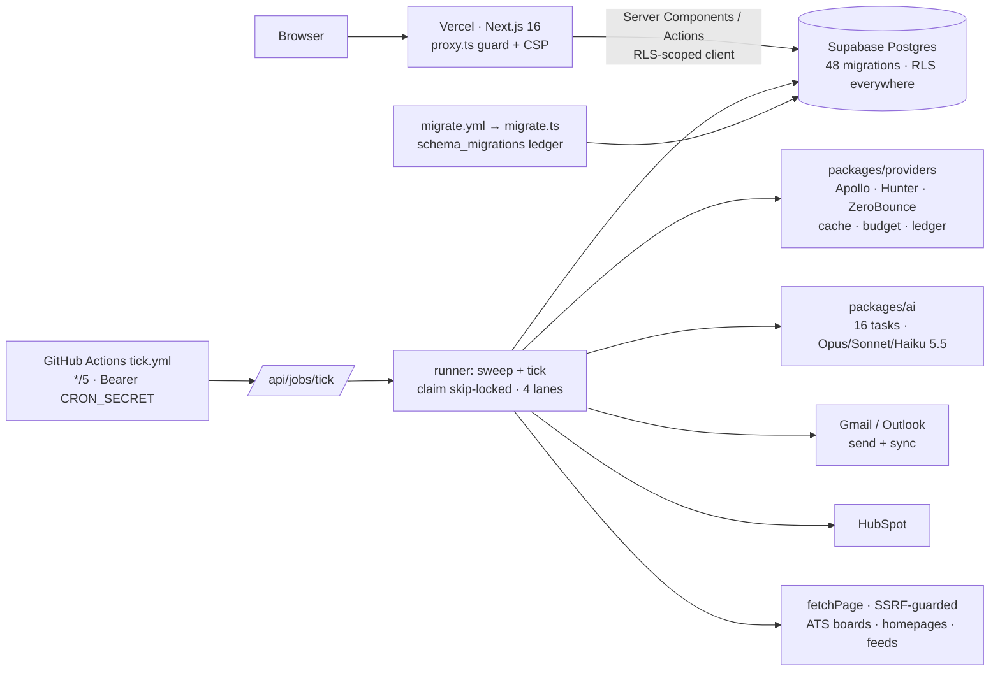
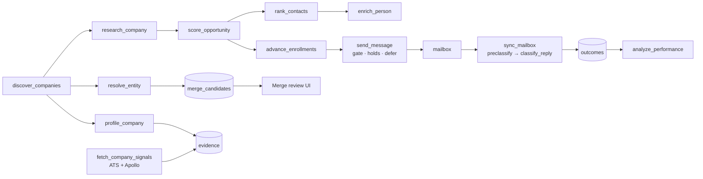

# Pass 15 — system map

```mermaid
flowchart LR
  U[Browser] --> V[Vercel · Next.js 16<br/>proxy.ts guard + CSP]
  V -->|Server Components / Actions<br/>RLS-scoped client| DB[(Supabase Postgres<br/>48 migrations · RLS everywhere)]
  GH[GitHub Actions tick.yml<br/>*/5 · Bearer CRON_SECRET] --> T[/api/jobs/tick/]
  T --> R[runner: sweep + tick<br/>claim skip-locked · 4 lanes]
  R --> DB
  R --> P[packages/providers<br/>Apollo · Hunter · ZeroBounce<br/>cache · budget · ledger]
  R --> AI[packages/ai<br/>16 tasks · Opus/Sonnet/Haiku 5.5]
  R --> MB[Gmail / Outlook<br/>send + sync]
  R --> CRM[HubSpot]
  R --> W[fetchPage · SSRF-guarded<br/>ATS boards · homepages · feeds]
  MG[migrate.yml → migrate.ts<br/>schema_migrations ledger] --> DB
```

## Core loop data flow

```mermaid
flowchart LR
  D[discover_companies] --> RC[research_company] --> SO[score_opportunity] --> RK[rank_contacts]
  D --> RE[resolve_entity] --> MC[(merge_candidates)] --> MRV[Merge review UI]
  D --> PC[profile_company] --> EV[(evidence)]
  FS[fetch_company_signals<br/>ATS + Apollo] --> EV
  RK --> EP[enrich_person]
  SO --> AE[advance_enrollments] --> SM[send_message<br/>gate · holds · defer] --> MB[mailbox]
  MB --> SY[sync_mailbox<br/>preclassify → classify_reply] --> OUT[(outcomes)] --> AP[analyze_performance]
```

Production today: `www.huntloop.pro` → project at `8021d3f` → Supabase host `hnoycsbd…` (0001–0047). Apex `huntloop.pro` fails TLS. No tick driver.
