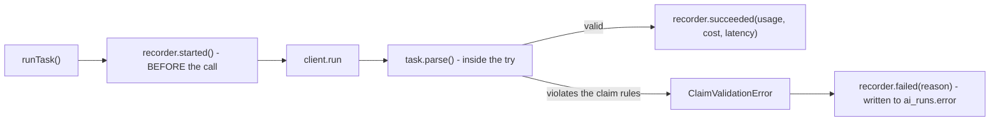
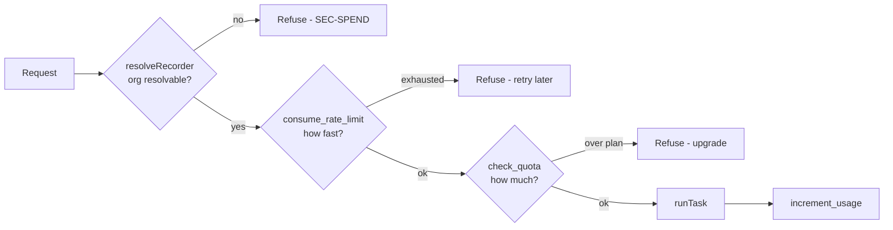

# AI subsystem

> **Layer:** Internal · **Audience:** engineering, product

`packages/ai` holds twelve tasks and one runner. The package's own rule:
**nothing here decides whether a model may be called.** Callers ask
`isAiConfigured()` and choose what to show when it is false — "no key" is a
normal deployment state, and the honest answer to it is a screen that says so,
not a fabricated result.

## The task shape

```ts
interface LLMTask<TInput, TOutput> {
  name: TaskName;
  prompt: Prompt;                 // versioned
  schema: object | ((i: TInput) => object);  // JSON Schema for output_config
  maxTokens: number;
  renderInput: (i: TInput) => string;
  fetchDomains?: (i: TInput) => string[];    // omit to forbid fetching
  parse: (json: unknown, i: TInput) => TOutput;  // the validation boundary
  entity?: (i: TInput) => { type: string; id?: string | null };
}
```

A task owns four things: its prompt, its output schema, how it renders an
input, and how it validates what came back. `runTask` owns everything that must
happen identically every time and that nobody should be free to skip — routing,
the pre-call `ai_runs` row, timing, cost, and the validation boundary.

**Derived schemas** exist for tasks whose *valid* output depends on what was
asked: `recommend_sources` constrains its `basis` field to the ICP elements
actually sent, so the model cannot justify a recommendation with a criterion
the user never wrote. `parse` re-checks it anyway — the schema turns a failed
run into an impossible one, which is the difference between catching the error
and paying for it.

## The twelve tasks and their routing

| Task | Model | Effort | Why this route |
|---|---|---|---|
| `research_company` | Opus 5 | high | Multi-source synthesis whose quality propagates into every later step |
| `research_competitor` | Opus 5 | high | Output becomes sentences a seller repeats about a company not present to correct them |
| `draft_icp` | Opus 5 | high | This is *policy*, not an answer about one company. High effort buys protection against the generic answer — "Series A to C, 50–500 employees, North America" is never obviously wrong enough to reject |
| `draft_scoring_rules` | Opus 5 | high | Writes executable policy; a plausible-but-wrong proposal is more expensive than a wrong answer about one opportunity |
| `qualify_opportunity` | Opus 5 | high | Decides where money goes, and must be willing to return `IGNORE` |
| `analyze_performance` | Opus 5 | high | Drives rule proposals |
| `recommend_sources` | Opus 5 | medium | |
| `explain_why_now` | Opus 5 | medium | |
| `personalize_message` | Opus 5 | medium | The customer-visible artifact — a bad opener burns the prospect permanently |
| `sales_agent` | Opus 5 | medium | |
| `extract_signals` | Haiku 4.5 | medium | Deterministic extraction into a normalised event |
| `classify_reply` | Haiku 4.5 | low | Short input, fixed label set, high volume |

**The routing rule:** Haiku only where the task is genuinely closed-set
classification; everything whose output a customer eventually reads runs on
Opus. The failure cost of a bad qualification or a tone-deaf opening line is
far larger than the token delta.

### Model capabilities are encoded, not assumed

```ts
const CAPABILITIES = {
  "claude-opus-5":   { adaptiveThinking: true,  effort: true,  webFetch: true  },
  "claude-sonnet-5": { adaptiveThinking: true,  effort: true,  webFetch: true  },
  "claude-haiku-4-5":{ adaptiveThinking: false, effort: false, webFetch: false },
};
```

These differences are **400 errors, not degradations**. Encoding them means a
future routing change — moving `extract_signals` to a different model to save
money — cannot silently produce a request shape that model has never accepted.

## The validation boundary



Parsing happens **inside** the `try`, so a rule violation is recorded as a
failed run rather than escaping as an unattributed exception. The tokens were
spent either way; the bill should say so. That is what makes a bad prompt
version attributable.

`claims.ts` enforces the epistemic rules:

* `CLAIM_KINDS` = `fact` | `inference` | `unknown`
* `CONFIDENCES` — graded, never invented
* `assertValidClaim` / `assertValidClaims` throw `ClaimValidationError`

`qualify_opportunity` additionally requires **all eight dimensions, unknowns
included**, and checks that the verdict is one the dimensions can support.

## Prompt-injection containment

Every enriched field and every fetched page is written by someone who is not
our user and may be trying to reach the model.

Two mitigations, and **the second is the load-bearing one**:

1. **Delimit and frame as data.** `wrapUntrusted(label, content)` fences the
   text in a **randomised** identifier per call, so a page that includes the
   literal string `</untrusted>` cannot escape a block delimited by an
   identifier it has never seen. `UNTRUSTED_CONTENT_RULE` is appended to the
   system prompt of any task that reads the web.
2. **Fetched content never reaches a tool that does anything.** The research
   tasks fetch and extract; they do not send, delete, or spend. An injection
   that succeeds completely can make the model *wrong about a company*, which
   the evidence trail then exposes.


That blast radius is the actual defence, and it is an architectural choice, not
a prompt. Preserve it when adding tasks: **do not give a web-reading task a
tool with a side effect.**


`fetchDomains` is derived from the input and omitting it **forbids fetching**,
so a task cannot browse the open web by accident.

## Cost accounting

`ai_runs` is written **before** the call, not after. A run that crashes still
has a row; a run that was never recorded is a run nobody can attribute.

| Column group | Contents |
|---|---|
| Identity | org, task, model, `prompt_version`, `input_hash` |
| Entity | `entity_type`, `entity_id` — what the run was about |
| Result | token usage, `cost_cents`, `latency_ms`, `error` |

### Pricing

List price per million tokens, in `models.ts`:

| Model | Input | Output |
|---|---|---|
| Opus 5 | $5.00 | $25.00 |
| Sonnet 5 | $3.00 | $15.00 |
| Haiku 4.5 | $1.00 | $5.00 |

Cache reads bill at ~0.1× input and cache writes at ~1.25×. That is why
caching is the biggest cost lever: the ICP and product context are
byte-identical across every opportunity in a campaign, so almost all of a
mature campaign's input tokens should arrive at the 0.1× rate. **If they are
not, the cache is broken and `/analytics` is how you find out.**


Sonnet 5 carries an introductory rate that expires. The **standard** rate is
used here on purpose: a cost dashboard that quietly assumes a promotional price
will understate the bill from the day it ends, without anyone changing a line
of code.


## The three gates before any model call



Each gate is verified by a check in `scripts/audit.mjs`: `SEC-SPEND`,
`SEC-RATELIMIT`, `SEC-QUOTA`. The engine path has the same three using the
`_internal` service-role variants (`packages/jobs/src/ai.ts`).

### Why `ai_runs` is written through the tenant client

Cost rows are **tenant data** — they say which companies an org researched and
when — so they go through RLS like everything else. One consequence worth
stating: if the policy is wrong, cost accounting breaks *loudly* on the next
call instead of quietly writing rows nobody can read.

### Demo mode runs unmetered

With no database there is nothing to meter against. That is a deliberate trade
and the smaller of two harms: refusing would make onboarding untestable before
Supabase is wired up, while running unmetered is **visible** (the screen says
so) and **bounded**.

## Current limitation


**No AI task has ever called the real Anthropic API.** All twelve are tested
against a scripted client (198 checks in `verify-tasks.ts`). Adding
`ANTHROPIC_API_KEY` runs them for the first time. Treat every task's live
behaviour as unverified until that happens.


## Related

* [Plans, quotas and billing](../product/plans-and-quotas.md)
* [Security model](../security/model.md)
* [Observability](../operations/observability.md)
