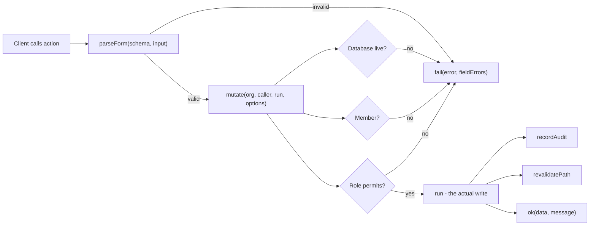

# Backend and server actions

> **Layer:** Developer / Internal · **Audience:** engineering

Huntloop has **no general-purpose REST API**. Writes are Server Actions; the
handful of HTTP routes that exist are there because something outside the app
must call them. See [HTTP endpoints](../developer/http-endpoints.md).

## Why no REST API

A public API is a contract with an external consumer, and there is no external
consumer yet. Shipping one now would mean versioning, documenting and
deprecating a surface nobody uses, and every internal refactor would become a
breaking change. `docs/OPERATIONS.md` (API-03) records the versioning strategy
to adopt **when** that changes; until then, Server Actions keep the read model
and the write model in one place.

## The Server Action contract

Every action in the app follows the same four-step shape.



### 1. Validate at the edge


**Server Actions are public POST endpoints.** Next generates an id for each one
and exposes it to the browser, so anyone can call them with anything — and
TypeScript is erased at runtime, so the parameter types on
`analyzeUrlAction(org: string, url: string)` are documentation, not a check.


`apps/web/lib/validation.ts` holds a Zod schema for every action input. The
`SEC-VAL` audit check fails the build if a Server Action does not validate its
inputs at runtime.

Two rules for what goes in that file:

1. **Validate shape and bounds, not business meaning.** Whether a URL is a real
   company is `normalizeUrl`'s job and then the model's; whether the caller may
   act on this org is the `mutate` helper's.
2. **Bound every string and array.** An unbounded field on a public endpoint is
   a way to make Huntloop pay to tokenize a megabyte of someone else's text.

Enum members are **derived**, never retyped — `PRIORITIES`, `CLAIM_KINDS`,
`CONFIDENCES`, `SCORE_DIMENSIONS` come from `@huntloop/ai`, `ORG_TONES` from
`@huntloop/db/org-profile`, the onboarding vocabularies from
`lib/onboarding/steps.ts`. A hand-copied union drifts *silently*: the schema
keeps validating and starts rejecting the new member as invalid input.

### 2. One result shape

```ts
type ActionResult<T = undefined> =
  | { ok: true; data: T; message?: string }
  | { ok: false; error: string; fieldErrors?: Record<string, string> };
```

One shape for every action, so forms share their pending / error / success
rendering. `fieldErrors` exists because a form that says only "invalid" makes
the user hunt for which of nine fields it meant.

### 3. `mutate()` — the common preamble

`apps/web/lib/data/org.ts` wraps every write:

| Check | Failure message is user-facing and specific |
|---|---|
| Database live? | Distinguishes `unconfigured` from `no-schema` |
| Member of this org? | "You are not a member of this organisation." |
| Role is not `viewer`? | "Your role is read-only… An admin can change your role under Members." |
| `minRole: "admin"` satisfied? | Names the caller's actual role |

This is a **courtesy layer**. If it were deleted, RLS would still refuse the
write — the difference is whether the user gets a sentence or a Postgres error.

### 4. Audit and revalidate

`recordAudit()` writes to `audit_logs` via `write_audit_log()`. `revalidatePath()`
refreshes the affected route.


`audit_logs` is currently **write-only** — nothing in the product reads it. It
is forensic-only until a read surface exists. See
[Technical debt](../status/technical-debt.md).


## Reads

Reads never go through `mutate`. They go through `lib/data/*` loaders, which
return `Loaded<T>` and carry the data source with them. See
[Frontend](frontend.md#the-data-loading-contract).

`requireOrgId(orgSlug, caller)` throws rather than returning null — by the time
a loader runs, the org layout has already 404'd a non-member, so a missing
membership here is a bug, not a user state.

## Model-calling paths

Any path that can spend money passes three gates, all checked by
`scripts/audit.mjs`:

| Gate | Check id | Where |
|---|---|---|
| Resolve the org (never spend for an unresolvable caller) | `SEC-SPEND` | `lib/ai/recorder.ts` |
| Consume a rate-limit budget | `SEC-RATELIMIT` | `lib/rate-limit.ts` → `consume_rate_limit()` |
| Check the monthly quota and count the run | `SEC-QUOTA` | `lib/ai/budget.ts` → `check_quota` |

The engine path has its own equivalents (`packages/jobs/src/ai.ts`, using the
`_internal` service-role variants).

## The engine cannot be driven from a request

```ts
// lib/data/engine.ts, inbox/actions.ts, learn/actions.ts all say this:
// enqueue() writes through the service-role client, and calling it from a
// Server Action would put that client in the request path.
```

A Server Action that wants background work therefore goes through a narrow,
named seam (`lib/data/engine.ts`) rather than importing the queue. This is what
keeps `SEC-ADMIN` true.

## Related

* [Server actions reference](../developer/server-actions.md) — the full list
* [HTTP endpoints](../developer/http-endpoints.md)
* [Security model](../security/model.md)
