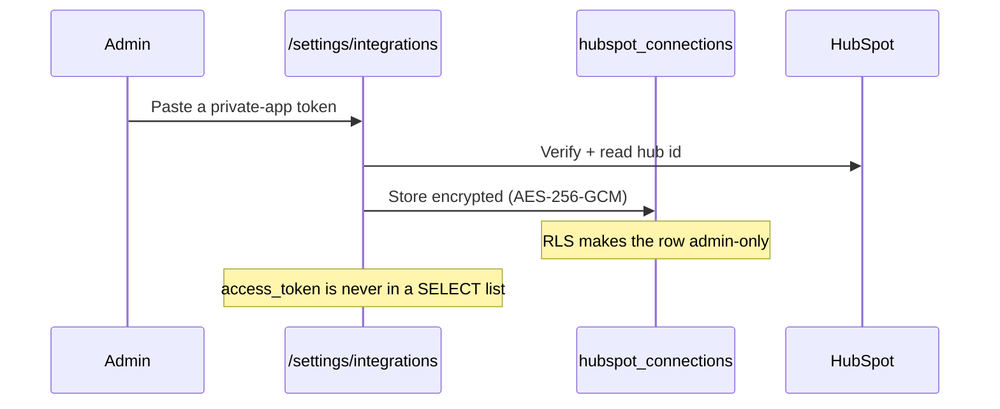
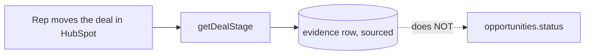

# CRM integration

> **Layer:** Internal / Developer · **Audience:** engineering, product

One destination: **HubSpot**. `packages/crm`.

## Why this is not shaped like `packages/providers`

The provider package abstracts *reading* from several interchangeable vendors
behind one capability interface — the whole design rests on Apollo, Hunter and
ZeroBounce being able to answer the same question.

CRM sync is the opposite shape:

| | Providers | CRM |
|---|---|---|
| Direction | Read | **Write** |
| Vendors | Three, interchangeable | One |
| Credential | Deployment-wide env var | **Per organisation** |
| Routing | A registry | None needed |

There is no shared, deployment-wide credential to route through a registry, and
building a five-vendor abstraction over one real implementation would be the
premature-abstraction failure the rest of this codebase avoids.

## The surface

Deliberately narrow: **three objects and one read-back**.

| Operation | Purpose |
|---|---|
| `upsertCompany` | Company by domain |
| `upsertContact` | Contact by email |
| `createDeal` / `updateDealHuntloopFields` | The opportunity as a deal |
| `ensureDealProperties` | Creates Huntloop's custom properties on first use |
| `associate` | Links company ↔ contact ↔ deal |
| `getDealStage` | **The only read.** |

What a deal carries into HubSpot:

```ts
interface CrmDealInput {
  name: string;
  score: number | null;   // 0–100; null when the dimension is UNKNOWN
  whyNow: string;         // the opportunity's own explanation, never rewritten
  evidenceUrl: string;    // a link back, for a rep who wants the evidence
}
```

`whyNow` is **never rewritten for HubSpot's audience**. `score` is `null` rather
than `0` when unmeasured — the same rule as everywhere else.

## Connection and credentials



* Admin-only, both in the action and at the RLS layer (`0028`).
* The token is encrypted at the **application** layer with
  `MAILBOX_ENCRYPTION_KEY`, the same key that protects mailbox OAuth tokens.
* `lib/data/integrations.ts` leaves `access_token` **out of the query** rather
  than trusting every caller to remember not to render it — this is a Server
  Component read that ends up serialized into the page a browser receives.
* Connecting is **refused** when the encryption key is unset, rather than
  storing a token in plain text.
* A non-admin member gets an RLS-refused read, which this screen renders as
  "not connected" — a defensible default, since a member who cannot see the
  connection cannot act on it either.

### Why one encryption key, and why the name is wrong

`MAILBOX_ENCRYPTION_KEY` was named when mailboxes were the only thing it
protected. The CRM stores the same *kind* of thing — a token belonging to the
customer, not to us. Two keys would double what a rotation has to touch and
protect nothing the first does not. The variable keeps its name because
renaming one already set on a live deployment trades a real outage for a tidier
word.

**Rotating it makes every connected mailbox and CRM need reconnecting.**

## Why encrypt when the database is already private

These are not our secrets. A refresh token for a customer's Gmail account
grants read and send on their real mailbox, indefinitely, and it survives every
rotation of our own credentials. **RLS protects it from other tenants;
encryption protects it from a backup file, a log line, a snapshot shared with
support, and a PostgREST misconfiguration** — all of which are ways rows leave a
database without anyone breaching it.

AES-256-GCM from `node:crypto` — no dependency, and *authenticated*: a
ciphertext that has been altered fails to decrypt rather than decrypting to
something else. A random 12-byte IV per encryption, stored alongside; reusing
an IV under GCM is not a weakness, it is a break.

## Two design decisions worth understanding

### Per opportunity, never bulk

A HubSpot company or contact with **no opportunity behind it** is exactly the
undifferentiated list this product exists not to produce. Sync is triggered per
opportunity — a rep pushing the ones worth a CRM record.

### A deal is created exactly once

A deal has no natural search key, so the only thing standing between "sync
twice" and "two deals for one opportunity" is remembering the id from the first
push. `external_ids` is checked **before** `createDeal` is ever called —
reusing the existing generic identity table rather than inventing a second one.

### A HubSpot stage change becomes evidence, not a status write



HubSpot's stage is a real, citable fact about what a rep did in their CRM — and
it is recorded with its source, **not silently promoted into overwriting a
status Huntloop's own scoring engine is responsible for.**

Whether that should change is [open decision #2](../decisions/README.md#open-decisions).
It needs a real rep's opinion and a source-of-truth table, written *before*
inbound sync exists rather than after.

## The gap


**`sync_hubspot` has no trigger.** It is registered, tested (20 checks in
`verify-crm.ts`) and enqueued by nothing. Connecting HubSpot today records a
connection and pushes nothing.

The fix is small: an action on the opportunity page, or a fan-out from
`schedule_syncs` (which already exists and already sweeps on a cadence). See
[Technical debt](../status/technical-debt.md).


## Adding a second CRM

Not planned. The day it becomes real, `contract.ts` is the seam — it is already
vendor-neutral in its type names. What would need to be added is a per-org
routing decision, because unlike providers, the credential belongs to the
customer rather than the deployment.

## Related

* [Data providers](providers.md)
* [Feature reference](../product/features.md#crm)
* [Security model](../security/model.md)
