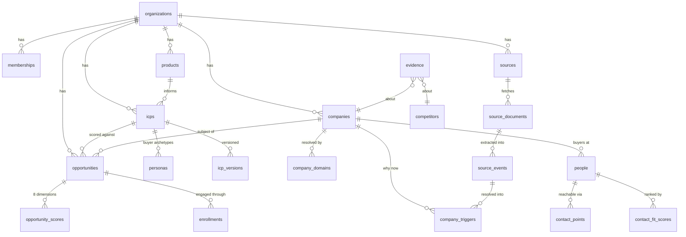
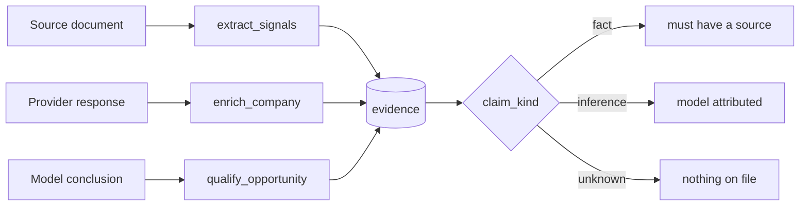

# Data model

> **Layer:** Internal · **Audience:** engineering, product

## The core graph



**The opportunity is the unit**, and it is unique on `(company, icp)`.

## Entity reference

| Entity | Tables | Created by | Read by | Lifecycle |
|---|---|---|---|---|
| **Organization** | `organizations` | signup / `createWorkspace` | everything | soft delete; tenant root |
| **User / profile** | `auth.users`, `profiles` | Supabase auth + `handle_new_user` trigger | team, assignments | names readable only by co-members (`co_member_ids`) |
| **Membership** | `memberships` | `accept_invitation()` | the guard, every RLS policy | role enum; `has_org_role()` is the authorization primitive |
| **Invitation** | `invitations` | `inviteMemberAction` | `/invite/[token]` | token + expiry; seat quota enforced |
| **Join request** | `join_requests` | `request_to_join()` | `/team` | same-domain discovery (`0027`) |
| **Product** | `products` | onboarding / settings | ICP, qualification | soft delete; upstream of everything |
| **ICP** | `icps`, `icp_versions` | `draft_icp` + user edit | discovery, scoring | versioned; 15 criteria keys enforced by `jsonb_keys_within` |
| **Persona** | `personas` | ICP step | contact ranking | buyer archetypes, scoped to an ICP |
| **Source** | `sources`, `source_documents`, `source_events` | onboarding / settings | `scan_source` | soft delete; a pending recommendation is `is_enabled = false` |
| **Company** | `companies`, `company_domains` | `discover_companies`, `scan_source`, import | everything | soft delete + `merged_into_id`; canonical domain is the display key, `company_domains` the resolution key |
| **External id** | `external_ids` | `enrich_company`, `sync_hubspot` | dedupe, CRM | generic over entity type |
| **Person** | `people`, `contact_points` | `enrich_person` (unreachable), first run | opportunity page, outreach | contact points carry confidence + verification |
| **Opportunity** | `opportunities` | `score_opportunity` | list, detail, pipeline, CRM | status enum; **the product's unit** |
| **Score** | `opportunity_scores`, `contact_fit_scores` | `score_opportunity`, `rank_contacts` | detail, ordering | append-only; 8 named dimensions, **no weights column** |
| **Evidence** | `evidence` | enrichment, signals, scans, CRM | detail page | deduped by (subject, field, source); fact / inference / unknown enforced by `CHECK` |
| **Trigger** | `company_triggers` | `extract_signals`, `fetch_company_signals` | why-now, scoring | freshness decays |
| **Competitor** | `competitors`, `competitor_profiles`, `competitor_evidence`, `company_competitor_signals` | `research_competitor`, `resolve_competitor_mentions` | intelligence | |
| **Campaign / sequence** | `campaigns`, `sequences`, `sequence_steps` | `/outreach` | outreach | `autonomy_level` 0–5 lives on the campaign |
| **Enrollment** | `enrollments` | `enrollOpportunitiesAction` | `advance_enrollments` | autonomy-gated |
| **Message** | `messages`, `message_events`, `threads` | `send_message`, `sync_mailbox` | inbox | `sent_at` is the proof; send is idempotent |
| **Mailbox** | `mailboxes` | OAuth callback | send, sync | tokens encrypted at the application layer |
| **CRM link** | `hubspot_connections`, `external_ids` | settings + `sync_hubspot` | CRM push | token encrypted; row is admin-only at the RLS layer |
| **Suppression** | `suppressions`, `contact_frequency` | unsubscribe, sends | `can_contact()` | `contact_frequency` is currently unread |
| **Learning** | `learning_runs`, `learning_findings`, `outcomes`, `ai_decisions`, `human_overrides` | `analyze_performance`, reply classification, overrides | `/learn` | needs volume |
| **Memory** | `memories` | agent, learning, `/memory` | agent prompts | scoped: org / person / opportunity |
| **Provider call** | `provider_calls`, `provider_cache`, `provider_breakers`, `provider_accounts` | `callProvider` | `/ops`, budget | ledger is append-only |
| **AI run** | `ai_runs` | `runTask` | `/analytics` | cost + latency, recorded before the call |
| **Job** | `job_executions` | `enqueue()` | runner, `/ops` | claim / retry / backoff; at-least-once |
| **Discovery** | `discovery_queries`, `discovery_runs`, `discovery_results` | onboarding, `schedule_discovery` | `/companies` | resumable via `page_cursor` |
| **Rate limit** | `rate_limits` | `consume_rate_limit()` | — | read-only to tenants; no write policy |
| **Public research** | `public_research` | `/discover` (anonymous) | `claim_research()` | expires; visitor addresses hashed |
| **Audit** | `audit_logs` | `lib/data/audit.ts` | **nothing** | write-only today |
| **Plans / usage** | `plans`, `usage_counters`, `subscriptions` | `0007` seed, `increment_usage` | pricing page, usage screen | `subscriptions` is unused |

## Evidence — the epistemic core



| Column group | Purpose |
|---|---|
| `subject_type`, `subject_id` | What the claim is about — a company, a person, a competitor (`0021` widened this) |
| `field` | Which attribute (`0020`) |
| `claim_kind` | `fact` / `inference` / `unknown` — a `CHECK` forbids a fact with no source |
| `confidence` | Graded, never invented |
| `claim_hash` | Deduplication (`0022`); `merge_duplicate_evidence()` collapses repeats |
| source columns | Where it came from, and when |

`flag_contradictions()` (`0020`) surfaces two sources asserting incompatible
facts about the same field, rather than silently preferring the newer one.

## Scores

```
opportunity_scores
├── model_score      what the model said, untouched
├── score            after rules
├── rule_trace       every rule that fired, and its effect
├── dimension_*      eight nullable dimensions
└── prompt_version   which prompt produced this (drift indexes in 0016)
```

Both drift indexes exist because a score is only comparable to another score
produced by the same rules version and the same prompt version.
`active_rules_version()` names the current one.

## Concepts that were considered and deliberately not merged

| Pair | Verdict |
|---|---|
| **lead vs. contact** | No conflict. There is no `leads` table. `people` + `contact_points` is the only contact model — and "lead" must not be introduced, because it would duplicate `opportunities`. |
| **company vs. account** | Only `companies` exists. "Account" appears in prose only. **One word: company.** |
| **lead vs. opportunity** | `opportunities` is the unit; an opportunity is `(company × icp)`. |
| **source vs. signal** | Genuinely distinct: a `source` is a monitored *place*, a `company_triggers` row is an *event* extracted from one. |
| **campaign vs. sequence** | `campaigns` group targets; `sequences` / `sequence_steps` define cadence. |
| **qualification vs. scoring** | Intentional overlap: `score_opportunity` produces model + rule-adjusted scores; `priority` is the human-facing verdict derived from them. |

## Related

* [Database](database.md)
* [Core workflows](../product/core-workflows.md)
* [Glossary](../reference/glossary.md)
