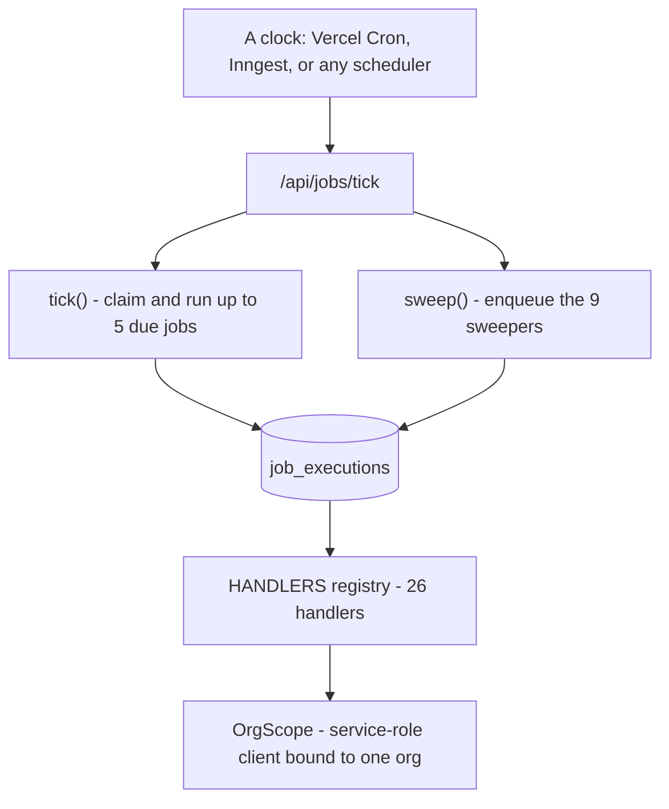

# The engine: queue, jobs, sweepers

> **Layer:** Internal · **Audience:** engineering, operations

Everything Huntloop does on its own happens here. The engine is
`packages/jobs`, the queue is a Postgres table, and the only thing that starts
it is an HTTP request to `/api/jobs/tick`.

## The three layers



| Layer | File | Responsibility |
|---|---|---|
| Queue | `queue.ts` | `enqueue`, `claim`, `succeed`, `markFailed`, `requeueStalled` |
| Runner | `runner.ts` | `tick()`, `sweep()`, deadline handling, sweeper allow-list |
| Registry | `registry.ts` | `JobName` → handler, as a **total map** |
| Scope | `scope.ts` | `OrgScope` — refuses to be constructed without an org id |

## Why a Postgres table and not a hosted queue

Every job here either reads a web page or calls a model, so the unit of work is
seconds to tens of seconds and the queue round-trip is noise. A table is
transactional with the rows the job is about, is backed up with them, and is
visible in the same SQL editor. `INNGEST_*` being configured changes where the
*tick* comes from, not where the work lives.

## The two properties that make it correct

### At-least-once, not exactly-once

`claim_job_executions` hands a row to one worker under `for update skip locked`;
`requeue_stalled_jobs` gives it back if that worker dies. **A job can run
twice, and every handler is written to tolerate that.** Exactly-once across a
network is not available, and pretending otherwise is how duplicate emails get
sent.

### Idempotent enqueue

`idempotency_key` is unique among queued and running rows, so "scan source X"
enqueued by both the scheduler and a *Scan now* button is one job. A `23505`
from that index is treated as **success** — the work the caller asked for is
already going to happen.

## `JobName` is a closed union

Adding a name without writing a handler is a **compile error**, not a job that
queues, claims, throws "no handler", retries three times and fails. That
failure mode is particularly nasty because it looks like a bug in the *work*
rather than in the *wiring*.

## What the runner refuses to do

| It does not | Because |
|---|---|
| Run forever | Serverless functions have a hard limit; a worker killed mid-job leaves rows in `running` that only `requeue_stalled_jobs` can recover, ten minutes later. `tick()` takes a deadline and stops claiming within `reserveMs` (default 20s) of it. |
| Run jobs in parallel | Five at once against one connection pool and one Anthropic rate limit buys latency and spends reliability. Concurrency is across *invocations*. |
| Let one failure end the tick | One poisoned payload must not stop every other org's work. |

Jobs claimed but not started before the deadline are **given back**, not run
half-way.

## Retry and backoff

```
attempt 1 fails → retry in 1 minute
attempt 2 fails → retry in 4 minutes
attempt 3 fails → retry in 9 minutes    (capped at 60)
attempts exhausted → status "failed", error recorded
```

`permanent: true` skips the remaining attempts. **Some failures are answers**:
a source whose URL does not parse will not parse next time either, and three
attempts at it is three times the log noise for the same outcome.

A *throw* keeps its retries (the commonest cause is a transient network error
inside a library that does not distinguish them); a returned
`{ ok: false, permanent: true }` does not.

## `sweep()` — and why it is not inside `tick()`

`tick()` is also how a test, a script or an operator **drains** the queue, and
a drain that keeps adding work never finishes. The sweep is the *heartbeat*;
the tick is the *work*.


**Every driver must call `sweep()`.** These jobs are the only things that put
periodic work into the queue. A driver that ticks without sweeping runs an
engine that processes whatever it is handed and never notices that a source is
overdue, a reply is unread, or a sequence is due to advance — *an engine that
looks healthy in every log line and does nothing.* That is exactly what the
Inngest route did before `sweep()` existed.


### Sweeper cadence

Implemented through the idempotency key, not a schedule column — so it is the
same mechanism as everything else.

| Cadence | Key | Sweepers |
|---|---|---|
| Every tick | `<name>` | `schedule_scans`, `schedule_syncs`, `schedule_sends`, `advance_enrollments`, `schedule_discovery`, `schedule_recomputes`, `schedule_signal_fetches` |
| Hourly | `<name>:<YYYY-MM-DDTHH>` | `schedule_learning` |
| Daily | `<name>:<YYYY-MM-DD>` | `enforce_retention` |

A missed hour or day costs nothing: being *due* is decided inside the handler
from the data, not from having been enqueued.

### The sweeper allow-list

Sweepers are the jobs allowed to run with `org_id = null` — they ask a
cross-tenant question and fan the answer out into per-org work. This is a
**closed set in `runner.ts`**, not a flag on the row, because "may read across
every tenant" is the most consequential property a job can have and it should
be stated in one place a reviewer can read in full.

Anything not on the list **fails permanently** when its `org_id` is null. A
sweeper's own scope is given the nil UUID — a value that matches no row — so a
sweeper that ever *did* read through its scope would read nothing rather than
everything.

## The 26 handlers

### Sweepers (cross-tenant, fan out)

| Handler | What it asks | Enqueues |
|---|---|---|
| `schedule_scans` | Which sources are overdue? | `scan_source` |
| `schedule_discovery` | Which saved searches are due? (`claim_due_discovery_queries` advances `next_run_at` as part of the claim) | `discover_companies` |
| `schedule_signal_fetches` | Which companies have signals older than 48h? (capped per tick) | `fetch_company_signals` |
| `schedule_sends` | Which approved messages are due? | `send_message` |
| `schedule_syncs` | Which mailboxes need reading? | `sync_mailbox` |
| `schedule_recomputes` | Who has asked for a rescore? | `recompute_scores` |
| `schedule_learning` | Whose last analysis was > 6 days ago? | `analyze_performance` |
| `advance_enrollments` | Which enrollments are due to step? | `send_message` |
| `enforce_retention` | Is anything past an org's retention window? | — (deletes) |

### Per-org work

| Handler | Trigger | Notes |
|---|---|---|
| `scan_source` | `schedule_scans`, *Scan now* | fetch → extract → dedupe → signals → resolve; SSRF-checked; per-scan extraction cap |
| `discover_companies` | `schedule_discovery`, first run | Resumable, page-capped, credit-budgeted |
| `enrich_company` | first run, `discover_companies` chain | Fills blanks only, writes sourced evidence |
| `fetch_company_signals` | `schedule_signal_fetches` | Hiring/job-posting evidence |
| `research_company` | `discover_companies` | Opus, web fetch |
| `research_competitor` | competitor screens | Fact-or-nothing; an unsourced strength is refused |
| `resolve_competitor_mentions` | `scan_source` | Links what a source said to the competitor list |
| `score_opportunity` | `research_company`, `scan_source`, `recompute_scores`, `resolve_competitor_mentions` | The qualification verdict |
| `recompute_scores` | `schedule_recomputes` | Batches, re-enqueues itself to continue |
| `rank_contacts` | first run | Writes `contact_fit_scores` |
| `send_message` | `schedule_sends`, `advance_enrollments` | Idempotent; refuses an unapproved message at autonomy 0–1 |
| `sync_mailbox` | `schedule_syncs` | Reads replies, classifies them |
| `analyze_performance` | `schedule_learning` | Opus; writes findings |

### Registered, tested, and never enqueued

| Handler | Consequence |
|---|---|
| `enrich_person` | Contact enrichment unreachable |
| `resolve_entity` | Deduplication never runs |
| `purge_contact_data` | GDPR erasure cannot be triggered |
| `sync_hubspot` | CRM sync has no trigger |

See [Technical debt](../status/technical-debt.md) for what each one needs.

## First run — the exception

`packages/jobs/src/first-run.ts` drives handlers **directly**, inside the
onboarding request, through five ordered stages. It does not use the queue
because `tick()` claims work for *every* tenant and in queue order — so it
could neither guarantee this user's work runs nor report which stage it is on,
which is the one thing the building screen has to do.

The handlers are the same objects the runner calls, with the same `OrgScope`,
so there is exactly one implementation of discovery.

## Drivers

| Driver | Configured by | Behaviour |
|---|---|---|
| **Vercel Cron** | `apps/web/vercel.json` + `CRON_SECRET` | One timer, no memory. A dropped invocation simply did not happen, and nothing records that. |
| **Inngest** | `INNGEST_EVENT_KEY` **and** `INNGEST_SIGNING_KEY` | Keeps a run history, retries the invocation, can be paused. `/api/inngest` returns **404** when unconfigured — not "200, feature disabled", which is how a scheduler reports green for a week of ticks that never ran. |
| **Anything else** | `CRON_SECRET` | `/api/jobs/tick` is an ordinary HTTP endpoint with a bearer token |

There is deliberately **no Inngest SDK dependency**. The durable steps in this
system are rows in `job_executions`; re-expressing them as Inngest step
functions would create a second definition of "what work is outstanding", and
the two would disagree the first time one of them was down. The dependency is
an eleven-line HMAC signature check.

## Observing it

`/[org]/ops` — the **Engine** screen — shows job health and provider health,
and offers `retry_job` and `cancel_job` (`0019`). It answers "why has nothing
happened", which is a question asked occasionally and urgently, which is why it
sits under Settings rather than being a top-level destination.

## Related

* [The heartbeat](../operations/heartbeat.md) — the operational side
* [Core workflows](../product/core-workflows.md)
* [Observability](../operations/observability.md)
