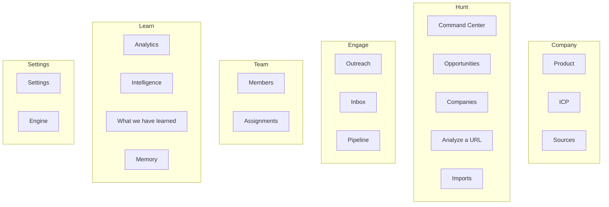
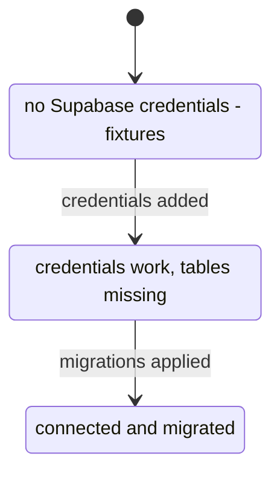

# Frontend

> **Layer:** Internal / Developer · **Audience:** engineering, design

Next.js 16, App Router, Turbopack, React 19 Server Components by default.
Client components exist only where interaction requires them.

## Route groups

Route groups are folder conventions, not URL segments.

| Group | URLs | Purpose |
|---|---|---|
| `(marketing)` | `/`, `/discover`, `/for/[useCase]`, `/compare/[approach]` | Public funnel; indexed, in the sitemap |
| `(auth)` | `/login`, `/signup` | Magic link + Google |
| `(onboarding)` | `/welcome/*` | Seven-step setup |
| `(app)` | `/orgs`, `/[org]/*` | The product |
| — | `/invite/[token]`, `/unsubscribe/[token]`, `/kitchen-sink` | Public, token-scoped or design gallery |

## The 19 product destinations



The nav follows the product loop — **Company → Hunt → Engage → Team → Learn** —
rather than a campaign tool's Leads/Campaigns/Inbox. Three deliberate
departures: "Leads" is called **Opportunities**, **Sources** is a first-class
destination rather than a settings sub-page, and **Analyze a URL** gets its own
entry because "is this actually a good lead?" is a top-level job.

### The `unbuilt` flag

`Sidebar` supports an `unbuilt` flag that renders an item as a **label rather
than a link**. For most of the project's life two thirds of the nav pointed at
404s. The rule is: the flag comes off in the same commit that adds the page.
All 19 have had it removed, so no item carries it today — **keep the flag and
the rule**, because `NAV-01` in `scripts/audit.mjs` fails the build for a nav
item pointing at a route that does not exist, which makes "add the label, not
the link" the cheaper option rather than a discipline to remember.

## The data-loading contract

Every read goes through `apps/web/lib/data/*`. There is one module per domain
and every loader returns `Loaded<T>`:

```ts
interface Loaded<T> {
  data: T;
  source: "live" | "unconfigured" | "no-schema";
}
```

The helper that enforces it:

```ts
export async function load<T>(
  live: (db: TenantClient) => Promise<T>,
  fallback: () => T,
): Promise<Loaded<T>>
```


**A failing query inside `live` is deliberately not caught.** A configured
deployment that quietly downgraded to fixtures on error would hide an outage
behind plausible-looking numbers, and the user would make decisions on them.


### The three data states



`no-schema` is a **normal step in setup**, not a crash — you get keys before you
get tables. It used to surface as a 404 on every page, which reads as "the app
is broken" rather than "you have one command left to run".

Two different banners, and the difference is the point:

| Component | Answers | Quiet when |
|---|---|---|
| `DataSourceBanner` | "Is this deployment connected to a database?" | `source === "live"` |
| `DemoFigures` | "Are *this screen's* figures invented?" | Never — a screen renders it or does not |

`DemoFigures` has no quiet state on purpose. A screen renders it while its
numbers do not come from the database, and stops on the commit that wires it
up — a change a reviewer can see, unlike a banner that silently stops
appearing. The `FEAT-DEMO` audit check fails the build if a `/[org]` screen
does neither.

## Roles and rendering

`lib/data/membership.ts` returns a `Viewer`:

```ts
type Viewer = { kind: "member"; orgId: string; role: Role } | { kind: "demo" };
```

`"demo"` is a **third state**, and collapsing it into either of the others is
the bug worth avoiding. Before the migrations are applied there is no
`memberships` table, so there is no role. Treating that as `viewer` would make
the whole app appear read-only during setup; treating it as `owner` would be
inventing a fact.

| Helper | Question |
|---|---|
| `canWrite(viewer)` | May this viewer change things? (everyone but `viewer`) |
| `canAdmin(viewer)` | May they change the organisation itself? |
| `canSpend(viewer)` | May they trigger work that costs money? |


This is **not** an authorization check. RLS is the authorization check.
Everything here decides what to *render*. Hiding a button is a courtesy, not a
control — the moment it is treated as a control, someone will move a policy out
of Postgres to match.


`currentViewer` is wrapped in React `cache()`, so the org layout and the page
inside it share one lookup rather than each paying for `auth.getUser()` plus a
join.

## proxy.ts

Formerly `middleware.ts`; Next 16 deprecated that name. Three jobs, in order:

1. **Refresh the Supabase session.** Server Components cannot set cookies, so
   without this tokens expire mid-session and the user is silently logged out
   on a navigation.
2. **Bounce anonymous visitors off `/[org]/*`.** A convenience, not the boundary.
3. **Mint the per-request CSP nonce**, and put it on the *request* headers as
   well as the response — that is how Next learns it and stamps it onto its own
   inline bootstrap scripts.

Public prefixes, each for a stated reason:
`/login`, `/signup`, `/auth`, `/kitchen-sink`, `/api/csp-report`,
`/unsubscribe`, `/api/unsubscribe`, `/discover`, `/for`, `/compare`.

When Supabase is unconfigured, or the schema is not applied, the guard passes
everything through — otherwise demo mode would be unreachable.

## Theming

Three preferences: **System / Light / Dark**, stored in the `hl-theme` cookie
and rendered into `data-theme` server-side for a flash-free first paint. Only
`"system"` needs the blocking inline script (`THEME_INIT_SCRIPT`), which
resolves from `matchMedia` before any content paints and keeps following the OS
live via a `change` listener.

Light is **not an inversion of Dark** — it derives from the reference report
screenshots (warm paper canvas, white cards, rust/amber flag accent). See
[Design system](design-system.md).

## Accessibility

* A skip link is the **first focusable element in the document** — every
  authenticated page renders ~17 nav items before `<main>`.
* The mobile drawer closes on `Escape`; a nav dismissible only by pointer is a
  keyboard trap on the one breakpoint where it covers the page.
* `DataTable` rows without `onRowClick` are **not focusable**, because they do
  nothing.
* Nothing is communicated by colour alone — priority ships with the word and a
  dot shape.
* `eslint-plugin-jsx-a11y` runs in CI; 90 Playwright tests cover focus order and
  responsive behaviour on desktop and mobile viewports.

## Performance

* Internal links use `next/link` — enforced by `PERF-01`.
* `npm run audit:bundle` budgets the **shared client chunks** after a build and
  fails CI if they grow.
* PostHog is server-side (`posthog-node`) rather than the ~50 kB browser SDK.
  Every onboarding step transition already passes through the server.
* Sentry Session Replay is deliberately **not** enabled: a replay of the
  opportunity page records a named prospect's research.

## Related

* [Design system](design-system.md)
* [Backend and server actions](backend.md)
* [Security model](../security/model.md)
