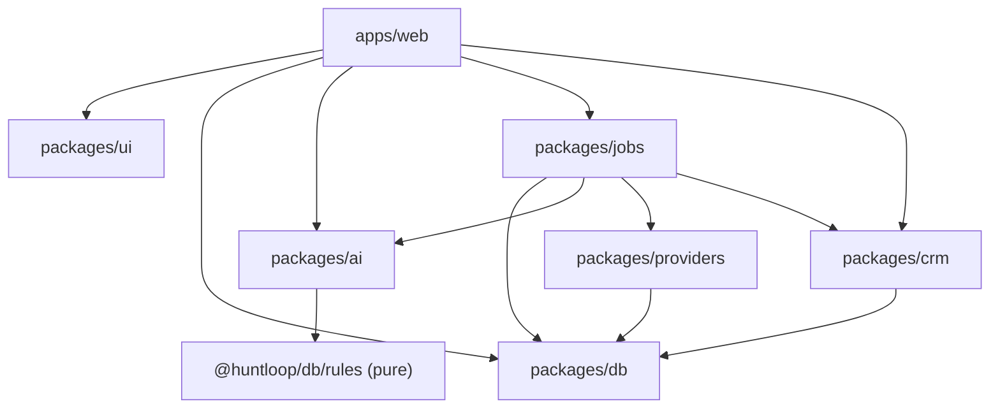

# The monorepo

> **Layer:** Internal / Developer · **Audience:** engineering

npm workspaces. No Turborepo, no Nx — `npm run <script> --workspaces` is
sufficient at this size and adds nothing to learn.

```
apps/web              Next.js 16 — marketing, auth, onboarding, product, admin
packages/ui           Design system: tokens + 20 components
packages/db           Schema (28 migrations), RLS, clients, pure domain logic
packages/ai           12 AI tasks, prompt/claim validation, run ledger
packages/jobs         Queue, runner, 26 handlers, mailbox adapters, first-run
packages/providers    Vendor seam: Apollo, Hunter, ZeroBounce + cost control
packages/crm          HubSpot connector
```

## Package reference

### `apps/web` — `@huntloop/web`

The only deployable. Next.js 16 on Turbopack, React 19, Tailwind v4, Zod 4 for
runtime validation, Sentry, `posthog-node`.

```
app/(marketing)     Landing, /discover, /for/[useCase], /compare/[approach]
app/(auth)          /login, /signup
app/(onboarding)    /welcome/* — seven steps
app/(app)/[org]     The product — 19 nav destinations
app/api             Route handlers (see HTTP endpoints)
lib/data/*          Every read. One module per domain. Returns Loaded<T>.
lib/ai/*            Model-calling wrappers: rate limit, budget, recorder
lib/validation.ts   Zod schemas for every Server Action input
proxy.ts            Session refresh, route guard, CSP nonce
```

Tests: `vitest run` — 108 tests across 7 files.

### `packages/ui` — `@huntloop/ui`

Ships **TypeScript source**, not a build artifact; `apps/web` transpiles it via
`transpilePackages`. Exports `tokens.css` and `theme.css` as subpaths.

Twenty components. The ones that carry product meaning rather than generic
chrome: `ClaimBadge`, `ScorePill` (and `SCORE_DIMENSIONS`), `PriorityBadge`,
`EvidenceList`, `Freshness`, `QuotaBar`, `BreakdownList`, `ActionRail`,
`Sidebar`, `States`.

Tests: `vitest run` — 22 tests, jsdom + Testing Library.

### `packages/db` — `@huntloop/db`

The schema and everything that is *about* the shape of a row.

| Subpath | Contents | Safe to import from a client component? |
|---|---|---|
| `.` | `createTenantClient`, `resolveMembership`, types | No — server only |
| `./admin` | The service-role client | **Never from `apps/`** |
| `./rules` | The scoring-rule grammar and evaluator | Yes — pure, no I/O |
| `./icp` | ICP parsing and exclusion logic | Yes — pure |
| `./identity` | Domain canonicalisation | Yes — pure |
| `./contact` | Contact-point logic | Yes — pure |
| `./discovery` | ICP to provider-filter translation | Yes — pure |
| `./org-profile` | Org profile shape | Yes — pure |

The pure subpaths exist so both sides can share logic without the web app
importing a database client to answer a question about a JSON object.

Tests, all four gate `npm test`:

| Script | What it proves | Assertions |
|---|---|---|
| `test:migrations` | Runs all 28 migrations against PGlite and asserts the rules the schema enforces, including cross-tenant isolation as a non-superuser | 236 |
| `test:rules` | The rule evaluator | 59 |
| `test:pure` | The pure domain modules | 121 |
| `check:admin-imports` | `apps/` never imports the service-role client | — |

### `packages/ai` — `@huntloop/ai`

Twelve tasks, one runner, and the validation boundary. **Nothing here decides
whether a model may be called** — callers check `isAiConfigured()` and choose
what to show when it is false.

Tests: `scripts/verify-tasks.ts` — 198 checks against a scripted client.

### `packages/jobs` — `@huntloop/jobs`

The engine. Queue, runner, sweep, 26 handlers, Gmail and Outlook adapters,
`first-run.ts`, the SSRF-checked fetcher, and `OrgScope`.

Tests: `scripts/verify-jobs.ts` — 199 checks.

### `packages/providers` — `@huntloop/providers`

Six capabilities, three adapters, and the cost-control stack. See
[Data providers](providers.md).

Tests: `scripts/verify-providers.ts` — 81 checks.

### `packages/crm` — `@huntloop/crm`

HubSpot. Three objects (company, contact, deal) and one read-back (deal stage).
Deliberately **not** shaped like `packages/providers` — see [CRM](crm.md).

Tests: `scripts/verify-crm.ts` — 20 checks.

## Why `node --experimental-strip-types`

Five of the seven packages test with plain Node running TypeScript directly,
not Vitest. That is why `package.json` pins `"node": ">=22.6"` — type stripping
lands there. The payoff is that the migration suite and the job suite have no
test-framework dependency at all and run identically in CI and locally.

The two packages that *do* use Vitest (`ui`, `web`) need a DOM.

## Dependency graph



`apps/web` depends on `@huntloop/jobs` only for the two route handlers that
drive a tick (`/api/jobs/tick`, `/api/inngest`) and for `first-run.ts` during
onboarding.

## Root scripts

```bash
npm run dev          # apps/web on :3100
npm run build        # production build
npm run typecheck    # every workspace
npm test             # every workspace
npm run lint         # eslint, flat config at the root
npm run audit:site   # scripts/audit.mjs — 40 repository checks
npm run audit:bundle # bundle budget, after a build
npm run verify       # all of the above, in order
npm run db:doctor    # which migrations this project has actually had applied
npm run db:seed      # one worked organisation, three opportunities
```

## Related

* [Development setup](../developer/setup.md)
* [Testing](../developer/testing.md)
* [Architecture overview](overview.md)
