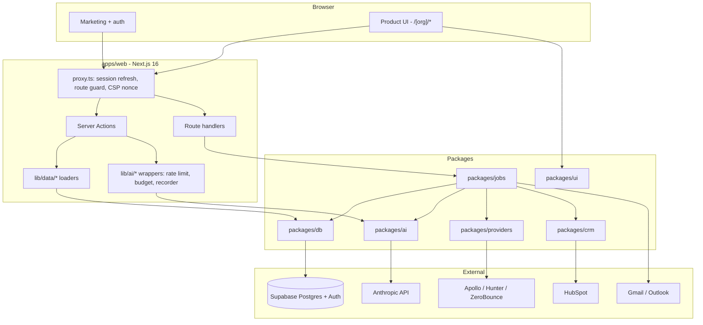
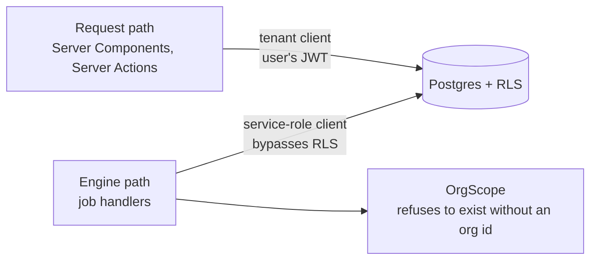
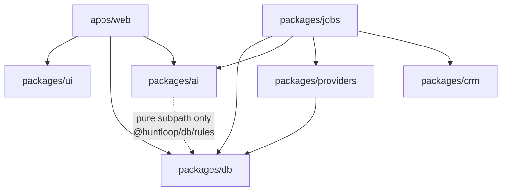

# Architecture overview

> **Layer:** Internal · **Audience:** engineering

## The stack

| Layer | Choice | Notes |
|---|---|---|
| Frontend | Next.js 16, App Router, Turbopack, React 19, TypeScript, Tailwind v4 | Server Components by default |
| Backend | Server Actions + a handful of route handlers | No general REST API — [a decision](../decisions/README.md) |
| Database | Supabase Postgres, tenant isolation by RLS | 28 migrations, 69 tables, 63 functions |
| Queue | `job_executions` — a Postgres table | Not a hosted queue — [a decision](../decisions/README.md) |
| Jobs driver | Vercel Cron, or Inngest, or any scheduler | `/api/jobs/tick` |
| AI | Anthropic Claude — Opus 5, Sonnet 5, Haiku 4.5 | 12 routed tasks |
| Data providers | Apollo, Hunter, ZeroBounce behind one seam | Capability-routed |
| CRM | HubSpot | Single vendor, by design |
| Errors | Sentry | Optional; no-op without a DSN |
| Analytics | PostHog, server-side only | Optional |
| Billing | — | Not implemented |

## The whole system on one page



## Two paths to the database, and only two

This is the most important structural fact in the codebase.



| | Request path | Engine path |
|---|---|---|
| Client | `createTenantClient` (`packages/db/src/server.ts`) | `adminClient` (`packages/db/src/admin.ts`) |
| Auth | The caller's own session | Service role |
| RLS | Applies | Bypassed |
| Boundary | Postgres | `OrgScope`, which cannot be constructed without an org id |
| Enforced by | — | `SEC-ADMIN` audit check + `check-admin-imports.ts` |

`npm test` fails the build if anything under `apps/` imports the service-role
client. The last run reported: *"212 files in apps/ and 128 in packages/
scanned; the service-role client is confined to 5 named files."*

## Dependency rules



Three rules:

1. **`packages/ai` never reaches a database client.** It imports exactly one
   thing from `packages/db` — the pure `@huntloop/db/rules` subpath, which has
   no client, no `server-only`, and no I/O — so `draft_scoring_rules` and
   `analyze_performance` can be compiled against the real rule grammar. Any
   other import would make the AI package a second path around RLS.
   
   Several in-repo comments still say `packages/ai` "does not import
   `@huntloop/db`" at all. That was true when written and is now imprecise; the
   subpath import arrived with `0010`'s rule work. The property that matters —
   no client — still holds. Recorded in
   [Documentation vs. code](../status/doc-vs-code.md).
   
2. **Nothing outside `packages/providers/src/adapters/` may know a vendor
   exists.** The `PRV-CHK` audit check fails the build if the string `apollo`
   appears in an import path or a type name outside that directory. The test of
   whether it worked: deleting `adapters/apollo.ts` should break the build in
   exactly one place — the registry.
3. **`apps/` never imports the admin client.** See above.

## Where each boundary lives

| Concern | Enforced in | Not enforced by |
|---|---|---|
| Tenant isolation | Postgres RLS | `proxy.ts` (a convenience), the UI |
| Authorization | `has_org_role()` in RLS policies | Hiding buttons (a courtesy) |
| Spend rate | `consume_rate_limit()` in Postgres | Application memory |
| Spend total | `check_quota` / `check_quota_internal` | — |
| Vendor spend | `provider_budget_state()`, breakers, ledger | — |
| Claim epistemics | `CHECK` on `evidence`, `claims.ts`, `ClaimBadge` | Convention |
| Job exclusivity | `for update skip locked` in `claim_job_executions` | Application locks |

## Runtime flow, as built

```mermaid
flowchart TD
  A[Onboarding: a URL] --> B[research_company]
  B --> C[draft_icp]
  C --> D[recommend_sources]
  D --> E[first-run.ts]
  E -->|drives handlers directly| F[discover_companies]
  F --> G[enrich_company]
  G --> H[score_opportunity]
  H --> I[rank_contacts]
  I --> J[Opportunity detail]

  K[/api/jobs/tick] -->|sweep| L[schedule_scans]
  K -->|sweep| M[schedule_discovery]
  K -->|sweep| N[schedule_sends]
  K -->|sweep| O[schedule_syncs]
  K -->|sweep| P[schedule_signal_fetches]
  K -->|sweep| Q[advance_enrollments]
  K -->|sweep| R[schedule_learning]
  K -->|sweep| S[schedule_recomputes]
  K -->|sweep| T[enforce_retention]

  M --> F
  L --> U[scan_source] --> V[extract_signals]
  P --> W[fetch_company_signals]
  N --> X[send_message]
  O --> Y[sync_mailbox] --> Z[classify_reply]

  AA[enrich_person - no caller]
  AB[resolve_entity - no caller]
  AC[purge_contact_data - no caller]
  AD[sync_hubspot - no caller]
```

Everything in the `/api/jobs/tick` column depends on a clock.
See [The heartbeat](../operations/heartbeat.md).

## Non-obvious choices worth knowing early

* **The queue is a Postgres table, not SQS or a hosted service.** Every job here
  fetches a page or calls a model, so the unit of work is seconds to tens of
  seconds and the queue round-trip is noise. A table is transactional with the
  rows the job is about, is backed up with them, and is visible in the same SQL
  editor.
* **At-least-once, not exactly-once.** `claim_job_executions` hands a row to one
  worker under `for update skip locked`; `requeue_stalled_jobs` gives it back if
  that worker dies. Every handler is written to tolerate running twice.
  Exactly-once across a network is not available, and pretending otherwise is
  how duplicate emails get sent.
* **The runner does not run jobs in parallel.** Concurrency is across
  *invocations*, not within one.
* **The tick route runs on Node, not Edge**, because the SSRF guard reaches
  `node:dns` and `node:net`.
* **`proxy.ts`, not `middleware.ts`** — Next 16 deprecated the old name.

## Related

* [The monorepo](monorepo.md)
* [The engine](engine.md)
* [Database](database.md)
* [Security model](../security/model.md)
* [Decision log](../decisions/README.md)
