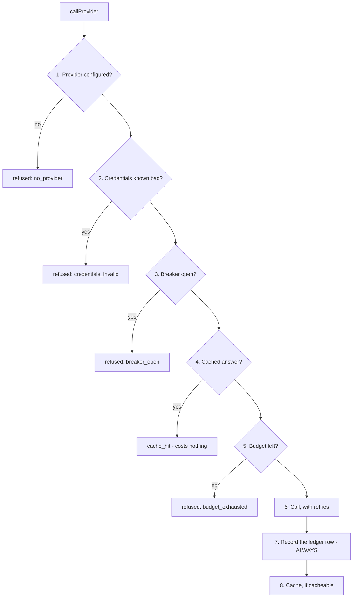
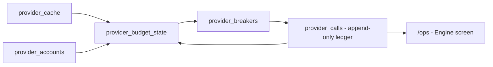

# Data providers

> **Layer:** Internal · **Audience:** engineering, operations

`packages/providers` is the only place in the codebase that knows a data vendor
exists.


**The one rule:** nothing outside `src/adapters/` may know a vendor exists.
Every type in `contract.ts` is Huntloop-shaped. An adapter turns a vendor's
response into those types and those types into a vendor's request; a caller's
job is never to know which vendor answered.

`PRV-CHK` in `scripts/audit.mjs` enforces it mechanically — the string
`"apollo"` may not appear in an import path or a type name outside the adapters
directory. **The test of whether this worked:** deleting `adapters/apollo.ts`
should break the build in exactly one place — the registry.


## Six capabilities

Not one `search()`, because they have different costs, cache lifetimes, failure
meanings and vendors. A capability is the unit that is either configured or is
not.

| Capability | Cache TTL | Why that TTL |
|---|---|---|
| `company.search` | 24 h | A result set changes as the provider ingests |
| `company.enrich` | 30 d | Headcount, industry and funding move slowly |
| `person.search` | 7 d | |
| `person.match` | 30 d | An address is stable while the person is in the role |
| `email.verify` | 90 d | A mailbox that accepts mail today almost certainly will in three months |
| `company.signals` | 48 h | The opposite end from `company.enrich`, deliberately — a hiring signal is only useful while it is current |

## Three adapters

| Vendor | Env var | Capabilities |
|---|---|---|
| Apollo | `APOLLO_API_KEY` | `company.search`, `company.enrich`, `person.search`, `person.match`, `company.signals` |
| Hunter | `ENRICHMENT_API_KEY` | `person.match` |
| ZeroBounce | `EMAIL_VERIFICATION_API_KEY` | `email.verify` |

**When both Apollo and Hunter are configured, Hunter wins `person.match`.** It
is the specialist, it is cheaper per lookup, and preferring it leaves Apollo's
more expensive credits for the searching only Apollo can do.

### A reversed decision worth knowing about

An earlier design **sniffed the vendor from the shape of the key** rather than
using a second env var, to avoid "a live deployment sending Hunter's key to
Apollo's endpoint and reporting *no results* rather than *wrong
credentials*". That reasoning was right for one optional capability with two
vendors. It does not survive six capabilities across three vendors — there is
no shape of a single key that expresses "Apollo for search, Hunter for email
finding, ZeroBounce for verification".

So explicit variables came back, and the failure they were avoiding is
addressed **directly**: `verifyCredentials()` is called at configuration time,
and a key that does not work says *"wrong credentials"*. That is a stronger
guarantee than sniffing gave — it catches an expired key, a revoked key, and a
key for the right vendor on the wrong account, none of which sniffing could see.


`.env.example` still carries the *old* argument ("There is deliberately no
`ENRICHMENT_PROVIDER` variable… the vendor is chosen from the shape of the
key"). That comment is **outdated** — the registry routes `ENRICHMENT_API_KEY`
to Hunter unconditionally. Recorded in
[Documentation vs. code](../status/doc-vs-code.md).


## The call pipeline

The order **is** the design, which is why it is one function and not five
composable middlewares — a composition mechanism would let somebody change the
order without noticing.

**Five of the eight steps exist to *not* spend money.** Steps 1–5 all cost
nothing.


**Cache before budget (4 before 5) looks wrong and is not.** A cached answer
costs nothing, so refusing it for lack of budget would deny a customer data we
already hold and already paid for.


### Retry policy

Three attempts, exponential with jitter, 15-second timeout each. The numbers
are chosen against what these calls actually are: a provider search takes
300 ms – 3 s, so 15 s means *something is wrong* rather than *this is slow*, and
a third attempt eight seconds after the first is past almost every transient
failure while still inside a job's own deadline.

The retry policy is uniform precisely because `call.ts` never sees a URL, a
header or a JSON body — only an adapter method and a promise.

## Seven outcomes, and why none can be collapsed

`CallOutcome` maps exactly onto `provider_calls.outcome` in `0011`, because the
budget, the breaker and the health view all read that column.

| Outcome | Meaning |
|---|---|
| `ok` | The provider answered |
| `cache_hit` | Served from cache; zero credits |
| `partial` | The provider returned fewer rows than asked **because it hit a limit** |
| `empty` | The provider has nothing — a complete answer |
| `rate_limited` | Retryable |
| `failed` | Not retryable within this call |
| `refused` | Never made; carries a `RefusalReason` |


**`partial` is the load-bearing field.** A provider that returns 40 of 100 rows
because it hit a page limit is a *different fact* from a provider that has 40.
The first is resumable and the second is complete. A system that cannot tell
them apart either re-pays for the first page forever, or quietly stops at 40
and reports a market smaller than it is.


## Five refusal reasons

`no_provider` · `credentials_invalid` · `budget_exhausted` · `breaker_open` ·
`capability_unsupported`

A refusal **costs nothing and must never be presented as a result.** The
discovery runner turns each into a `stop_reason`, which is how a customer finds
out their search stopped because of a budget rather than because their market
is empty.

## Cost control

| Layer | Table / function | Purpose |
|---|---|---|
| Cache | `provider_cache`, `prune_provider_cache()` | Per-capability TTL |
| Budget | `provider_budget_state()`, `provider_budget_for_org()`, `provider_accounts` | Per-org ceiling |
| Breaker | `provider_breakers` | Opens after repeated failure; refuses rather than hammers |
| Ledger | `provider_calls`, `record_provider_call()` | Append-only: every call, outcome, credit count and latency |

## Credit accounting

Apollo credits, as the adapter declares them:

| Operation | Credits |
|---|---|
| Organization search | 1 |
| Organization enrich | 1 |
| People search | 1 |
| **Person match (reveal)** | **2** — a contact point is the expensive part |
| Job postings | 1 |


These are taken from published documentation and have **not been reconciled
against a real invoice**. The adapter says so in a comment. Reconcile before
relying on the budget arithmetic.


## Type design

Every field on `ProviderCompany` is nullable except the two that make it an
entity at all. A provider that has a name and nothing else has still told us
something; a type that demanded an industry would force an adapter to **invent
one** — the epistemic rule broken inside a type definition.

Domains are canonicalised by the adapter (`packages/db/src/identity.ts`) and
set to `null` when unusable.

## Known gap

The registry picks **one** provider per capability. There is no fallback chain:
if Apollo refuses `company.enrich`, nothing tries a second vendor. Listed in
[Technical debt](../status/technical-debt.md).

## Related

* [CRM integration](crm.md) — deliberately *not* shaped like this
* [Plans, quotas and billing](../product/plans-and-quotas.md)
* [Environment variables](../developer/environment-variables.md)
