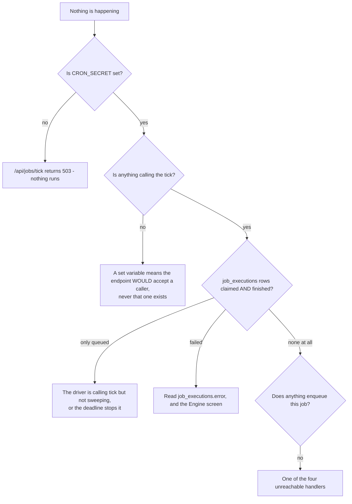

# Troubleshooting

> **Layer:** Developer / Internal · **Audience:** engineering, operations

## "Nothing is happening"

By far the most common report. Work through it in order.



| Check | How |
|---|---|
| Is the secret set? | The route returns **503** with an explanatory body when it is not |
| Is a clock calling it? | `curl -H "Authorization: Bearer $CRON_SECRET" <url>/api/jobs/tick` — if that works by hand, the problem is the schedule |
| Is it sweeping? | Every driver must call `sweep()`. Both shipped routes do. A custom driver that calls `tick()` only will process what it is handed and notice nothing |
| Is the job reachable at all? | `enrich_person`, `resolve_entity`, `purge_contact_data` and `sync_hubspot` have **no caller** |

The **Engine** screen (`/[org]/ops`) shows job and provider health and offers
retry and cancel.

## "Discovery only ran once"

Expected, currently. The only callers of `discover_companies` are
`first-run.ts` (inside the onboarding request) and the `schedule_discovery`
sweeper. With no cron, discovery runs exactly once per workspace — during
onboarding. See [The heartbeat](../operations/heartbeat.md).

## "Everything is demo data"

Three states, and the banner tells you which:

| Banner says | Meaning | Fix |
|---|---|---|
| No database connected | `NEXT_PUBLIC_SUPABASE_URL` or the publishable key is missing | Set them in `apps/web/.env.local` |
| Migrations not applied | Credentials work, tables missing | Apply the migrations, then `npm run db:doctor` |
| *(no banner, but `DemoFigures` on a screen)* | That screen's loader fell back | Usually the same cause |

The schema probe is **cached per worker** — restart the dev server after
applying migrations.

## "`db:doctor` disagrees with the app"

Trust `db:doctor`. The app's own probe checks **one** table and will happily
report a project missing the rate-limit migration as fully migrated. That is
the exact failure `db:doctor` was written for.

```bash
npm run db:doctor
```

## "0 companies match my ICP"

Read the `stop_reason` on the discovery run. `discover_companies` is built so
that **a failed search never looks like an empty market** — `succeeded` is only
reachable when the provider answered and there was nothing left to read.

Common stop reasons: `no_provider` (no `APOLLO_API_KEY`),
`credentials_invalid`, `budget_exhausted`, `breaker_open`.

## "The reach counter says it cannot count"

Correct behaviour with no company-search provider. *"We cannot count"* and
*"there are none"* are opposite statements and only one of them is true.

## "Connecting a mailbox / HubSpot is refused"

`MAILBOX_ENCRYPTION_KEY` is unset. The refusal happens **before** the OAuth
redirect, on purpose — discovering it at the callback would mean throwing away
a grant the user has already given.

```bash
openssl rand -hex 32
```

## "AI screens show a worked example"

No `ANTHROPIC_API_KEY`. That is not a refusal and nothing is charged — the
example is **labelled as one**. Add the key and the tasks run for the first
time.

## "A model call was refused"

Three different refusals, with three different messages:

| Message shape | Gate | What to do |
|---|---|---|
| "Try again in N minutes" | Rate limit — how *fast* | Wait |
| "You have used X of Y this month" | Plan quota — how *much* | Upgrade |
| "Could not resolve the organisation" | `SEC-SPEND` | A bug, or a demo-mode path |

If you see a rate-limit message where a quota message belongs, that is a
regression — the two are deliberately distinct copy.

## "A page half-works and the console shows a CSP error"

Expected while `CSP_ENFORCE` is unset — the policy is report-only and nothing
is blocked, so this is a *report*, not a break. Violations go to
`/api/csp-report` and on to Sentry.

If a page genuinely half-works with `CSP_ENFORCE=true`, turn it off, read the
reports, and fix the directive. A wrong CSP does not fail loudly.

## "The unsubscribe link does nothing"

`GET` is inert by design — it redirects to a page with a button. Only the
`POST` acts, because mail clients and security scanners prefetch links and a
GET that unsubscribed would remove people who never clicked anything.

## Build and tooling

| Symptom | Cause |
|---|---|
| `--experimental-strip-types` unrecognised | Node < 22.6 |
| Build fails in CI but not locally | CI builds with **empty** Supabase credentials — something started reading the database at build time |
| Playwright passes locally, fails in CI | The empty-string env overrides in `playwright.config.ts` are load-bearing; a real `.env.local` would otherwise change what is tested |
| Sentry warns about source maps | `SENTRY_ORG`, `SENTRY_PROJECT` and `SENTRY_AUTH_TOKEN` must **all** be set, or upload is skipped |
| Vercel build succeeds but the app is broken | Root Directory is not `apps/web`. See [Deployment](../operations/deployment.md) |
| The cron never fires on Vercel | Hobby allows **one invocation per day**. Use Inngest or upgrade |

## Getting help

Include:

1. Which step or screen
2. The exact error text
3. What `npm run verify` says
4. What `npm run db:doctor` says

**Never send** the contents of `.env.local`, or anything labelled *secret* or
*service_role*.

## Related

* [The heartbeat](../operations/heartbeat.md)
* [Operations runbook](../OPERATIONS.md)
* [Observability](../operations/observability.md)
