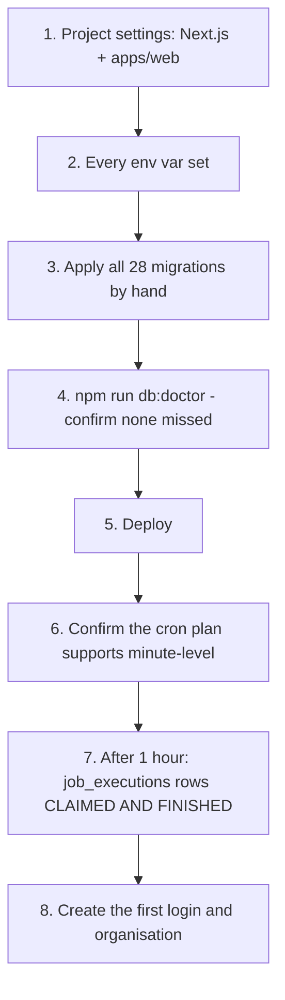

# Deployment

> **Layer:** Internal · **Audience:** operations, engineering

## Vercel project settings

This is an npm-workspaces monorepo, so **the defaults do not work**.

| Setting | Value | If wrong |
|---|---|---|
| Framework Preset | **Next.js** — not "Other" | No Next.js build pipeline |
| Root Directory | **`apps/web`** — not `./` | The build fails, or `vercel.json` is silently ignored |
| Install Command | **leave default** | Pinning `npm install` makes it run inside `apps/web`, and the `@huntloop/*` workspaces resolve only from the repository root |
| Build Command | leave default | |


**Do not pin `installCommand`.** Vercel already installs from the repository
root when the Root Directory is a workspace package. Pinning it breaks a build
that currently works.


### Why `vercel.json` lives in `apps/web/`, not the root

Vercel reads `vercel.json` from the **configured Root Directory**. At the
repository root it is silently ignored — and a cron config that is silently
ignored is the exact failure this paragraph exists to prevent.

### Why there is no root-level build redirect

A root `vercel.json` with `buildCommand` and `outputDirectory` pointing into
`apps/web` is the obvious move and is **not a supported path** for a fully
dynamic Next.js app: every route here is server-rendered on demand, there is a
proxy, and Vercel's Next.js builder expects to run against the app's own
directory. The plausible outcome is not a fixed deployment but a **green build
that serves a broken app**, which is worse than the honest failure.

Root Directory is the mechanism Vercel provides. Use it.

## Environment variables

Add **every** variable from `.env.example` under Project → Settings →
Environment Variables. See [Environment variables](../developer/environment-variables.md).


`SUPABASE_SECRET_KEY` must **never** carry the `NEXT_PUBLIC_` prefix. Anything
with that prefix is compiled into the browser bundle.


Set `NEXT_PUBLIC_SITE_URL` to the production origin. Without it, canonical and
Open Graph URLs fall back to the per-deployment Vercel host — or to
`localhost:3100` — **and get published that way**.

## Deployment checklist

| # | Step | Verify by |
|---|---|---|
| 1 | Project settings | The build succeeds |
| 2 | Environment variables | `/api/jobs/tick` does not return 503 |
| 3 | Migrations, all 28, in order, by hand | — |
| 4 | `npm run db:doctor` | It lists no missing migration |
| 5 | Deploy | The app loads with **no** `DataSourceBanner` |
| 6 | Cron plan | See [The heartbeat](heartbeat.md) |
| 7 | Heartbeat | `job_executions` rows that were **claimed and finished**, not merely queued |
| 8 | First login | [`SETUP.md`](../developer/setup.md) step 5 |


**Step 7 is the one people skip.** Rows sitting in `queued` forever look like a
working engine in every log line. Check for `succeeded`.


## Two Vercel projects

This account has historically had two projects pointed at this repository. One
(`huntloop-web`) serves the app; the other (`huntloop`) is rooted at `./` and
has **never built**. Either repoint it at `apps/web` — which gives two
production projects deploying the same commit to two URLs, worth wanting only
if one is a staging target — or delete it.

Details in [the operations runbook](../OPERATIONS.md) (OPS-03).

## What happens without each piece

| Missing | Consequence |
|---|---|
| Supabase credentials | The whole app runs on fixtures, and says so |
| Migrations | Credentials work; every screen is `no-schema` and says so |
| `CRON_SECRET` | `/api/jobs/tick` returns 503 — **nothing runs on a timer** |
| A clock | The endpoint would accept a caller; none exists. Nothing runs |
| `ANTHROPIC_API_KEY` | AI screens show a worked example, labelled as one |
| `APOLLO_API_KEY` | Discovery finds nothing; the reach counter says "cannot count" |
| `MAILBOX_ENCRYPTION_KEY` | Connecting a mailbox or CRM is refused |
| `NEXT_PUBLIC_SITE_URL` | Canonical URLs point at the per-deploy host |

Every one of these is a **stated** state in the UI, not a silent degradation.
That is the design.

## Rollback

Vercel's instant rollback works for the application. It does **not** roll back
migrations — the schema is append-only and a rollback to an older deploy runs
older code against a newer schema. Every migration is written to be additive
for this reason, but it is a property to preserve, not one to rely on blindly.

## CI

`.github/workflows/ci.yml` gates every pull request with two parallel jobs.
Nothing deploys from CI — Vercel deploys on push. See
[Testing](../developer/testing.md#ci).

## Related

* [The heartbeat](heartbeat.md)
* [Migrations](migrations.md)
* [Operations runbook](../OPERATIONS.md)
