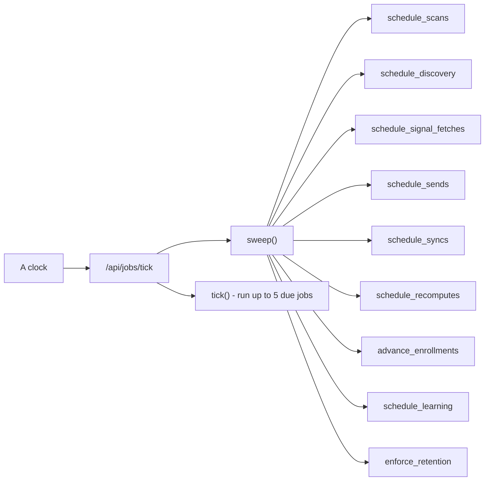

# The heartbeat

> **Layer:** Internal · **Audience:** operations, engineering, leadership


**The most important finding in the current audit:** the engine has almost
certainly never run on a schedule in any deployment.

`apps/web/app/api/jobs/tick/route.ts` is the only thing that enqueues the
sweepers, and its own header says "Vercel Cron calls this on a schedule (see
`vercel.json`)". **No `vercel.json` existed in this repository until
2026-09-15.** Every scheduled behaviour — discovery re-runs, source scans, reply
sync, sequence advancement, retention enforcement, signal fetches — depends on
that endpoint being called by a clock that was never configured.


## What depends on it



Without it:

| Nothing… | Which means |
|---|---|
| scans a source | No new signals from monitored places |
| re-runs discovery | **Discovery runs once per workspace, during onboarding, and never again** |
| fetches company signals | No hiring or funding triggers |
| advances an enrollment | Sequences never step |
| sends an approved message | Approved drafts sit forever |
| reads a mailbox | Replies are never seen, so no outcomes, so no learning |
| recomputes a score | New rules never apply to existing opportunities |
| enforces retention | Retention policies do nothing |


Compounding this: **there is no in-app control that starts discovery.** Its only
callers are `first-run.ts` and the `schedule_discovery` sweeper. That is the
difference between a product that hunts and a product that hunted once.


## Three ways to drive it

Pick one.

### A — Vercel Cron (committed)

`apps/web/vercel.json`:

```json
{
  "$schema": "https://openapi.vercel.sh/vercel.json",
  "crons": [{ "path": "/api/jobs/tick", "schedule": "* * * * *" }]
}
```

Needs:

* **`CRON_SECRET`** set on the project. Vercel then sends
  `Authorization: Bearer $CRON_SECRET` automatically.
* **A plan with minute-level cron.** Hobby is limited to **one invocation per
  day**, which is not a heartbeat.


**A Hobby account will refuse to deploy this file:**

> Hobby accounts are limited to daily cron jobs. This cron expression
> (`* * * * *`) would run more than once per day.

A deployment that does not deploy is worse than any scheduling problem. On
Hobby, use Inngest instead.


### B — Inngest (free, already built, recommended on Hobby)

Set **both** `INNGEST_EVENT_KEY` and `INNGEST_SIGNING_KEY`. `/api/inngest`
serves the identical tick, and the queue is in Postgres either way.

Inngest keeps a run history, retries the invocation itself, and can be paused —
worth having once the engine is spending money on a customer's behalf. Vercel
Cron is one timer with no memory: a dropped invocation simply did not happen,
and nothing anywhere records that it did not.

One without the other is a half-wired integration that fails at the first
invocation, so the app treats either-alone as **not configured** and the route
returns 404.

### C — Any external scheduler

`/api/jobs/tick` is an ordinary HTTP endpoint with a bearer token. A GitHub
Actions schedule, a cron box, or an uptime pinger all work.

```bash
curl -H "Authorization: Bearer $CRON_SECRET" https://your-app/api/jobs/tick
```

## Why a daily tick is not a slow engine

It is a **stalled** one, and the arithmetic is short.

`tick()` claims `limit` jobs (5 by default). The route sets `maxDuration = 60`
and the runner keeps a 20-second reserve, so it stops claiming with 20 seconds
left. Every job either fetches a page or calls a model, and both take tens of
seconds. **One invocation therefore completes somewhere between one and four
jobs.**

Once per day, that is a handful of jobs against a queue fed by every enabled
source, every connected mailbox and every active enrollment. The queue would
grow without bound, `job_executions` would fill with work that never runs, and
**the deployment would look correctly configured the whole time.**

That is why a daily cron was never committed as a compromise: a scheduled cron
in `vercel.json` reads as a working engine to anyone reviewing the repository.

## Verifying it actually runs


**`CRON_SECRET` being set means the endpoint *would* accept a caller. It never
means one exists.** These are different facts and the second is the one that
matters.


```sql
-- Rows that were claimed AND finished, not merely queued.
select job_name, status, count(*)
from job_executions
where created_at > now() - interval '1 hour'
group by 1, 2
order by 1;
```

| What you see | What it means |
|---|---|
| `succeeded` rows | The engine is running |
| Only `queued` rows | Something enqueued work; nothing is claiming it |
| No rows at all | Nothing is sweeping. Check the driver |
| Growing `failed` count | Read `job_executions.error` and the Engine screen |

In the product, `/[org]/ops` — the **Engine** screen — shows job and provider
health and offers retry and cancel. The Sources screen shows the last tick time
and states plainly when nothing is reading sources on a timer.

## The tick report

```jsonc
{
  "claimed": 5,
  "succeeded": 4,
  "failed": 1,
  "requeued": 0,
  "stoppedEarly": false,   // true = the deadline stopped it with work still queued
  "jobs": [ /* one entry per job */ ]
}
```

`stoppedEarly: true` repeatedly means the tick cadence is too slow for the
queue depth, not that anything is broken.

## Historical note

`docs/OPERATIONS.md` still contains a section titled *"What drives the tick, and
why no cron is committed"*, written when the file had been removed after a
Hobby-plan deploy failure. **`apps/web/vercel.json` now exists and commits a
one-minute cron.** That section is superseded on the question of whether a file
exists; its reasoning about Hobby limits and about why a daily cron is a lie
remains correct and is reproduced above. Recorded in
[Documentation vs. code](../status/doc-vs-code.md).

## Related

* [The engine](../architecture/engine.md)
* [Deployment](deployment.md)
* [Troubleshooting](../developer/troubleshooting.md#nothing-is-happening)
