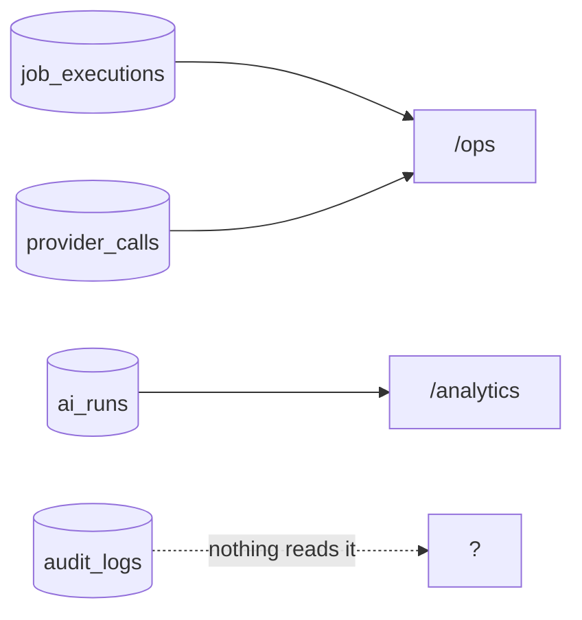

# Observability

> **Layer:** Internal · **Audience:** operations, engineering

Four surfaces, each answering a different question.

| Surface | Question | Where |
|---|---|---|
| **Engine screen** | Is the engine working? | `/[org]/ops` |
| **Analytics screen** | What is AI costing? | `/[org]/analytics` |
| **Sentry** | What is throwing? | External, optional |
| **PostHog** | Where do people drop out of onboarding? | External, optional |

Plus four tables that are the ground truth underneath them.

## The four ledgers



| Table | Written by | Read by | Contains |
|---|---|---|---|
| `job_executions` | `enqueue()`, the runner | `/ops`, the runner | status, attempts, `locked_by`, `error`, `result`, timings |
| `provider_calls` | `record_provider_call()` | `/ops`, the budget | provider, capability, outcome, credits, latency, HTTP status. **Append-only** |
| `ai_runs` | `runTask` | `/analytics` | task, model, prompt version, tokens, `cost_cents`, `latency_ms`, entity, error |
| `audit_logs` | `write_audit_log()` | **nothing** | actor, action, target |

## The Engine screen

`/[org]/ops`, in the nav as **Engine**, under Settings.

It sits under Settings rather than being a top-level destination because it
answers *"why has nothing happened"* — a question asked occasionally and
urgently, not a workflow of its own.

| Shows | Actions |
|---|---|
| Job health by name and status | `retry_job()`, `cancel_job()` (`0019`) |
| Recent failures with their error text | |
| Provider health: configured capabilities, breaker state, recent outcomes | |
| Budget state per provider | |

The **Sources** screen carries the complementary half: `isEngineRunning()`
answers *"would the endpoint accept a caller"* (an env-var read) and
`lastTickAt()` answers *"has anything called it"* (a `job_executions` read).
Those are different facts, and the screen says which.

## The Analytics screen

`/[org]/analytics`, over `ai_runs`. Spend by task, by model, by day, with
latency.


**The number to watch is cache read tokens.** Cache reads bill at ~0.1× input.
The ICP and product context are byte-identical across every opportunity in a
campaign, so almost all of a mature campaign's input tokens should arrive at
the 0.1× rate. **If they are not, the cache is broken and this screen is how
you find out.**


`ai_runs` is written **before** the call, so a run that crashed still has a row
and the bill is attributable to a prompt version.

## Sentry

Optional; a no-op with no DSN, which is the normal state locally and in CI.

Configured in `instrumentation.ts`, `instrumentation-client.ts`,
`sentry.server.config.ts`, `sentry.edge.config.ts`.

* **Session Replay is deliberately off**, and not merely unconfigured — a replay
  of the opportunity page records a named prospect's research. It is not in the
  bundle at all.
* Source maps upload only when `SENTRY_ORG`, `SENTRY_PROJECT` **and**
  `SENTRY_AUTH_TOKEN` are all set. A warning on every correct build is noise
  that hides the one that matters.
* **CSP violations arrive here** from `/api/csp-report`, fingerprinted by
  directive and blocked-URI so one misconfigured directive is one issue rather
  than one per page view.

## PostHog

Server-side only (`posthog-node`), five events, closed union:

`onboarding_step_viewed` · `onboarding_step_completed` ·
`onboarding_step_failed` · `analysis_requested` · `analysis_refused`

`analysis_refused` carries a reason: `rate_limited`, `unresolvable_org`,
`no_icp`, `invalid_input`, `model_refused`. That is the field that distinguishes
"people cannot use this" from "people do not want this".

No email addresses, no company names, no pasted URLs, no ICP text. See
[Privacy](../security/privacy.md#what-analytics-sends).

## The audit-log gap


`audit_logs` is **write-only**. `recordAudit()` writes; nothing in the product
reads. It is forensic-only — queryable in SQL, invisible in the app.

Either build a read surface or accept it as forensic-only, but do not assume an
admin can answer "who changed this" without a SQL client.


## Useful queries

```sql
-- Is the engine alive?
select job_name, status, count(*), max(finished_at)
from job_executions
where created_at > now() - interval '1 hour'
group by 1, 2 order by 1;

-- What is failing, and why?
select job_name, error, count(*)
from job_executions
where status = 'failed' and finished_at > now() - interval '1 day'
group by 1, 2 order by 3 desc;

-- Where is the AI money going?
select task, model, count(*), sum(cost_cents)/100.0 as usd
from ai_runs
where created_at > now() - interval '30 days'
group by 1, 2 order by 4 desc;

-- Is the prompt cache working?
select task,
       sum(cache_read_tokens)::float
         / nullif(sum(input_tokens + cache_read_tokens), 0) as cache_ratio
from ai_runs
where created_at > now() - interval '7 days'
group by 1;

-- Vendor credits
select provider, capability, outcome, count(*), sum(credits)
from provider_calls
where created_at > now() - interval '30 days'
group by 1, 2, 3 order by 5 desc;
```

## What is not instrumented

| Gap | Impact |
|---|---|
| No alerting on a stalled queue | A dead cron is discovered by a person, not a page |
| No uptime monitoring documented | |
| No structured request logs beyond Sentry | |
| No dashboard outside the product | `/ops` requires a login and an org |
| `contact_frequency` is written but never read | Cadence pressure is invisible |

The cheapest first improvement: an external uptime check on `/api/jobs/tick`
that alerts when the response stops reporting `succeeded > 0`.

## Related

* [The heartbeat](heartbeat.md)
* [Performance](performance.md)
* [Troubleshooting](../developer/troubleshooting.md)
