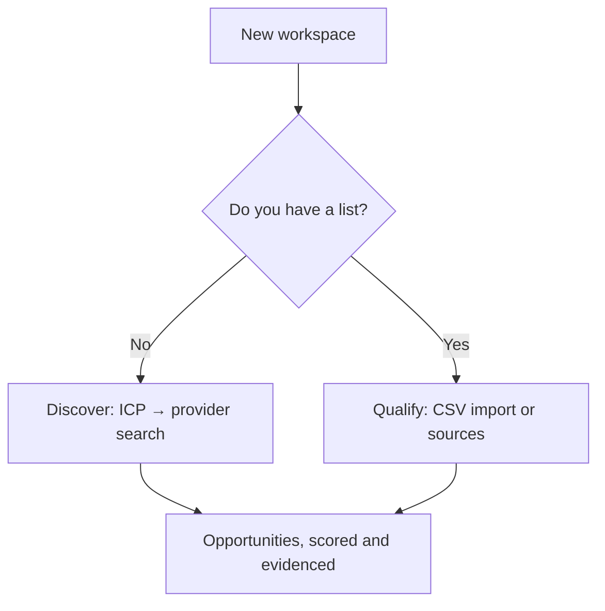

# Who it is for

> **Layer:** Product · **Audience:** product, marketing, design

Huntloop does not guess at its audience. Onboarding asks, the answer is stored
on `profiles`, and `apps/web/lib/data/personalization.ts` uses it to order the
Command Center and pick a default opportunity filter.


**Personalisation reorders; it never removes.** A role that hides a feature
produces a support ticket reading "where did X go", and it silently locks out
somebody who picked the wrong option in onboarding. Every dashboard section is
present for every role — only the order and the default filter change.


## The seven modelled roles

| Role | Who they are | Command Center leads with | Default opportunity filter |
|---|---|---|---|
| `founder` | Leads the company, sells alongside everything else | Why now | `hot-warm` |
| `gtm_generalist` | Founder-led sales; owns the whole funnel | Why now | `hot` |
| `sales` | Account executive working named accounts | Priority counts | `assigned` |
| `sdr` | High-volume outbound | Sending capacity | `ready` |
| `revops` | Owns the system and the numbers | The learning loop | `all` |
| `marketing` | Demand gen, signal-led programmes | Why now | `all` |
| `agency` | Runs the motion on behalf of clients | Priority counts | `hot` |

## The five goals

Asked at onboarding, at most **two** per workspace. The answer's only job is to
rank the dashboard — it grants no capability and removes none.

| Goal | Stage | Promise |
|---|---|---|
| `discover` | Discover | Search the market for companies that match your profile |
| `qualify` | Qualify | Bring your own list; we watch it for buying signals |
| `enrich` | Enrich | Work out who to talk to, and how to reach them |
| `reach_out` | Reach out | Draft messages grounded in why each company is a fit |
| `learn` | Learn | Measure which triggers and messages actually convert |

## The two entry motions

This matters more than it looks — it is the difference between two products.

Both motions land on the same object. `qualify` is the lower-risk entry — it
needs no data-provider key — and is the one that works on a deployment with
only an Anthropic key configured.

## The outreach channel question

Asked at onboarding, because it changes what the product will offer:

| Answer | What it means |
|---|---|
| `email` | Connect Gmail or Outlook; you approve every message before it sends |
| `manual` | Huntloop drafts, a human sends elsewhere |
| `export` | Huntloop is a source of qualified rows for another system |
| `undecided` | Nothing is assumed |

## Who it is *not* for, today

* **Enterprise buyers needing SSO / SCIM.** Not started, deliberately deferred.
* **Teams wanting a shared sending infrastructure.** Huntloop is bring-your-own
  mailbox and has no deliverability tooling.
* **Anyone needing a second CRM.** HubSpot only, single-vendor by design.
* **EU-only prospecting without a legal review.** The erasure and retention SQL
  exists; the lawful-basis assessment is a decision the operator must make.
  See [Privacy and data handling](../security/privacy.md).

## Related

* [User journeys](user-journeys.md)
* [Core workflows](core-workflows.md)
