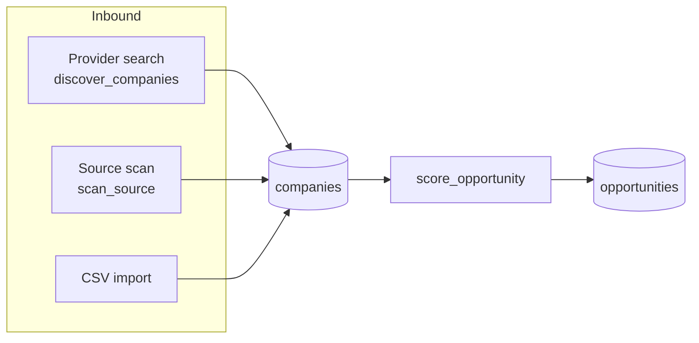
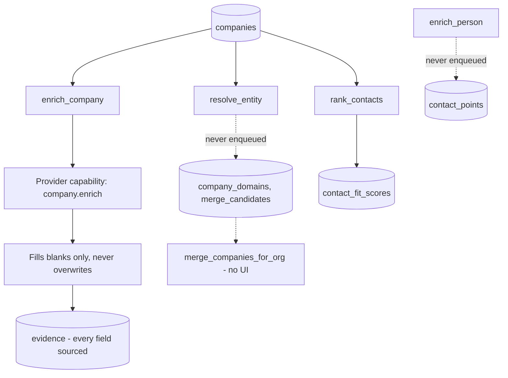
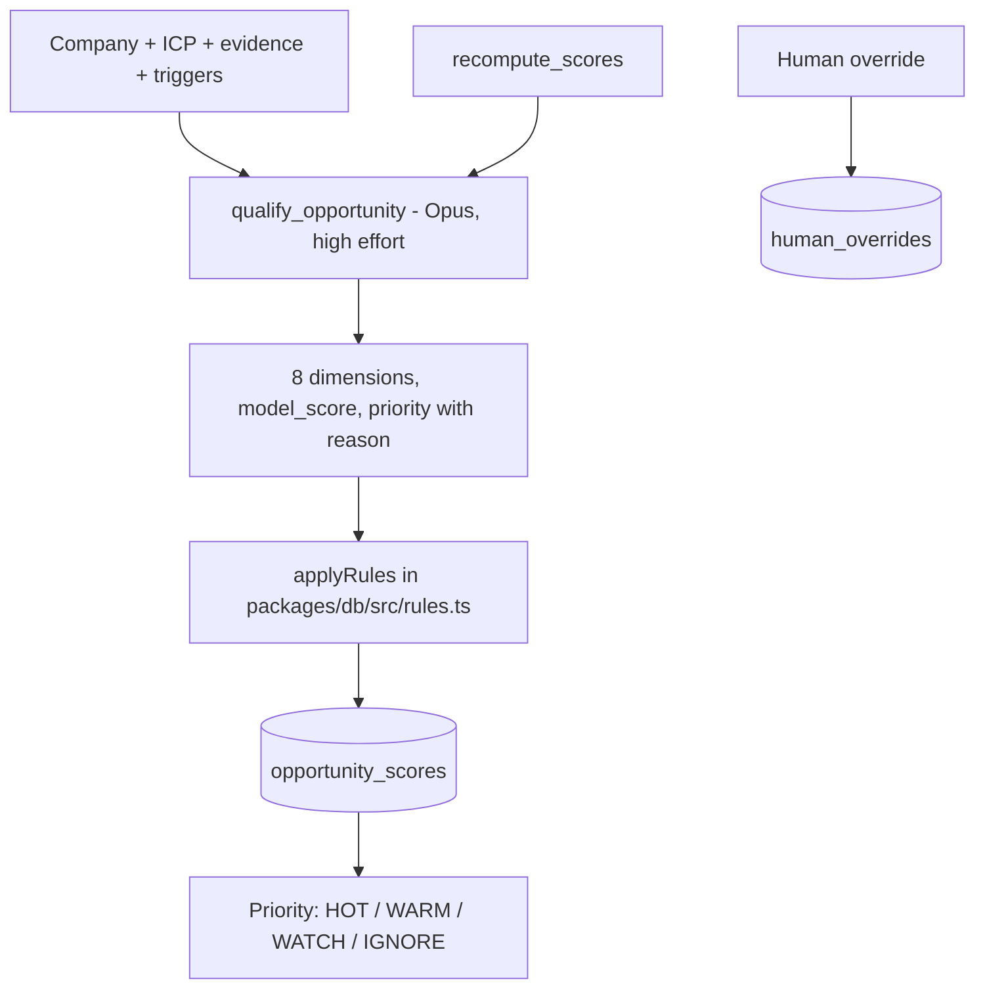
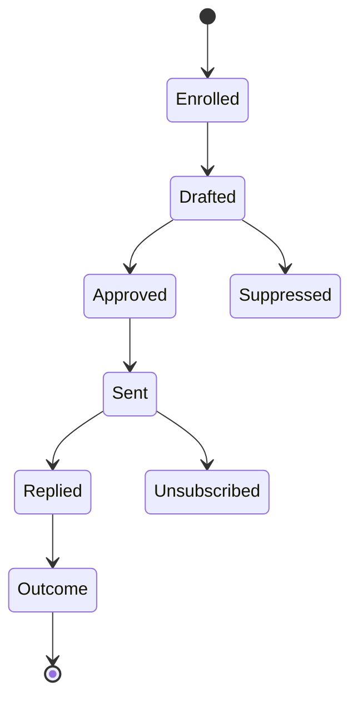
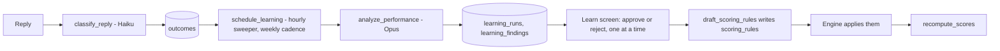

# Core workflows

> **Layer:** Product / Internal · **Audience:** product, engineering

Six workflows. Each is described as it is implemented, with its trigger, its
guards, and its current gaps.

***

## 1. Discovery — finding companies

**Three ways in, one destination.**

### Provider search

`discover_companies` translates the ICP into provider filters
(`packages/db/src/discovery.ts` — criteria that cannot be mapped are *reported*,
not dropped), pages through the provider, and writes `discovery_results` and
`companies`.

The rule the handler is built around: **a failed search must never look like an
empty market.** Every exit writes a `status` and a `stop_reason`; `succeeded`
is reachable only when the provider actually answered and there was nothing
left to read.

Resumability and idempotency, because this one spends money:

| Mechanism | Effect |
|---|---|
| `discovery_runs_one_open_per_query` | One live run per saved query |
| `discovery_results` unique on (run, provider, provider_id) | The same company on page 1 and page 3 counts once |
| `page_cursor` | A re-run after a crash pays only for pages it has not read |
| `finish_discovery_run` derives counts from results | Running it twice changes nothing |

**Look-alike expansion** (`packages/jobs/src/look-alike.ts`) broadens a search
from companies that already scored well.

### Source scanning

`scan_source` is five steps: **fetch → extract → dedupe → signals → resolve**.

Each step degrades to the one before it rather than failing the scan. With no
`ANTHROPIC_API_KEY` the fetch and dedupe still happen, documents are stored,
and the result says extraction was skipped and why. The Sources screen shows
the document count, so the difference is visible rather than asserted.

The fetch is SSRF-checked against private addresses (`packages/jobs/src/fetch.ts`),
which is why the tick route must run on the Node runtime, not Edge.

### What neither of them does

**Neither creates an opportunity.** A strong trigger must not lift a poor-fit
company, and neither handler has the ICP in front of it. Both produce companies
and evidence and enqueue `score_opportunity`, which does.


**Gap.** No in-app control enqueues `discover_companies`. Its only callers are
`first-run.ts` (inside the onboarding request) and the `schedule_discovery`
sweeper. In practice, in any deployment to date, discovery has run **once per
workspace, during onboarding**.


***

## 2. Enrichment and identity

* `enrich_company` **fills blanks only** and writes sourced evidence for each
  field. It does not overwrite what a human or a more trusted source supplied.
* `contact_points` carry a confidence and a verification status.
  ZeroBounce's eight statuses map **conservatively** — a score is kept and
  attributed but never promoted to "verified".
* Entity resolution, merge candidates, merge execution and person enrichment
  are **complete, tested and inert**: nothing enqueues them.
  See [Technical debt](../status/technical-debt.md).

***

## 3. Signals — why now

| Signal type | Source | Status |
|---|---|---|
| Hiring / job postings | `fetch_company_signals` via the `company.signals` capability | Built, cron-gated |
| Source-derived triggers | `scan_source` then `extract_signals` | Built, cron-gated |
| Funding | `company.enrich` funding fields | Built |
| Competitor mentions | `resolve_competitor_mentions` | Built |
| Job change | — | Not modelled |
| Intent data (Bombora-style) | — | Not modelled |
| Website visitor ID | — | Not modelled (GDPR review first) |

Signals land as `company_triggers` rows with timestamps, and as `evidence`.
Freshness decays, and `explain_why_now` (Opus) turns the recent ones into the
sentence a seller reads.

`schedule_signal_fetches` runs on its own **48-hour** staleness cadence rather
than piggybacking on `enrich_company`'s 30-day one, with a `MAX_PER_TICK` cap.

***

## 4. Qualification and scoring

**The rule language is deliberately small**: six operators, four combinators, a
closed field list, no I/O. Three effects only:

| Effect | What it does |
|---|---|
| `adjust` | Signed points on the overall score, bounded to ±40 by a `CHECK` |
| `veto` | Refuses the opportunity outright |
| `floor` | A priority the opportunity will not fall below |

A rule may **never** touch the eight dimensions. Every application is recorded
in `opportunity_scores.rule_trace` beside the untouched `model_score`, so the
model's own answer stays legible.

`recompute_scores` and `schedule_recomputes` handle rescoring after a profile
or a rule changes underneath existing scores (`0023`: `request_score_recompute`,
`claim_due_recomputes`, `advance_recompute`, `fail_recompute`).


**Known product gap.** Three independent ranked signals exist — `priority`,
`opportunity_scores.score`, and `contact_fit_scores.score` — and nothing
composes them into a single "who next, why, and what do I do".


***

## 5. Outreach

| Transition | Driven by |
|---|---|
| Enrolled | `enrollOpportunitiesAction` writes `enrollments.next_action_at` |
| Drafted | `advance_enrollments` sweeper plus `personalize_message` |
| Approved | A human at autonomy 0–1; automatic at autonomy ≥ 2 |
| Sent | `schedule_sends` then `send_message` through Gmail or Outlook |
| Replied | `sync_mailbox` then `classify_reply` |
| Outcome | An `outcomes` row, which feeds the learning loop |
| Suppressed | `can_contact()` refused |
| Unsubscribed | `/unsubscribe/[token]`, `record_unsubscribe()` |

**The autonomy ladder** (`campaigns.autonomy_level`, 0–5) is the only field on
a campaign that can hurt somebody. At 0–1 the engine drafts and stops. There is
deliberately **no way to enrol and raise autonomy in one call**.

Safety, all enforced in Postgres (`0017`):

* `can_contact()` — suppression list and per-contact cadence caps
* `record_contact_send()` / `record_contact_reply()` — rolled *after* the
  provider accepted, never before
* `claim_mailbox_send()` — per-mailbox daily allowance claimed atomically
* `is_suppressed()`, `record_unsubscribe()` — unsubscribe is a public route

Sending is idempotent; `messages.sent_at` is the proof.


**Gap.** The `emails` plan limit is incremented after each send but never
*checked*. Nothing refuses a send for being over plan.


***

## 6. The learning loop

Also feeding it: `human_overrides` (`record_override`) captures when a person
disagrees with the model's priority, and `ai_decisions` carries ratings.

`schedule_learning` is enqueued **hourly** via an idempotency key carrying the
hour; being *due* is decided from `learning_runs` inside the handler, so a
missed hour costs nothing.


The loop is complete in code. What it lacks is **outcome volume**, which is
gated on the heartbeat and on discovery having a trigger — not on more code.


***

## Related

* [The engine](../architecture/engine.md) — the queue and runner underneath all of this
* [Feature reference](features.md) — status per capability
* [AI subsystem](../architecture/ai.md)
