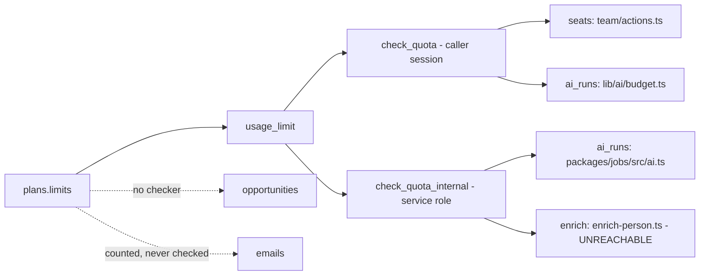

# Plans, quotas and billing

> **Layer:** Product / Internal · **Audience:** product, leadership, engineering

## The catalogue

Plans live in the `plans` table, seeded by `0007`. The pricing page reads the
**same rows** that `usage_limit()` reads when it decides whether to refuse a
call — so a negotiated limit changed in the database shows on the site, and the
page cannot disagree with the product.

| Plan | Price / mo | `opportunities` | `ai_runs` | `emails` | `enrich` | `seats` |
|---|---|---|---|---|---|---|
| Free | $0 | 50 | 100 | 0 | 25 | 2 |
| Growth | $99 | 1,000 | 3,000 | 5,000 | 1,000 | 10 |
| Scale | $299 | 10,000 | 20,000 | 50,000 | 10,000 | 50 |

`NULL` in a limit means **unlimited** — a real answer, and not the same as
zero. `plans_read` grants `using (true)` so an anonymous visitor can price the
product without a session. With no database at all, the literals from `0007`'s
own `INSERT` stand in.

## Quota versus rate limit

They look alike and answer different questions. Conflating them makes one of
them wrong.

| | `lib/rate-limit.ts` | `lib/data/usage.ts` |
|---|---|---|
| Question | How **fast** | How **much** |
| Window | Fixed, resets hourly | Calendar month |
| Purpose | Stop a loop costing money | Enforce the plan |
| Refusal is | Temporary — retry later | Not temporary — upgrade |


A rate-limit message ("try again in 40 minutes") shown for an exhausted plan
quota is a lie that costs a sale. The two produce different copy on purpose.


## Enforcement — the honest table

| Metric | Displayed | Counted | **Checked** |
|---|---|---|---|
| `seats` | yes | yes | **yes** — `inviteMemberAction` |
| `ai_runs` | yes | yes | **yes** — both the request path and the engine path |
| `enrich` | yes | yes | only inside `enrich_person`, which nothing enqueues |
| `emails` | yes | yes (`send_message` increments) | **no** |
| `opportunities` | yes | no | **no** |

### Why quota checks fail open

If the counter query fails, the product continues. The cost of failing open is
a reconciliation and it is ours; the cost of failing closed is a customer who
paid for a plan and cannot use it because a `SELECT` timed out.

### Why the check is never a substitute for the consume

`checkQuota` renders "412 of 1,000 this month" and decides whether to *offer*
an action. `consumeQuota` is what happens before the work. Between a check and
a use, a second request can take the last unit.

`increment_usage` **always increments, including when the answer is no** — the
same reasoning as `consume_rate_limit`. A counter that stops counting once over
limit hides the overage exactly when somebody needs to see it.

## Billing


**There is no payment path at all.**

`STRIPE_SECRET_KEY`, `STRIPE_WEBHOOK_SECRET` and
`NEXT_PUBLIC_STRIPE_PUBLISHABLE_KEY` are declared in `.env.example` and read by
**zero lines of code**. The `subscriptions` table has existed since `0001` and
is referenced by no application code — `lib/data/directory.ts` says so in a
comment: *"Because there is no billing."*


A product that meters three things it does not enforce, and prices a plan it
cannot sell, is not ready to take money. This is
[decision #1](../decisions/README.md#open-decisions) on the open-decisions list:
**implement Stripe, or remove the pricing and the env vars.** Either is
defensible; the current state is not, because the pricing page implies a
purchase is possible.

## Provider credits — a separate ledger

Plan quotas meter Huntloop's own product. **Vendor credits are metered
separately** and in a different place:

| Layer | Object | Purpose |
|---|---|---|
| Cache | `provider_cache` | Per-capability TTL; a cache hit costs zero credits |
| Budget | `provider_budget_state()`, `provider_accounts` | A per-org ceiling |
| Breaker | `provider_breakers` | Opens after repeated failure; refuses rather than retries |
| Ledger | `provider_calls` | Append-only; every call, outcome, credit and latency |

A refusal from any of these carries a `RefusalReason` that reaches the UI, so a
customer finds out their search stopped because of a budget rather than because
their market is empty.

## Related

* [Feature reference](features.md#commercial)
* [Data providers](../architecture/providers.md)
* [Security model](../security/model.md)
