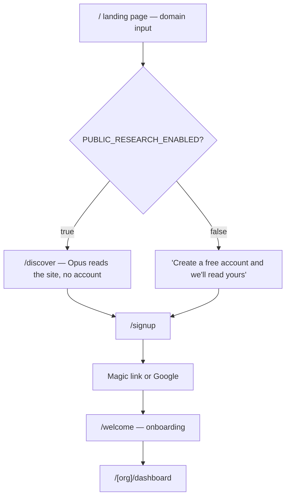
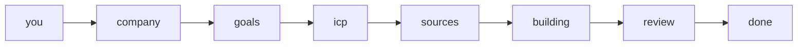
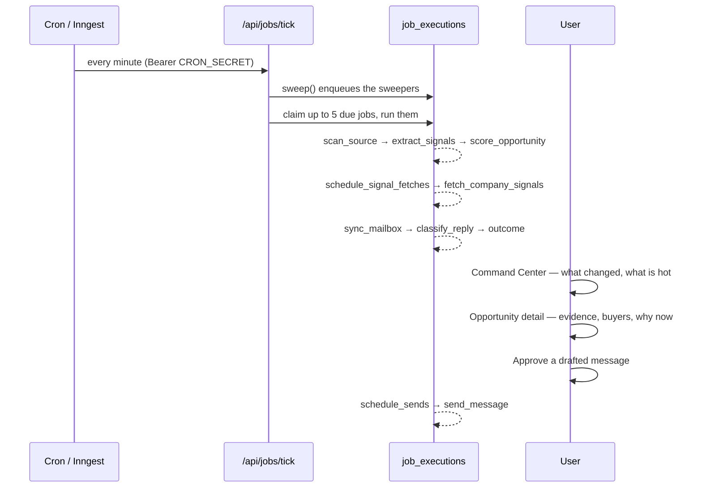
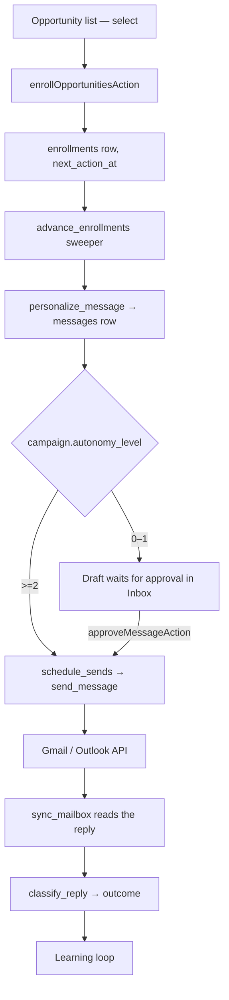

# User journeys

> **Layer:** Product · **Audience:** product, design, engineering

Every journey below is traced against the routes and actions that implement it.
Where a step depends on something the deployment must supply (a key, a cron),
that is called out.

***

## Journey 1 — Anonymous visitor to first opportunity

This is the funnel the landing page was built around: a domain box before a
signup wall.

| Step | Implemented by |
|---|---|
| Landing page + domain box | `app/(marketing)/page.tsx`, `DomainInput.tsx` |
| Anonymous research | `app/(marketing)/discover/`, `public_research` table (`0025`), `claim_research()` |
| Use-case and comparison pages | `app/(marketing)/for/[useCase]`, `compare/[approach]` |
| Sign-in | `app/(auth)/`, `sendMagicLink`, `signInWithGoogle` |


`PUBLIC_RESEARCH_ENABLED` puts an **Opus call with web fetching behind an
unauthenticated endpoint** — the single most expensive misconfiguration in the
codebase. It is off unless the value is exactly `"true"`, and it is bounded by
a hard rolling-24-hour cap (`PUBLIC_RESEARCH_DAILY_LIMIT`, default 200) as well
as a 5/hour per-source window. Visitor addresses are hashed with
`PUBLIC_RESEARCH_SALT`, never stored.


***

## Journey 2 — Onboarding

Seven stored steps, five of which the user is asked to *do*. The current step
lives on `organizations` (`0024`), so onboarding is resumable across devices.

| Step | What happens | Code |
|---|---|---|
| `you` | Name and role | `YouForm.tsx`, `saveYou` |
| `company` | URL → `research_company` (Opus, web fetch). Or **join an existing workspace** on the same email domain | `company/`, `researchCompanyAction`, `requestJoinAction` |
| `goals` | Up to two goals + outreach channel | `goals/`, `saveGoals` |
| `icp` | `draft_icp` proposes, the user edits, look-alike preview and reach estimate run live | `icp/`, `draftIcpAction`, `estimateReachAction`, `previewLookAlikesAction` |
| `sources` | `recommend_sources` proposes feeds/sites to monitor | `sources/`, `recommendSourcesAction` |
| `building` | **First run.** Five stages, one HTTP request each | `building/`, `packages/jobs/src/first-run.ts` |
| `review` | The payoff screen — first companies with scores and evidence | `review/`, `finishOnboarding` |

### The first-run stages

`FIRST_RUN_STAGES` = `discover` → `enrich` → `score` → `contacts` → `explain`.

Each stage is **one request**, because a Vercel Hobby function is capped at 60
seconds and a progress bar must be able to say what stage it is on. Each stage
**degrades independently**: no Apollo key means `discover` is `skipped`, and the
workspace is still correctly configured. `skipped` is a first-class outcome
alongside `done` and `failed`.


First run drives the job handlers **directly**, not through the queue —
`tick()` claims work for every tenant and in queue order, so it could neither
guarantee this user's work runs nor report which stage it is at. The handlers
are the same objects the runner calls, so there is exactly one implementation
of discovery.


***

## Journey 3 — The daily loop (the intended steady state)

**This journey is gated on a clock.** See
[The heartbeat](../operations/heartbeat.md) — the sweepers are the only thing
that puts periodic work into the queue, and nothing calls them without a cron.

***

## Journey 4 — Analyze one URL

The fastest path to value, and the one that needs no provider key.

1. `/[org]/analyze` — paste a company URL.
2. `analyzeUrlAction` → rate limit → AI budget → `qualify_opportunity` (Opus).
3. Eight dimensions, a priority with a reason, cited evidence.
4. `whyNowAction` → `explain_why_now`.
5. `saveQualificationAction` — writes a real company and opportunity.

That last step is the edge that turns four screens into a loop: an analysis the
user keeps becomes an opportunity the rest of the product operates on.

***

## Journey 5 — Engage

Guards on the send path, all of them in the database:

* `can_contact()` — suppression list and cadence caps (`0017`)
* `claim_mailbox_send()` — per-mailbox daily allowance, claimed atomically
* `messages.sent_at` is the proof of send; the send is idempotent
* Unsubscribe is a **public** route — requiring an account to stop being
  emailed is not something this product may do

***

## Journey 6 — Team

| Step | Code |
|---|---|
| Invite by email, seat quota enforced | `inviteMemberAction` (`team/actions.ts`) |
| Accept | `/invite/[token]`, `accept_invitation()` (`0007`) |
| Request to join a same-domain workspace | `request_to_join()` (`0027`) |
| Approve / decline | `approveJoinAction`, `approve_join_request()` |
| Assign opportunities | `/[org]/team/assignments`, `assignOpportunityAction` |

***

## Related

* [Core workflows](core-workflows.md) — the same ground, organised by subsystem
* [The engine](../architecture/engine.md)
* [Feature reference](features.md)
