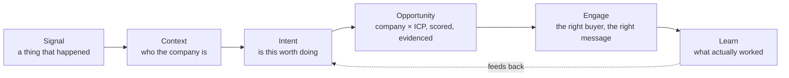

# What Huntloop is

> **Layer:** Product · **Audience:** everyone

## The problem

A B2B seller's day has two hard parts, and prospecting tools mostly solve the
easy one. Finding companies that *match a filter* is a solved commodity —
Apollo, ZoomInfo and a dozen others sell lists. What is not solved is knowing
**which of those companies is worth a message today, and what to say in it.**

The consequence is visible in every sales org: sequences sent to plausible
companies at arbitrary times, personalised with a merge field, at a reply rate
that makes the whole motion marginal.

## What Huntloop does instead

Huntloop treats an opportunity as a **claim that has to be evidenced**.

1. It learns your **product** and your **ideal customer profile** from your own
   website and your edits.
2. It **discovers** companies — from a provider search built out of the ICP,
   from monitored **sources** (feeds, sites), and from CSV import.
3. It **enriches** them, recording every field with where it came from.
4. It watches for **triggers** — hiring, funding, launches, what a source said.
5. It **qualifies** each company against your ICP with a model, producing eight
   named score dimensions, a priority, and a "why now" that cites evidence.
6. It ranks the **buyers** inside that company by fit, not by seniority alone.
7. It **drafts and sends** outreach through your own mailbox, at an autonomy
   level you choose, and reads the replies back.
8. It **learns** from outcomes and proposes scoring rules a human approves.

## The unit of the product

An **opportunity** is unique on `(company, icp)`. It carries a priority
(`HOT` / `WARM` / `WATCH` / `IGNORE`) with a mandatory reason, an eight
dimension score where unmeasured dimensions are `NULL` rather than `0`, and a
trail of evidence rows that each say whether they are a **fact**, an
**inference**, or **unknown**.

## What makes it different

| Most tools | Huntloop |
|---|---|
| A list of companies matching filters | An opportunity with evidence and a reason to act now |
| A single opaque "score" | Eight named dimensions, each shown, no invented weights |
| Confident answers everywhere | "Unknown" is a valid answer and is rendered as one |
| Personalisation by merge field | A message written from the specific trigger and evidence |
| Automation you either trust or don't | A six-rung autonomy ladder, per campaign |
| Enrichment cost discovered on the invoice | Cache → budget → circuit breaker → append-only ledger, before the first call |

## What it is not

* **Not a CRM.** It pushes to HubSpot; it does not replace one.
* **Not an email-sending service.** You connect your own Gmail or Outlook
  mailbox. There is no shared sending infrastructure and no deliverability
  tooling — [deliberately](../decisions/README.md).
* **Not a data vendor.** Providers are pluggable behind a seam
  (`packages/providers`); Huntloop owns the judgement, not the raw data.
* **Not a lead database.** There is no `leads` table and there will not be one.

## Related

* [Vision and principles](vision-and-principles.md) — the rules and why they exist
* [Core workflows](core-workflows.md) — how the loop actually runs
* [Feature reference](features.md) — the complete capability table with status
