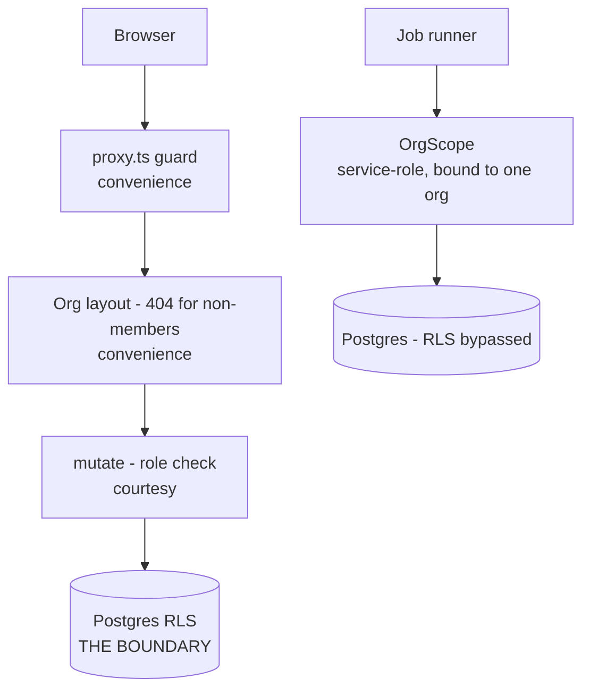

# Security model

> **Layer:** Internal · **Audience:** engineering, security review, operations

## The one-sentence version

**The tenant boundary is Row Level Security in Postgres.** Everything else —
the middleware guard, the role-based UI, the org layout's 404 — is a
convenience that improves the experience of a boundary it does not enforce.

## Threat model

| Threat | Control |
|---|---|
| A user reads another tenant's data | RLS on every tenant table; proven by a non-superuser cross-tenant test |
| A user writes to another tenant | `has_org_role()` in every write policy |
| A stranger enumerates customers by guessing slugs | The org layout returns **404**, not 403 |
| An attacker drains the AI budget | Rate limit (how fast) + quota (how much) + org resolution |
| An attacker drains the vendor budget | Cache → budget → breaker → ledger |
| An unauthenticated caller runs the engine | `CRON_SECRET`, constant-time compared; 503 when unset |
| A malicious web page reaches the model | Untrusted-content wrapping + no side-effecting tools on fetch paths |
| SSRF via a user-supplied source URL | `packages/jobs/src/fetch.ts` resolves and rejects private addresses |
| Stolen backup exposes customer OAuth tokens | AES-256-GCM at the application layer |
| XSS | Nonce-based CSP with `strict-dynamic` |
| Clickjacking | `X-Frame-Options: DENY` + `frame-ancestors 'none'` |
| Open redirect after login | `lib/safe-next.ts` validates `?next=` |
| A tampered Server Action payload | Zod at the edge, `SEC-VAL` enforced |
| Unbounded input to make us pay for tokenization | Every string and array is bounded |

## Tenant isolation



Delete layers B, C and D and a non-member still reads zero rows. That is the
design. See [Tenancy and permissions](tenancy-and-permissions.md).

### The service-role path

`packages/db/src/admin.ts` bypasses RLS. It is confined to **five named files**,
and `npm test` fails the build otherwise:

```
PASS — 212 files in apps/ and 128 in packages/ scanned;
       the service-role client is confined to 5 named files
```

Inside the engine, the substitute boundary is `OrgScope`, which **refuses to be
constructed without an org id**. Sweepers — the only jobs allowed to run with
`org_id = null` — are a closed set in `runner.ts`, and are given the **nil
UUID** as their scope, so a sweeper that ever did read through its scope would
read nothing rather than everything.

## Content Security Policy

```
script-src 'nonce-<per request>' 'strict-dynamic'
```

A nonce, not a static header, because Next injects inline bootstrap scripts
into every document. A static policy has two bad options: `'unsafe-inline'`,
which permits every inline script including an injected one and so certifies
nothing; or hashes, which change on every build. A nonce is the third option —
a fresh 16-byte value per response, attached to the scripts we emitted and to
no others. `'strict-dynamic'` then trusts what those scripts load, which is
what lets the policy survive Next's chunk loading without a URL allow-list that
goes stale.

`crypto.getRandomValues`, not `Math.random` or a UUID: a nonce whose next value
can be predicted from previous ones is not a nonce.

The nonce is set on the **request** headers as well as the response — that is
how Next learns it.

### Report-only by default


A wrong CSP does not fail loudly. It blocks one script on one route and the
page half-works, which is the worst failure mode available. So it ships
observing: `Content-Security-Policy-Report-Only`, violations to
`/api/csp-report`. Set `CSP_ENFORCE=true` once that stream has been quiet for a
week.


The policy passes its whole Playwright suite under `CSP_ENFORCE=true`. The
`SEC-CSP-MODE` audit check requires a documented path from report-only to
enforcing.

## Response headers

Applied to every route in `next.config.ts`:

| Header | Value | Reason |
|---|---|---|
| `Strict-Transport-Security` | `max-age=63072000; includeSubDomains` | `preload` omitted on purpose — submitting to the preload list is close to irreversible and is a decision for whoever owns the apex domain |
| `X-Content-Type-Options` | `nosniff` | |
| `X-Frame-Options` | `DENY` | The app has approve/send actions behind single clicks |
| `Content-Security-Policy` | `frame-ancestors 'none'` | Duplicated here because the proxy matcher excludes static assets |
| `Referrer-Policy` | `strict-origin-when-cross-origin` | Org slugs and opportunity ids are in the path, and outbound links point at **prospect websites** |
| `Permissions-Policy` | camera, microphone, geolocation, interest-cohort all `()` | Denying up front means a future dependency cannot quietly start asking |

`poweredByHeader: false` — the version header names the framework and its major
version to anyone who asks, buys nothing, and shortens the list of exploits
worth trying.

## Spend protection

Three independent controls, because they fail differently.

| Control | Scope | Stored in |
|---|---|---|
| Rate limit | Per org, per task, fixed hourly window | `rate_limits` + `consume_rate_limit()` |
| Plan quota | Per org, calendar month | `usage_counters` + `check_quota` |
| Provider budget | Per org, per vendor | `provider_accounts` + `provider_budget_state()` |

`rate_limits` grants **read only** to tenants — there is no write policy, and
`SEC-RATELIMIT-RLS` checks that. The counter can only be moved by the
`SECURITY DEFINER` function, which is the only thing standing between a
stranger and another org's quota.

### The anonymous research endpoint

The one place an unauthenticated visitor can cause an Opus call with web
fetching. Four controls:

1. **Off** unless `PUBLIC_RESEARCH_ENABLED` is exactly `"true"`.
2. A **hard rolling-24-hour cap** (`PUBLIC_RESEARCH_DAILY_LIMIT`, default 200).
   This is the control that actually bounds the bill — a distributed script
   defeats a per-IP window trivially; nothing defeats a hard daily cap.
3. A per-source window of 5/hour.
4. Source addresses are **hashed with a salt**, never stored. An `inet` column
   would be personal data about people who never became customers.

`0` switches the endpoint off entirely.

## Prompt injection

See [AI subsystem](../architecture/ai.md#prompt-injection-containment). The
short version: delimiting is helpful, and the **architectural** control is that
fetched content never reaches a tool that does anything. The research tasks
fetch and extract; they do not send, delete, or spend.

## SSRF

`packages/jobs/src/fetch.ts` resolves the host and refuses private addresses
before the request. This is why `/api/jobs/tick` must run on the **Node**
runtime — the guard reaches `node:dns` and `node:net`, neither of which exists
on Edge.

## Stored credentials

| Column | Protected by |
|---|---|
| `mailboxes.oauth_token_enc` | AES-256-GCM, `MAILBOX_ENCRYPTION_KEY` |
| `mailboxes.refresh_token_enc` | same |
| `hubspot_connections.access_token` | same key; row is admin-only at RLS |

Authenticated encryption matters more than confidentiality here: a token is
about to be presented to Google, and a corrupted one should fail loudly on our
side rather than as a mysterious 401 on theirs. A random 12-byte IV per
encryption — reusing an IV under GCM is not a weakness, it is a break.

Connecting is **refused** when the key is unset, rather than storing plain text.

## Known gaps

| Gap | Severity | Status |
|---|---|---|
| CSP is report-only | Medium | Deliberate; flip after a quiet week |
| No load test of the rate limiter | Medium | Proven at the database level only |
| `audit_logs` is write-only | Low | Forensic-only until a read surface exists |
| No SSO / SCIM | Low | Deferred |
| No automated schema-drift check | Medium | `types.ts` is hand-maintained |
| Two moderate dev-only advisories (`vitest`) | Low | `npm audit --audit-level=high` is clean |


`audit/full-system/28_MANUAL_ACTIONS_REQUIRED.md` lists a critical Next.js RCE
as the top item. **Re-verified on 2026-09-16: `npm audit --audit-level=high`
exits 0.** Only two moderate `@vitest/mocker` advisories remain, in a dev
dependency. That document is stale on this point.


## Verifying the posture

```bash
npm run audit:site      # 19 of the 40 checks are security checks
npm test                # includes cross-tenant isolation and the admin-import scan
npx playwright test     # includes the CSP suite
npm audit --audit-level=high
```

## Related

* [Tenancy and permissions](tenancy-and-permissions.md)
* [Outreach safety and compliance](outreach-compliance.md)
* [Privacy and data handling](privacy.md)
