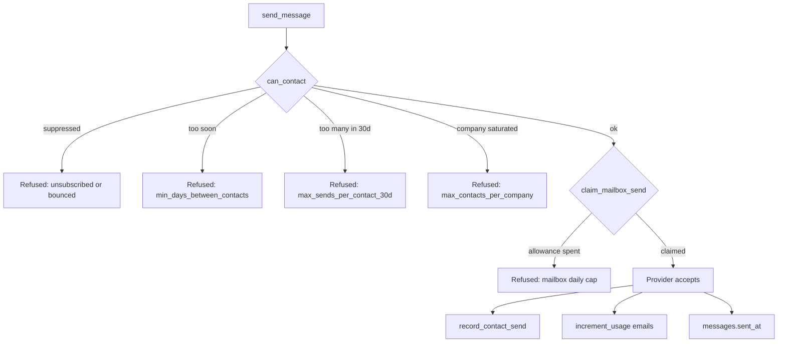

# Outreach safety and compliance

> **Layer:** Internal / Product · **Audience:** engineering, product, legal

## The principle


**Every control here is enforced at the database, not in the sending handler.**
A rule that lives in one code path is a rule the second code path does not
have — and there are already three ways a message gets sent
(`advance_enrollments`, `schedule_sends`, a manual reply).


## The problem `0017` was written for

The per-mailbox cap answers *"how much may this mailbox send"*, which is a
deliverability question. Nothing answered *"how often may we contact this
**person**"* — and with three campaigns and two sequences, nothing prevented one
contact receiving three unrelated emails on a Tuesday.

That is not a compliance edge case. It is the ordinary behaviour of an
automation system nobody bounded.

## The four frequency policies

Set per organisation, with defaults chosen to be **invisible to a customer
already behaving reasonably and a hard stop for one who is not**.

| Column | Default | Meaning |
|---|---|---|
| `min_days_between_contacts` | 2 | Minimum days between two outbound messages to one address, across every campaign |
| `max_sends_per_contact_30d` | 6 | Maximum messages to one address in a rolling 30 days |
| `max_contacts_per_company` | 3 | Maximum people at one company with an open sequence — stops the "email nine people at once" pattern, which is the fastest route to a domain block |
| `max_sends_per_day` | `NULL` | Org-wide daily ceiling above the per-mailbox caps. `NULL` keeps the pre-existing behaviour |

## `can_contact()`

One function, called by **every** send path, returning a decision **and the
reason**.


A boolean would mean the outreach screen says "blocked" with no explanation,
and the support ticket that follows costs more than the column.


**`record_contact_send()` is called after the provider accepted, never before.**
Recording it earlier would decrement a customer's allowance for a message that
failed to send; recording it in a later sweep would leave the cadence cap wrong
for exactly the window in which a sequence sends again.

## Structural guarantees

| Guarantee | Mechanism |
|---|---|
| A send that did not happen cannot be recorded as sent | `messages_sent_has_provider_id` — a `CHECK` |
| The same message is never sent twice | Idempotent send; `sent_at` is the proof |
| A mailbox cannot exceed its daily allowance | `claim_mailbox_send()` claims atomically |
| A message cannot send at autonomy 0–1 without approval | `send_message` refuses it outright |

## Unsubscribe

Every message carries `List-Unsubscribe` and
`List-Unsubscribe-Post: List-Unsubscribe=One-Click`, plus a footer link.

* **`POST` acts immediately** — the one-click POST comes from the mail client,
  which is an explicit user action.
* **`GET` does not act.** Mail clients and security scanners prefetch links; a
  GET that unsubscribed would remove people who never clicked anything.
* **No session is required.** The person clicking is a prospect, not a user.
  `record_unsubscribe()` is `SECURITY DEFINER` and takes only the token.


Gmail and Yahoo **require** working one-click unsubscribe from bulk senders. A
dead unsubscribe link converts somebody who wanted to leave quietly into
somebody pressing "report spam" — charged to the sending domain and to every
other campaign running from it.


## Erasure — and the trap

`erase_contact()` / `erase_contact_for_org()` answer *"delete everything you
have about me"*.


**The naive implementation deletes the suppression too, which makes the person
contactable again.** `0017` is most careful about exactly this. The suppression
survives erasure — it is the record that they asked not to be contacted, not
data *about* them in the sense the request means.


`erase_contact` is destructive and irreversible, so it is admin-gated through
its wrapper and service-role otherwise.

`export_contact()` answers the access half of a data-subject request.

## Retention

`contact_retention_days` — per org, **`NULL` by default**.


`NULL` means "keep indefinitely", and that is the honest default. Silently
deleting a customer's prospect database because we picked 365 would be worse
than not having the feature. The minimum accepted value is 30 days. It is a
policy the customer sets, and the screen explains it.


`enforce_retention` is a **daily** sweeper. It deletes nothing at all unless a
customer set a number, and `prune_stale_contacts()` refuses to touch anybody who
has been messaged or is a live opportunity's contact.

## The autonomy ladder

`campaigns.autonomy_level`, 0–5. The only field on a campaign that can hurt
somebody.

| Level | Behaviour |
|---|---|
| 0–1 | The engine drafts and **stops**. A human approves in the Inbox |
| ≥ 2 | The engine sends within every limit above |

There is deliberately **no way to enrol and raise autonomy in one call**, and the
campaign *create* action does not accept an autonomy level at all.

## Gaps and open questions

| Item | Status |
|---|---|
| `emails` plan limit is counted but never checked | 🔴 Nothing refuses a send for being over plan |
| `contact_frequency` table | Written by the send path; **not read by application code** |
| GDPR erasure has no request intake | `purge_contact_data` exists and is **never enqueued** |
| Lawful basis for enrichment and outreach in the EU | **Needs counsel.** Affects whether EU prospecting is viable at all |
| CAN-SPAM / PECR content and sender-identification requirements | A policy matter, not an engineering one |
| Data-processing agreements with Apollo, Hunter, ZeroBounce, Anthropic, HubSpot | Not in place |

## What Huntloop deliberately does not do

* **No shared sending infrastructure.** Bring your own mailbox — the
  deliverability consequences land on the sender who chose to send.
* **No deliverability tooling** (warm-up, rotation, seed lists).
* **No website visitor identification.** Not modelled; a GDPR review would come
  first.

## Related

* [Privacy and data handling](privacy.md)
* [Core workflows — outreach](../product/core-workflows.md#5-outreach)
