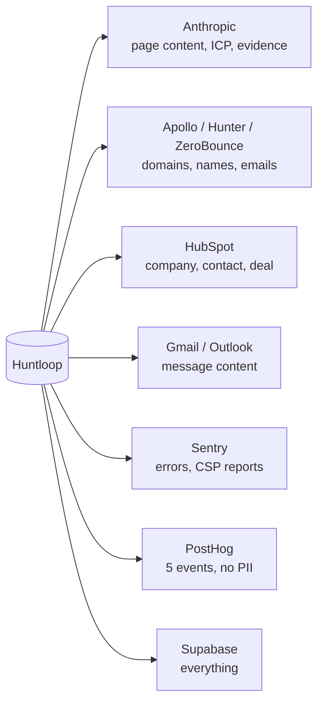

# Privacy and data handling

> **Layer:** Internal · **Audience:** legal, operations, engineering

Huntloop processes personal data about **three different groups**, and the
obligations differ for each.

| Group | Data | Basis |
|---|---|---|
| **Customers** (users) | Email, name, role, goals | Contract |
| **Customers' prospects** (people at target companies) | Name, title, work email, phone, company | Requires a lawful-basis assessment — **unresolved** |
| **Anonymous visitors** | A salted hash of the request source | Legitimate interest (rate limiting) |

## Personal data inventory

| Table | Contains | Notes |
|---|---|---|
| `auth.users` | Customer email | Supabase-managed |
| `profiles` | Name, role, goals | Readable only by co-members (`co_member_ids()`) |
| `people` | Prospect name, title, company | Soft delete |
| `contact_points` | Email, phone, verification status, confidence | The most sensitive table in the system |
| `messages` | Message content, recipient address | |
| `threads`, `message_events` | Conversation metadata | |
| `suppressions` | Addresses that asked not to be contacted | **Survives erasure, by design** |
| `contact_frequency` | (org, email) send counts | Currently unread by application code |
| `mailboxes` | Customer OAuth tokens | **Encrypted** |
| `hubspot_connections` | Customer CRM token | **Encrypted**, admin-only |
| `public_research` | Domain researched + a salted source hash | Expires |
| `audit_logs` | Who did what | Write-only today |

## Deliberately never collected

* **No raw IP addresses.** The anonymous research endpoint hashes the request
  source with `PUBLIC_RESEARCH_SALT`. The question being answered is "is one
  source hammering us", which a hash answers exactly as well — and an `inet`
  column would be personal data about people who never became customers. The
  salt also makes hashes non-comparable across deployments.
* **No guessed email addresses.** With no contact provider, `enrich_person`
  stops rather than producing `first.last@company.com`. A guessed address is a
  plausible string with no evidence behind it, and the bounce lands on the
  customer's sending domain.
* **No session replay.** Sentry Replay is not "off pending configuration": a
  replay of the opportunity page records a named prospect's research, and one of
  the analyze screen records what a customer is prospecting. Enabling it would
  need a masking policy and a conversation with customers, so its implementation
  is not even in the bundle.
* **No client-side autocapture.** PostHog runs server-side (`posthog-node`).
  Autocapture, rage clicks and session tracking raise the same questions that
  kept Replay off.
* **No website visitor identification.** Not modelled.

## What analytics sends

`AnalyticsEvent` is a **closed union** of five events:

`onboarding_step_viewed` · `onboarding_step_completed` ·
`onboarding_step_failed` · `analysis_requested` · `analysis_refused`

`properties` is typed to a closed set, so sending something new takes a
deliberate edit rather than an autocomplete.


**Never sent:** email addresses, company names, URLs a user pasted, ICP text.
Those are the customer's commercial data and their prospects' identities.
`distinctId` is the Supabase user id — already an opaque UUID.


The reporting step vocabulary is deliberately **not** the product's onboarding
union: renaming a screen must not silently split one funnel into two series
nobody can join, and retiring a screen must not make historical data unreadable.

## What CSP reports send

Only a fixed set of fields, each truncated. The report body is
attacker-controlled and the destination is the alerting channel engineers read
at 3am.

## Data flows out of the system

Each of these is a sub-processor. **Data-processing agreements are not in
place.**

## Subject rights

| Right | Mechanism | Status |
|---|---|---|
| Access | `export_contact()` | ✅ SQL exists, no UI |
| Erasure | `erase_contact()` / `erase_contact_for_org()` | ✅ SQL exists, admin-gated |
| Erasure at scale | `purge_contact_data` job | 🔴 **Never enqueued — unreachable** |
| Objection to contact | `/unsubscribe/[token]` | ✅ Public, one-click, RFC 8058 |
| Retention | `contact_retention_days` + `enforce_retention` | 🟡 Cron-gated |


**GDPR erasure cannot be triggered from the product today.** The function
exists, the job exists, the job has no caller, and there is no request intake
form. This is a compliance gap, not a nice-to-have.


## The erasure trap

The naive implementation of "delete everything about me" deletes the
suppression too, **which makes the person contactable again.** `0017` keeps the
suppression deliberately: it is the record that they asked not to be contacted,
not data *about* them in the sense the request means.

## Retention default

`contact_retention_days` is `NULL` — keep indefinitely. Silently deleting a
customer's prospect database because the product picked 365 would be worse than
not having the feature. Minimum accepted value is 30 days.

## Unresolved, and needing a decision

| # | Question | Why it cannot wait |
|---|---|---|
| 1 | **Lawful basis** for processing enriched personal data — GDPR Art. 6(1)(f) legitimate-interest assessment | Affects whether EU prospecting is viable at all |
| 2 | CAN-SPAM / PECR content and sender-identification requirements | Unsubscribe and suppression are implemented; *content* rules are policy |
| 3 | DPAs with every sub-processor above | Required before a customer's data is processed |
| 4 | Privacy policy and a data-subject-request procedure | The erasure job exists; there is no intake |
| 5 | Default retention periods per org | The SQL exists; the numbers are a policy choice |

## Backups

Supabase-provided, plan-dependent. **Never rehearsed.** `docs/OPERATIONS.md`
(DB-02) records what a restore involves and what is *not* backed up. Untested
backups are a belief about backups, not backups.

## Related

* [Outreach safety and compliance](outreach-compliance.md)
* [Security model](model.md)
* [Operations runbook](../OPERATIONS.md)
