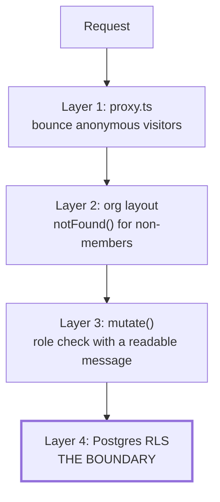
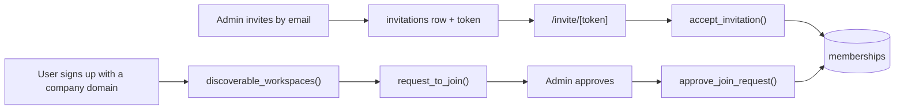

# Tenancy and permissions

> **Layer:** Internal / Developer · **Audience:** engineering, security review

## The tenant root

`organizations`. Every tenant-scoped table carries:

```sql
org_id uuid not null references organizations(id) on delete cascade
```

A user reaches an org only through a `memberships` row.

## The four roles

`org_role` is declared **most- to least-privileged**, and `has_org_role`
compares ordinals:

```sql
create type org_role as enum ('owner', 'admin', 'member', 'viewer');
```

| Role | Read | Work with opportunities | Change the org, members, integrations |
|---|---|---|---|
| `owner` | ✅ | ✅ | ✅ |
| `admin` | ✅ | ✅ | ✅ |
| `member` | ✅ | ✅ | ❌ |
| `viewer` | ✅ | ❌ | ❌ |


**Reordering that enum silently changes every policy in the database.** Add new
roles at the end and revisit every policy deliberately.


## Four layers, one boundary



| Layer | Kind | If deleted |
|---|---|---|
| 1 `proxy.ts` | Convenience | Anonymous users reach a page that returns nothing |
| 2 Org layout | Convenience | A non-member sees an empty page instead of a 404 |
| 3 `mutate()` | Courtesy | The user gets a Postgres error instead of a sentence |
| 4 **RLS** | **Control** | Everything breaks |

### Why 404 and not 403

"That organization exists, but you may not see it" tells anyone who can guess a
slug which companies are Huntloop customers. A 404 tells them nothing and costs
a legitimate user nothing — a legitimate user is a member.

The same reasoning is used by `/api/jobs/tick` (404 on a bad bearer token) and
by `/api/inngest` (404 when unconfigured).

## The RLS pattern

```sql
-- Reads: membership is enough
create policy thing_read on things for select
  using (org_id in (select public.user_org_ids()));

-- Writes: role matters
create policy thing_write on things for all
  using      (public.has_org_role(org_id, 'member'))
  with check (public.has_org_role(org_id, 'member'));
```

`user_org_ids()` is **the single definition of the tenant boundary** — every
`tenant_isolation` policy calls it and nothing else. Both helpers are
`SECURITY DEFINER`, `stable`, with an explicit `search_path`.

## Tables with a narrower policy

| Table | Policy | Why |
|---|---|---|
| `plans` | `using (true)` | The pricing page needs no session |
| `rate_limits` | **read only**, no write policy | Only the `SECURITY DEFINER` function may move the counter (`SEC-RATELIMIT-RLS`) |
| `hubspot_connections` | admin-only | It holds a customer credential |
| `profiles` | readable only by co-members (`co_member_ids()`) | A name is personal data |
| `public_research` | no tenant policy | Anonymous rows, claimed by `claim_research()` |
| `audit_logs` | read within org; writes via `write_audit_log()` | |

## The UI layer

`lib/data/membership.ts` returns a `Viewer` and three predicates:

| Predicate | Question |
|---|---|
| `canWrite` | May this viewer change things? |
| `canAdmin` | May they change the organisation itself? |
| `canSpend` | May they trigger work that costs money? |


**This is not an authorization check.** RLS is. Everything here decides what to
*render*, and a caller who bypasses it entirely gets exactly as far as one who
does not: the database refuses the write.

It exists because **an affordance that fails is a product bug.** A viewer who
sees "Draft outreach", clicks it, and gets a Postgres error cannot tell "I am
not allowed" from "this is broken", and learns not to trust the interface.


### The `demo` viewer

A third state. Before the migrations are applied there is no `memberships`
table, so there is no role. Treating that as `viewer` would make the whole app
appear read-only during setup; treating it as `owner` would invent a fact.
Naming it lets each call site decide — and every one chooses "show the
controls", because there is no real data behind them and the banner already
says so.

### Unknown enum values fail safe

If the column carries a value outside the known set, the enum changed and this
file did not. It falls back to `viewer` — the least privileged reading.

## Joining an organisation

Two paths, both in `0007` / `0027`:



Both are `SECURITY DEFINER` — they must write a membership the caller does not
yet have. `inviteMemberAction` enforces the `seats` quota; it is one of only two
plan limits actually enforced.

## Audit logging

`write_audit_log()` / `write_audit_log_internal()` record who did what.
`recordAudit()` is called from mutations.


**Nothing reads `audit_logs`.** It is forensic-only — queryable in SQL, absent
from the product. Either build a read surface or accept it as forensic, but do
not assume an admin can see it today.


## Verifying isolation

```bash
npm test   # 236 migration-level checks, including cross-tenant as a NON-SUPERUSER
```

The non-superuser part is the point: a superuser bypasses RLS, so a test run as
one proves nothing about the boundary.

## Related

* [Security model](model.md)
* [Database](../architecture/database.md)
