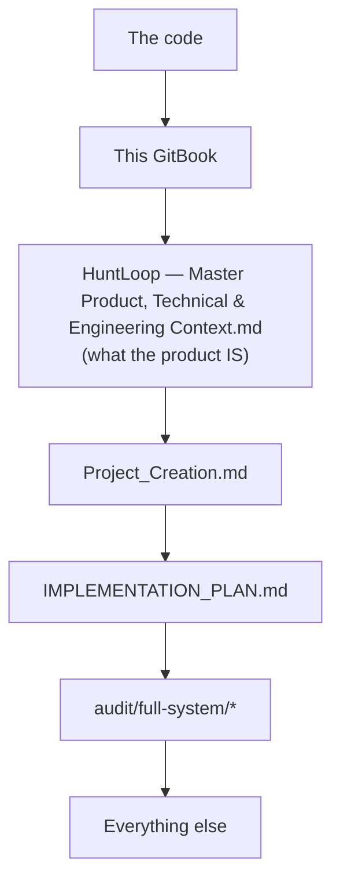

# Documentation vs. code

> **Layer:** Internal · **Audience:** engineering, product, anyone reading the
> older documents

**The rule: the code outranks every document on the question of what exists.**
A requirement described in a plan is not evidence that it is implemented.

This page is the reconciliation. It was produced by reading the code first and
the documents second.

## Severity key

| | |
|---|---|
| 🔴 | Actively misleading — a reader would make a wrong decision |
| 🟠 | Outdated — was true, no longer is |
| 🟡 | Imprecise — the spirit holds, the letter does not |
| ⚪ | Historical — correct when written, kept for context |

***

## 🔴 `README.md` — the Status section

| README says | Code says |
|---|---|
| "Eleven of the seventeen nav destinations are not built and are marked 'Soon'" | **All 19 destinations are built.** `OrgShell.tsx` carries no `unbuilt` flag; `NAV-01` passes |
| "Nothing sends an email" | `send_message`, the Gmail and Outlook adapters, and the approval gate all exist and are tested |
| "Nobody can be invited" | `inviteMemberAction` exists with seat-quota enforcement; `accept_invitation()` since `0007` |
| "The Command Center and sources screens still render illustrative figures" | Both read loaders. The Command Center's `DemoFigures` was removed in the commit that wired it up; Sources renders it only when `source !== "live"` |
| "Nothing yet *finds* companies or computes a score" | `discover_companies` and `score_opportunity` both exist and both run during first run |
| "ten screens exist" | Nineteen |

**Action:** rewrite the Status section. It is the first thing a new reader sees
and it understates the product substantially.

The README's *other* sections — the stack table, local development, Supabase
setup, the Vercel deployment table, and the heartbeat section — are **current
and correct**.

***

## 🟠 `docs/OPERATIONS.md` — the cron sections

| Document says | Reality |
|---|---|
| "Why there is no `vercel.json` fixing this" | `apps/web/vercel.json` exists and was added 2026-09-15 |
| "What drives the tick, and **why no cron is committed**" | A one-minute cron is committed |

The *reasoning* in both sections is still correct and worth keeping: the Hobby
daily-cron limit is real, a root-level `vercel.json` genuinely is not a
supported path, and a daily cron genuinely would be a lie.

**Action:** done — a correction banner has been added at the top of that page,
and [The heartbeat](../operations/heartbeat.md) carries the current state.

***

## 🟠 `SETUP.md` — "What still won't work after all this"

| Table says | Reality |
|---|---|
| "The Command Center, analytics, sources — still demo figures" | All three read the database |
| "Onboarding steps 3–4 — Real screens, fake brain. Nothing is generated, nothing is saved" | `draft_icp` and `recommend_sources` both exist, run, and save |
| "Finding companies — Not built" | `discover_companies` exists; look-alike expansion exists |
| "Scoring, why-now, evidence — Displayed, not generated" | `qualify_opportunity`, `explain_why_now` and `extract_signals` all generate |
| "The AI chat on each opportunity — A shell. It says 'not connected'" | `AgentPanel.tsx` + the `sales_agent` task are connected |
| "Sending email — Not built" | Built |
| "Everything else on the sidebar — Marked SOON" | Nothing is marked Soon |

**Action:** replace that table. Steps 1–8 of SETUP.md are current and are the
authoritative walkthrough for the human-only parts of setup.

***

## 🟠 `.env.example` — the `ENRICHMENT_API_KEY` comment

> "There is deliberately no `ENRICHMENT_PROVIDER` variable. The vendor is chosen
> from the shape of the key…"

`packages/providers/src/registry.ts` **reversed that decision** and documents
why at length: key-sniffing did not survive six capabilities across three
vendors, and the failure it avoided is now addressed directly by
`verifyCredentials()` at configuration time. `ENRICHMENT_API_KEY` routes to
Hunter unconditionally.

**Action:** update the comment in `.env.example` to point at the registry.

***

## 🟠 `audit/full-system/28_MANUAL_ACTIONS_REQUIRED.md` — the Next.js RCE

> "🔴 Do first — security. `npm audit --audit-level=high` exits 1 today…
> two critical unauthenticated RCE advisories."

**Re-verified 2026-09-16: `npm audit --audit-level=high` exits 0.** Two moderate
advisories remain, both in `@vitest/mocker`, a dev dependency, fixable only by a
major Vitest bump.

**Action:** mark that item resolved. Everything else on that page — the
credential table, the deployment steps, the third-party accounts, and the six
decisions only the owner can make — is current.

***

## 🟡 In-code comments: "`packages/ai` does not import `@huntloop/db`"

`packages/ai/src/runs.ts` and `audit/full-system/01_SYSTEM_MAP.md` both state
this. `packages/ai` **does** import `@huntloop/db/rules` — the pure subpath,
which carries no client, no `server-only`, and no I/O — so
`draft_scoring_rules` and `analyze_performance` compile against the real rule
grammar.

The property that matters (**the AI package never reaches a database client, so
it cannot become a second path around RLS**) still holds exactly.

**Action:** reword the comments to say "never imports a database client".

***

## 🟡 README: "a dashboard rendering invented pipeline numbers"

The README's `DemoFigures` discussion describes a state that no longer exists on
the dashboard. The mechanism it describes is still live and still enforced by
`FEAT-DEMO`; only the example is stale.

***

## ⚪ Superseded by design — kept for context

| Document | Status |
|---|---|
| `DELIVERY_PLAN.md` | A phase plan from before most of this was built. Its 🔴/🟡/🟢 markers are largely obsolete. Useful as a record of the intended ordering |
| `IMPLEMENTATION_PLAN.md` | The build plan and design-system source. §1 (tokens) and §11 (build plan) are still referenced by live code comments. Treat its *status* claims as historical |
| `Project_Creation.md` | Execution spec: phases, cost model, UI states, API shape. Authoritative on intent where it does not contradict the master context |
| `HuntLoop — Master Product, Technical & Engineering Context.md` | **Governing product intent.** Still the top of the precedence order for *what the product is*. Its section numbers (§7, §15, §46, §51, §52, §78) are cited throughout the code and this book |
| `Migrate.md`, `explee.md`, `New_Aud.md` | Working documents from specific efforts. Historical |
| `audit/FINDINGS.md`, `PLAN-11`, `PLAN-12`, `PASS-12`, `PASS-13`, `VERIFICATION.md`, `BACKLOG.md`, `UX-REVIEW.md`, `AGENT-REACH.md` | The audit program's running record. Individual findings are dated and many are closed — read them as history, and `audit/README.md` for how the program works |
| `audit/ROADMAP.md` | R0–R4 and R6 marked Done. R5 is "what only provisioning unblocks", which is still accurate |
| `audit/full-system/*` (29 files) | **The most current of the older documents** — written 2026-09-15 from repository-wide inspection. This book supersedes it as a *destination*, but its per-subsystem depth is worth keeping |

***

## The precedence order

When two documents disagree:

The master context outranks the others **on product intent**. The code outranks
all of them **on what exists**. This book's job is to keep those two in the same
place.

## What was checked and found correct

To be fair to the older documents, the following claims were verified and hold:

* `CONTRIBUTING.md` — every convention it states matches current practice
* `audit/README.md` — the ten audit phases match `scripts/audit.mjs`
* `docs/OPERATIONS.md` DB-05 (migration checking), OPS-03 (the two Vercel
  projects), DB-03 (schema drift) and API-03 (no REST API)
* `audit/full-system/00`–`27` — the system map, feature inventory, orphan list
  and the four-unreachable-jobs finding all reproduce exactly

## Related

* [Implementation status](implementation-status.md)
* [Documentation conventions](../meta-documentation-conventions.md) — how to stop this recurring
* [Source document map](../reference/source-documents.md)
