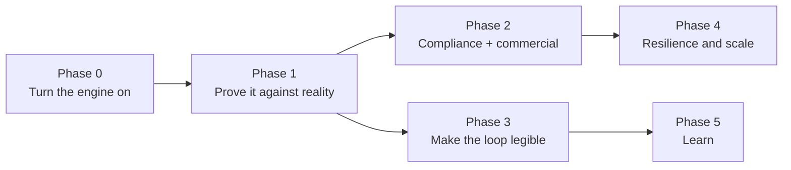

# Roadmap

> **Layer:** Internal / Product · **Audience:** everyone

Ordered by **dependency and product impact**, not by effort. Work is labelled
**Fix** (exists, broken) · **Improve** (exists, wrong shape) · **Build** (does
not exist).

***

## Phase 0 — Turn the engine on · 1–2 days

**Six subsystems are complete, tested and dormant because nothing calls them.**

| # | Work | Type | Where |
|---|---|---|---|
| 0.1 | Deploy `apps/web/vercel.json`; set `CRON_SECRET` | Fix | Committed; needs deploying |
| 0.2 | Enqueue `resolve_entity` at the end of `discover_companies` | Fix | `handlers/discover-companies.ts` |
| 0.3 | Enqueue `enrich_person` after `rank_contacts` for the top N contacts | Fix | `handlers/rank-contacts.ts` |
| 0.4 | **"Hunt now"** → enqueue `discover_companies` | Build | Opportunities or Sources screen |
| 0.5 | **"Push to HubSpot"** → enqueue `sync_hubspot` | Build | `opportunities/[id]/OpportunityActions.tsx` |
| 0.6 | An erasure control → enqueue `purge_contact_data` | Build | Settings, admin-only |

**Database changes:** none.
**Risk:** 0.2 and 0.3 increase provider spend per run. Both are already inside
the budget/breaker path, and `MAX_PER_TICK` bounds the sweepers.


**Done when:** a workspace created today still has discovery runs, enrichment
and signal fetches happening tomorrow, with no human intervention, visible in
`/ops`.


***

## Phase 1 — Prove it against reality · gated on credentials

Not engineering-limited. Every item waits on a credential.

| # | Work |
|---|---|
| 1.1 | Configure `ANTHROPIC_API_KEY`, `APOLLO_API_KEY`, a HubSpot private-app token, `MAILBOX_ENCRYPTION_KEY`, Gmail/Outlook OAuth |
| 1.2 | **One company, end to end:** URL → ICP → discovery → enrich → signals → score → contacts → research → draft → HubSpot deal |
| 1.3 | Reconcile the Apollo job-postings shape and every HubSpot v3/v4 shape against real payloads |
| 1.4 | Reconcile the Apollo credit estimates in `adapters/apollo.ts` against one real invoice |


**Done when:** one real opportunity exists with a cited hiring signal, a real
score, and a deal in a real HubSpot portal — **reached by clicking, not by
running a script.**


### What each credential unblocks

| Needs | Unblocks |
|---|---|
| `ANTHROPIC_API_KEY` | All 12 AI tasks, none of which has called the real API |
| `APOLLO_API_KEY` | Discovery, enrichment, signals, the reach counter |
| A Sentry DSN | A week of quiet CSP reports, then `CSP_ENFORCE=true` |
| `DATABASE_URL` | Query plans, schema-drift checking, and scripted migrations |
| `NEXT_PUBLIC_POSTHOG_KEY` | The onboarding funnel emitting anything at all |
| A second seeded org | The membership-guard 404 test, which needs an org the user is *not* in |

**Nothing on this list blocks another item on it** — four independent leaves,
each a credential rather than a decision.

***

## Phase 2 — Close the compliance and commercial gaps · 3–5 days

| # | Work | Type | Note |
|---|---|---|---|
| 2.1 | Enforce the `emails` quota in `send_message` | Fix | The choke point already exists |
| 2.2 | Enforce the `enrich` quota in the provider call path | Fix | Beside the existing budget check |
| 2.3 | Enforce the `opportunities` quota in `score_opportunity` | Fix | Refuse **creation**, not scoring |
| 2.4 | Data export (GDPR portability) | Build | Pairs with 0.6 |
| 2.5 | A read surface for `audit_logs` | Build | Admin-only |
| 2.6 | Drop `company_gaps`, `contact_frequency`, `evidence_citations` | Fix | Migration `0029` |
| 2.7 | **Decide Stripe:** implement it, or delete the env vars and `subscriptions` | Build/Fix | **Do not leave it ambiguous** |


**Done when:** every limit shown to a user is enforced; an erasure request can
be served end to end; the schema contains no table nothing reads.


***

## Phase 3 — Make the loop legible · 1–2 weeks

**Objective:** answer *"who next, why, and what do I do"* in one place.

| # | Work | Type |
|---|---|---|
| 3.1 | **Next-best-action engine** — compose `priority` + `opportunity_scores` + `contact_fit_scores` + recency + signal freshness into one ranked queue with a reason | Build |
| 3.2 | **Signal → action** — a hiring signal produces a recommended action on the opportunity, not just an evidence row | Build |
| 3.3 | **Merge-review UI** over `merge_candidates`, calling `merge_companies_for_org()` | Build |
| 3.4 | **Capture user corrections** — score override, dismissed recommendation, "not a fit" with a reason | Build |


**3.1 is the place a competing ranking system could appear.** It must *read* the
three existing scores, never recompute them. A fourth ranking that disagrees
with the other three is worse than no composition at all.



**Done when:** the Command Center opens on a ranked list of accounts, each with
a one-line reason and a single primary action.


***

## Phase 4 — Resilience and scale · 1–2 weeks

| # | Work | Type |
|---|---|---|
| 4.1 | Provider **fallback chain** per capability, rather than one adapter | Improve |
| 4.2 | Dead-letter surface in `/ops` with a safe retry control | Build |
| 4.3 | Narrow `schedule_signal_fetches` to companies with live opportunities | Improve |
| 4.4 | **Load test** `tick()` concurrency at realistic volume | Build |
| 4.5 | Enforce CSP — `CSP_ENFORCE=true` | Fix |

***

## Phase 5 — Learn · gated on volume, not code

| # | Work | Type |
|---|---|---|
| 5.1 | Outcome attribution: which triggers converted, which messages got replies | Build |
| 5.2 | Feed outcomes into ICP suggestions and rule proposals — **proposed to a human, never auto-applied** | Build |
| 5.3 | Accepted/rejected proposals become training signal | Build |

The learning loop is already complete in code. What it lacks is **outcome
volume**, which is gated on Phases 0 and 1.

***

## Explicitly not building

| Not building | Because |
|---|---|
| A dialer | Not the product |
| LinkedIn automation | Terms of service, and account risk borne by the customer |
| A generic workflow canvas | The loop is the product; a canvas is an admission it is not |
| In-house deliverability | Bring-your-own mailbox is deliberate |
| A full CRM | Huntloop pushes to one; it does not replace one |
| A second AI agent framework | `runTask` plus the claim boundary is the framework |
| SSO / SCIM | No enterprise demand yet |
| A second CRM vendor | Single-vendor by design until a second is real |

***

## The re-audit cadence

The audit program is only worth what its last run proved.

| When | What |
|---|---|
| Every PR | `npm run audit:site` — automatic, gating |
| Every release | Re-run the phases the release touched; add a script check for each finding closed |
| Quarterly | Full 10-phase pass; re-baseline the backlog |
| On a new integration | Phase 5 (security) in full, plus Phase 1 for the new configuration surface |

The quarterly pass exists to catch what a script cannot: whether the information
architecture still matches the product, whether the roadmap is still the right
one, and whether decisions recorded as **Accepted** are still the right
trade-offs.

## Related

* [Technical debt](technical-debt.md)
* [Implementation status](implementation-status.md)
* [Decision log](../decisions/README.md)
