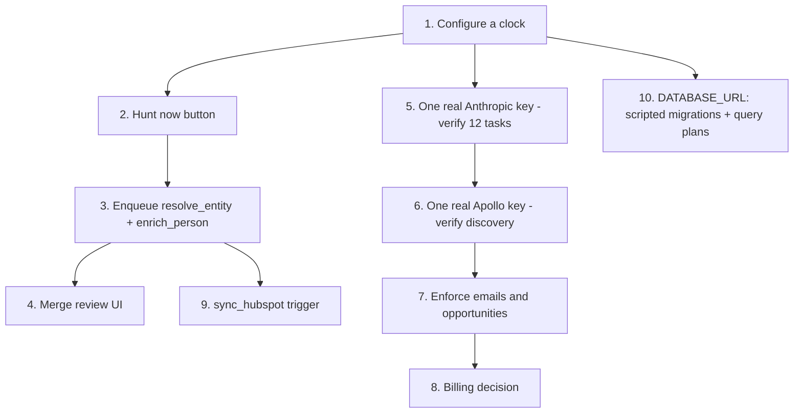

# Technical debt

> **Layer:** Internal · **Audience:** engineering, leadership

Ranked by consequence, not by effort. Each item names its evidence so it can be
re-verified rather than believed.

***

## P0 — Blocks the product from working at all

### 1. Four job handlers have no caller

| Job | Fix | Effort |
|---|---|---|
| `sync_hubspot` | An action on the opportunity page, or fan out from `schedule_syncs` (which already sweeps) | Hours |
| `enrich_person` | Enqueue after `rank_contacts`, gated on the `enrich` quota it already checks | Hours |
| `resolve_entity` | Enqueue after `discover_companies` and after import | Hours |
| `purge_contact_data` | Needs a request intake as well as a trigger | Days |

**Evidence:** `grep -rn "enqueue(" packages apps` returns 18 call sites; none
names these four.

### 2. There is no in-app control that starts discovery

A "hunt now" button on the Command Center or the Companies screen, enqueuing
`discover_companies` through `lib/data/engine.ts`. Gate on `canSpend(viewer)`.

**Consequence today:** discovery runs once per workspace, during onboarding, and
never again.

### 3. Nothing runs on a schedule unless the deployment configures a clock

See [The heartbeat](../operations/heartbeat.md). Not a code defect — a
deployment one — but it is the reason none of the above has ever been observed.

***

## P1 — Correctness and money

### 4. Three of five plan limits are unenforced

| Metric | State | Fix |
|---|---|---|
| `emails` | Counted by `send_message`, never checked | Call `check_quota_internal` before the send, alongside `can_contact()` |
| `opportunities` | Neither counted nor checked | Increment on opportunity creation; check in `score_opportunity` |
| `enrich` | Checked, but only inside the unreachable `enrich_person` | Resolved by fixing #1 |

### 5. There is no payment path

`STRIPE_SECRET_KEY`, `STRIPE_WEBHOOK_SECRET` and
`NEXT_PUBLIC_STRIPE_PUBLISHABLE_KEY` are read by **zero lines of code**.
`subscriptions` has been unused since `0001`.

**Either implement billing or remove the variables and the pricing.** The
current state implies a purchase that is impossible.

### 6. No live vendor call has ever succeeded

Anthropic, Apollo, Hunter, ZeroBounce and HubSpot are all tested against
scripted clients. **Every behaviour documented in this book from those
integrations is tested but not observed.** This gates everything else.

### 7. Migrations are applied by hand

No ledger, no automation, no rollback. `db:doctor` infers state from what each
file creates. Setting `DATABASE_URL` and scripting the apply is the single
highest-value infrastructure change available.

***

## P2 — Structure and maintenance

### 8. Five schema objects nobody reads

| Object | Origin | Verdict |
|---|---|---|
| `company_gaps` | `0003` | Never read or written. Drop or wire |
| `contact_frequency` | `0017` | Written by the send path; **never read** by application code. Surface it or explain why |
| `evidence_citations` | `0022` | Never read or written |
| `company_merges` | `0012` | Unreachable in practice — its only writer is `resolve_entity` |
| `subscriptions` | `0001` | No billing exists |

**A schema that carries tables nobody reads teaches the next reader that tables
are decorative.**

### 9. `audit_logs` is write-only

`recordAudit()` writes; nothing in the product reads. Either build an admin
read surface or state explicitly that it is forensic-only.

### 10. No merge review UI

`merge_companies_for_org()` is the `SECURITY DEFINER` wrapper `0012` built
**specifically so a Server Action could call it**, and no Server Action does.
Resolving #1 makes this urgent — `resolve_entity` will start producing
`merge_candidates` with nowhere to review them.

### 11. No provider fallback chain

The registry picks **one** provider per capability. If Apollo refuses
`company.enrich`, nothing tries a second vendor. The contract already supports
it; the registry does not.

### 12. Nothing composes the three ranked signals

`priority`, `opportunity_scores.score` and `contact_fit_scores.score` are three
independent rankings. They do not conflict, and nothing turns them into a single
"who next, why, and what do I do". This is the largest *product* gap.

### 13. Signals land but produce no recommended action

`fetch_company_signals` writes hiring evidence. Nothing surfaces "what changed
since you last looked". The Command Center is the natural home and already has
the layout.

### 14. Schema drift is unchecked

`packages/db/src/types.ts` is hand-maintained. No CI check compares it to the
live schema.

***

## P3 — Measurement and hardening

| # | Item | Why it matters |
|---|---|---|
| 15 | **No load test** | The rate limiter is proven at the database level and by nothing driving it through HTTP |
| 16 | **No query plans** | `EXPLAIN ANALYZE` needs `DATABASE_URL`. No index has been validated against real cardinality |
| 17 | **CSP is report-only** | Deliberate. Flip `CSP_ENFORCE=true` after a quiet week |
| 18 | **No e2e coverage of real auth** | Sign-in, the OAuth callback and the membership 404 need a live Supabase project |
| 19 | **No alerting on a stalled queue** | A dead cron is discovered by a person |
| 20 | **No CSV import benchmark** | `/imports` is untested at volume |
| 21 | **Two moderate dev advisories** | `@vitest/mocker`; fixable only by a major Vitest bump |
| 22 | **Second Vercel project has never built** | Repoint it at `apps/web` or delete it |
| 23 | **Apollo credit costs unreconciled** | Taken from published docs, never checked against an invoice |

***

## Not debt — deliberate

These look like gaps and are decisions. See [Decision log](../decisions/README.md).

* No general REST API
* No shared sending infrastructure or deliverability tooling
* No second CRM
* Two-way CRM sync — stage is recorded as evidence, not obeyed
* No Inngest SDK dependency
* No exactly-once queue semantics
* No weights column on `opportunity_scores`
* No SSO / SCIM
* `contact_retention_days` defaults to `NULL`

***

## Suggested order

Steps 1–3 are days of work and turn a one-shot onboarding demo into the product
the landing page describes.

## Related

* [Implementation status](implementation-status.md)
* [Roadmap](roadmap.md)
* [Decision log](../decisions/README.md)
